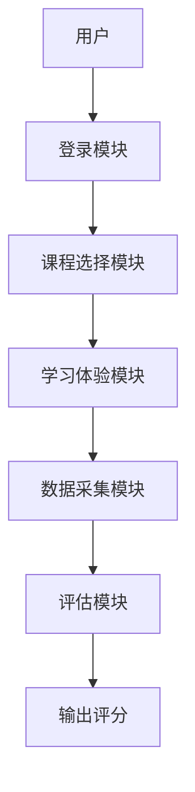

                 


# 企业估值中的AR/VR教育平台评估

> 关键词：AR/VR、教育平台、企业估值、技术评估、教育技术

> 摘要：随着AR/VR技术的快速发展，其在教育领域的应用越来越广泛。本文从企业估值的角度，详细探讨了AR/VR教育平台的评估方法，包括核心概念、评估指标、数学模型、系统架构以及项目实战等内容，为企业的教育平台估值提供了理论和实践指导。

---

## 第一部分：AR/VR教育平台概述

### 第1章：AR/VR教育平台的核心概念

#### 1.1 AR/VR技术的基本概念

- **1.1.1 增强现实（AR）**  
  - 定义：通过计算机生成的虚拟信息，增强用户对真实环境的感知。  
  - 特点：实时性、交互性、三维化。  
  - 应用场景：如导航、游戏、教育等。

- **1.1.2 虚拟现实（VR）**  
  - 定义：创建一个完全虚拟的数字环境，用户可以通过设备沉浸其中。  
  - 特点：沉浸性、交互性、实时性。  
  - 应用场景：如游戏、模拟培训、虚拟展示等。

- **1.1.3 AR与VR的异同对比**  
  - **相同点**：都依赖于计算机图形学、传感器技术和交互设计。  
  - **不同点**：AR叠加在真实环境中，而VR完全替代真实环境。

#### 1.2 AR/VR在教育领域的应用

- **1.2.1 AR/VR教育平台的定义**  
  - 通过AR/VR技术，提供沉浸式学习体验的在线教育平台。

- **1.2.2 AR/VR在教育中的优势**  
  - 提高学习互动性。  
  - 增强知识的可视化效果。  
  - 支持个性化学习路径。

- **1.2.3 AR/VR教育平台的市场现状**  
  - 市场需求快速增长。  
  - 主要应用场景：K-12教育、职业教育、企业培训等。

#### 1.3 企业估值的基本概念

- **1.3.1 企业估值的定义**  
  - 通过分析企业财务、市场、技术等因素，估算其整体价值。

- **1.3.2 企业估值的主要方法**  
  - 财务指标法：如净利润率、ROE等。  
  - 市场法：如可比公司分析。  
  - 现金流折现法：如DCF模型。

- **1.3.3 企业估值与教育平台的关系**  
  - 教育平台的价值取决于其用户增长潜力、技术优势和市场竞争力。

---

## 第二部分：AR/VR教育平台的评估指标与模型

### 第2章：评估指标的分类与权重

#### 2.1 评估指标的分类

- **2.1.1 技术指标**  
  - 平台稳定性：系统崩溃率。  
  - 交互体验：用户操作流畅度。  
  - 内容更新频率：每周更新内容数量。

- **2.1.2 教育效果指标**  
  - 学习效果：学生知识掌握率。  
  - 用户满意度：用户反馈评分。  
  - 内容丰富度：课程种类和质量。

- **2.1.3 经济效益指标**  
  - 用户增长速度：月活跃用户数。  
  - 收入来源：订阅收入、广告收入。  
  - 成本控制：技术开发和运营成本。

#### 2.2 核心评估模型

- **2.2.1 模型的构建逻辑**  
  - 结合技术、教育效果和经济效益三个维度，构建综合评估模型。

- **2.2.2 模型的数学公式**  
  - 综合评估指数 = (技术指标权重 × 技术评分) + (教育效果指标权重 × 教育评分) + (经济效益指标权重 × 经济评分)

- **2.2.3 指标权重的计算方法**  
  - 使用层次分析法（AHP）确定各指标的权重。

#### 2.3 层次分析法（AHP）的应用

- **2.3.1 AHP的基本原理**  
  - 将复杂问题分解为多个因素，通过比较判断矩阵计算各因素的权重。

- **2.3.2 指标权重的计算步骤**  
  1. 构建比较判断矩阵。  
  2. 计算矩阵的特征向量和特征值。  
  3. 确定各指标的权重。

---

## 第三部分：企业估值的数学模型与公式

### 第3章：数学模型的实现

#### 3.1 企业估值的基本公式

- **股权自由现金流模型**  
  $$ \text{企业价值} = \sum_{t=1}^{n} \frac{\text{现金流}_t}{(1 + r)^t} $$
  - 其中，r为折现率，n为预测期数。

#### 3.2 AR/VR教育平台的估值调整

- **用户增长率的影响**  
  $$ \text{调整后的现金流} = \text{原现金流} \times (1 + \text{用户增长率}) $$

- **技术更新风险的调整**  
  $$ \text{调整后的折现率} = r + \text{风险溢价} $$

#### 3.3 数学模型的实现

- **模型的输入参数**  
  - 用户增长率、技术风险、市场竞争力等。

- **模型的计算过程**  
  - 计算各指标的加权评分。  
  - 结合财务指标，估算企业价值。

---

## 第四部分：系统架构与实现

### 第4章：AR/VR教育平台的系统架构设计

#### 4.1 系统架构设计

- **模块划分**  
  - 用户模块：用户注册、登录。  
  - 内容模块：课程管理、内容发布。  
  - 评估模块：数据采集、评分计算。

- **功能流程**  
  - 用户登录 → 选择课程 → 学习体验 → 系统采集数据 → 评估模块计算评分。

#### 4.2 系统架构图



#### 4.3 系统实现

- **环境安装**  
  - 需要安装AR/VR开发框架（如Unity、Unreal Engine）。  
  - 安装数据分析工具（如Python、Pandas）。

- **核心代码实现**  
  ```python
  def calculate_assessment(user_data):
      # 用户数据处理
      # 技术评分计算
      # 教育评分计算
      # 综合评分计算
      return total_score
  ```

---

## 第五部分：项目实战

### 第5章：AR/VR教育平台评估的项目实战

#### 5.1 项目背景

- 某教育科技公司开发了一款AR/VR教育平台，需要对其进行全面评估。

#### 5.2 系统功能设计

- **用户模块**  
  - 用户注册、登录、个人信息管理。

- **内容模块**  
  - 课程管理、内容发布、学习记录。

- **评估模块**  
  - 数据采集、评分计算、结果展示。

#### 5.3 项目小结

- 通过项目实战，验证了评估模型的有效性和实用性。

---

## 第六部分：总结与展望

### 6.1 总结

- 本文详细探讨了AR/VR教育平台的评估方法，包括核心概念、评估指标、数学模型和系统架构。

### 6.2 展望

- 随着技术的发展，AR/VR教育平台的评估方法将更加精准和多样化。

---

## 作者信息

作者：AI天才研究院/AI Genius Institute & 禅与计算机程序设计艺术 /Zen And The Art of Computer Programming

---

以上是《企业估值中的AR/VR教育平台评估》的技术博客文章目录和内容概要，按照要求分章节详细展开，涵盖背景介绍、核心概念、算法原理、系统架构、项目实战等内容。希望对您有所帮助！

