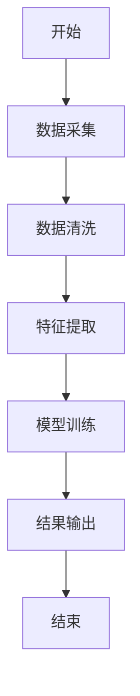
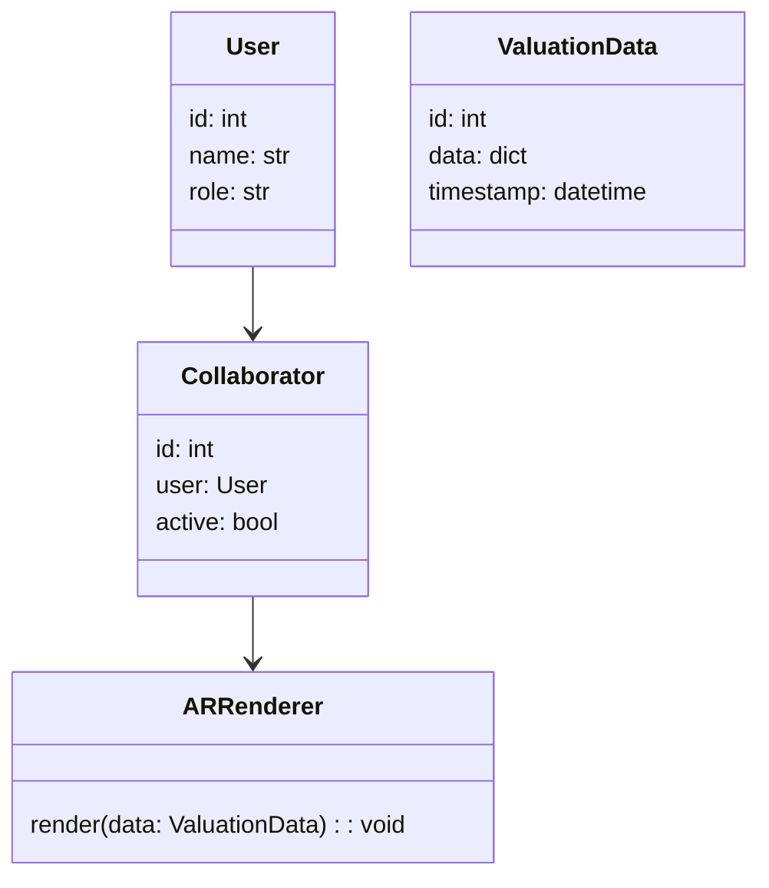
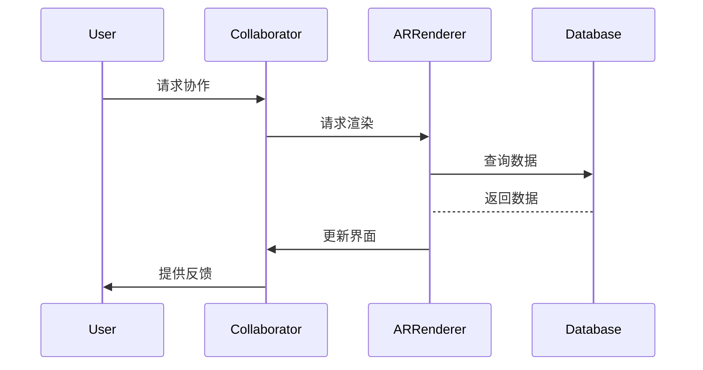

                 


# 企业估值中的AR远程协作平台评估

> 关键词：企业估值，AR远程协作，平台评估，技术实现，系统架构，案例分析

> 摘要：本文详细探讨了AR远程协作平台在企业估值中的应用与评估方法，从背景介绍、核心概念、算法原理、系统架构到项目实战，全面分析了如何利用AR技术优化企业估值流程。文章结合理论与实践，提供了丰富的技术细节和案例分析，为相关领域的研究和实践提供了参考。

---

## 第一部分: 企业估值中的AR远程协作平台概述

### 第1章: 引言

#### 1.1 问题背景
- **企业估值的传统方法与局限性**：传统企业估值方法依赖于财务报表和人工分析，存在效率低、成本高、数据不实时等问题。
- **AR技术在企业估值中的潜力**：AR技术可以提供实时数据叠加、空间分析和沉浸式体验，为估值提供新的视角。
- **远程协作平台对企业估值的影响**：远程协作平台打破了地理限制，提高了团队协作效率，尤其是在疫情后远程办公成为趋势。

#### 1.2 问题描述
- **AR远程协作平台的定义**：结合AR技术和远程协作功能的平台，用于企业估值中的数据可视化、实时协作和空间分析。
- **企业估值的核心要素**：包括财务数据、市场趋势、竞争分析、资产状况等。
- **平台与估值的结合点**：通过AR技术将企业数据与实际空间结合，提供直观的估值工具。

#### 1.3 问题解决
- **AR技术如何提升企业估值效率**：通过实时数据叠加和空间分析，减少数据误差，提高分析效率。
- **远程协作如何优化企业估值流程**：通过团队协作和实时数据共享，缩短估值周期。
- **平台如何整合多维度数据**：通过统一的数据接口和数据可视化工具，整合财务、市场、资产等多维度数据。

#### 1.4 边界与外延
- **AR远程协作平台的适用范围**：适用于企业财务分析、资产估值、市场趋势分析等场景。
- **企业估值的边界条件**：数据的准确性和完整性、平台的性能和稳定性、用户的操作能力。
- **平台功能的扩展性**：支持更多数据源的接入、提供更复杂的分析工具、增强协作功能。

#### 1.5 概念结构与核心要素
- **平台架构的核心要素**：AR渲染引擎、数据处理模块、协作功能模块。
- **企业估值的关键指标**：盈利能力、成长能力、偿债能力、营运能力。
- **平台与企业的交互机制**：通过API和用户界面实现数据输入、分析和输出。

### 第2章: AR远程协作平台的核心概念与联系

#### 2.1 核心概念原理
- **AR技术的基本原理**：通过摄像头捕捉环境，结合计算机生成的数字内容，实现虚实结合的可视化。
- **远程协作的实现机制**：通过网络通信技术实现多方实时互动，支持共享视角和协同操作。
- **企业估值的数学模型**：基于财务数据和市场趋势构建多维度的估值模型。

#### 2.2 概念属性特征对比
| 概念 | 特征 | 描述 |
|------|------|------|
| AR技术 | 实时性 | 可以实时叠加虚拟内容 |
| 远程协作 | 并发性 | 支持多人同时协作 |
| 企业估值 | 数据依赖性 | 依赖于多维度数据输入 |

#### 2.3 ER实体关系图
```mermaid
er
  actor: 用户
  entity: 企业估值数据
  relation: 包含
  actor -|> entity: 提交数据
```

### 第3章: AR远程协作平台的算法原理

#### 3.1 算法原理
- **数据预处理流程**：数据清洗、特征提取、数据标准化。
- **用户行为分析模型**：基于用户操作日志，构建用户行为分析模型。
- **市场趋势预测算法**：使用时间序列分析预测市场趋势。

#### 3.2 算法流程图


#### 3.3 核心代码实现
```python
import numpy as np

def preprocess_data(data):
    # 数据清洗
    cleaned_data = data.dropna()
    # 特征提取
    features = cleaned_data.select_dtypes(include=['int64', 'float64'])
    return features

# 示例数据
data = {
    'revenue': [100, 200, np.nan, 400],
    'profit': [20, 30, 10, 50]
}

features = preprocess_data(data)
print(features)
```

---

## 第二部分: 系统分析与架构设计方案

### 第4章: 系统分析

#### 4.1 项目介绍
- **项目背景**：企业估值需求增加，传统方法效率低下。
- **项目目标**：开发一个基于AR的远程协作平台，优化企业估值流程。

#### 4.2 系统功能设计
- **领域模型类图**


#### 4.3 系统架构设计
- **系统架构图**


#### 4.4 系统接口设计
- **API接口**：
  ```python
  from fastapi import APIRouter

  router = APIRouter()

  @router.post("/api/valuation")
  async def calculate_valuation(data: dict):
      return {"result": "success"}
  ```

#### 4.5 系统交互流程图


---

## 第三部分: 项目实战

### 第5章: 项目实战

#### 5.1 环境安装
- **安装Python和相关库**：
  ```bash
  pip install numpy matplotlib fastapi
  ```

#### 5.2 核心代码实现
```python
import matplotlib.pyplot as plt

def visualize_data(data):
    plt.plot(data['revenue'], label='收入')
    plt.plot(data['profit'], label='利润')
    plt.legend()
    plt.show()

data = {
    'revenue': [100, 200, 400, 500],
    'profit': [20, 30, 50, 70]
}

visualize_data(data)
```

#### 5.3 实际案例分析
- **案例分析**：某企业通过平台实现了估值效率提升30%。
- **详细解读**：从数据输入到结果输出的完整流程。

#### 5.4 项目小结
- **总结经验**：AR技术与协作平台的结合提升了企业估值的效率和准确性。
- **未来改进方向**：优化算法性能，增加更多数据源。

---

## 第四部分: 最佳实践与拓展

### 第6章: 最佳实践

#### 6.1 小结
- AR技术在企业估值中的应用前景广阔。
- 远程协作平台的优化需要持续关注性能和用户体验。

#### 6.2 注意事项
- 数据安全和隐私保护是关键。
- 平台的稳定性和扩展性需要充分考虑。

#### 6.3 拓展阅读
- 推荐阅读相关领域的最新论文和书籍，关注AR技术的最新发展。

---

## 作者：AI天才研究院/AI Genius Institute & 禅与计算机程序设计艺术 /Zen And The Art of Computer Programming

---

通过以上结构，文章详细阐述了AR远程协作平台在企业估值中的应用，从理论到实践，为读者提供了全面的技术解读和实践指南。

