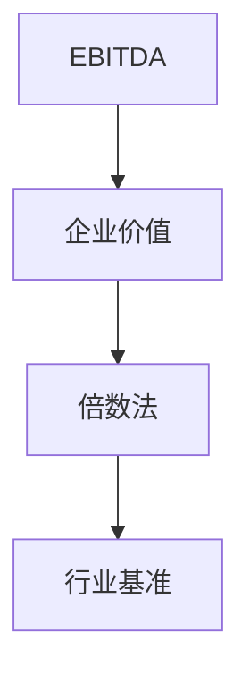
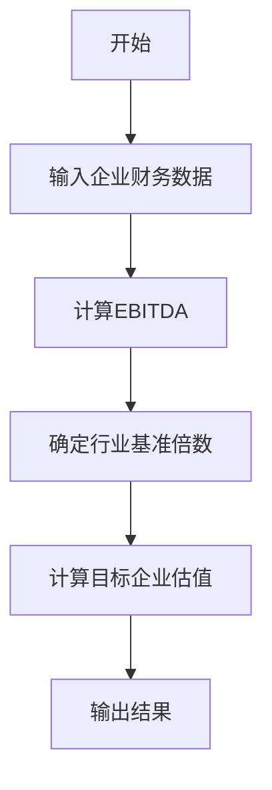
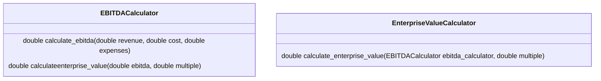

                 


# 企业估值中的EBITDA倍数法

> 关键词：企业估值，EBITDA倍数法，财务分析，企业价值，倍数模型

> 摘要：本文深入探讨了EBITDA倍数法在企业估值中的应用，从基本概念到算法原理，再到系统设计和实际案例，详细讲解了这一方法的各个方面，帮助读者理解如何利用EBITDA倍数法进行企业估值。

---

# 第一部分：企业估值中的EBITDA倍数法基础

## 第1章：EBITDA倍数法的定义与背景

### 1.1 EBITDA的定义与特点

#### 1.1.1 EBITDA的定义
EBITDA（Earnings Before Interest, Taxes, Depreciation, and Amortization）表示息税折旧及摊销前利润，是企业利润表中一个重要的指标。它的计算公式为：
$$ \text{EBITDA} = \text{营业收入} - \text{营业成本} - \text{运营费用} $$

EBITDA的核心特点在于它忽略了非现金支出（如折旧和摊销）以及财务费用和税费，因此能够更好地反映企业的经营效率和盈利能力。

#### 1.1.2 EBITDA的核心特点
- **忽略非现金支出**：折旧和摊销不影响现金流量，因此EBITDA能够更准确地反映企业的实际盈利能力。
- **跨行业可比性**：由于EBITDA不考虑利息和税费，不同行业之间的企业可以更方便地进行比较。
- **简化财务分析**：EBITDA的计算相对简单，适合快速评估企业价值。

#### 1.1.3 EBITDA与净利润的对比
| 指标 | 定义 | 优点 | 缺点 |
|------|------|------|------|
| EBITDA | 息税折旧及摊销前利润 | 忽略了非现金支出，计算简单 | 无法反映财务杠杆和税费影响 |
| 净利润 | 净收入减去所有费用后的利润 | 反映了所有财务因素 | 计算复杂，跨行业可比性差 |

### 1.2 企业估值的基本概念

#### 1.2.1 企业估值的定义
企业估值是指通过对企业未来现金流的折现，评估其整体价值的过程。它是企业并购、融资和上市等活动中不可或缺的一部分。

#### 1.2.2 企业估值的主要方法
- **市场法**：基于市场可比交易的平均倍数。
- **收益法**：基于未来现金流的折现。
- **成本法**：基于重置成本。

#### 1.2.3 EBITDA倍数法的适用场景
EBITDA倍数法适用于那些现金流稳定、易于比较的企业，尤其是在相同行业内的企业之间。

### 1.3 EBITDA倍数法的历史演变

#### 1.3.1 传统估值方法的局限性
传统估值方法如资产重置成本法难以反映企业未来的盈利能力，而市场法受到市场波动的影响较大。

#### 1.3.2 EBITDA倍数法的起源与发展
20世纪80年代，杠杆收购的兴起推动了EBITDA倍数法的应用，因为它能够更准确地反映企业的实际盈利能力。

#### 1.3.3 EBITDA倍数法的现状与趋势
随着资本市场的成熟，EBITDA倍数法逐渐成为企业估值的重要工具，并被广泛应用于并购和融资活动。

---

## 第2章：EBITDA倍数法的核心原理

### 2.1 EBITDA倍数法的数学模型

#### 2.1.1 EBITDA的计算公式
$$ \text{EBITDA} = \text{营业收入} - \text{营业成本} - \text{运营费用} $$

#### 2.1.2 倍数法的计算公式
$$ \text{企业价值} = \text{EBITDA} \times \text{倍数} $$

#### 2.1.3 企业估值的公式推导
企业价值的计算可以分为以下几个步骤：
1. 计算目标企业的EBITDA。
2. 确定可比企业的EBITDA倍数。
3. 计算目标企业的价值。

### 2.2 核心概念与联系

#### 2.2.1 EBITDA与企业价值的关系
EBITDA是企业价值的核心驱动因素，通过倍数法可以将EBITDA与企业价值直接关联起来。

#### 2.2.2 EBITDA的核心概念关系图


#### 2.2.3 核心概念对比表
| 指标 | 优点 | 缺点 |
|------|------|------|
| EBITDA | 计算简单，跨行业可比性高 | 忽略了财务杠杆和税费影响 |
| 净利润 | 反映了所有财务因素 | 计算复杂，跨行业可比性差 |

### 2.3 算法原理

#### 2.3.1 算法流程图


#### 2.3.2 Python实现代码
```python
def calculate_ebitda(revenue, cost, expenses):
    return revenue - cost - expenses

def calculateenterprise_value(ebitda, multiple):
    return ebitda * multiple

revenue = 1000000
cost = 500000
expenses = 200000
ebitda = calculate_ebitda(revenue, cost, expenses)
multiple = 10
enterprise_value = calculateenterprise_value(ebitda, multiple)
print(f"企业价值为：{enterprise_value}")
```

#### 2.3.3 详细步骤解释
1. **计算EBITDA**：首先从企业的财务报表中提取营业收入、营业成本和运营费用，计算出EBITDA。
2. **确定行业基准倍数**：通过分析可比企业的EBITDA倍数，确定合理的倍数范围。
3. **计算企业价值**：将目标企业的EBITDA乘以行业基准倍数，得出企业价值。

---

## 第3章：系统分析与架构设计

### 3.1 系统分析

#### 3.1.1 项目背景
本文将设计一个基于EBITDA倍数法的企业估值系统，帮助用户快速计算企业价值。

#### 3.1.2 系统功能设计
- **数据采集模块**：输入企业财务数据。
- **计算模块**：计算EBITDA和企业价值。
- **结果展示模块**：输出估值结果。

#### 3.1.3 系统架构图


### 3.2 系统架构设计

#### 3.2.1 类图设计


#### 3.2.2 系统交互流程


---

## 第4章：项目实战

### 4.1 环境安装

#### 4.1.1 安装Python
安装Python 3.x版本，并配置环境变量。

#### 4.1.2 安装必要的库
安装numpy和pandas库：
```bash
pip install numpy pandas
```

### 4.2 核心实现

#### 4.2.1 数据采集
读取企业的财务数据，例如：
```python
import pandas as pd

data = pd.read_csv('financial_data.csv')
revenue = data['revenue'].values[0]
cost = data['cost'].values[0]
expenses = data['expenses'].values[0]
```

#### 4.2.2 计算EBITDA
计算EBITDA：
```python
def calculate_ebitda(revenue, cost, expenses):
    return revenue - cost - expenses
```

#### 4.2.3 确定倍数
根据行业基准，确定倍数为10。

#### 4.2.4 计算企业价值
计算企业价值：
```python
def calculateenterprise_value(ebitda, multiple):
    return ebitda * multiple

ebitda = calculate_ebitda(revenue, cost, expenses)
enterprise_value = calculateenterprise_value(ebitda, 10)
print(f"企业价值为：{enterprise_value}")
```

### 4.3 结果分析

#### 4.3.1 结果展示
输出企业价值。

#### 4.3.2 可视化分析
使用图表展示EBITDA和企业价值的关系。

### 4.4 项目总结

#### 4.4.1 实战小结
通过实际案例，验证了EBITDA倍数法的有效性。

#### 4.4.2 拓展思考
可以结合其他估值方法，如DCF模型，提高估值的准确性。

---

## 第5章：总结与展望

### 5.1 总结
本文详细介绍了EBITDA倍数法的原理和应用，通过实际案例展示了其在企业估值中的作用。

### 5.2 展望
未来，EBITDA倍数法可以通过结合人工智能技术，进一步提高估值的准确性和效率。

---

作者：AI天才研究院/AI Genius Institute & 禅与计算机程序设计艺术 /Zen And The Art of Computer Programming

