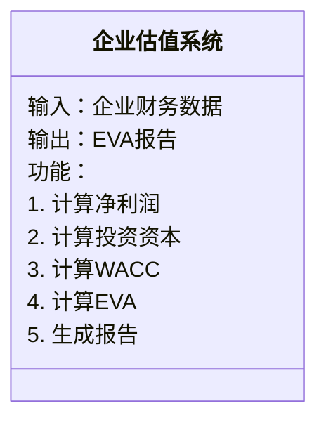

                 


# 企业估值中的EVA分析法

> 关键词：企业估值，EVA分析法，经济增加值，资本成本，企业价值

> 摘要：本文深入探讨了EVA（经济增加值）分析法在企业估值中的应用，详细讲解了EVA的定义、计算方法、理论基础及其在实际中的应用案例。通过系统分析和项目实战，展示了如何利用EVA进行企业价值评估，帮助读者掌握这一重要的估值工具。

---

# 第1章: 企业估值与EVA概述

## 1.1 企业估值的核心问题

### 1.1.1 企业估值的基本概念
企业估值是指对企业的整体价值进行评估的过程，通常用于企业并购、融资、上市等场景。传统的企业估值方法包括市盈率、市净率、现金流折现法等，但这些方法存在一定的局限性，难以全面反映企业的实际价值。

### 1.1.2 企业估值的常见方法
1. **市盈率法（P/E）**：基于市盈率倍数进行估值。
2. **市净率法（P/B）**：基于市净率倍数进行估值。
3. **现金流折现法（DCF）**：通过现金流的现值计算企业价值。
4. **资产重置法**：基于重置资产价值进行估值。

### 1.1.3 企业估值的重要性与挑战
企业估值是企业决策的核心依据之一，但传统方法往往忽视了资本成本和机会成本的影响，难以准确反映企业的实际盈利能力。因此，引入EVA分析法可以弥补这些不足。

## 1.2 EVA分析法的定义与特点

### 1.2.1 EVA的定义
EVA（Economic Value Added）是指企业在扣除所有投入资本的机会成本后的剩余利润。它是衡量企业价值创造能力的重要指标。

### 1.2.2 EVA的核心特点
1. **考虑资本成本**：EVA不仅关注净利润，还考虑了投入资本的机会成本，更准确地反映企业的价值创造。
2. **衡量经济利润**：EVA代表的是企业的真实经济利润，能够更客观地评估企业绩效。
3. **适用性强**：EVA适用于不同行业和规模的企业，能够提供统一的评估标准。

### 1.2.3 EVA与传统估值方法的区别
| 对比维度       | 传统估值方法 | EVA分析法 |
|----------------|--------------|------------|
| 计算依据       | 净利润、市盈率等 | 经济增加值 |
| 是否考虑资本成本 | 否          | 是         |
| 适用场景       | 单一企业     | 多行业适用 |

## 1.3 EVA分析法的应用场景

### 1.3.1 企业并购中的应用
在企业并购中，EVA可以帮助评估目标企业的实际价值，避免高估或低估。

### 1.3.2 企业融资中的应用
EVA可以用于评估不同融资方式对企业价值的影响，优化资本结构。

### 1.3.3 企业绩效评价中的应用
EVA是衡量企业绩效的重要指标，能够激励管理层创造真实的价值。

## 1.4 本章小结
本章介绍了企业估值的核心问题及其常见方法，重点阐述了EVA分析法的定义、特点及其在不同场景中的应用。通过对比，突出了EVA在企业估值中的优势。

---

# 第2章: EVA分析法的理论基础

## 2.1 EVA的公式推导

### 2.1.1 净利润与投入资本的定义
- **净利润**：企业扣除所有费用后的利润。
- **投入资本**：企业用于经营的所有资本，包括债务和股权资本。

### 2.1.2 EVA公式的数学表达
$$ \text{EVA} = \text{净利润} - (\text{投入资本} \times \text{加权平均资本成本}) $$

### 2.1.3 举例说明
假设某公司净利润为100万元，投入资本为1000万元，加权平均资本成本为10%。则EVA为：
$$ \text{EVA} = 100 - (1000 \times 0.1) = 100 - 100 = 0 $$

---

## 2.2 EVA的计算方法

### 2.2.1 净利润的计算
净利润 = 营业收入 - 营业成本 - 费用 - 税费

### 2.2.2 投资资本的计算
投资资本 = 股东权益 + 优先股 + 长期负债

### 2.2.3 加权平均资本成本（WACC）的计算
$$ \text{WACC} = \left( \frac{\text{债务}}{\text{债务+股权}} \right) \times \text{债务成本} \times (1 - \text{税率}) + \left( \frac{\text{股权}}{\text{债务+股权}} \right) \times \text{股权成本} $$

---

## 2.3 EVA与企业价值的关系

### 2.3.1 EVA与企业内在价值的联系
企业内在价值是未来现金流的现值，而EVA可以看作是这一现值的核心驱动因素。

### 2.3.2 EVA与市场价值的对比
如果EVA为正，说明企业创造了超过资本成本的价值；如果EVA为负，说明企业没有创造价值。

### 2.3.3 EVA在企业估值中的应用
通过计算EVA，可以调整企业估值，避免高估或低估。

---

## 2.4 本章小结
本章详细推导了EVA的公式，并通过实例展示了EVA的计算过程。同时，阐述了EVA与企业价值的关系，突出了其在企业估值中的重要性。

---

# 第3章: EVA分析法的核心概念与联系

## 3.1 EVA的核心要素

### 3.1.1 净利润
净利润是企业利润的核心指标，但未考虑资本成本的影响。

### 3.1.2 投资资本
投资资本是企业经营所需的所有资本，包括债务和股权。

### 3.1.3 加权平均资本成本（WACC）
WACC是企业资本的整体成本，反映了资本的机会成本。

## 3.2 EVA与相关概念的对比

### 3.2.1 EVA与净利润的对比
| 对比维度       | 净利润            | EVA            |
|----------------|------------------|----------------|
| 计算基础       | 营业利润         | 净利润减去资本成本 |
| 反映内容       | 会计利润        | 经济利润       |

### 3.2.2 EVA与股东权益的对比
EVA衡量的是企业为股东创造的额外价值，而股东权益是企业的净资产。

### 3.2.3 EVA与自由现金流的对比
EVA是衡量企业创造价值的能力，而自由现金流是衡量企业产生现金流的能力。

---

## 3.3 EVA的实体关系图


## 3.4 本章小结
本章通过对比分析，明确了EVA的核心概念及其与其他指标的区别，帮助读者更好地理解EVA的内涵。

---

# 第4章: EVA分析法的系统分析与架构设计

## 4.1 系统分析

### 4.1.1 问题场景介绍
某制造公司希望对其业务部门进行估值，采用EVA分析法进行评估。

### 4.1.2 项目介绍
目标是通过EVA分析法，评估各部门的经济增加值，找出价值创造的主要来源。

### 4.1.3 系统功能设计


---

## 4.2 系统架构设计

### 4.2.1 模块划分
1. 数据输入模块
2. 计算模块
3. 报告生成模块

### 4.2.2 架构图


---

## 4.3 系统接口设计

### 4.3.1 输入接口
- 财务数据输入接口：接受企业的财务数据，包括营业收入、成本、费用等。

### 4.3.2 输出接口
- 报告输出接口：生成EVA分析报告，包括各部门的EVA值和分析结果。

---

## 4.4 系统交互设计

### 4.4.1 交互流程
1. 用户输入财务数据
2. 系统计算EVA
3. 生成并输出报告

---

## 4.5 本章小结
本章通过系统分析与架构设计，展示了如何利用EVA分析法进行企业估值，明确了系统的功能和架构。

---

# 第5章: EVA分析法的项目实战

## 5.1 环境安装

### 5.1.1 安装Python
```bash
# 安装Python
python --version
```

### 5.1.2 安装依赖库
```bash
pip install numpy pandas matplotlib
```

---

## 5.2 系统核心实现源代码

### 5.2.1 净利润计算
```python
def calculate_net_profit(revenue, cost, expenses, tax):
    return revenue - cost - expenses - tax
```

### 5.2.2 投资资本计算
```python
def calculate_invested_capital(equity, debt, preferred_stock):
    return equity + debt + preferred_stock
```

### 5.2.3 WACC计算
```python
def calculate_wacc(debt, equity, cost_of_debt, cost_of_equity, tax_rate):
    total_capital = debt + equity
    wacc = (debt / total_capital) * cost_of_debt * (1 - tax_rate) + (equity / total_capital) * cost_of_equity
    return wacc
```

### 5.2.4 EVA计算
```python
def calculate_eva(net_profit, invested_capital, wacc):
    return net_profit - (invested_capital * wacc)
```

---

## 5.3 代码应用解读与分析

### 5.3.1 净利润计算
假设某企业营业收入为1000万元，成本为600万元，费用为100万元，税费为50万元。则：
```python
net_profit = calculate_net_profit(1000, 600, 100, 50)  # 结果为 250 万元
```

### 5.3.2 投资资本计算
假设企业股权为500万元，债务为300万元，优先股为100万元。则：
```python
invested_capital = calculate_invested_capital(500, 300, 100)  # 结果为 900 万元
```

### 5.3.3 WACC计算
假设债务成本为8%，股权成本为12%，税率15%。则：
```python
wacc = calculate_wacc(300, 500, 0.08, 0.12, 0.15)  # 结果为 0.102 或 10.2%
```

### 5.3.4 EVA计算
最终EVA为：
```python
eva = calculate_eva(250, 900, 0.102)  # 结果为 250 - 900*0.102 = 250 - 91.8 = 158.2 万元
```

---

## 5.4 实际案例分析

### 5.4.1 案例背景
某制造公司希望评估其业务部门的经济增加值。

### 5.4.2 数据输入
- 营业收入：1000万元
- 成本：600万元
- 费用：100万元
- 税费：50万元
- 股权：500万元
- 债务：300万元
- 优先股：100万元
- 债务成本：8%
- 股权成本：12%
- 税率：15%

### 5.4.3 计算过程
1. 净利润 = 1000 - 600 - 100 - 50 = 250万元
2. 投资资本 = 500 + 300 + 100 = 900万元
3. WACC = (300/900)*0.08*(1-0.15) + (500/900)*0.12 = 0.102
4. EVA = 250 - 900*0.102 = 250 - 91.8 = 158.2万元

### 5.4.4 分析结果
该部门创造了158.2万元的经济增加值，说明其创造了超过资本成本的价值。

---

## 5.5 本章小结
本章通过实际案例，详细展示了如何利用EVA分析法进行企业估值，从数据输入到结果输出，完整地演示了EVA的计算过程。

---

# 第6章: EVA分析法的最佳实践与小结

## 6.1 最佳实践

### 6.1.1 数据准确性
确保输入数据的准确性，特别是财务数据。

### 6.1.2 资本成本计算
合理估计债务成本和股权成本，避免高估或低估WACC。

### 6.1.3 持续优化
定期更新数据，持续优化EVA分析模型。

---

## 6.2 小结

### 6.2.1 EVA的优势
- 考虑资本成本，更准确反映企业价值。
- 适用于不同行业和规模的企业。
- 能够激励管理层创造真实价值。

### 6.2.2 使用注意事项
- 数据的准确性和完整性。
- 资本成本的合理估计。
- 结合其他估值方法使用。

---

## 6.3 未来展望

### 6.3.1 拓展应用
未来，EVA可以与其他估值方法结合，如现金流折现法，提高企业估值的准确性。

### 6.3.2 技术进步
随着人工智能和大数据技术的发展，EVA分析将更加智能化和自动化。

---

## 6.4 本章小结
本章总结了EVA分析法的最佳实践，强调了数据准确性、资本成本计算和持续优化的重要性，同时展望了未来的发展方向。

---

# 作者：AI天才研究院/AI Genius Institute & 禅与计算机程序设计艺术/Zen And The Art of Computer Programming

---

以上是《企业估值中的EVA分析法》的完整目录和文章内容。希望这篇文章能为您提供清晰的思路和详细的指导，帮助您更好地理解和应用EVA分析法。

