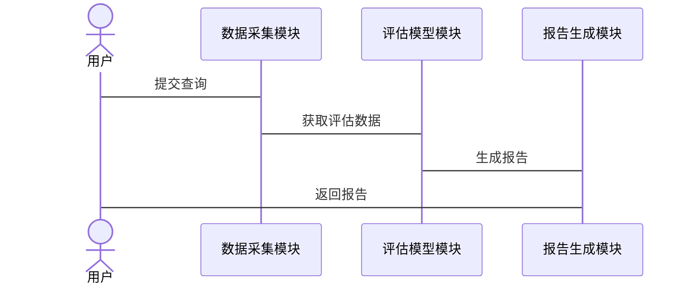

                 


# 企业估值中的专利组合价值分析

## 关键词：专利组合，企业估值，价值分析，技术评估，法律因素，经济价值

## 摘要：在企业估值过程中，专利组合的价值分析是评估企业无形资产的重要组成部分。本文详细探讨了专利组合的定义、核心概念、评估维度、算法原理，以及如何将其整合到企业整体估值中。通过实际案例和系统设计，本文为读者提供了全面的视角，帮助他们理解专利组合在企业估值中的关键作用。

---

## 第一部分：背景介绍

### 第1章：专利组合价值分析的背景与重要性

#### 1.1 专利的基本概念
- **专利的定义与特征**：专利是法律授予发明者的独占权，具有独占性、地域性和时间性。
- **专利的法律保护**：通过法律手段保护发明者的权益，防止他人未经许可使用。
- **专利在企业中的作用**：提升竞争力，防御性策略，获取经济收益。

#### 1.2 专利组合的定义与特点
- **专利组合的定义**：一组相互关联的专利，共同保护企业的技术解决方案。
- **专利组合的核心要素**：技术关联性、法律状态、覆盖范围。
- **专利组合的分类与层次**：按技术领域、法律状态和覆盖范围分类。

#### 1.3 专利组合价值分析的重要性
- **专利组合对整体估值的影响**：增强企业市场竞争力，提升估值。
- **专利组合价值分析的必要性**：准确评估无形资产，支持投资决策。
- **专利组合价值分析的边界与外延**：明确评估范围，考虑市场动态。

#### 1.4 专利组合与企业估值的关系
- **专利组合对整体估值的影响**：专利组合的强度和质量影响企业价值。
- **专利组合在企业价值评估中的权重**：根据行业和企业特点调整权重。
- **专利组合与其他无形资产的协同作用**：与商标、版权等共同提升企业价值。

---

## 第二部分：核心概念与联系

### 第2章：专利组合价值分析的核心概念

#### 2.1 专利组合的构成要素
- **专利的数量与质量**：数量多不一定质量高，需考虑技术先进性。
- **专利的覆盖范围**：地理覆盖和技术覆盖，影响市场影响力。
- **专利的法律状态**：有效、失效或被挑战的状态，影响价值。

#### 2.2 专利组合价值分析的维度
- **技术价值维度**：技术的创新性、实用性和发展前景。
- **经济价值维度**：市场潜力、盈利能力、成本效益。
- **法律风险维度**：专利的稳定性、可执行性和侵权风险。

#### 2.3 核心概念的对比与联系
- **专利组合与其他无形资产的对比**：与商标、版权的异同点，专利的法律保护更强。
- **专利组合内部要素的相互作用**：技术与经济的相互影响，法律风险对经济价值的制约。

#### 2.4 实体关系模型（ER图）
```mermaid
er
    patent (
        id,
        title,
        assignee,
        filing_date,
        grant_date,
        legal_status
    )
    belongs_to (
        patent_id,
        technology_area_id
    )
    technology_area (
        id,
        name,
        description
    )
    value_assessment (
        patent_id,
        value,
        date
    )
```

---

## 第三部分：算法原理讲解

### 第3章：专利组合价值评估算法

#### 3.1 层次分析法（AHP）
- **步骤**：构建层次结构，确定权重，计算一致性检验。
- **数学模型**：权重计算公式，层次分析法的步骤。

#### 3.2 模糊综合评价法
- **步骤**：建立模糊评价矩阵，计算隶属度。
- **数学公式**：模糊综合评价公式。

#### 3.3 算法对比与选择
- **适用场景**：层次分析法适用于结构清晰的问题，模糊综合评价法适用于模糊问题。

#### 3.4 Python代码示例
```python
# 层次分析法示例
def calculate_weights(criteria_matrix):
    n = len(criteria_matrix)
    # 计算一致性检验
    CI = (sum(criteria_matrix[i] * criteria_matrix[i].T for i in range(n))) / n - 1
    return CI

# 模糊综合评价法示例
def fuzzy_evaluation(factors, criteria_weights):
    # 计算隶属度
    result = sum(factors[i] * criteria_weights[i] for i in range(len(factors)))
    return result
```

---

## 第四部分：系统分析与架构设计

### 第4章：系统设计与架构

#### 4.1 项目背景
- 知识产权保护的重要性，专利组合价值分析的需求。

#### 4.2 功能设计
- 数据采集模块：收集专利数据。
- 评估模型模块：实现层次分析法和模糊评价法。
- 报告生成模块：输出评估结果。

#### 4.3 架构设计


#### 4.4 接口设计
- REST API：数据接口、评估接口、报告接口。

#### 4.5 交互流程


---

## 第五部分：项目实战

### 第5章：专利组合价值分析实战

#### 5.1 环境安装
- 安装Python和相关库（numpy, pandas, scikit-fuzzy）。

#### 5.2 数据收集
- 从专利数据库获取专利数据，清洗和预处理。

#### 5.3 模型实现
- 使用层次分析法和模糊评价法进行评估，编写Python代码。

#### 5.4 案例分析
- 以科技企业为例，展示数据处理、模型计算和结果分析。

#### 5.5 代码示例
```python
import numpy as np
from fuzzywuzzy import process

# 示例数据
patent_data = {
    '专利ID': [1, 2, 3],
    '技术领域': ['AI', 'AI', 'ML'],
    '法律状态': ['active', 'expired', 'active']
}

# 数据预处理
processed_data = pd.DataFrame(patent_data)

# 层次分析法计算
weights = calculate_weights(processed_data)

# 模糊评价
results = fuzzy_evaluation(processed_data, weights)
```

---

## 第六部分：最佳实践与总结

### 第6章：总结与建议

#### 6.1 核心要点回顾
- 专利组合的重要性，评估维度和方法。

#### 6.2 小结
- 专利组合价值分析的关键点，系统设计的重要性。

#### 6.3 注意事项
- 数据质量，模型选择，法律风险。

#### 6.4 拓展阅读
- 推荐相关书籍和论文，深入学习专利评估。

---

## 作者：AI天才研究院/AI Genius Institute & 禅与计算机程序设计艺术/Zen And The Art of Computer Programming

---

**注**：以上目录和内容为示例，实际撰写时需根据具体需求调整细节和深度。

