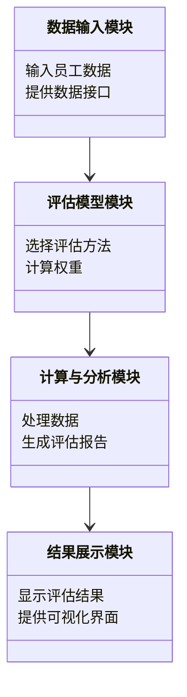

                 


# 企业估值中的人力资本价值法

## 关键词：企业估值，人力资本，价值评估，算法原理，系统架构

## 摘要

人力资本是企业在现代经济中最重要的资产之一。本文从人力资本的基本概念出发，结合企业估值的核心方法，详细阐述了人力资本价值法的理论基础、数学模型、算法实现和系统架构设计。文章通过实际案例分析，探讨了如何将人力资本价值法应用于企业估值，并提供了完整的项目实战代码。最后，文章总结了人力资本价值法的优势与挑战，并对未来的发展方向进行了展望。

---

## 第1章：人力资本的定义与背景

### 1.1 人力资本的基本概念

#### 1.1.1 人力资本的定义与内涵

人力资本是指企业员工的知识、技能、经验和创造力的总和，是企业在竞争中获得持续优势的核心资源。与传统资本（如财务资本、实物资本）不同，人力资本具有动态性、无形性和难以量化的特征。

#### 1.1.2 人力资本与传统资本的对比

| 资本类型 | 特性 | 价值来源 | 测度方式 |
|----------|------|----------|----------|
| 人力资本 | 动态性、无形性、个体差异性 | 员工的知识、技能、经验 | 难以直接量化，需通过间接方法评估 |
| 财务资本 | 稳定性、可量化性 | 资金、设备、厂房 | 财务报表直接反映 |
| 实物资本 | 可见性、可触性 | 设备、厂房、原材料 | 资产负债表直接反映 |

#### 1.1.3 人力资本在企业估值中的重要性

人力资本是企业创新的核心驱动力。在知识经济时代，企业价值越来越依赖于员工的能力和创造力，因此，如何准确评估人力资本的价值，已成为企业估值的关键问题。

---

### 1.2 人力资本的现状与趋势

#### 1.2.1 现代企业对人力资本的依赖

随着经济全球化和技术进步的加速，企业的竞争优势 increasingly depends on employees' knowledge, skills, and expertise.

#### 1.2.2 人力资本在企业创新中的作用

人力资本是企业创新的核心源泉。员工的创造力和创新能力直接决定了企业的技术进步和产品竞争力。

#### 1.2.3 人力资本价值法的发展历程

人力资本价值法经历了从简单的人力成本计算到复杂的多维度价值评估的发展过程。随着大数据和人工智能技术的进步，人力资本价值评估的精度和效率不断提升。

---

## 第2章：人力资本价值法的核心理论

### 2.1 人力资本理论

#### 2.1.1 人力资本理论的起源与发展

人力资本理论起源于20世纪60年代，由美国经济学家舒尔茨（T. W. Schultz）提出。他认为，人力资本是经济增长的主要驱动力。

#### 2.1.2 人力资本的核心要素

- **知识**：员工的专业知识和行业经验。
- **技能**：员工的技术能力和实践能力。
- **经验**：员工在企业中的工作年限和积累的经验。
- **创造力**：员工的创新能力和解决问题的能力。

#### 2.1.3 人力资本的动态特征

人力资本具有动态性，员工的知识和技能会随着时间和环境的变化而不断更新和提升。

---

### 2.2 价值评估的基本原理

#### 2.2.1 价值评估的定义与方法

价值评估是通过一定的方法和模型，对人力资本的价值进行量化的过程。常用的方法包括层次分析法（AHP）、模糊综合评价法和数据包络分析法（DEA）。

#### 2.2.2 人力资本价值的构成要素

| 要素 | 描述 |
|------|------|
| 知识 | 员工的专业知识和行业经验 |
| 技能 | 员工的技术能力和实践能力 |
| 经验 | 员工在企业中的工作年限和积累的经验 |
| 创造力 | 员工的创新能力和解决问题的能力 |

#### 2.2.3 价值评估的数学模型

人力资本价值的计算公式如下：

$$
V = \sum_{i=1}^{n} w_i \cdot x_i
$$

其中：
- \( V \) 是人力资本的总价值
- \( w_i \) 是第 \( i \) 个要素的权重
- \( x_i \) 是第 \( i \) 个要素的评分

---

## 第3章：人力资本价值的评估方法

### 3.1 人力资本价值评估的步骤

#### 3.1.1 确定评估目标

明确人力资本价值评估的目标，例如：员工的价值评估、团队的价值评估、企业整体的人力资本价值评估。

#### 3.1.2 数据收集与预处理

收集与人力资本相关的数据，包括员工的教育背景、工作经验、技能水平、绩效表现等。

#### 3.1.3 选择评估方法

根据实际情况选择合适的评估方法，例如：层次分析法（AHP）、模糊综合评价法等。

#### 3.1.4 计算与分析

根据选择的评估方法，计算人力资本的价值，并进行数据分析和结果解释。

---

### 3.2 人力资本价值评估的数学模型

#### 3.2.1 层次分析法（AHP）

层次分析法是一种常用的多准则决策方法，适用于人力资本价值评估中多个要素的权重分配和综合评价。

1. 建立层次分析模型，包括目标层、准则层和方案层。
2. 构造比较矩阵，确定各准则的权重。
3. 计算各准则的特征值和特征向量，确定各准则的权重。
4. 计算方案层的综合得分，确定各方案的优先顺序。

---

## 第4章：人力资本价值评估的系统架构设计

### 4.1 系统功能设计

#### 4.1.1 功能模块

- **数据输入模块**：收集员工的教育背景、工作经验、技能水平等数据。
- **评估模型模块**：选择合适的评估方法（如AHP、模糊综合评价法）。
- **计算与分析模块**：计算人力资本的价值，并生成评估报告。
- **结果展示模块**：以图表形式展示评估结果。

#### 4.1.2 领域模型（Mermaid 类图）



---

### 4.2 系统架构设计

#### 4.2.1 系统架构图


---

## 第5章：项目实战

### 5.1 环境安装

#### 5.1.1 安装Python环境

```bash
python --version
pip install numpy
pip install scikit-learn
```

#### 5.1.2 安装Jupyter Notebook

```bash
pip install jupyter
jupyter notebook
```

---

### 5.2 核心代码实现

#### 5.2.1 层次分析法（AHP）的Python实现

```python
import numpy as np
from sklearn.preprocessing import normalize

def calculate_weights(matrix):
    # 计算归一化矩阵
    normalized_matrix = normalize(matrix, norm='max')
    # 计算特征向量
    eigenvectors = np.linalg.eig(normalized_matrix)
    return eigenvectors[1]

# 示例数据矩阵
matrix = np.array([
    [1, 3, 2],
    [2, 1, 1],
    [3, 2, 1]
])

weights = calculate_weights(matrix)
print("权重向量为:", weights)
```

---

### 5.3 案例分析

#### 5.3.1 案例背景

假设某企业需要评估三个部门的人力资本价值，数据包括员工的教育背景、工作经验、技能水平和绩效表现。

#### 5.3.2 数据处理与分析

```python
import pandas as pd

data = pd.DataFrame({
    '教育背景': [4, 3, 5],
    '工作经验': [5, 4, 3],
    '技能水平': [3, 2, 4],
    '绩效表现': [4, 5, 2]
})

print(data)
```

---

## 第6章：总结与展望

### 6.1 最佳实践 tips

- 在进行人力资本价值评估时，应结合企业的实际情况选择合适的评估方法。
- 数据的准确性和完整性是评估结果的关键，建议尽可能收集多维度的数据。

### 6.2 小结

人力资本价值法是一种科学、系统的评估方法，能够帮助企业更好地管理和优化其最重要的资产——人力资本。

### 6.3 注意事项

- 人力资本价值评估的结果仅供参考，实际应用中应结合企业的具体情况进行调整。
- 在数据收集和分析过程中，应确保数据的准确性和完整性。

### 6.4 拓展阅读

- 舒尔茨的《人力资本投资》
- 托马斯·彼得斯的《追求卓越》
- 格里高利·博克的《人才战争》

---

## 作者：AI天才研究院 & 禅与计算机程序设计艺术

---

**本文由AI天才研究院 & 禅与计算机程序设计艺术联合撰写，转载请注明出处。**

