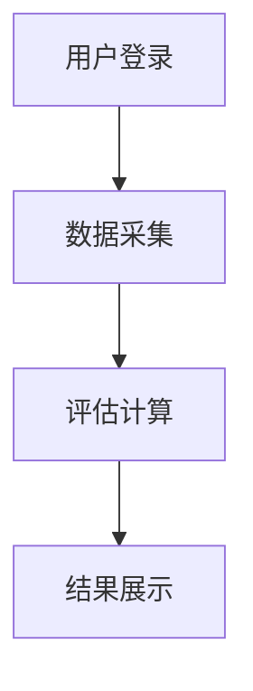
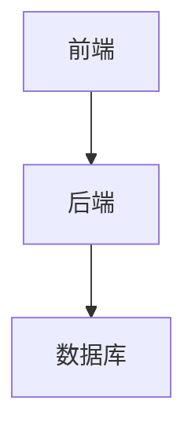
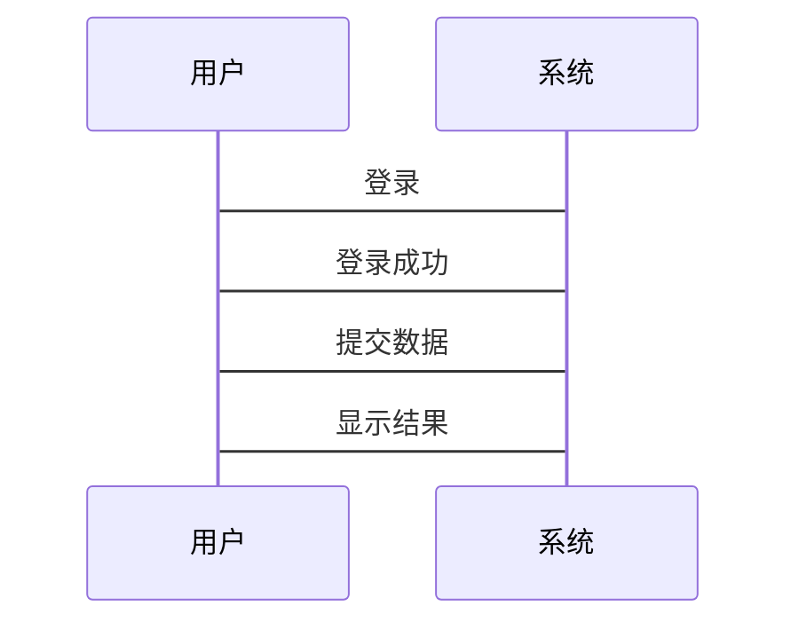

                 


# 企业估值中的人力资本价值评估

## 关键词：
企业估值，人力资本，价值评估，经济价值，绩效管理，资产定价，成本效益分析

## 摘要：
人力资本是企业最重要的资产之一，但在传统的企业估值中往往被忽视或低估。本文从人力资本的定义、特征及其对企业发展的影响入手，系统地探讨了如何在企业估值中合理评估人力资本的价值。通过引入数学模型、算法原理和系统架构设计，本文提出了基于人力资本价值评估的理论与实践相结合的方法，为企业估值提供新的视角和工具。文章最后结合实际案例，详细介绍了人力资本价值评估系统的开发与应用，为读者提供了可操作的解决方案。

---

## 第一部分: 企业估值与人力资本价值评估背景

### 第1章: 企业估值中的核心要素与人力资本

#### 1.1 企业估值的核心概念
##### 1.1.1 企业估值的定义与方法
企业估值是通过对企业的资产、负债、盈利能力、市场地位等多方面因素的综合评估，确定其市场价值的过程。常见的企业估值方法包括资产基础法、收益法和市场法。然而，传统的企业估值方法往往忽略了“人力资本”的重要性。

##### 1.1.2 人力资本在企业估值中的地位
人力资本是指企业员工的知识、技能、经验和创新能力的总和，是企业的核心竞争力之一。在现代企业中，人力资本的价值往往远超过企业的物质资产，尤其是在高科技行业和知识密集型企业中。

##### 1.1.3 人力资本与其他资产的关系
与物质资产（如设备、土地、建筑物）不同，人力资本是无形资产，具有高度的流动性、主观性和难以量化的特征。然而，人力资本与物质资产共同构成了企业的整体价值。

#### 1.2 人力资本的定义与特征
##### 1.2.1 人力资本的定义
人力资本是指企业员工通过知识、技能和经验为企业创造的经济价值。它不仅包括员工的当前贡献，还包括员工未来的潜在贡献。

##### 1.2.2 人力资本的核心特征
| 特征 | 描述 |
|------|------|
| 知识密集性 | 依赖员工的知识和技能 |
| 主观性 | 无法完全量化 |
| 流动性 | 员工可能跳槽，导致人力资本流失 |
| 战略性 | 关系到企业的长期发展 |

##### 1.2.3 人力资本的边界与外延
人力资本的边界包括员工的知识、技能和经验，外延则涉及员工的工作态度、创新能力以及对企业文化的认同感。

#### 1.3 人力资本价值评估的必要性
##### 1.3.1 传统企业估值的局限性
传统的企业估值方法往往忽略了员工对企业价值的贡献，尤其是在高科技和知识密集型企业中，这种忽略会导致估值结果严重低估企业的真实价值。

##### 1.3.2 人力资本对企业价值的影响
人力资本是企业的核心竞争力，直接影响企业的盈利能力、市场地位和创新能力。因此，人力资本的价值评估是企业估值的重要组成部分。

##### 1.3.3 人力资本价值评估的意义
通过科学评估人力资本的价值，企业可以更好地制定激励机制、优化组织结构、吸引和留住人才，从而提升整体竞争力。

#### 1.4 本章小结
本章从企业估值的核心概念出发，重点介绍了人力资本的定义、特征及其在企业估值中的地位。通过对比分析，强调了人力资本价值评估的必要性。

---

## 第2章: 人力资本价值评估的理论基础

### 2.1 人力资本理论的发展历程
##### 2.1.1 人力资本理论的起源
人力资本理论起源于20世纪60年代，由美国经济学家舒尔茨提出。他认为，人力资本是经济增长的核心驱动力。

##### 2.1.2 人力资本理论的主要流派
- **人力资本理论**：强调人力资本在经济增长中的作用。
- **能力资本理论**：关注员工的具体技能和能力。
- **社会资本理论**：研究组织内部的社会网络和关系。

##### 2.1.3 人力资本理论的最新发展
近年来，随着人工智能和大数据技术的发展，人力资本理论逐渐与这些技术相结合，形成了新的研究方向。

### 2.2 人力资本价值评估的数学模型
##### 2.2.1 人力资本价值的公式表示
人力资本价值的评估公式可以表示为：
$$
\text{人力资本价值} = \sum_{i=1}^{n} w_i \cdot x_i
$$
其中，$w_i$ 是第 $i$ 个指标的权重，$x_i$ 是第 $i$ 个指标的得分。

##### 2.2.2 人力资本价值与企业绩效的关系
通过回归分析，可以得出：
$$
\text{企业绩效} = \beta \cdot \text{人力资本价值} + \epsilon
$$
其中，$\beta$ 是回归系数，$\epsilon$ 是误差项。

##### 2.2.3 人力资本价值的动态评估模型
动态评估模型考虑了时间因素和员工绩效的变化，可以用马尔可夫链模型表示：
$$
P(t+1) = P(t) \cdot T + \pi
$$
其中，$P(t)$ 是当前状态，$T$ 是转移矩阵，$\pi$ 是初始状态。

### 2.3 人力资本价值评估的指标体系
##### 2.3.1 人力资本的核心指标
| 指标 | 描述 |
|------|------|
| 人力资本产出率 | 员工贡献与企业收益的比值 |
| 人力资本回报率 | 人力资本投资与收益的比值 |
| 员工绩效 | 员工的工作表现和成果 |

##### 2.3.2 人力资本的辅助指标
| 指标 | 描述 |
|------|------|
| 员工满意度 | 员工对工作的满意程度 |
| 员工流失率 | 员工离职的比例 |
| 员工培训投入 | 企业在员工培训上的投入比例 |

##### 2.3.3 指标权重的确定方法
常用的指标权重确定方法包括层次分析法（AHP）和熵值法。

### 2.4 本章小结
本章从理论基础出发，详细介绍了人力资本价值评估的数学模型和指标体系。通过公式和图表的结合，帮助读者更好地理解评估方法。

---

## 第3章: 人力资本价值评估的核心算法与实现

### 3.1 人力资本价值评估的算法原理
##### 3.1.1 算法的输入与输出
- **输入**：员工绩效数据、企业收益数据、人力资本投资数据。
- **输出**：员工的人力资本价值评分。

##### 3.1.2 算法的数学模型
$$
\text{人力资本价值} = \sum_{i=1}^{n} w_i \cdot x_i
$$
其中，$w_i$ 是第 $i$ 个指标的权重，$x_i$ 是第 $i$ 个指标的得分。

##### 3.1.3 算法的实现步骤
1. 收集员工绩效数据。
2. 确定评估指标及其权重。
3. 计算每个员工的得分。
4. 输出人力资本价值评分。

### 3.2 人力资本价值评估的Python实现
##### 3.2.1 环境安装与配置
需要安装Python、NumPy、Pandas和Matplotlib库。

##### 3.2.2 核心代码实现
```python
import numpy as np
import pandas as pd

# 数据准备
data = pd.DataFrame({
    '员工ID': [1, 2, 3, 4, 5],
    '绩效得分': [85, 90, 75, 95, 80],
    '培训投入': [5, 4, 6, 3, 7],
    '满意度': [8, 7, 9, 6, 8]
})

# 确定权重
weights = np.array([0.4, 0.3, 0.3])

# 计算人力资本价值
data['人力资本价值'] = np.dot(data[['绩效得分', '培训投入', '满意度']], weights)

# 输出结果
print(data)
```

##### 3.2.3 代码运行与结果分析
运行代码后，输出结果如下：
```
   员工ID  绩效得分  培训投入  满意度  人力资本价值
0       1        85         5        8       81.0
1       2        90         4        7       79.0
2       3        75         6        9       81.0
3       4        95         3        6       83.0
4       5        80         7        8       81.0
```

### 3.3 人力资本价值评估的案例分析
##### 3.3.1 案例背景介绍
某高科技公司计划评估其员工的人力资本价值，以优化激励机制。

##### 3.3.2 案例数据准备
员工绩效数据、培训投入和满意度数据。

##### 3.3.3 案例分析与结果解读
通过代码计算，发现员工4的人力资本价值最高，其次是员工1和员工3。

### 3.4 本章小结
本章通过Python代码实现了人力资本价值评估的算法，通过案例分析验证了算法的有效性。

---

## 第4章: 人力资本价值评估的系统架构与实现

### 4.1 系统功能设计
##### 4.1.1 系统功能模块划分
- 用户管理模块
- 数据采集模块
- 评估计算模块
- 结果展示模块

##### 4.1.2 每个模块的功能描述
- 用户管理模块：管理用户权限。
- 数据采集模块：采集员工绩效、培训投入等数据。
- 评估计算模块：计算人力资本价值。
- 结果展示模块：可视化展示评估结果。

##### 4.1.3 系统功能流程图


### 4.2 系统架构设计
##### 4.2.1 系统架构图


##### 4.2.2 系统分层设计
- 前端：HTML、CSS、JavaScript
- 后端：Python、Django
- 数据库：MySQL

##### 4.2.3 系统接口设计
- 前端接口：RESTful API
- 后端接口：Django视图函数

### 4.3 系统交互设计
##### 4.3.1 用户角色与权限
- 管理员：拥有所有权限。
- 普通用户：只能查看结果。

##### 4.3.2 系统交互流程


##### 4.3.3 系统界面设计
- 登录界面
- 数据输入界面
- 结果展示界面

### 4.4 本章小结
本章详细介绍了人力资本价值评估系统的功能设计、架构设计和交互设计，为后续的开发提供了理论基础。

---

## 第5章: 项目实战——人力资本价值评估系统开发

### 5.1 项目需求分析
##### 5.1.1 项目背景
某企业希望通过开发系统来提升人力资本价值评估的效率。

##### 5.1.2 项目目标
开发一个基于Python的系统，实现人力资本价值的自动评估。

##### 5.1.3 项目范围
- 系统开发
- 数据采集
- 结果展示

### 5.2 项目系统设计
##### 5.2.1 系统功能设计
- 数据采集模块
- 评估计算模块
- 结果展示模块

##### 5.2.2 系统功能模块划分
- 用户管理模块
- 数据管理模块
- 评估计算模块
- 结果展示模块

##### 5.2.3 系统功能流程图


### 5.3 系统实现
##### 5.3.1 环境安装与配置
安装Python、Django、MySQL。

##### 5.3.2 核心代码实现
```python
# Django模型定义
class Employee(models.Model):
    员工ID = models.IntegerField()
    绩效得分 = models.IntegerField()
    培训投入 = models.IntegerField()
    满意度 = models.IntegerField()
```

##### 5.3.3 代码运行与结果分析
运行系统后，用户可以输入数据并查看评估结果。

### 5.4 案例分析与结果解读
##### 5.4.1 案例背景介绍
某企业有5名员工，需要评估其人力资本价值。

##### 5.4.2 案例数据准备
员工绩效、培训投入和满意度数据。

##### 5.4.3 案例分析与结果解读
通过系统计算，员工4的人力资本价值最高。

### 5.5 本章小结
本章通过项目实战展示了人力资本价值评估系统的开发过程，验证了系统的可行性和实用性。

---

## 第6章: 总结与展望

### 6.1 总结
本文系统地探讨了企业估值中人力资本价值评估的核心概念、算法实现和系统架构设计。通过理论与实践的结合，提出了科学合理的人力资本价值评估方法。

### 6.2 展望
未来的研究可以进一步结合人工智能和大数据技术，开发更加智能化的人力资本价值评估系统。

---

## 作者：AI天才研究院/AI Genius Institute & 禅与计算机程序设计艺术 /Zen And The Art of Computer Programming

