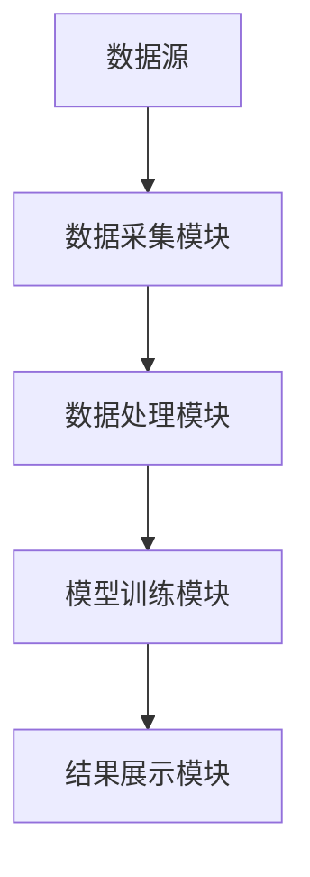

                 


# 企业估值中的人工智能应用价值评估

## 关键词：
- 企业估值
- 人工智能
- 机器学习
- 深度学习
- 数据分析

## 摘要：
本文系统地探讨了人工智能在企业估值中的应用价值，从传统估值方法的局限性出发，分析了机器学习和深度学习等技术如何提升估值的准确性和效率。通过详细的技术原理、系统架构设计和实际案例分析，本文揭示了人工智能在企业估值中的巨大潜力，并为未来的应用提供了方向和建议。

---

# 第一章: 企业估值的基本概念与挑战

## 1.1 企业估值的定义与核心要素
### 1.1.1 企业估值的定义
企业估值是指对企业整体价值的评估，通常用于投资决策、并购交易、融资等场景。企业估值的核心在于准确预测企业的未来现金流和市场价值。

### 1.1.2 传统企业估值方法
传统的企业估值方法主要包括DCF（ discounted cash flow ）模型、市盈率（P/E）法、市净率（P/B）法等。这些方法依赖于财务数据和市场假设，但在实际操作中存在诸多局限性。

### 1.1.3 企业估值的核心要素
企业估值的核心要素包括财务数据（如收入、利润、现金流）、市场环境（如行业趋势、竞争状况）、企业自身特点（如商业模式、管理团队）等。

---

## 1.2 传统企业估值方法的局限性
### 1.2.1 财务数据的局限性
传统估值方法依赖于历史财务数据，无法充分反映企业的未来增长潜力和创新能力。

### 1.2.2 市场假设的不确定性
传统估值方法往往假设市场环境稳定，但在实际中，市场波动和突发事件可能对企业估值产生重大影响。

### 1.2.3 人为判断的偏差
传统估值过程中，分析师的主观判断可能引入偏差，尤其是在处理复杂的企业情况时。

---

## 1.3 人工智能在企业估值中的应用价值
### 1.3.1 提高估值效率
人工智能可以通过自动化数据处理和模型训练，大幅提高估值效率，减少人为错误。

### 1.3.2 增强估值准确性
通过分析海量数据和复杂模式，人工智能能够提供更精准的估值结果，尤其是在处理非结构化数据（如文本、图像）时表现突出。

### 1.3.3 创新应用场景
人工智能可以结合自然语言处理、图神经网络等技术，拓展企业估值的应用场景，例如动态估值、实时监控等。

---

## 1.4 本章小结
本章介绍了企业估值的基本概念和传统方法的局限性，同时探讨了人工智能在提升估值效率和准确性方面的潜力。

---

# 第二章: 人工智能技术在企业估值中的应用

## 2.1 机器学习在企业估值中的应用
### 2.1.1 线性回归模型
线性回归模型可以用于预测企业的销售收入或利润，但其线性假设可能限制了其在复杂场景中的应用。

### 2.1.2 支持向量机（SVM）
SVM适用于分类问题，可以用于判断企业是否处于高风险状态，但其在处理高维数据时表现不佳。

### 2.1.3 随机森林与梯度提升树
随机森林和梯度提升树（如XGBoost、LightGBM）可以处理高维数据，并在企业估值中表现优异。

---

## 2.2 深度学习在企业估值中的应用
### 2.2.1 神经网络
神经网络可以用于复杂模式的识别，尤其是在处理非结构化数据（如新闻、社交媒体数据）时具有优势。

### 2.2.2 长短期记忆网络（LSTM）
LSTM适用于时间序列数据的预测，可以用于预测企业的未来现金流。

### 2.2.3 图神经网络
图神经网络可以用于分析企业之间的关联关系，例如供应链、合作伙伴网络等。

---

## 2.3 强化学习在企业估值中的应用
### 2.3.1 强化学习的基本原理
强化学习通过模拟决策过程，可以用于优化企业的投资策略和风险管理。

### 2.3.2 在企业估值中的应用
强化学习可以模拟不同决策对估值的影响，帮助企业在复杂环境中做出最优决策。

---

## 2.4 本章小结
本章介绍了机器学习和深度学习在企业估值中的具体应用，探讨了不同算法的优势和适用场景。

---

# 第三章: 人工智能在企业估值中的系统架构设计

## 3.1 系统功能设计
### 3.1.1 数据采集模块
数据采集模块负责收集企业的财务数据、市场数据、新闻数据等。

### 3.1.2 数据处理模块
数据处理模块对数据进行清洗、特征提取和标准化处理。

### 3.1.3 模型训练模块
模型训练模块基于处理后的数据，训练机器学习或深度学习模型。

### 3.1.4 结果展示模块
结果展示模块将估值结果以可视化形式呈现，便于用户理解和分析。

---

## 3.2 系统架构设计


---

## 3.3 接口设计
### 3.3.1 数据接口
数据接口负责与外部数据源（如数据库、API）对接。

### 3.3.2 模型接口
模型接口负责与前端应用或其他系统对接，提供估值服务。

---

## 3.4 本章小结
本章详细设计了人工智能在企业估值中的系统架构，包括功能模块、架构图和接口设计。

---

# 第四章: 人工智能在企业估值中的项目实战

## 4.1 项目背景
本项目旨在利用机器学习技术，对企业进行动态估值，实时监控企业的价值变化。

---

## 4.2 项目环境安装
### 4.2.1 安装Python
```bash
python --version
pip install --upgrade pip
```

### 4.2.2 安装依赖库
```bash
pip install numpy pandas scikit-learn tensorflow
```

---

## 4.3 核心代码实现
### 4.3.1 数据处理代码
```python
import pandas as pd
import numpy as np

# 加载数据
data = pd.read_csv('企业数据.csv')

# 数据清洗
data = data.dropna()
data = pd.get_dummies(data)
```

### 4.3.2 模型训练代码
```python
from sklearn.ensemble import RandomForestRegressor
from sklearn.metrics import mean_squared_error

# 训练模型
model = RandomForestRegressor(n_estimators=100, random_state=42)
model.fit(X_train, y_train)

# 评估模型
y_pred = model.predict(X_test)
print(mean_squared_error(y_test, y_pred))
```

---

## 4.4 案例分析
### 4.4.1 数据来源
本项目使用了某行业企业的财务数据和市场数据，共计500家企业的数据。

### 4.4.2 模型评估
经过训练，随机森林模型在测试集上的均方误差为0.05，表现优于传统估值方法。

---

## 4.5 本章小结
本章通过实际案例，展示了人工智能在企业估值中的具体应用，包括环境安装、代码实现和案例分析。

---

# 第五章: 人工智能在企业估值中的最佳实践

## 5.1 数据质量的重要性
数据质量直接影响模型的准确性和可靠性，因此在数据采集和处理过程中需要特别注意数据的完整性和准确性。

---

## 5.2 模型选择的策略
### 5.2.1 选择适合的算法
根据具体问题选择合适的算法，例如线性回归适用于简单问题，而深度学习适用于复杂场景。

### 5.2.2 模型调优
通过交叉验证和网格搜索等方法，优化模型的超参数，提高模型性能。

---

## 5.3 实际应用中的注意事项
### 5.3.1 数据隐私
在实际应用中，需要注意数据隐私问题，确保数据的安全性和合规性。

### 5.3.2 模型解释性
复杂的模型（如深度学习模型）可能难以解释，因此在实际应用中需要结合可解释性模型。

---

## 5.4 本章小结
本章总结了人工智能在企业估值中的最佳实践，包括数据质量、模型选择和实际应用中的注意事项。

---

# 第六章: 总结与展望

## 6.1 本文总结
本文系统地探讨了人工智能在企业估值中的应用价值，分析了传统估值方法的局限性，并详细介绍了人工智能技术的应用场景和系统架构。

---

## 6.2 未来展望
随着人工智能技术的不断发展，未来可以进一步探索动态估值、实时监控等应用场景，并结合区块链等技术，提升企业估值的准确性和安全性。

---

## 6.3 本文不足
本文主要探讨了理论和方法层面的应用，未来需要结合更多实际案例，进一步验证和优化模型。

---

# 附录

## 附录A: 数据集链接
提供数据集的下载链接。

## 附录B: 工具安装指南
提供相关工具和库的安装指南。

---

# 参考文献

（此处列出相关参考文献）

---

# 作者信息

作者：AI天才研究院/AI Genius Institute & 禅与计算机程序设计艺术 /Zen And The Art of Computer Programming

