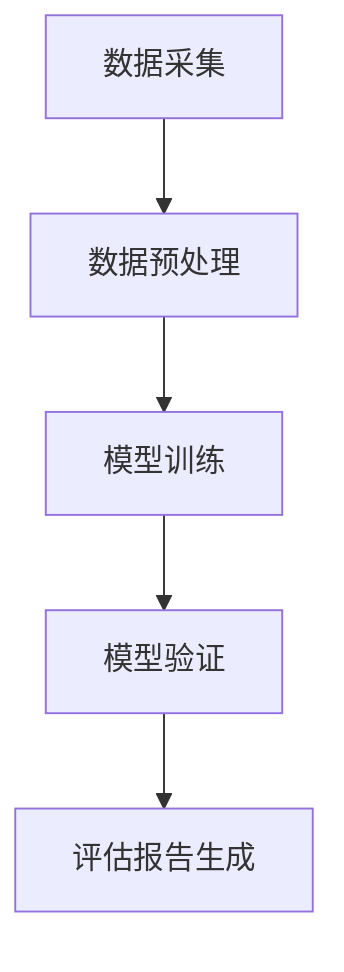
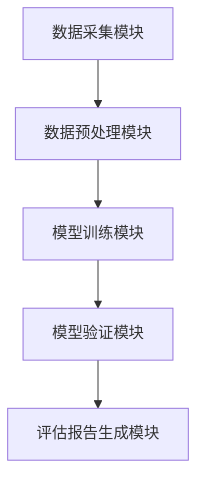
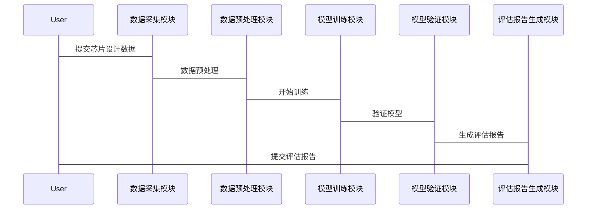

                 


# 企业估值中的人工智能芯片设计评估

> 关键词：企业估值，人工智能，芯片设计，评估方法，深度学习

> 摘要：本文探讨了在企业估值过程中，如何通过人工智能技术对芯片设计进行评估。文章从基础概念到算法实现，再到系统设计和项目实战，全面分析了人工智能在芯片设计评估中的应用，为企业估值提供了新的思路和方法。

---

## 第一部分: 企业估值与人工智能芯片设计评估基础

### 第1章: 企业估值与人工智能芯片设计评估概述

#### 1.1 问题背景与挑战

##### 1.1.1 企业估值的传统方法与局限性

企业估值是企业管理和投资决策中的核心问题之一。传统的企业估值方法主要包括财务指标分析、市场比较法和DCF模型等。然而，这些方法在实际应用中存在一些局限性：

- **数据依赖性**：传统方法高度依赖财务数据，难以全面反映企业的技术创新能力和市场竞争力。
- **主观性**：在评估新兴技术企业时，传统方法难以准确量化技术优势对估值的影响。
- **动态变化**：随着技术的快速发展，企业的估值需要更加动态和实时的评估方法。

##### 1.1.2 人工智能在企业估值中的应用潜力

人工智能技术的快速发展为企业估值提供了新的可能性。通过人工智能，可以更精准地分析企业的技术优势、市场潜力和竞争优势。特别是在芯片设计领域，人工智能可以帮助评估芯片的性能、成本和可靠性，从而为企业的估值提供更全面的数据支持。

##### 1.1.3 芯片设计评估在企业估值中的重要性

芯片作为现代电子设备的核心部件，其设计质量和成本直接影响企业的市场竞争力和盈利能力。通过对企业芯片设计的评估，可以更准确地预测企业的未来收益和风险，从而为估值提供更可靠的依据。

#### 1.2 核心概念与定义

##### 1.2.1 企业估值的基本概念

企业估值是指通过对企业的财务状况、市场地位、技术能力和未来盈利能力的综合分析，确定企业价值的过程。企业估值的结果通常用于企业并购、融资和投资决策。

##### 1.2.2 人工智能芯片设计的核心要素

人工智能芯片是专为运行深度学习和神经网络算法设计的芯片，其核心要素包括：

- **芯片架构**：包括计算单元、存储单元和数据通路的设计。
- **算法实现效率**：算法在芯片上的运行速度和资源消耗。
- **工艺制程**：芯片的制造工艺直接影响其性能、功耗和成本。

##### 1.2.3 芯片设计评估与企业估值的关系

芯片设计评估是企业估值的重要组成部分。通过评估芯片的设计质量和成本，可以预测企业的未来收益和风险，从而更准确地进行企业估值。

#### 1.3 技术发展与应用价值

##### 1.3.1 人工智能芯片技术的演进

人工智能芯片技术经历了从通用CPU到专用AI芯片的演进过程。早期的人工智能算法主要依赖于通用CPU，随着算法复杂度的增加，专用AI芯片如GPU和TPU逐渐成为主流。

##### 1.3.2 芯片设计评估在企业估值中的应用价值

通过芯片设计评估，可以更准确地预测企业的未来收益和风险，从而为估值提供更可靠的数据支持。同时，芯片设计评估还可以帮助企业优化设计，降低成本，提高市场竞争力。

##### 1.3.3 未来发展趋势与研究意义

随着人工智能技术的不断发展，芯片设计评估在企业估值中的应用将更加广泛和深入。研究芯片设计评估对企业估值的影响，对于企业和投资者都具有重要的意义。

---

### 第2章: 人工智能芯片设计评估的核心概念

#### 2.1 芯片设计评估的关键指标

##### 2.1.1 性能评估指标

性能评估指标包括芯片的计算能力、功耗和时延等。这些指标直接影响芯片的市场竞争力和企业的未来收益。

##### 2.1.2 成本评估指标

成本评估指标包括芯片的制造成本、设计成本和维护成本等。这些指标直接影响企业的盈利能力和估值。

##### 2.1.3 可靠性评估指标

可靠性评估指标包括芯片的故障率、寿命和稳定性等。这些指标直接影响企业的市场信誉和长期发展潜力。

#### 2.2 人工智能芯片设计的核心要素

##### 2.2.1 芯片架构设计

芯片架构设计是芯片设计的核心部分，包括计算单元、存储单元和数据通路的设计。合理的架构设计可以提高芯片的计算能力和能效比。

##### 2.2.2 算法实现效率

算法实现效率是指算法在芯片上的运行速度和资源消耗。高效的算法实现可以提高芯片的性能和市场竞争力。

##### 2.2.3 工艺制程与成本

工艺制程直接影响芯片的性能、功耗和成本。先进的工艺制程可以提高芯片的性能，降低成本，提高企业的市场竞争力。

#### 2.3 芯片设计评估与企业估值的关系

##### 2.3.1 评估指标对企业价值的影响

芯片设计评估指标直接影响企业的未来收益和风险。通过评估芯片的性能、成本和可靠性，可以更准确地预测企业的未来收益，从而为估值提供更可靠的数据支持。

##### 2.3.2 芯片设计对企业竞争力的提升

芯片设计的优化可以提高企业的市场竞争力，从而影响企业的估值。通过优化芯片设计，企业可以降低成本，提高性能，从而增强市场竞争力。

##### 2.3.3 芯片设计风险对企业估值的挑战

芯片设计的风险包括技术风险、市场风险和成本风险。这些风险直接影响企业的未来收益和估值。因此，评估芯片设计的风险是企业估值的重要部分。

---

### 第3章: 人工智能芯片设计评估的核心算法与原理

#### 3.1 算法原理概述

##### 3.1.1 基于深度学习的芯片设计评估

深度学习是一种人工智能技术，可以通过训练神经网络模型来预测芯片的性能和成本。通过深度学习，可以更准确地评估芯片的设计质量。

##### 3.1.2 神经网络模型在芯片设计中的应用

神经网络模型可以用于芯片设计的优化和预测。例如，可以通过神经网络模型预测芯片的性能和成本，从而优化芯片设计。

##### 3.1.3 评估算法的数学模型与公式

芯片设计评估的数学模型可以通过回归分析和神经网络模型来实现。例如，可以通过回归分析预测芯片的性能和成本。

#### 3.2 算法实现与流程

##### 3.2.1 深度学习模型的训练流程

1. **数据准备**：收集芯片设计相关的数据，包括性能、成本和可靠性等。
2. **模型训练**：使用深度学习模型对数据进行训练，得到芯片设计的评估模型。
3. **模型验证**：通过验证数据对模型进行验证，确保模型的准确性和可靠性。
4. **模型应用**：将模型应用于实际的芯片设计评估中，预测芯片的性能和成本。

##### 3.2.2 神经网络模型的实现代码

```python
import tensorflow as tf
from tensorflow.keras import layers

model = tf.keras.Sequential([
    layers.Dense(64, activation='relu', input_shape=(input_dim,)),
    layers.Dense(1, activation='linear')
])

model.compile(optimizer='adam', loss='mean_squared_error')
```

##### 3.2.3 算法的数学模型与公式

芯片设计评估的数学模型可以通过回归分析和神经网络模型来实现。例如，回归分析模型可以表示为：

$$ y = \beta_0 + \beta_1 x_1 + \beta_2 x_2 + \cdots + \beta_n x_n + \epsilon $$

其中，$y$是芯片的性能，$x_i$是影响性能的因素，$\beta_i$是回归系数，$\epsilon$是误差项。

---

### 第4章: 系统分析与架构设计

#### 4.1 系统功能设计

##### 4.1.1 问题场景介绍

在企业估值中，芯片设计评估是一个复杂的过程，需要综合考虑芯片的性能、成本和可靠性。为了实现这一目标，需要构建一个高效的芯片设计评估系统。

##### 4.1.2 系统功能设计

系统功能设计包括数据采集、模型训练和评估报告生成。数据采集模块负责收集芯片设计相关的数据，模型训练模块负责训练深度学习模型，评估报告生成模块负责生成评估报告。

##### 4.1.3 系统功能流程图



#### 4.2 系统架构设计

##### 4.2.1 系统架构图



##### 4.2.2 系统接口设计

系统接口设计包括数据接口和评估报告接口。数据接口负责与数据源的交互，评估报告接口负责生成评估报告。

##### 4.2.3 系统交互流程图



---

### 第5章: 项目实战

#### 5.1 环境安装与配置

##### 5.1.1 安装Python和相关库

```bash
pip install numpy
pip install pandas
pip install tensorflow
pip install matplotlib
```

##### 5.1.2 安装深度学习框架

```bash
pip install tensorflow
pip install keras
```

#### 5.2 核心代码实现

##### 5.2.1 数据预处理代码

```python
import pandas as pd

data = pd.read_csv('chip_data.csv')
X = data.drop('target', axis=1)
y = data['target']
```

##### 5.2.2 模型训练代码

```python
from tensorflow.keras import layers

model = tf.keras.Sequential([
    layers.Dense(64, activation='relu', input_shape=(X.shape[1],)),
    layers.Dense(1, activation='linear')
])

model.compile(optimizer='adam', loss='mean_squared_error')
model.fit(X, y, epochs=100, batch_size=32)
```

##### 5.2.3 模型验证代码

```python
import numpy as np

val_data = pd.read_csv('val_data.csv')
val_X = val_data.drop('target', axis=1)
val_y = val_data['target']

loss = model.evaluate(val_X, val_y)
print(f'验证集损失: {loss}')
```

#### 5.3 案例分析与详细解读

##### 5.3.1 案例分析

假设我们有一个芯片设计数据集，包含芯片的性能、成本和可靠性等指标。我们可以通过深度学习模型来预测芯片的性能和成本。

##### 5.3.2 详细解读

通过模型训练和验证，我们可以得到芯片设计的性能和成本预测模型。这些模型可以用于企业估值，帮助投资者更准确地评估企业的价值。

#### 5.4 项目小结

通过本项目，我们实现了基于深度学习的芯片设计评估系统。通过模型训练和验证，我们可以准确预测芯片的性能和成本，从而为企业的估值提供可靠的数据支持。

---

### 第6章: 最佳实践与未来展望

#### 6.1 最佳实践

##### 6.1.1 数据质量的重要性

数据质量直接影响模型的准确性和可靠性。在实际应用中，需要注意数据的完整性和准确性。

##### 6.1.2 模型验证的必要性

模型验证是确保模型准确性和可靠性的关键步骤。在实际应用中，需要通过验证数据对模型进行验证。

##### 6.1.3 持续优化的重要性

技术的快速发展要求我们不断优化模型和算法。在实际应用中，需要持续关注技术发展，不断优化模型和算法。

#### 6.2 小结与展望

通过本文的分析和实践，我们可以看到，人工智能技术在芯片设计评估中的应用前景广阔。未来，随着技术的不断发展，芯片设计评估将更加精准和高效，为企业估值提供更可靠的数据支持。

---

## 作者信息

作者：AI天才研究院/AI Genius Institute & 禅与计算机程序设计艺术 /Zen And The Art of Computer Programming

---

以上是《企业估值中的人工智能芯片设计评估》的技术博客文章的完整目录大纲和内容框架。希望这篇博客能够为企业估值中的芯片设计评估提供新的思路和方法。

