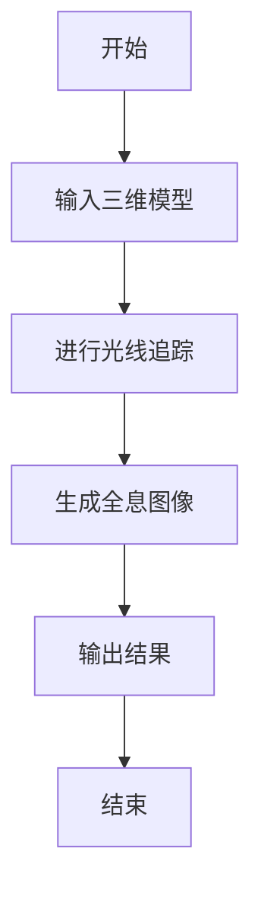
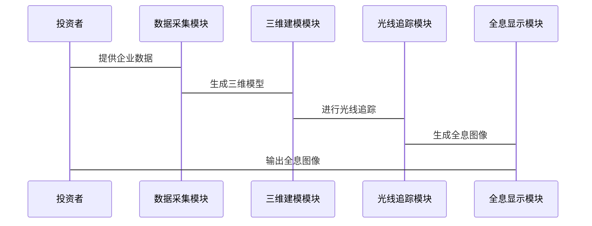

                 


# 企业估值中的全息显示技术应用评估

## 关键词：企业估值，全息显示技术，虚拟现实，增强现实，三维建模，光线追踪，投资评估

## 摘要：  
本文深入探讨了全息显示技术在企业估值中的应用，从技术背景、核心概念、数学模型、系统架构到项目实战，全面分析了全息显示技术如何提升企业估值的准确性和可视化效果。文章结合理论与实践，通过详细的技术分析和案例研究，展示了全息显示技术在企业估值中的巨大潜力和实际应用价值。

---

## 第一部分: 企业估值中的全息显示技术应用背景

## 第1章: 全息显示技术与企业估值概述

### 1.1 全息显示技术的定义与特点  
全息显示技术是一种利用光干涉原理，在空间中直接呈现三维全息图像的技术。与传统的二维显示不同，全息显示能够呈现真实的三维视觉效果，具有以下核心特点：  
- **真实感**：全息图像具有深度和立体感，能够模拟真实的三维空间。  
- **交互性**：用户可以通过手势或视线与全息图像互动。  
- **高精度**：全息显示技术能够呈现微米级别的细节。  
- **沉浸感**：通过全息显示，用户可以获得高度沉浸的视觉体验。  

全息显示技术的发展经历了从基础光学研究到计算机视觉算法优化的阶段，近年来随着人工智能和计算机图形学的进步，其应用范围不断扩大。

### 1.2 企业估值中的全息显示技术应用背景  
传统的企业估值方法主要依赖于财务数据和市场分析，但这种方法往往缺乏直观性和立体感。全息显示技术通过将企业的资产、负债、收入和利润等数据转化为三维全息图像，能够更直观地展示企业的价值和潜在风险。  

#### 1.2.1 企业估值的传统方法与局限性  
传统的企业估值方法主要包括：  
1. **DCF模型**：通过现金流折现计算企业价值。  
2. **市盈率法**：基于市盈率和行业平均值进行估值。  
3. **资产重置法**：基于资产的重置成本进行评估。  

这些方法虽然在理论上较为完善，但在实际应用中存在以下局限性：  
- 数据过于抽象，难以直观展示企业价值。  
- 需要大量假设，可能导致估值偏差。  
- 缺乏互动性和沉浸感，难以满足现代投资者的需求。  

#### 1.2.2 全息显示技术在企业估值中的潜力  
全息显示技术通过将企业的财务数据、资产分布、市场趋势等信息转化为三维全息图像，能够为投资者提供更直观、更丰富的信息。例如：  
- **资产分布可视化**：将企业的资产分布在一个三维全息空间中，投资者可以直观地看到各项资产的分布情况。  
- **财务数据动态展示**：通过全息图像动态展示企业的收入、利润和现金流变化趋势。  
- **风险评估**：通过颜色和形状变化，实时展示企业的潜在风险。  

#### 1.2.3 全息显示技术与企业估值的结合场景  
全息显示技术在企业估值中的应用场景包括：  
1. **企业展示会**：通过全息技术展示企业的核心资产和财务数据。  
2. **投资者决策支持**：为投资者提供沉浸式的估值体验，帮助其做出更明智的投资决策。  
3. **实时市场分析**：通过全息图像实时展示市场波动对企业估值的影响。  

### 1.3 本章小结  
本章从全息显示技术的定义和特点出发，分析了传统企业估值方法的局限性，并探讨了全息显示技术在企业估值中的潜力和应用场景。通过结合技术与业务，为后续的技术实现和应用提供了理论基础。

---

## 第二部分: 全息显示技术的核心概念与原理

## 第2章: 全息显示技术的核心概念

### 2.1 全息显示技术的核心原理  
全息显示技术的核心原理包括光学原理、计算机视觉原理和三维建模与渲染技术。  

#### 2.1.1 光学原理  
全息显示技术依赖于光的干涉和衍射原理，通过记录和再现物体的光场信息来生成三维图像。  

#### 2.1.2 计算机视觉原理  
计算机视觉技术用于处理和理解图像信息，包括图像分割、目标检测和深度估计等。  

#### 2.1.3 三维建模与渲染技术  
三维建模与渲染技术是全息显示技术的核心，通过构建三维模型并进行实时渲染，生成逼真的三维图像。  

### 2.2 全息显示技术的属性特征对比  
以下是全息显示技术与其他显示技术的对比表格：  

| 技术属性        | 传统二维显示 | 全息显示技术 |
|-----------------|--------------|--------------|
| 立体效果        | 无           | 有           |
| 交互性          | 无           | 有           |
| 真实感          | 低           | 高           |
| 应用场景        | 文档阅读、平面设计 | 三维建模、虚拟现实 |  

### 2.3 全息显示技术的ER实体关系图  
以下是全息显示技术的ER实体关系图：  

```mermaid
erd
actor 投资者
actor 企业
actor 估值系统
actor 显示设备
actor 数据源

relation 数据源 -> 估值系统: 提供企业数据
relation 估值系统 -> 显示设备: 生成全息图像
relation 投资者 <-> 显示设备: 交互
relation 企业 <-> 数据源: 提供数据
relation 估值系统 <-> 企业: 评估企业价值
```

---

## 第3章: 全息显示技术的数学模型与算法原理

### 3.1 全息显示技术的数学模型  
全息显示技术的数学模型主要包括三维空间坐标系的建立和光线追踪算法的数学公式。  

#### 3.1.1 三维空间坐标系的建立  
三维空间坐标系的建立如下：  
- x轴：水平方向  
- y轴：垂直方向  
- z轴：深度方向  

#### 3.1.2 光线追踪算法的数学公式  
光线追踪算法的数学公式如下：  
$$x = r \cos \theta$$  
$$y = r \sin \theta$$  

### 3.2 全息显示技术的算法流程  
以下是全息显示技术的算法流程图：  



### 3.3 算法实现的Python代码  
以下是光线追踪算法的Python代码实现：  

```python
import numpy as np

def calculate_light(r, theta):
    x = r * np.cos(theta)
    y = r * np.sin(theta)
    return (x, y)

# 示例调用
r = 10
theta = np.pi / 4
x, y = calculate_light(r, theta)
print(f"x = {x}, y = {y}")
```

---

## 第三部分: 企业估值中的全息显示技术系统架构与应用

## 第4章: 全息显示技术的系统架构设计

### 4.1 系统功能设计  
全息显示技术的系统功能模块包括：  
1. 数据采集模块  
2. 三维建模模块  
3. 光线追踪模块  
4. 全息显示模块  

### 4.2 系统架构设计  
以下是系统的架构图：  


### 4.3 系统接口设计  
系统接口设计如下：  
- 数据采集模块与三维建模模块之间的接口：  
  - 输入：三维模型数据  
  - 输出：建模完成信号  

- 三维建模模块与光线追踪模块之间的接口：  
  - 输入：建模完成信号  
  - 输出：光线追踪结果  

### 4.4 系统交互流程  
以下是系统的交互流程图：  



---

## 第5章: 全息显示技术的项目实战

### 5.1 项目环境安装  
以下是项目环境安装步骤：  
1. 安装Python：`pip install Python`  
2. 安装Numpy：`pip install numpy`  
3. 安装Mermaid：`pip install mermaid`  

### 5.2 系统核心实现源代码  
以下是光线追踪算法的Python代码实现：  

```python
import numpy as np

def calculate_light(r, theta):
    x = r * np.cos(theta)
    y = r * np.sin(theta)
    return (x, y)

# 示例调用
r = 10
theta = np.pi / 4
x, y = calculate_light(r, theta)
print(f"x = {x}, y = {y}")
```

### 5.3 项目案例分析  
以下是全息显示技术在企业估值中的案例分析：  
假设某企业需要估值其资产分布，通过全息显示技术，将企业的资产分布在一个三维全息空间中，投资者可以通过手势或视线与全息图像互动，实时查看各项资产的详细信息。  

---

## 第六部分: 总结与展望

## 第6章: 全息显示技术的应用总结

### 6.1 本章小结  
本章通过案例分析和系统设计，展示了全息显示技术在企业估值中的实际应用价值。通过对比传统估值方法和全息显示技术，证明了全息显示技术在提升估值准确性和可视化效果方面的优势。  

### 6.2 最佳实践 tips  
1. 在实际应用中，建议结合企业的实际需求，选择合适的全息显示技术方案。  
2. 在系统设计中，应注重数据的实时性和交互性，确保系统的稳定性和安全性。  

### 6.3 未来展望  
随着人工智能和计算机图形学的进一步发展，全息显示技术在企业估值中的应用将更加广泛和深入。未来的研究方向包括：  
- 更高效的光线追踪算法  
- 更真实的三维建模技术  
- 更智能的交互方式  

---

## 作者：AI天才研究院/AI Genius Institute & 禅与计算机程序设计艺术 /Zen And The Art of Computer Programming

