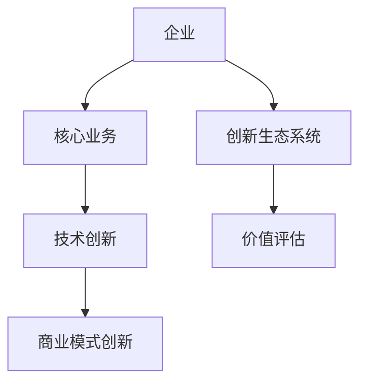
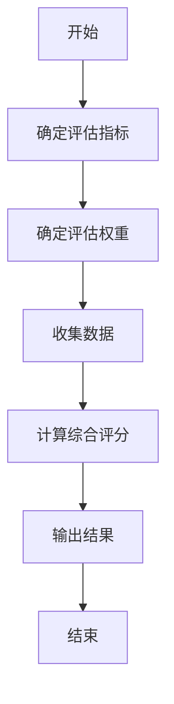
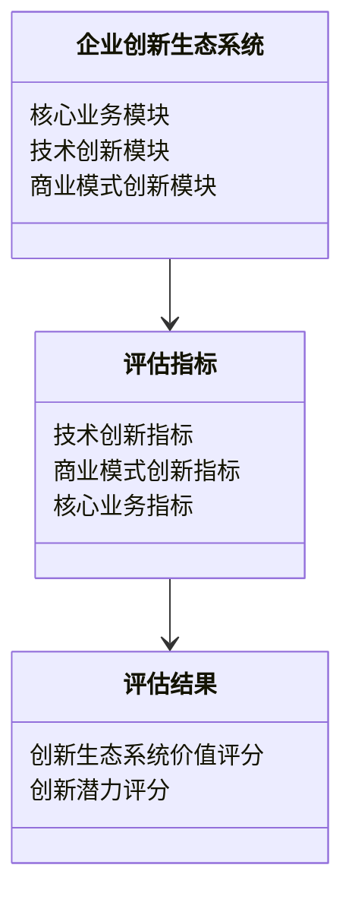
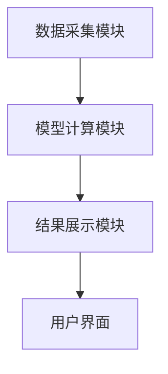

                 


# 企业估值中的创新生态系统价值评估

## 关键词：
企业估值、创新生态系统、价值评估、算法原理、系统架构

## 摘要：
创新生态系统是企业在竞争激烈的市场中保持持续增长和竞争优势的关键。本文从创新生态系统的概念、核心要素、价值评估方法、系统架构设计、实际案例分析等方面展开，系统地阐述了如何在企业估值中量化和评估创新生态系统的价值。通过结合层次分析法和模糊综合评价法，本文提供了一套创新生态系统价值评估的数学模型和实现方案，并通过实际案例分析展示了如何将理论应用于实践。

---

## 第一部分: 创新生态系统与企业估值的背景介绍

## 第1章: 创新生态系统概述

### 1.1 创新生态系统的核心概念

#### 1.1.1 问题背景与问题描述
在当今快速变化的商业环境中，企业的核心竞争力不再仅仅依赖于单一的产品或技术优势，而是依赖于整个创新生态系统的协同效应。创新生态系统是一个由企业内部核心业务、技术创新、商业模式创新等要素构成的复杂系统，其价值不仅体现在当前的财务表现上，更体现在未来的可持续增长潜力中。

#### 1.1.2 创新生态系统在企业估值中的作用
传统的财务估值方法往往忽视了创新生态系统对企业长期价值的影响。创新生态系统能够通过技术、商业模式和组织结构的协同创新，为企业创造更大的市场机会和竞争优势，从而显著提升企业的整体估值。

#### 1.1.3 创新生态系统的核心要素与边界
创新生态系统的核心要素包括：
- **核心业务模块**：企业的主营业务和核心产品。
- **技术创新模块**：企业的技术储备和研发能力。
- **商业模式创新模块**：企业的商业模式和市场策略。

创新生态系统的边界包括企业内部的创新资源和外部的合作伙伴、客户、供应商等。

### 1.2 创新生态系统与传统企业估值的对比

#### 1.2.1 传统企业估值方法的局限性
传统的估值方法（如市盈率、市净率等）主要依赖于企业的财务数据，忽视了创新生态系统对企业未来增长的潜在影响。

#### 1.2.2 创新生态系统对企业价值的影响
创新生态系统通过提高企业的创新能力和市场适应能力，显著提升了企业的未来盈利能力，从而增强了企业的估值。

#### 1.2.3 创新生态系统与企业可持续发展的关系
创新生态系统是企业实现可持续发展的核心驱动力。通过创新，企业可以不断优化产品和服务，满足客户的需求，同时减少对环境和社会的负面影响。

### 1.3 创新生态系统价值评估的必要性

#### 1.3.1 企业创新的核心驱动力
企业的核心竞争力来源于创新，而创新生态系统则是企业创新的核心驱动力。

#### 1.3.2 创新生态系统对企业竞争力的影响
创新生态系统通过整合企业内外部资源，提高了企业的创新效率和竞争力。

#### 1.3.3 创新生态系统价值评估的现实意义
创新生态系统价值评估是企业制定战略决策的重要依据，也是投资者评估企业长期价值的关键指标。

---

## 第2章: 创新生态系统的核心概念与联系

### 2.1 创新生态系统的核心要素

#### 2.1.1 核心业务模块
核心业务模块是企业的主营业务和核心产品，是创新生态系统的基础。

#### 2.1.2 技术创新模块
技术创新模块是企业的技术储备和研发能力，是创新生态系统的核心驱动力。

#### 2.1.3 商业模式创新模块
商业模式创新模块是企业的商业模式和市场策略，是创新生态系统的重要组成部分。

### 2.2 创新生态系统的核心属性特征对比

#### 2.2.1 核心属性对比表格
以下表格对比了传统企业和创新生态系统在核心属性上的差异：

| 属性       | 传统企业 | 创新生态系统 |
|------------|----------|--------------|
| 核心驱动力 | 产品与成本 | 创新与生态协同 |
| 价值来源   | 规模与效率 | 持续创新与生态价值 |
| 竞争优势   | 成本与质量 | 创新速度与生态网络 |

### 2.3 创新生态系统ER实体关系图



---

## 第3章: 创新生态系统价值评估的算法原理

### 3.1 创新生态系统价值评估模型

#### 3.1.1 模型概述
创新生态系统价值评估模型是一个基于层次分析法（AHP）和模糊综合评价法（FCM）的混合模型。该模型通过对企业创新生态系统的核心要素进行量化评估，计算出企业的创新生态系统价值。

#### 3.1.2 算法流程
以下是创新生态系统价值评估的算法流程图：



#### 3.1.3 数学模型与公式

##### 层次分析法（AHP）
层次分析法是一种用于确定各指标权重的方法。其基本步骤如下：
1. 构建层次分析模型。
2. 计算各指标的相对权重。
3. 进行一致性检验。

层次分析法的权重计算公式为：
$$
w_i = \frac{a_i}{\sum_{j} a_{ij}}
$$
其中，$w_i$ 是第 $i$ 个指标的权重，$a_i$ 是第 $i$ 个指标的总得分。

##### 模糊综合评价法（FCM）
模糊综合评价法是一种用于计算综合评分的方法。其基本步骤如下：
1. 建立模糊评价矩阵。
2. 计算模糊合成结果。
3. 得到最终评分。

模糊综合评价法的综合评分计算公式为：
$$
S_i = \sum_{j} w_j \times v_{ij}
$$
其中，$S_i$ 是第 $i$ 个方案的综合评分，$w_j$ 是第 $j$ 个指标的权重，$v_{ij}$ 是第 $i$ 个方案在第 $j$ 个指标上的评分。

---

## 第4章: 创新生态系统价值评估的系统架构设计

### 4.1 问题场景介绍
创新生态系统价值评估系统是一个基于企业创新生态系统核心要素的评估系统，旨在为企业提供创新生态系统价值的量化评估。

### 4.2 系统功能设计

#### 4.2.1 领域模型
以下是创新生态系统评估系统的领域模型：



### 4.3 系统架构设计

#### 4.3.1 系统架构图
以下是创新生态系统评估系统的架构图：



---

## 第5章: 创新生态系统价值评估的项目实战

### 5.1 环境安装
创新生态系统价值评估系统的环境安装需要以下工具和库：
- Python 3.8+
- NumPy
- Scipy
- matplotlib
- pymermaid

### 5.2 核心代码实现

#### 5.2.1 算法实现代码
以下是创新生态系统价值评估模型的Python实现代码：

```python
import numpy as np
import matplotlib.pyplot as plt

# 定义层次分析法计算权重
def calculate_weights(matrix):
    n = matrix.shape[1]
    total = np.sum(matrix, axis=0)
    weights = total / np.sum(total)
    return weights

# 定义模糊综合评价法计算评分
def calculate_scores(matrix, weights):
    return np.dot(matrix, weights)

# 示例数据
criteria = ['技术创新', '商业模式创新', '核心业务']
matrix = np.array([
    [4, 3, 5],
    [3, 5, 4],
    [2, 3, 3],
    [5, 4, 6]
])

weights = calculate_weights(matrix.T)
scores = calculate_scores(matrix.T, weights)

print("权重:", weights)
print("评分:", scores)
```

### 5.3 代码应用解读与分析
上述代码首先定义了层次分析法和模糊综合评价法的计算函数，然后使用示例数据计算了各指标的权重和综合评分。

---

## 第6章: 创新生态系统价值评估的最佳实践

### 6.1 小结
创新生态系统价值评估是企业在竞争中保持优势的重要手段。通过量化创新生态系统的核心要素，企业可以更好地制定战略决策。

### 6.2 注意事项
在实际应用中，需要注意以下几点：
1. 数据的准确性和完整性。
2. 模型的适用性和可解释性。
3. 持续监控和优化。

### 6.3 拓展阅读
- 《创新生态系统：企业竞争优势的新模式》
- 《层次分析法与模糊综合评价法的结合应用》

---

## 作者：AI天才研究院/AI Genius Institute & 禅与计算机程序设计艺术 /Zen And The Art of Computer Programming

---

**这篇文章通过系统地分析创新生态系统的核心概念、算法原理和系统架构，为企业估值中的创新生态系统价值评估提供了理论和实践的指导。**

