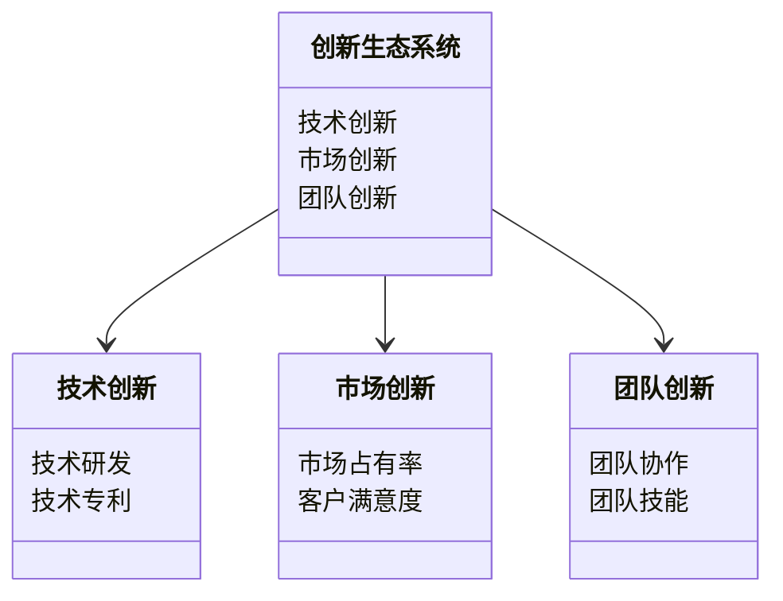
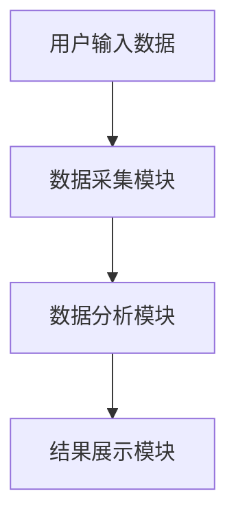

                 


# 企业估值中的创新生态系统评估

> 关键词：企业估值，创新生态系统，技术创新，市场创新，团队创新

> 摘要：本文探讨了在企业估值过程中，如何将创新生态系统作为一个整体进行评估。通过分析创新生态系统的核心要素，包括技术创新、市场创新和团队创新，结合定性和定量评估方法，构建系统的评估框架，并通过实际案例和系统架构设计，提供可操作的评估方案。

---

## 第1章: 创新生态系统评估的背景与意义

### 1.1 企业估值的传统方法与局限性

#### 1.1.1 传统企业估值方法的介绍
传统的企业估值方法主要包括财务指标分析（如利润、收入、资产等）、市场分析（如市场份额、竞争对手分析）和行业趋势分析。这些方法主要基于历史数据和当前市场状况，为企业提供了一个相对稳定的估值框架。

#### 1.1.2 传统方法的局限性与不足
尽管传统方法在企业估值中起到了重要作用，但它们在面对创新驱动的经济环境时显得力不从心。例如，传统方法难以准确评估企业的创新潜力，尤其是那些依赖技术创新和市场创新的企业。此外，传统方法往往忽视了团队能力和内部管理对企业价值的影响。

#### 1.1.3 创新生态系统评估的必要性
创新生态系统评估的引入，弥补了传统方法的不足。它将企业的创新能力作为一个整体生态系统来评估，包括技术创新、市场创新和团队创新等多个维度。通过这种方式，企业能够更全面地评估自身的创新能力，从而在估值过程中获得更准确的结果。

### 1.2 创新生态系统的核心概念

#### 1.2.1 创新生态系统定义
创新生态系统是指由企业内部的创新资源（如技术、团队）和外部创新资源（如市场、合作伙伴）共同构成的一个动态系统。该系统通过内部和外部的协同作用，推动企业的持续创新和发展。

#### 1.2.2 创新生态系统的核心要素
创新生态系统的核心要素包括：
- **技术创新**：企业的技术储备、研发能力等。
- **市场创新**：企业在市场中的创新能力，包括产品定位、市场扩展等。
- **团队创新**：团队的能力、结构和协作效率等。

#### 1.2.3 创新生态系统与企业价值的关系
创新生态系统是企业价值的重要组成部分。一个强大的创新生态系统能够提升企业的竞争力，增强市场适应能力，从而提高企业价值。通过评估创新生态系统，企业能够在估值过程中获得更全面的视角。

### 1.3 本章小结
本章介绍了传统企业估值方法的局限性，提出了创新生态系统评估的必要性，并定义了创新生态系统的核心概念和要素。这些内容为后续章节的深入分析奠定了基础。

---

## 第2章: 创新生态系统评估的核心要素

### 2.1 技术创新评估

#### 2.1.1 技术创新的定义与特征
技术创新是指企业在技术层面的创新，包括研发新技术、改进现有技术等。其特征包括技术领先性、可扩展性和可持续性。

#### 2.1.2 技术创新的核心指标
技术创新的核心指标包括：
- 技术研发投入占比
- 技术专利数量
- 技术成果转化率

#### 2.1.3 技术创新的评估方法
技术创新的评估可以采用定性和定量相结合的方法。例如，通过评估企业的研发投入占比和专利数量，结合技术领先性进行综合评价。

### 2.2 市场创新评估

#### 2.2.1 市场创新的定义与特征
市场创新是指企业在市场中的创新能力，包括产品定位、市场策略等。其特征包括市场适应性、客户满意度和市场扩展能力。

#### 2.2.2 市场创新的核心指标
市场创新的核心指标包括：
- 市场占有率
- 客户满意度
- 市场扩展速度

#### 2.2.3 市场创新的评估方法
市场创新的评估可以采用问卷调查、客户访谈等方式，结合定量指标进行综合评估。

### 2.3 团队创新评估

#### 2.3.1 团队创新的定义与特征
团队创新是指团队在协作和创新能力上的表现。其特征包括团队结构合理性、协作效率和创新能力。

#### 2.3.2 团队创新的核心指标
团队创新的核心指标包括：
- 团队成员的技能多样性
- 团队协作效率
- 团队创新能力

#### 2.3.3 团队创新的评估方法
团队创新的评估可以通过团队成员的技能评估、协作效率分析和创新能力测试等方式进行。

### 2.4 本章小结
本章详细分析了技术创新、市场创新和团队创新的核心要素和评估方法，为后续章节的系统分析和架构设计奠定了基础。

---

## 第3章: 创新生态系统评估的系统分析

### 3.1 问题场景介绍

#### 3.1.1 企业估值中的创新生态系统评估需求
在企业估值过程中，创新生态系统评估的需求主要体现在：
- 准确评估企业的创新能力
- 提供全面的估值依据
- 为投资者提供新视角

#### 3.1.2 系统目标与范围
系统的总体目标是构建一个能够全面评估创新生态系统的框架，包括技术创新、市场创新和团队创新三个维度。

#### 3.1.3 系统边界与外部实体
系统的边界包括企业内部的创新资源和外部市场环境。外部实体包括合作伙伴、客户和竞争对手等。

### 3.2 领域模型设计

#### 3.2.1 领域模型的定义与作用
领域模型是用来描述特定领域内核心概念及其关系的模型。在创新生态系统评估中，领域模型用于展示技术创新、市场创新和团队创新之间的关系。

#### 3.2.2 领域模型的构建步骤
领域模型的构建步骤包括：
1. 确定核心概念
2. 分析概念之间的关系
3. 绘制领域模型图

#### 3.2.3 领域模型的实例分析
以下是一个创新生态系统领域的领域模型实例：



### 3.3 本章小结
本章通过领域模型展示了创新生态系统的核心概念及其关系，为后续的系统架构设计奠定了基础。

---

## 第4章: 创新生态系统评估系统的架构设计

### 4.1 系统架构设计

#### 4.1.1 系统架构的定义与特点
系统架构是系统设计的核心部分，包括数据采集模块、数据分析模块和结果展示模块。

#### 4.1.2 系统架构的设计原则
系统架构设计应遵循模块化、可扩展性和易用性原则。

#### 4.1.3 系统架构的实现方案
系统的实现方案包括：
1. 数据采集模块：收集技术创新、市场创新和团队创新的相关数据。
2. 数据分析模块：对数据进行分析，生成评估结果。
3. 结果展示模块：以图表形式展示评估结果。

### 4.2 数据流设计

#### 4.2.1 数据流的定义与特点
数据流是指系统中数据的流动方向和流程。

#### 4.2.2 数据流的设计步骤
数据流的设计步骤包括：
1. 确定数据来源
2. 设计数据流路径
3. 定义数据处理规则

#### 4.2.3 数据流的实例分析
以下是创新生态系统评估系统的数据流设计示例：



### 4.3 本章小结
本章详细设计了创新生态系统评估系统的架构和数据流，为系统的实现提供了清晰的指导。

---

## 第5章: 创新生态系统评估的项目实战

### 5.1 环境安装

#### 5.1.1 环境需求
需要安装Python、数据处理工具和数据分析工具。

#### 5.1.2 安装步骤
1. 安装Python
2. 安装Pandas、NumPy等数据分析库
3. 安装Matplotlib或Seaborn用于数据可视化

### 5.2 系统核心实现源代码

#### 5.2.1 数据处理代码
```python
import pandas as pd
import numpy as np

# 读取数据
data = pd.read_csv('innovation.csv')

# 数据清洗
data.dropna(inplace=True)
data = data[~data['收入'].isin([0])]
```

#### 5.2.2 数据分析代码
```python
from sklearn import preprocessing

# 标准化处理
x = data[['技术创新', '市场创新', '团队创新']].values
x = preprocessing.scale(x)
```

#### 5.2.3 数据可视化代码
```python
import matplotlib.pyplot as plt

plt.scatter(x[:,0], x[:,1], c=x[:,2], cmap='viridis')
plt.xlabel('技术创新')
plt.ylabel('市场创新')
plt.colorbar(label='团队创新')
plt.show()
```

### 5.3 代码应用解读与分析

#### 5.3.1 数据处理解读
上述代码通过读取CSV文件中的数据，并进行数据清洗，确保数据的完整性和准确性。

#### 5.3.2 数据分析解读
标准化处理将数据转换为无量纲形式，便于后续分析。

#### 5.3.3 数据可视化解读
散点图展示了技术创新、市场创新和团队创新之间的关系，颜色深浅表示创新能力的强弱。

### 5.4 本章小结
本章通过具体的代码示例，展示了创新生态系统评估系统的实现过程，帮助读者更好地理解和应用这些方法。

---

## 第6章: 创新生态系统评估的总结与展望

### 6.1 总结

#### 6.1.1 核心内容回顾
本文详细探讨了创新生态系统评估的核心要素、评估方法和系统架构设计，并通过具体案例展示了评估系统的实现过程。

#### 6.1.2 创新生态系统评估的重要性
创新生态系统评估能够帮助企业更全面地评估自身的创新能力，从而在估值过程中获得更准确的结果。

### 6.2 展望

#### 6.2.1 未来研究方向
未来的研究可以进一步探索创新生态系统与其他企业绩效指标的关系，以及如何将创新生态系统评估应用于更多行业。

#### 6.2.2 挑战与机遇
创新生态系统评估面临的挑战包括数据获取的难度和模型的复杂性，但同时也带来了更多的研究和实践机会。

### 6.3 本章小结
本文通过回顾创新生态系统评估的核心内容，展望了未来的研究方向和挑战，为读者提供了更全面的视角。

---

## 作者

作者：AI天才研究院/AI Genius Institute & 禅与计算机程序设计艺术 /Zen And The Art of Computer Programming

---

通过以上思考过程和内容，我们可以看到，创新生态系统评估在企业估值中的重要性日益凸显。通过系统的分析和实践，企业能够更全面地评估自身的创新能力，从而在激烈的市场竞争中占据优势地位。

