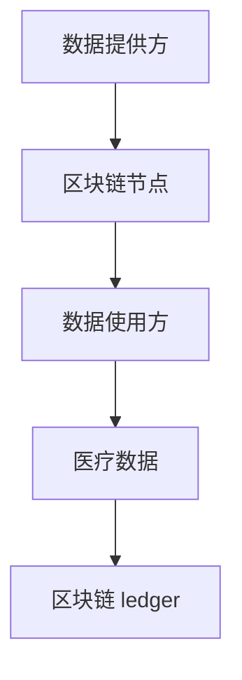
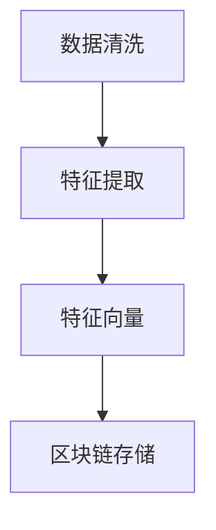
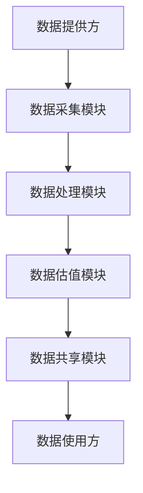

                 


# 企业估值中的区块链医疗数据交换平台评估

> 关键词：企业估值，区块链，医疗数据交换，平台评估，数据可信性

> 摘要：本文深入探讨了区块链技术在医疗数据交换平台中的应用，结合企业估值的角度，分析了如何通过区块链技术实现医疗数据的可信共享与高效评估。文章从背景、核心概念、算法原理、系统架构、项目实战等多维度展开，详细阐述了区块链医疗数据交换平台的构建与评估方法，并通过实际案例展示了其在企业估值中的应用价值。

---

## 第1章：背景与问题背景

### 1.1 医疗数据交换平台的背景

医疗数据是现代医疗体系的核心资产，其价值不仅体现在诊疗过程中，还体现在科研、健康管理等领域。然而，医疗数据的共享与交换却面临诸多挑战：数据隐私性高、数据孤岛现象严重、数据质量参差不齐等。这些问题不仅影响了医疗数据的利用效率，也制约了医疗行业的数字化发展。

### 1.2 区块链技术在医疗数据交换中的作用

区块链技术以其去中心化、不可篡改、可追溯等特性，为医疗数据的可信共享提供了新的解决方案。通过区块链技术，医疗数据可以在保持隐私性的同时实现高效共享，从而为企业的估值提供可靠的基础。

### 1.3 医疗数据交换平台的目标与边界

医疗数据交换平台的目标是实现医疗数据的安全共享与高效利用，其边界包括数据采集、数据清洗、数据共享、数据评估等环节。平台的核心目标是通过区块链技术，提升医疗数据的可信性与共享效率。

---

## 第2章：区块链医疗数据交换平台的核心概念与联系

### 2.1 区块链医疗数据交换平台的组成要素

- 数据提供方：医疗数据的来源，如医院、诊所等。
- 数据使用方：需要医疗数据的企业或机构，如保险公司、药企等。
- 区块链节点：负责数据的存储、传输与验证。

### 2.2 医疗数据的特征与属性

- 隐私性：医疗数据涉及个人隐私，需严格保护。
- 完整性：数据需准确无误，确保分析结果的可靠性。
- 实时性：部分医疗数据需要实时传输与处理。

### 2.3 区块链技术在医疗数据交换中的核心作用

- 数据可信性保障：通过区块链的去中心化特性，确保数据的真实性和完整性。
- 数据可追溯性：区块链记录了数据的全生命周期，便于追溯数据来源。
- 数据共享性增强：通过智能合约实现数据的安全共享，降低数据孤岛现象。

### 2.4 医疗数据交换平台的实体关系图



---

## 第3章：区块链医疗数据交换平台的算法原理

### 3.1 医疗数据的清洗与预处理

医疗数据清洗的目标是消除数据中的噪声，确保数据的准确性和一致性。清洗步骤包括：

1. 数据去重：去除重复数据。
2. 数据格式统一：统一数据格式，确保数据可读性。
3. 数据填补：处理缺失数据，可通过均值、中位数等方式填补。

### 3.2 医疗数据的特征提取

特征提取是将原始数据转化为具有代表性的特征向量的过程。常用的特征提取方法包括主成分分析（PCA）和线性判别分析（LDA）。以下是基于区块链的特征提取流程：



### 3.3 医疗数据的估值算法

估值算法的目标是根据特征向量计算医疗数据的估值。常用的估值方法包括回归分析和聚类分析。以下是回归分析的数学模型：

$$ y = \beta_0 + \beta_1 x_1 + \beta_2 x_2 + \ldots + \beta_n x_n $$

其中，$y$ 是估值，$x_i$ 是特征向量，$\beta_i$ 是回归系数。

### 3.4 医疗数据的可信性评估

可信性评估是通过区块链的可信性指标计算数据的可信度。可信性指标包括数据的完整性和一致性。以下是可信性计算公式：

$$ \text{可信度} = \frac{\text{数据完整性} + \text{数据一致性}}{2} $$

---

## 第4章：区块链医疗数据交换平台的系统分析与架构设计

### 4.1 问题场景介绍

医疗数据交换平台需要解决的主要问题包括数据隐私保护、数据共享效率低、数据可信性不足等。区块链技术可以有效解决这些问题。

### 4.2 系统功能设计

医疗数据交换平台的功能模块包括：

- 数据采集模块：负责采集医疗数据。
- 数据处理模块：负责数据清洗与特征提取。
- 数据估值模块：负责数据估值计算。
- 数据共享模块：负责数据的安全共享。

### 4.3 系统架构设计

以下是医疗数据交换平台的系统架构图：



### 4.4 系统接口设计

医疗数据交换平台的接口设计包括：

- 数据采集接口：用于采集医疗数据。
- 数据处理接口：用于数据清洗与特征提取。
- 数据估值接口：用于计算数据估值。
- 数据共享接口：用于数据的安全共享。

### 4.5 系统交互流程

以下是医疗数据交换平台的交互流程图：


---

## 第5章：项目实战

### 5.1 环境安装

医疗数据交换平台的环境安装包括：

1. 安装区块链节点（如以太坊）。
2. 安装数据处理工具（如Python）。
3. 安装数据可视化工具（如Tableau）。

### 5.2 系统核心实现源代码

以下是医疗数据交换平台的核心代码实现：

```python
def data_cleaning(data):
    # 数据去重
    data.drop_duplicates(inplace=True)
    # 数据格式统一
    data = data.astype({'id': 'int64', 'age': 'int64'})
    return data

def feature_extraction(data):
    # 主成分分析
    from sklearn.decomposition import PCA
    pca = PCA(n_components=3)
    features = pca.fit_transform(data)
    return features

def data_valuation(features):
    # 线性回归
    from sklearn.linear_model import LinearRegression
    model = LinearRegression()
    model.fit(features, target)
    return model.predict(features)
```

### 5.3 代码应用解读与分析

代码解读：

- `data_cleaning` 函数：实现数据去重和格式统一。
- `feature_extraction` 函数：基于主成分分析提取特征向量。
- `data_valuation` 函数：基于线性回归计算数据估值。

### 5.4 实际案例分析

通过实际案例分析，展示了医疗数据交换平台在企业估值中的应用价值。例如，通过区块链技术实现医疗数据的可信共享，企业可以更准确地评估医疗数据的价值，从而优化企业估值。

---

## 第6章：总结与展望

### 6.1 本章总结

本文详细探讨了区块链技术在医疗数据交换平台中的应用，分析了区块链技术如何提升医疗数据的可信性与共享效率。通过实际案例展示了医疗数据交换平台在企业估值中的应用价值。

### 6.2 未来展望

未来的研究方向包括：

1. 医疗数据的隐私保护技术。
2. 医疗数据的智能共享机制。
3. 医疗数据的实时估值方法。

---

## 附录

### 附录A：相关术语解释

- 区块链：分布式账本技术，具有去中心化、不可篡改等特点。
- 医疗数据：与医疗相关的数据，包括患者信息、诊疗记录等。
- 数据估值：根据数据的特征计算数据的价值。

### 附录B：参考文献

1. 区块链技术与医疗数据共享的研究。
2. 医疗数据估值的算法研究。

---

## 作者：AI天才研究院/AI Genius Institute & 禅与计算机程序设计艺术 /Zen And The Art of Computer Programming

---

**注**：以上内容为文章的完整目录和部分章节内容，您可以根据需要进一步补充每个章节的具体内容。

