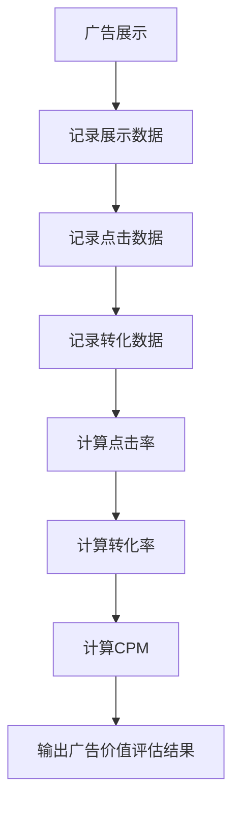
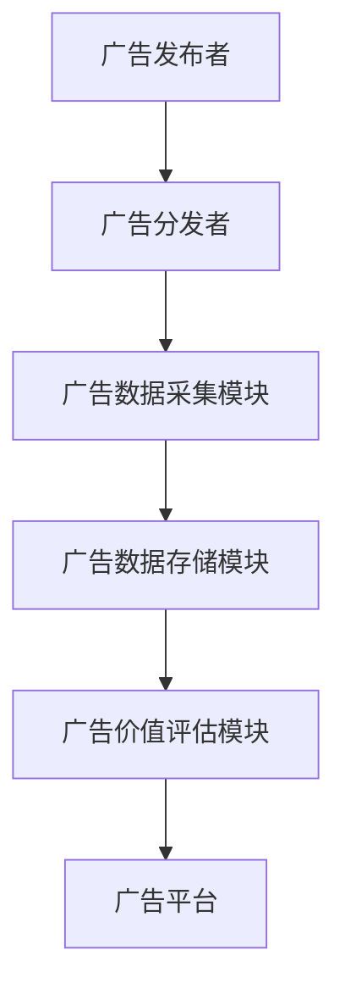
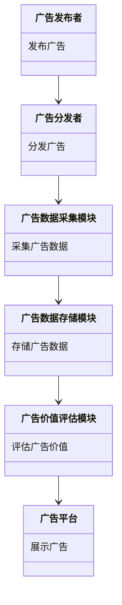
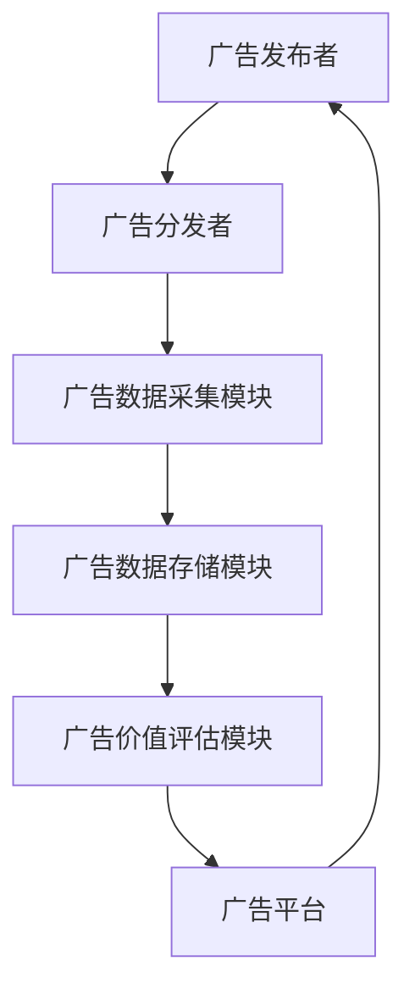

                 


# 企业估值中的区块链数字广告平台评估

> 关键词：区块链技术、数字广告平台、企业估值、广告数据可信性、广告透明度、智能合约

> 摘要：本文将深入探讨区块链技术在数字广告平台估值中的应用，分析区块链如何解决传统广告平台中的信任问题，提升广告数据的透明度和可信度。通过详细讲解区块链数字广告平台的核心概念、算法原理、系统架构以及实际项目案例，本文将为读者提供一个全面的技术视角，帮助企业在数字广告领域实现更高效、更可靠的估值方法。

---

# 第1章: 区块链与数字广告平台概述

## 1.1 区块链技术的基本概念

### 1.1.1 区块链的定义与核心特性

区块链是一种去中心化的分布式账本技术，通过加密算法和共识机制确保数据的安全性和不可篡改性。其核心特性包括去中心化、数据不可篡改、透明性和去信任化。

### 1.1.2 区块链的去中心化特点

去中心化是区块链的核心优势之一，通过将数据分布在网络中的多个节点上，避免了单点故障和数据被篡改的风险。

### 1.1.3 区块链在数字广告中的应用潜力

区块链技术可以用于解决数字广告中的数据可信度问题，提升广告交易的透明度，降低广告欺诈的风险。

## 1.2 数字广告平台的基本原理

### 1.2.1 数字广告的定义与分类

数字广告是指通过数字渠道（如网站、移动应用、社交媒体等）展示的广告形式，包括横幅广告、视频广告、搜索广告等。

### 1.2.2 数字广告平台的运作流程

数字广告平台通常包括广告发布者、广告分发者、广告数据记录与存储等环节。

### 1.2.3 数字广告中的信任问题

传统数字广告平台存在数据造假、广告点击率不真实、广告分发不透明等问题，导致广告价值评估困难。

## 1.3 区块链技术如何解决数字广告问题

### 1.3.1 区块链在广告透明度中的作用

通过区块链技术，广告数据可以实时记录在区块链上，确保广告的展示、点击、转化等数据的真实性和透明度。

### 1.3.2 区块链在广告数据可信性中的应用

区块链可以提供广告数据的不可篡改性，确保广告数据的准确性和完整性，从而提升广告价值评估的可信度。

### 1.3.3 区块链在广告价值评估中的潜力

区块链技术可以通过智能合约自动计算广告的点击率、转化率等关键指标，为广告价值的评估提供更加客观和准确的数据支持。

## 1.4 本章小结

---

# 第2章: 区块链数字广告平台的估值背景

## 2.1 企业估值的基本概念

### 2.1.1 企业估值的定义与方法

企业估值是指通过对企业财务状况、市场地位、盈利能力等多方面因素进行评估，确定企业的价值。

### 2.1.2 传统企业估值的关键指标

传统企业估值的关键指标包括收入、利润、市场份额、品牌价值等。

### 2.1.3 数字广告平台的特殊性

数字广告平台的估值需要考虑广告数据的可信度、用户行为数据的准确性以及广告平台的长期盈利能力。

## 2.2 区块链技术对数字广告平台估值的影响

### 2.2.1 区块链如何提升广告数据的可信度

通过区块链技术，广告数据可以实时记录在区块链上，确保数据的真实性和不可篡改性。

### 2.2.2 区块链如何优化广告交易的透明度

区块链技术可以实时记录广告的展示、点击、转化等数据，提升广告交易的透明度。

### 2.2.3 区块链如何降低广告平台的运营成本

通过区块链技术，广告平台可以减少中间环节，降低广告分发和数据存储的成本。

## 2.3 数字广告平台估值的核心问题

### 2.3.1 广告数据的准确性和完整性

广告数据的准确性和完整性是广告价值评估的基础，区块链技术可以通过不可篡改性确保数据的真实性和完整性。

### 2.3.2 广告平台的用户行为分析

通过区块链技术，广告平台可以实时记录用户的广告行为数据，为用户行为分析提供准确的数据支持。

### 2.3.3 广告平台的长期盈利能力

通过区块链技术，广告平台可以提升广告数据的可信度，增强广告发布者的信任，从而提升广告平台的长期盈利能力。

## 2.4 本章小结

---

# 第3章: 区块链数字广告平台的核心概念与联系

## 3.1 区块链技术的核心原理

### 3.1.1 区块链的数据结构

区块链由一系列区块组成，每个区块包含交易数据和区块头信息，区块头包含哈希值、时间戳、难度值等。

### 3.1.2 区块链的共识机制

共识机制是区块链的核心机制，用于确保所有节点达成一致，常见的共识机制包括PoW、PoS、Dpos等。

### 3.1.3 区块链的智能合约

智能合约是区块链上的自动化程序，用于自动执行合同条款，确保交易的安全性和可靠性。

## 3.2 数字广告平台的系统架构

### 3.2.1 广告发布者的角色与功能

广告发布者负责将广告内容发布到区块链数字广告平台，并设定广告的投放目标、预算等参数。

### 3.2.2 广告分发者的角色与功能

广告分发者负责将广告内容分发到目标用户，并记录广告的展示、点击、转化等数据。

### 3.2.3 广告数据记录与存储

广告数据通过区块链技术记录在分布式账本中，确保数据的不可篡改性和透明度。

## 3.3 区块链与数字广告平台的结合模型

### 3.3.1 广告数据的上链流程

广告数据通过智能合约自动上链，确保数据的实时性和不可篡改性。

### 3.3.2 广告价值的评估机制

通过区块链技术，广告价值的评估可以通过智能合约自动计算广告的点击率、转化率等关键指标。

### 3.3.3 广告收益的分配方式

区块链技术可以实现广告收益的自动分配，确保广告发布者和广告分发者之间的收益分配透明且公平。

## 3.4 核心概念对比分析

### 3.4.1 传统广告与区块链广告的对比

| 对比维度 | 传统广告 | 区块链广告 |
|----------|----------|------------|
| 数据记录 | 中心化记录，容易篡改 | 去中心化记录，不可篡改 |
| 透明度 | 低 | 高 |
| 可信度 | 低 | 高 |

### 3.4.2 广告数据的可信度对比

传统广告平台存在数据造假、点击率虚高等问题，而区块链广告平台通过去中心化记录和智能合约确保广告数据的可信度。

### 3.4.3 广告平台的长期盈利能力

区块链广告平台通过提升广告数据的可信度和广告交易的透明度，增强了广告发布者的信任，从而提升了广告平台的长期盈利能力。

## 3.5 本章小结

---

# 第4章: 区块链数字广告平台的算法原理

## 4.1 广告数据评估的指标与模型

### 4.1.1 广告点击率的定义与计算

广告点击率是指广告被点击的次数与广告展示次数的比率。

$$ 点击率 = \frac{点击次数}{展示次数} $$

### 4.1.2 广告转化率的定义与计算

广告转化率是指广告点击后用户完成目标行为（如购买、注册等）的比率。

$$ 转化率 = \frac{目标行为完成次数}{点击次数} $$

### 4.1.3 广告CPM的定义与计算

广告CPM（每千次展示费用）是指每千次广告展示的平均费用。

$$ CPM = \frac{总费用}{展示次数} \times 1000 $$

## 4.2 基于区块链的广告数据评估算法

### 4.2.1 算法原理

通过区块链技术，广告数据可以实时记录在区块链上，确保数据的不可篡改性。智能合约可以根据广告数据自动计算广告的点击率、转化率等关键指标。

### 4.2.2 算法流程图



### 4.2.3 算法实现代码

```python
def calculate_advertising_metrics(display_count, click_count, conversion_count):
    click_rate = click_count / display_count
    conversion_rate = conversion_count / click_count
    cpm = (total_cost / display_count) * 1000
    return click_rate, conversion_rate, cpm
```

### 4.2.4 算法优缺点分析

优点：
- 数据不可篡改，确保广告数据的透明度和可信度。
- 自动化计算广告价值，提升广告评估的效率。

缺点：
- 需要依赖区块链技术和智能合约，技术实现较为复杂。
- 区块链技术的运行成本较高，可能增加广告平台的运营成本。

## 4.3 本章小结

---

# 第5章: 区块链数字广告平台的系统架构设计

## 5.1 系统功能设计

### 5.1.1 广告数据采集模块

广告数据采集模块负责收集广告的展示、点击、转化等数据，并将其传输到区块链上。

### 5.1.2 广告数据存储模块

广告数据存储模块负责将广告数据存储在区块链上，确保数据的不可篡改性和透明度。

### 5.1.3 广告价值评估模块

广告价值评估模块通过智能合约自动计算广告的点击率、转化率等关键指标，评估广告的价值。

## 5.2 系统架构设计

### 5.2.1 系统功能模块图



### 5.2.2 系统类图



### 5.2.3 系统交互流程图



## 5.3 本章小结

---

# 第6章: 区块链数字广告平台的项目实战

## 6.1 项目背景与目标

### 6.1.1 项目背景

本项目旨在通过区块链技术构建一个透明、可信的数字广告平台，提升广告数据的准确性和完整性。

### 6.1.2 项目目标

通过区块链技术实现广告数据的实时记录、广告价值的自动评估以及广告收益的自动分配。

## 6.2 项目环境搭建

### 6.2.1 系统环境

需要安装区块链节点、智能合约开发环境、数据库等。

### 6.2.2 开发工具

使用Solidity编写智能合约，使用Python进行数据处理和分析。

## 6.3 项目核心实现

### 6.3.1 智能合约实现

```solidity
// SPDX-License-Identifier: MIT
pragma solidity ^0.8.0;

contract AdvertisingPlatform {
    event AdvertiserPublished(bytes32 indexed advertiserId, string name);
    event AdPublished(bytes32 indexed adId, bytes32 indexed advertiserId, string adContent);
    event AdViewed(bytes32 indexed adId, address indexed viewer);
    event AdClicked(bytes32 indexed adId, address indexed clicker);
    event AdConverted(bytes32 indexed adId, address indexed converter);

    struct Ad {
        bytes32 adId;
        bytes32 advertiserId;
        string adContent;
        uint256 viewCount;
        uint256 clickCount;
        uint256 conversionCount;
        uint256 costPerView;
    }

    function publishAdvertiser(bytes32 advertiserId, string memory name) public {
        emit AdvertiserPublished(advertiserId, name);
    }

    function publishAd(bytes32 advertiserId, string memory adContent) public {
        bytes32 adId = bytes32(keccak256(abi.encode(advertiserId, adContent)));
        emit AdPublished(adId, advertiserId, adContent);
    }

    function viewAd(bytes32 adId, address viewer) public {
        emit AdViewed(adId, viewer);
    }

    function clickAd(bytes32 adId, address clicker) public {
        emit AdClicked(adId, clicker);
    }

    function convertAd(bytes32 adId, address converter) public {
        emit AdConverted(adId, converter);
    }
}
```

### 6.3.2 数据处理与分析

```python
import json
from web3 import Web3

# 初始化区块链节点
web3 = Web3(Web3.HTTPProvider("http://localhost:8545"))

# 获取智能合约地址
contract_address = "0x123456789abcdef123456789abcdef123456789"

# 获取智能合约实例
contract = web3.eth.contract(contract_address, abi=ABI)

# 获取广告数据
ad_data = contract.functions.getAdData(ad_id).call()

# 计算广告价值
click_rate = ad_data.click_count / ad_data.display_count
conversion_rate = ad_data.conversion_count / ad_data.click_count
cpm = (total_cost / ad_data.display_count) * 1000

# 输出广告价值评估结果
print(f"点击率: {click_rate}")
print(f"转化率: {conversion_rate}")
print(f"CPM: {cpm}")
```

### 6.3.3 系统功能实现

通过智能合约实现广告数据的实时记录、广告价值的自动评估以及广告收益的自动分配。

## 6.4 项目小结

---

# 第7章: 区块链数字广告平台的最佳实践与注意事项

## 7.1 最佳实践

### 7.1.1 选择合适的区块链平台

根据项目需求选择合适的区块链平台，如以太坊、EOS、波场等。

### 7.1.2 确保智能合约的安全性

智能合约是区块链数字广告平台的核心，需要确保智能合约的安全性，避免漏洞和攻击。

### 7.1.3 提升系统的可扩展性

随着广告数据的增加，需要不断提升系统的可扩展性，确保广告数据的高效处理和存储。

## 7.2 注意事项

### 7.2.1 数据隐私保护

广告数据涉及用户隐私，需要确保数据的隐私保护，遵守相关法律法规。

### 7.2.2 系统性能优化

随着广告数据的增加，需要不断优化系统的性能，提升广告数据的处理和存储效率。

### 7.2.3 技术团队协作

区块链数字广告平台的开发需要技术团队的协作，确保系统的设计、开发、测试和运维工作的顺利进行。

## 7.3 未来研究方向

### 7.3.1 区块链技术的进一步优化

研究如何进一步优化区块链技术，提升广告数据的处理效率和安全性。

### 7.3.2 人工智能技术的应用

探索人工智能技术在广告数据处理和广告价值评估中的应用，提升广告评估的准确性和智能化水平。

### 7.3.3 多链架构的实现

研究多链架构在区块链数字广告平台中的应用，提升系统的扩展性和性能。

## 7.4 本章小结

---

# 第8章: 结语

通过本文的深入探讨，我们了解了区块链技术在数字广告平台估值中的重要性，以及如何通过区块链技术解决传统广告平台中的信任问题，提升广告数据的透明度和可信度。未来，随着区块链技术的不断发展和创新，区块链数字广告平台将在企业估值中发挥越来越重要的作用。

---

# 作者：AI天才研究院/AI Genius Institute & 禅与计算机程序设计艺术/Zen And The Art of Computer Programming

