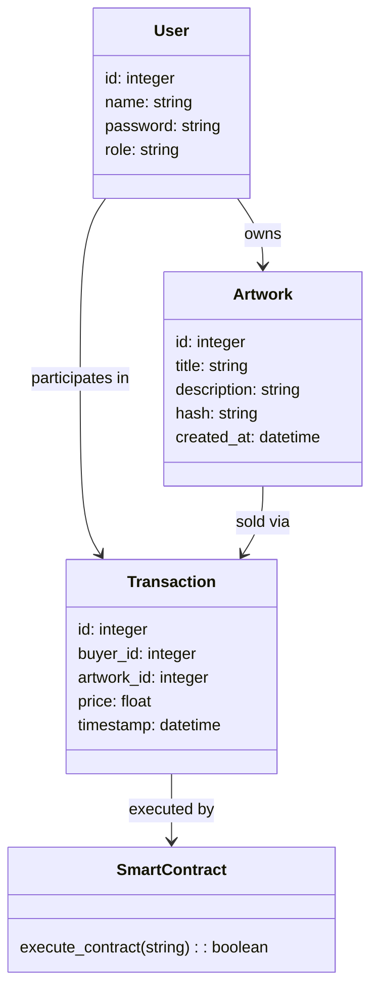
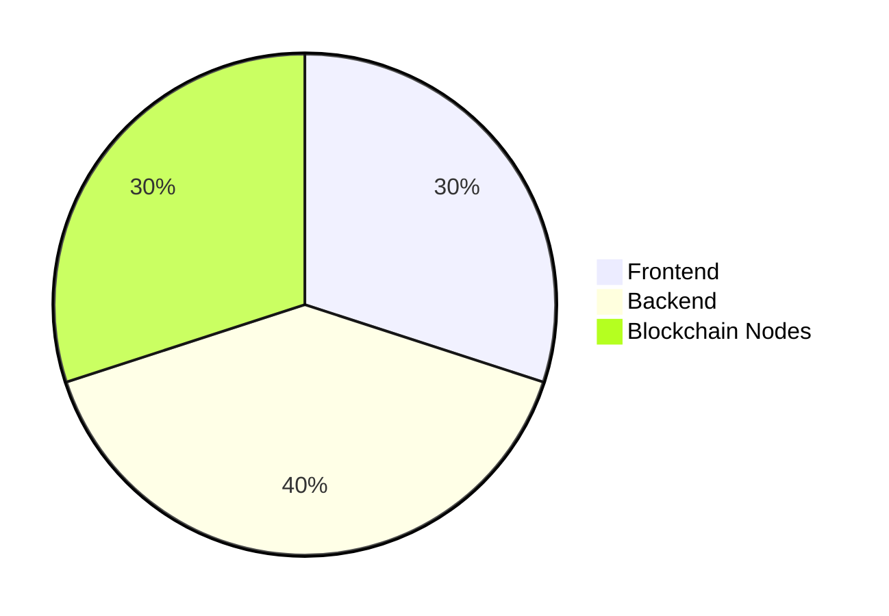

                 


```markdown
# 企业估值中的区块链数字艺术平台评估

> 关键词：企业估值，区块链，数字艺术，平台评估，算法原理

> 摘要：本文探讨了在企业估值过程中，如何对区块链数字艺术平台进行有效评估。通过分析区块链技术与数字艺术的结合，详细阐述了评估的核心概念、算法原理、系统架构设计及实际项目案例，为相关领域的从业者提供实用的指导。

---

## 第一部分: 背景介绍

### 第1章: 区块链与数字艺术的结合

#### 1.1 区块链技术的基本概念
区块链是一种去中心化的分布式账本技术，通过加密算法确保数据的安全性和不可篡改性。区块链的三个核心特性：去中心化、不可篡改和透明性，使其成为数字艺术领域的重要工具。

#### 1.2 数字艺术的定义与特点
数字艺术是指通过数字技术创作的艺术作品，具有易复制、难确权的特点。区块链技术通过智能合约和分布式账本，解决了数字艺术的版权归属和价值评估问题。

#### 1.3 区块链在数字艺术中的应用
区块链技术在数字艺术领域的应用主要体现在版权保护、作品溯源和交易透明化三个方面。通过区块链，数字艺术作品的创作、交易和流转过程可以被记录和验证，确保作品的真实性和所有权的合法性。

### 第2章: 企业估值的基本概念

#### 2.1 企业估值的定义与方法
企业估值是通过对企业的财务状况、市场表现和未来盈利能力进行分析，确定其市场价值的过程。常用的方法包括市盈率法、市净率法和DCF模型等。

#### 2.2 区块链数字艺术平台的估值挑战
区块链数字艺术平台的估值面临市场波动性大、技术复杂性和用户行为多样性等挑战。这些因素使得传统的估值方法难以直接应用于区块链数字艺术平台。

## 第二部分: 核心概念与联系

### 第3章: 核心概念与原理

#### 3.1 区块链技术的原理
区块链通过分布式节点存储数据，每个节点都保存一份完整的账本副本。交易通过共识机制被验证，并以区块的形式添加到区块链中。智能合约可以自动执行预设的交易规则，确保交易的安全性和可靠性。

#### 3.2 数字艺术平台的构成
数字艺术平台通常包括用户身份验证模块、作品展示模块、交易模块和智能合约模块。用户通过身份验证后，可以在平台上展示和购买数字艺术作品，交易过程由智能合约自动执行。

### 第4章: 核心概念之间的关系

#### 4.1 区块链如何保障数字艺术的唯一性
区块链通过记录每个数字艺术作品的元数据，确保每件作品的唯一性和不可篡改性。每个作品都有唯一的哈希值，可以通过区块链查询其创作时间和交易历史。

#### 4.2 区块链如何实现数字艺术的可追溯性
区块链的可追溯性使得数字艺术作品的流转过程可以被完整记录。每笔交易都会被记录在区块链上，确保作品的所有权变更可以被追踪和验证。

#### 4.3 区块链如何提升数字艺术的交易效率
通过区块链技术，数字艺术作品的交易可以在去中心化的平台上直接完成，避免了传统交易中心的中介环节。智能合约的自动执行功能使得交易过程更加高效和透明。

## 第三部分: 区块链数字艺术平台评估的算法原理

### 第5章: 评估算法的原理与流程

#### 5.1 评估算法的概述
区块链数字艺术平台的评估算法主要从技术实现、市场表现和用户行为三个方面进行分析。通过量化各指标的表现，综合评估平台的市场价值。

#### 5.2 评估算法的详细步骤
1. 数据收集：收集平台的交易数据、用户活跃度数据和区块链技术指标。
2. 数据预处理：清洗数据，消除异常值和冗余数据。
3. 指标计算：计算各项指标的权重，并进行加权平均。
4. 综合评估：根据各项指标的综合得分，确定平台的市场价值。

#### 5.3 评估算法的数学模型
综合评估模型如下：
$$
\text{综合得分} = \sum_{i=1}^{n} w_i \cdot x_i
$$
其中，\(w_i\) 是第i项指标的权重，\(x_i\) 是第i项指标的得分。

### 第6章: 算法实现

#### 6.1 算法实现的代码示例
```python
def assess_platform(value):
    # 计算各项指标得分
    score = sum(w * x for w, x in zip(weights, values))
    return score

# 示例权重和指标值
weights = [0.4, 0.3, 0.2, 0.1]
values = [0.8, 0.7, 0.6, 0.5]
assess_platform_result = assess_platform(values)
print(f"综合评估得分: {assess_platform_result}")
```

## 第四部分: 系统分析与架构设计

### 第7章: 系统功能设计

#### 7.1 系统功能概述
系统主要包括用户管理、作品管理、交易管理和数据管理四大功能模块。用户可以通过系统进行注册、登录、作品上传和交易操作。

#### 7.2 系统功能的领域模型
以下是系统的领域模型类图：


### 第8章: 系统架构设计

#### 8.1 系统架构概述
系统采用微服务架构，包括前端、后端和区块链节点三个部分。前端负责用户交互，后端负责业务逻辑处理，区块链节点负责数据存储和智能合约执行。

#### 8.2 系统架构的详细设计
以下是系统的架构图：


## 第五部分: 项目实战

### 第9章: 项目实战

#### 9.1 环境安装
安装Python和必要的库：
```bash
pip install flask blockchain
```

#### 9.2 核心代码实现
以下是核心代码实现：
```python
from flask import Flask
from blockchain import Blockchain

app = Flask(__name__)
blockchain = Blockchain()

@app.route('/assess', methods=['POST'])
def assess():
    data = request.json
    score = assess_platform(data)
    return jsonify({'score': score})
```

## 第六部分: 最佳实践

### 第10章: 最佳实践

#### 10.1 小结
区块链技术为数字艺术平台的评估提供了新的思路和方法。通过综合分析技术实现、市场表现和用户行为，可以更准确地评估平台的市场价值。

#### 10.2 注意事项
在实际应用中，需要注意数据的准确性和模型的适用性。同时，要定期更新模型参数，以适应市场变化。

#### 10.3 拓展阅读
建议深入研究区块链技术的最新发展，以及数字艺术市场的动态变化。

---

## 作者：AI天才研究院/AI Genius Institute & 禅与计算机程序设计艺术 /Zen And The Art of Computer Programming
```

