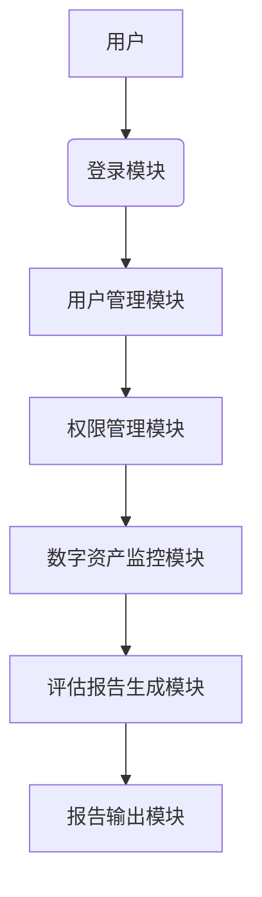
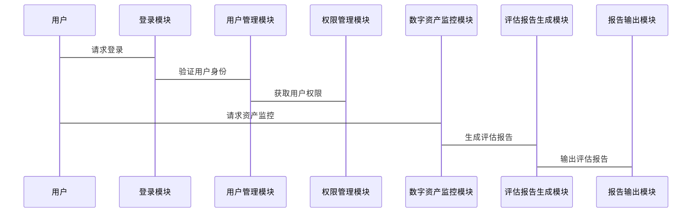

                 


# 《企业估值中的区块链数字资产托管平台评估》

> 关键词：企业估值，区块链，数字资产，托管平台，评估方法

> 摘要：本文详细探讨了在企业估值过程中，如何评估区块链数字资产托管平台的价值。通过分析数字资产的特性、区块链技术的优势，结合实际案例和系统设计，提出了一套科学的评估方法和流程，为企业的估值提供参考。

---

## 第一部分：背景与概述

### 第1章：区块链与数字资产概述

#### 1.1 区块链技术基础

区块链是一种分布式账本技术，通过去中心化、不可篡改和透明性的特点，解决了传统系统中的信任问题。以下是区块链的核心原理：

- **去中心化**：数据存储在多个节点上，没有单一的控制中心。
- **不可篡改**：通过加密算法和共识机制确保数据的安全性。
- **透明性**：所有交易记录在区块链上公开可查，保证透明度。

#### 1.2 数字资产的概念与分类

数字资产是指以数字形式存在的资产，包括加密货币、代币、NFT等。以下是数字资产的主要分类：

- **加密货币**：比特币、以太坊等，用于价值转移。
- **代币**：ERC-20、TRC-20等，用于表示特定的价值或权益。
- **NFT**：非同质化代币，用于表示独特的数字资产。

#### 1.3 企业估值的基本概念

企业估值是通过对企业的财务状况、市场地位、发展潜力等多方面进行评估，确定其市场价值。传统的估值方法包括市盈率、市净率等，而区块链技术的引入为估值提供了新的维度。

#### 1.4 区块链技术在企业估值中的应用背景

随着数字经济的发展，区块链技术在企业估值中的作用日益重要。以下是区块链技术在企业估值中的应用背景：

- **提升透明度**：通过区块链记录企业的交易和数据，提升估值的透明度。
- **降低风险**：区块链技术的不可篡改性降低了数据造假的风险。
- **提高效率**：通过智能合约自动化处理估值流程，提高效率。

---

## 第二部分：数字资产托管平台的评估方法

### 第2章：数字资产托管平台的评估方法

#### 2.1 评估的关键指标

在评估数字资产托管平台时，需要考虑以下关键指标：

- **安全性**：平台的安全性直接影响数字资产的价值。
- **流动性**：平台的流动性影响数字资产的变现能力。
- **透明度**：平台的透明度影响估值的准确性。

#### 2.2 数学模型的构建

以下是构建数字资产托管平台评估模型的数学公式：

$$
\text{平台价值} = \text{安全性权重} \times \text{安全性评分} + \text{流动性权重} \times \text{流动性评分} + \text{透明度权重} \times \text{透明度评分}
$$

其中，权重可以根据实际情况进行调整。

#### 2.3 实际案例分析

以某数字资产托管平台为例，假设其安全性评分为90，流动性评分为85，透明度评分为95，权重分别为30%、40%、30%。则平台价值计算如下：

$$
\text{平台价值} = 0.3 \times 90 + 0.4 \times 85 + 0.3 \times 95 = 27 + 34 + 28.5 = 89.5
$$

---

## 第三部分：区块链技术在企业估值中的应用

### 第3章：区块链技术在企业估值中的应用

#### 3.1 区块链提升估值透明度

通过区块链技术，企业的交易记录可以实时更新并公开，提升估值的透明度。以下是区块链提升透明度的方式：

- **实时更新**：区块链上的数据实时更新，确保估值的准确性。
- **公开可查**：所有交易记录公开可查，提升信任度。

#### 3.2 区块链降低估值风险

区块链技术的不可篡改性降低了数据造假的风险，以下是具体表现：

- **数据安全性**：通过加密算法和共识机制，确保数据的安全性。
- **降低欺诈**：区块链技术的特性降低了欺诈的可能性。

#### 3.3 区块链提高估值效率

通过智能合约和自动化流程，区块链技术可以提高估值的效率。以下是具体表现：

- **智能合约**：通过智能合约自动执行交易，减少人工干预。
- **自动化流程**：区块链技术可以自动化处理估值流程，提高效率。

---

## 第四部分：数字资产托管平台的系统架构设计

### 第4章：系统架构设计

#### 4.1 功能模块设计

以下是数字资产托管平台的主要功能模块：

- **用户管理**：负责用户注册、登录和权限管理。
- **资产监控**：实时监控数字资产的交易和价格变动。
- **评估报告**：生成数字资产托管平台的评估报告。

#### 4.2 系统架构图

以下是系统的架构图：



#### 4.3 接口设计

以下是系统的主要接口：

- **登录接口**：用户通过登录模块进行身份验证。
- **资产监控接口**：用户可以通过接口实时查看数字资产的交易和价格变动。

#### 4.4 交互流程图

以下是系统的交互流程图：



---

## 第五部分：项目实战

### 第5章：项目实战

#### 5.1 环境安装

以下是项目实战所需的环境安装步骤：

1. 安装Python和相关库：
   ```bash
   pip install python-blockchain
   pip install requests
   pip install pandas
   ```

2. 安装区块链节点：
   ```bash
   npm install -g blockchain-node
   ```

#### 5.2 核心代码实现

以下是核心代码实现：

```python
import requests
import pandas as pd

def assess_platform(value):
    # 安全性评估
    security_score = (value['security'] / 100) * 0.3
    # 流动性评估
    liquidity_score = (value['liquidity'] / 100) * 0.4
    # 透明度评估
    transparency_score = (value['transparency'] / 100) * 0.3
    # 计算总价值
    total_value = security_score + liquidity_score + transparency_score
    return total_value

# 示例数据
data = {
    'security': 90,
    'liquidity': 85,
    'transparency': 95
}

result = assess_platform(data)
print(f"平台价值评估结果为：{result}")
```

#### 5.3 案例分析

以某数字资产托管平台为例，假设其安全性评分为90，流动性评分为85，透明度评分为95，权重分别为30%、40%、30%。则平台价值计算如下：

$$
\text{平台价值} = 0.3 \times 90 + 0.4 \times 85 + 0.3 \times 95 = 27 + 34 + 28.5 = 89.5
$$

---

## 第六部分：总结与展望

### 第6章：总结与展望

#### 6.1 总结

本文详细探讨了在企业估值过程中，如何评估区块链数字资产托管平台的价值。通过分析数字资产的特性、区块链技术的优势，结合实际案例和系统设计，提出了一套科学的评估方法和流程。

#### 6.2 展望

未来，随着区块链技术的不断发展，数字资产托管平台的评估方法也将更加智能化和自动化。通过引入人工智能和大数据分析技术，可以进一步提升评估的准确性和效率。

---

## 作者：AI天才研究院 & 禅与计算机程序设计艺术

作者简介：AI天才研究院专注于人工智能和区块链技术的研究与应用，禅与计算机程序设计艺术致力于将复杂的科技概念以通俗易懂的方式呈现。

