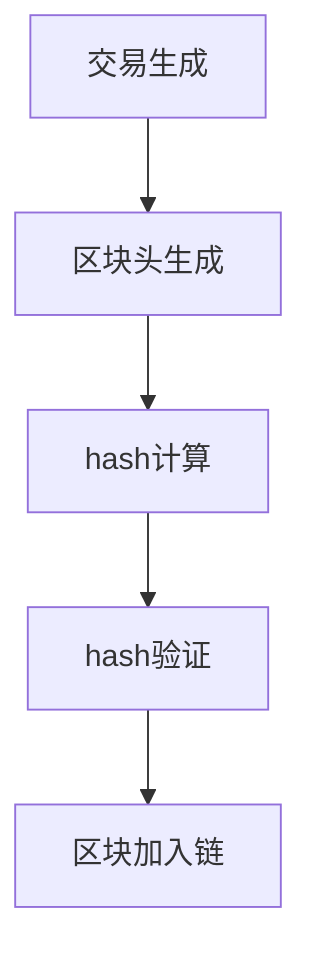
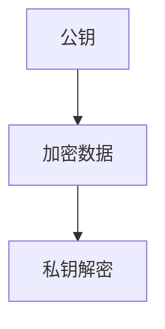
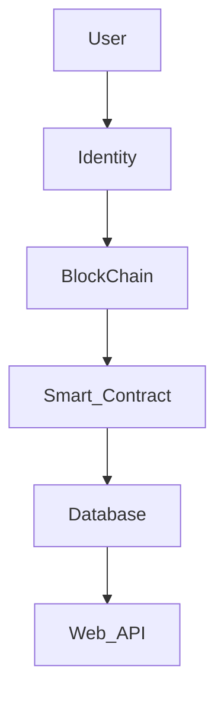

                 


# 企业估值中的区块链数字身份认证系统评估

> 关键词：区块链，数字身份认证，企业估值，共识机制，智能合约，去中心化

> 摘要：随着区块链技术的迅速发展，数字身份认证在企业估值中的作用日益重要。本文深入分析了区块链数字身份认证系统的核心概念、算法原理、系统架构，并通过实际项目案例展示了系统的实现与应用，最后提出了系统设计与实施的最佳实践建议。

---

# 第1章: 企业估值与区块链数字身份认证概述

## 1.1 企业估值的基本概念
### 1.1.1 企业估值的定义与重要性
企业估值是指对企业整体价值的评估，是企业在市场中的价值表现。准确的估值对企业融资、并购、上市等重大决策具有重要意义。传统的估值方法依赖于财务报表和市场分析，存在数据不透明、信息不对称等问题。

### 1.1.2 传统企业估值方法的局限性
传统估值方法主要依赖历史财务数据和市场假设，难以应对数据造假、信息不对称等问题。此外，传统方法在处理复杂业务场景时缺乏灵活性和实时性。

### 1.1.3 区块链技术对企业估值的影响
区块链技术的去中心化特性可以提高数据透明度和信任度，为企业的估值提供更可靠的数据支持。

## 1.2 区块链技术的基本原理
### 1.2.1 区块链的核心概念
- **区块**：数据记录单元，包含交易信息、时间戳等。
- **链式结构**：区块通过哈希指针连接，形成不可篡改的链式数据结构。
- **去中心化**：通过分布式账本实现数据的去中心化存储。

### 1.2.2 区块链的去中心化特性
去中心化使得数据存储不再依赖单一机构，提高了数据的安全性和抗篡改性。

### 1.2.3 区块链的共识机制
共识机制（如PoW、PoS）确保区块链网络中的交易一致性和可靠性。

## 1.3 数字身份认证的定义与特点
### 1.3.1 数字身份认证的定义
数字身份认证是通过数字技术验证用户身份的过程，确保用户身份的真实性、完整性和不可抵赖性。

### 1.3.2 数字身份认证的核心要素
- **用户身份标识**：唯一标识用户身份的信息（如用户名、公钥）。
- **身份认证流程**：验证用户身份的步骤和方法。
- **数据存储与传输**：确保数据的安全性和完整性。

### 1.3.3 区块链在数字身份认证中的优势
区块链的去中心化特性使得数字身份认证更加安全和高效。

## 1.4 本章小结
本章介绍了企业估值的基本概念、区块链技术的基本原理以及数字身份认证的核心要素，为后续内容奠定了基础。

---

# 第2章: 区块链数字身份认证系统的核心概念

## 2.1 数字身份认证系统的基本架构
### 2.1.1 用户身份标识
用户身份标识是数字身份认证的基础，通常包括用户名、密码、公钥等。

### 2.1.2 身份认证流程
身份认证流程包括身份验证、授权和访问控制三个阶段。

### 2.1.3 身份认证的生命周期
数字身份认证的生命周期包括身份注册、认证、授权和撤销。

## 2.2 区块链在数字身份认证中的作用
### 2.2.1 数据存储的安全性
区块链的分布式存储特性确保数据的安全性和不可篡改性。

### 2.2.2 身份验证的去中心化
去中心化的身份验证减少了对中心机构的依赖，提高了效率和安全性。

### 2.2.3 跨机构身份互认
区块链技术可以实现跨机构的身份互认，降低信任成本。

## 2.3 系统的核心要素与关系
### 2.3.1 核心要素对比表格
| 核心要素 | 描述 | 属性 |
|----------|------|------|
| 用户身份 | 用户标识信息 | 唯一性、不可篡改性 |
| 区块链节点 | 分布式账本节点 | 去中心化、不可篡改 |
| 共识机制 | 确认交易有效性的机制 | PoW、PoS、Dpos |
| 智能合约 | 自动执行的规则 | 自动化、不可篡改 |

## 2.4 ER实体关系图
```mermaid
erd
    User(user_id, name, email, public_key, private_key)
    Block(block_id, timestamp, transactions, hash, previous_hash)
    Transaction(tx_id, sender, receiver, amount, signature)
    Consensus Mechanism(pow, pos, dpos)
    Smart_Contract(smart_id, code, state, storage)
```

## 2.5 本章小结
本章详细介绍了区块链数字身份认证系统的核心概念和系统架构，为后续的系统设计和实现奠定了基础。

---

# 第3章: 区块链数字身份认证系统的算法原理

## 3.1 共识机制的算法原理
### 3.1.1 工作量证明（PoW）
PoW通过计算哈希值来确保区块链的共识一致性。



### 3.1.2 权益证明（PoS）
PoS通过持有代币的数量来决定记账权，降低了能源消耗。

### 3.1.3 可扩展的权益证明（Dpos）
Dpos通过选举代表节点来提高效率和可扩展性。

## 3.2 加密算法的原理
### 3.2.1 RSA加密
RSA是一种常用的公钥加密算法，用于数字签名和数据加密。



### 3.2.2 椭圆曲线加密
椭圆曲线加密是一种更安全的公钥加密算法，广泛应用于区块链领域。

## 3.3 数学模型与公式
### 3.3.1 哈希函数
$$ H(x) = \text{hash}(x) $$

### 3.3.2 数字签名
$$ \text{签名} = \text{私钥}(x) $$

## 3.4 本章小结
本章详细讲解了区块链数字身份认证系统中常用的共识机制和加密算法，为后续系统设计提供了理论基础。

---

# 第4章: 区块链数字身份认证系统的系统架构

## 4.1 系统功能设计
### 4.1.1 用户管理
用户管理模块负责用户身份的注册、认证和权限管理。

### 4.1.2 身份认证
身份认证模块基于区块链技术实现去中心化的身份验证。

### 4.1.3 权限管理
权限管理模块根据用户角色分配不同的访问权限。

## 4.2 系统架构设计


### 4.2.1 前端界面
前端界面负责用户交互和身份认证请求的提交。

### 4.2.2 后端服务
后端服务处理身份认证请求并调用区块链节点进行验证。

### 4.2.3 区块链节点
区块链节点负责存储交易数据和维护分布式账本。

## 4.3 接口设计
### 4.3.1 注册接口
```python
def register(username, password):
    # 实现用户注册逻辑
```

### 4.3.2 登录接口
```python
def login(username, password):
    # 实现用户登录逻辑
```

## 4.4 本章小结
本章详细描述了区块链数字身份认证系统的系统架构和接口设计，为后续的项目实现提供了指导。

---

# 第5章: 区块链数字身份认证系统的项目实战

## 5.1 环境搭建
### 5.1.1 安装区块链框架
安装以太坊或其他区块链框架，搭建开发环境。

### 5.1.2 安装数据库
选择适合的数据库（如MySQL）并配置环境。

### 5.1.3 安装开发工具
安装Python、Node.js等开发工具和相关库。

## 5.2 核心代码实现
### 5.2.1 智能合约实现
```solidity
// 智能合约代码示例
contract IdentityContract {
    mapping(address => string) public identities;

    function register(string memory _id) public {
        identities[msg.sender] = _id;
    }

    function getIdentity(address _addr) public view returns(string) {
        return identities[_addr];
    }
}
```

### 5.2.2 身份认证实现
```python
def authenticate(username, password):
    # 调用智能合约进行身份验证
    pass
```

## 5.3 代码解读与分析
### 5.3.1 智能合约解读
智能合约代码实现了用户身份的注册和查询功能。

### 5.3.2 后端代码解读
后端代码负责与区块链节点交互，处理身份认证请求。

## 5.4 实际案例分析
### 5.4.1 案例背景
假设某企业需要对其供应商进行身份认证，确保供应链数据的真实性和安全性。

### 5.4.2 系统应用
通过区块链数字身份认证系统实现供应商的身份认证和数据共享。

## 5.5 本章小结
本章通过实际项目案例展示了区块链数字身份认证系统的实现过程和应用价值。

---

# 第6章: 区块链数字身份认证系统的最佳实践

## 6.1 系统设计的关键点
### 6.1.1 数据安全
确保数据在存储和传输过程中的安全性和完整性。

### 6.1.2 性能优化
优化系统性能，提高身份认证的响应速度和吞吐量。

### 6.1.3 合规性
确保系统设计和实现符合相关法律法规和行业标准。

## 6.2 实际应用中的注意事项
### 6.2.1 安全性
加强系统防护，防止黑客攻击和数据泄露。

### 6.2.2 性能优化
采用分片技术、并行计算等方法提高系统性能。

### 6.2.3 合规性
确保系统设计和实现符合相关法律法规和行业标准。

## 6.3 拓展阅读
推荐一些与区块链技术相关的书籍和资源，帮助读者深入学习。

## 6.4 本章小结
本章总结了系统设计和实施中的关键点，提出了实际应用中的注意事项和建议。

---

# 作者：AI天才研究院/AI Genius Institute & 禅与计算机程序设计艺术 /Zen And The Art of Computer Programming

---

以上是《企业估值中的区块链数字身份认证系统评估》的技术博客文章目录和部分内容的详细说明。通过逐步分析和推理，我们从企业估值的背景出发，深入探讨了区块链数字身份认证系统的核心概念、算法原理、系统架构、项目实战以及最佳实践，为读者提供了一套完整的系统评估方案。

