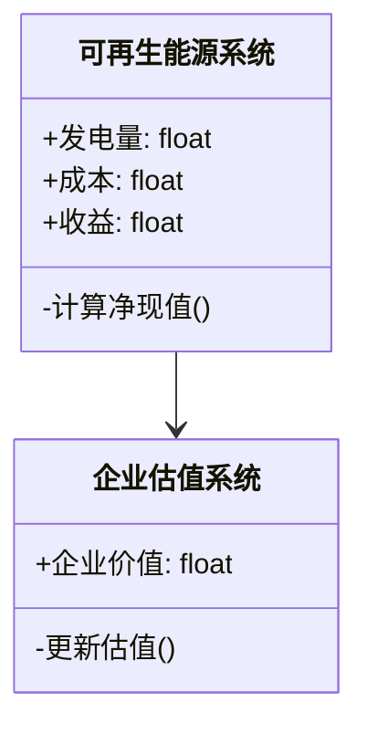

                 


# 企业估值中的可再生能源使用分析

> 关键词：企业估值、可再生能源、财务分析、环境影响、可持续发展

> 摘要：随着全球对可持续发展的关注增加，可再生能源在企业估值中的作用日益重要。本文详细分析了可再生能源如何影响企业的财务表现和环境影响，探讨了数学模型和系统架构设计，并通过实际案例展示了如何将可再生能源因素纳入企业估值体系。

---

## 第1章：概述

### 1.1 可再生能源的基本概念

可再生能源是指来源于自然的、能够持续再生的能源，主要包括太阳能、风能、水能、生物质能等。这些能源具有清洁、环保的特点，是实现可持续发展的关键。

#### 1.1.1 定义

可再生能源是指能够再生的能源，如风能、太阳能等，与化石能源不同，它们不会枯竭。

#### 1.1.2 分类

- 太阳能
- 风能
- 水能
- 生物质能
- 地热能

#### 1.1.3 全球发展趋势

全球范围内，可再生能源的使用量不断增加，尤其是在环保政策和气候变化的驱动下。

### 1.2 企业估值的基本概念

企业估值是通过对企业的财务状况、市场地位等因素进行评估，确定其价值的过程。

#### 1.2.1 定义

企业估值是评估企业整体价值的过程，通常考虑财务指标、市场地位等因素。

#### 1.2.2 方法

- 市盈率法
- 现金流折现法
- 股权自由现金流法

#### 1.2.3 可持续发展与企业估值的关系

企业对可再生能源的使用不仅影响环境，还会影响企业的财务表现，进而影响估值。

### 1.3 可再生能源在企业估值中的重要性

#### 1.3.1 成本影响

可再生能源的使用可以降低企业的运营成本，减少对化石能源的依赖。

#### 1.3.2 环境保护

使用可再生能源有助于减少碳排放，提升企业的社会责任形象。

#### 1.3.3 战略意义

可再生能源的使用是企业实现长期可持续发展的关键，也是应对政策和市场变化的重要策略。

---

## 第2章：可再生能源的特性与企业需求分析

### 2.1 可再生能源的特性分析

#### 2.1.1 波动性

可再生能源的供应不稳定，如风能和太阳能受天气影响较大。

#### 2.1.2 间歇性

可再生能源无法全天候供应，需要储能技术支持。

#### 2.1.3 技术成熟度

不同可再生能源技术成熟度不同，影响其应用效果。

### 2.2 企业对可再生能源的需求分析

#### 2.2.1 能源消耗分析

企业对能源的需求量和类型影响可再生能源的选择。

#### 2.2.2 政策需求

政府政策和补贴是推动企业使用可再生能源的重要因素。

#### 2.2.3 技术需求

企业需要先进的技术来高效利用可再生能源。

---

## 第3章：可再生能源对企业估值的数学模型

### 3.1 成本模型

#### 3.1.1 初始投资

安装可再生能源设备的初期投入较高。

#### 3.1.2 运营成本

包括维护、检修等费用，通常较低。

### 3.2 收益模型

#### 3.2.1 发电收益

可再生能源发电的收入，通常按电价计算。

#### 3.2.2 碳交易收益

通过碳交易市场获得的收益。

#### 3.2.3 补贴收益

政府提供的可再生能源补贴。

### 3.3 综合评价模型

#### 3.3.1 总收益公式

$$ \text{总收益} = \text{发电收益} + \text{碳交易收益} + \text{政府补贴收益} $$

#### 3.3.2 净现值计算

$$ \text{NPV} = \sum_{t=0}^{n} \frac{\text{现金流入}_t - \text{现金流出}_t}{(1 + r)^t} $$

---

## 第4章：系统分析与架构设计

### 4.1 系统分析方法

#### 4.1.1 问题场景介绍

企业需要一个系统来分析可再生能源的使用对估值的影响。

### 4.2 功能设计

#### 4.2.1 领域模型



### 4.3 架构设计


---

## 第5章：项目实战

### 5.1 环境安装

安装可再生能源系统，如太阳能电池板，需要选择合适的地理位置和设备。

### 5.2 源代码实现

```python
def calculate_npv(revenue, cost, discount_rate, years):
    npv = 0
    for year in range(years):
        cash_flow = revenue[year] - cost[year]
        npv += cash_flow / (1 + discount_rate) ** year
    return npv

# 示例数据
revenue = [100, 150, 200, 250]
cost = [50, 30, 20, 10]
discount_rate = 0.1
years = 4

print(calculate_npv(revenue, cost, discount_rate, years))
```

### 5.3 案例分析

以某企业为例，分析使用可再生能源后的估值变化，展示模型的应用。

---

## 第6章：最佳实践与未来展望

### 6.1 小结

可再生能源的使用对企业的财务和环境影响显著，需综合考虑。

### 6.2 注意事项

选择合适的可再生能源技术，合理规划投资和运营成本。

### 6.3 未来展望

随着技术进步和政策支持，可再生能源在企业估值中的作用将更加重要。

---

## 作者：AI天才研究院 & 禅与计算机程序设计艺术

这篇文章详细探讨了可再生能源在企业估值中的重要性，通过数学模型和系统设计展示了如何将可再生能源因素纳入企业价值评估体系，为企业的可持续发展提供了理论和实践指导。

