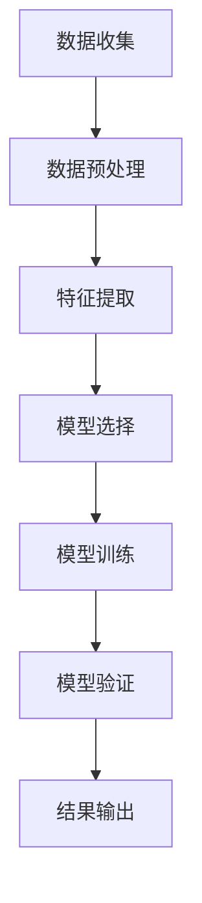
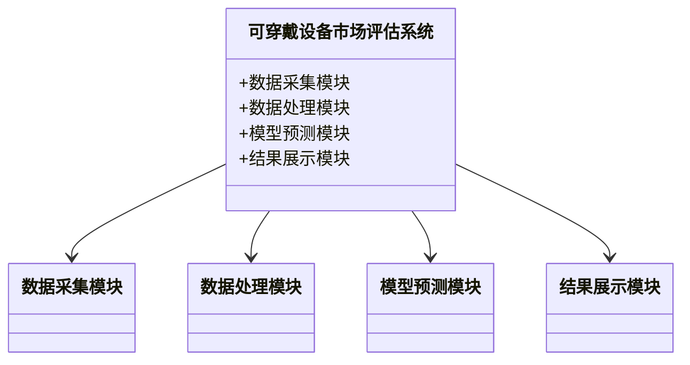

                 


# 企业估值中的可穿戴设备市场评估

> 关键词：企业估值，可穿戴设备，市场评估，算法模型，系统架构

> 摘要：本文从企业估值的角度出发，详细探讨可穿戴设备市场评估的核心概念、算法模型和系统架构。通过分析市场现状、用户行为、竞争格局等关键因素，结合数学模型和实际案例，为企业的市场估值提供深度洞察和实践指导。

---

## 第一章: 可穿戴设备市场评估的背景与重要性

### 1.1 可穿戴设备的定义与分类

#### 1.1.1 可穿戴设备的定义
可穿戴设备（Wearable Devices）是指能够佩戴在人体上的智能设备，通过传感器和互联网技术，实时采集、分析和传输数据。这些设备通常具备健康监测、运动追踪、智能助手等功能，能够与智能手机、电脑等终端设备进行数据交互。

#### 1.1.2 可穿戴设备的主要分类
可穿戴设备可以根据功能、形态和技术特点进行分类：

- **按功能分类**：
  - 健康监测类：如智能手表、健康手环，主要用于监测心率、血压、睡眠质量等。
  - 运动追踪类：如运动手表、智能鞋，主要用于记录运动数据。
  - 智能助手类：如智能眼镜、智能头盔，主要用于信息处理和辅助决策。

- **按形态分类**：
  - 手表类：如Apple Watch、Fitbit。
  - 项链类：如智能健康项链。
  - 手环类：如小米手环。

- **按技术分类**：
  - 基于传感器技术：如加速度计、心率传感器。
  - 基于通信技术：如蓝牙、Wi-Fi、5G。

#### 1.1.3 可穿戴设备的市场现状
根据市场研究机构的数据，可穿戴设备市场近年来呈现快速增长态势。2023年全球可穿戴设备市场规模约为1000亿美元，预计到2030年将突破3000亿美元。主要驱动因素包括技术进步、用户需求多样化以及企业级市场的拓展。

---

### 1.2 企业估值中的市场评估需求

#### 1.2.1 企业估值的基本概念
企业估值是指通过对企业的财务状况、市场地位、发展潜力等多方面因素的综合评估，确定企业的市场价值。在可穿戴设备领域，企业估值需要结合市场规模、用户增长率、竞争格局等因素进行分析。

#### 1.2.2 可穿戴设备市场在企业估值中的作用
可穿戴设备市场的规模和增长潜力直接影响企业的估值。例如，一家专注于智能手表制造的公司，其估值不仅取决于其财务表现，还与其在市场的份额、技术创新能力以及用户增长率密切相关。

#### 1.2.3 可穿戴设备市场评估的挑战与机遇
- **挑战**：市场竞争激烈、技术更新快、用户需求变化快。
- **机遇**：市场潜力大、技术进步快、用户数据价值高。

---

## 第二章: 可穿戴设备市场评估的核心概念与方法

### 2.1 可穿戴设备市场的核心要素

#### 2.1.1 市场规模与增长趋势
市场规模是指可穿戴设备在目标市场中的销售量和收入。增长趋势则通过分析历史数据和未来预测，确定市场的扩张速度。

#### 2.1.2 用户行为与需求分析
用户行为分析包括用户购买习惯、使用频率、满意度等。需求分析则关注用户对可穿戴设备功能、价格、品牌的偏好。

#### 2.1.3 市场竞争格局
市场竞争格局包括主要竞争对手的市场份额、产品特点、定价策略等。通过分析竞争格局，可以评估企业的市场地位和竞争优势。

---

### 2.2 市场评估的关键指标

#### 2.2.1 市场渗透率
市场渗透率（Market Penetration）是指企业在目标市场中的产品销售量占总销售量的比例。公式为：
$$ \text{市场渗透率} = \frac{\text{企业销售量}}{\text{市场总销售量}} \times 100\% $$

#### 2.2.2 用户增长率
用户增长率是指可穿戴设备用户的年增长速度。公式为：
$$ \text{用户增长率} = \frac{\text{新增用户数} - \text{原有用户数}}{\text{原有用户数}} \times 100\% $$

#### 2.2.3 市场份额
市场份额是指企业在整个市场中的销售比例。公式为：
$$ \text{市场份额} = \frac{\text{企业销售收入}}{\text{市场总收入}} \times 100\% $$

---

### 2.3 可穿戴设备市场与其他市场的关联性

#### 2.3.1 与消费电子市场的关联
可穿戴设备与消费电子市场密切相关，尤其是在技术、渠道和用户群体方面。

#### 2.3.2 与医疗健康市场的关联
可穿戴设备在医疗健康领域的应用（如健康监测）使其与医疗市场密切相关。

#### 2.3.3 与企业级市场的关联
企业级市场对可穿戴设备的需求主要体现在员工健康管理和效率提升方面。

---

## 第三章: 可穿戴设备市场评估的算法与模型

### 3.1 数据收集与预处理

#### 3.1.1 数据来源
- 用户行为数据：如点击率、购买率。
- 市场数据：如市场规模、增长率。
- 技术数据：如传感器精度、产品寿命。

#### 3.1.2 数据清洗与标准化
数据清洗包括去除重复数据、处理缺失值和异常值。数据标准化则是将数据转换为统一格式。

#### 3.1.3 数据特征提取
通过特征工程提取关键特征，例如用户增长率、市场渗透率等。

---

### 3.2 市场评估模型的选择

#### 3.2.1 线性回归模型
线性回归模型用于预测连续型变量，例如市场规模。

公式为：
$$ y = \beta_0 + \beta_1x_1 + \beta_2x_2 + \ldots + \beta_nx_n + \epsilon $$

其中，$y$ 是目标变量，$x_i$ 是自变量，$\beta_i$ 是系数，$\epsilon$ 是误差项。

#### 3.2.2 时间序列分析模型
时间序列分析模型用于预测时间相关的变量，例如用户增长率。

常用模型包括ARIMA（自回归积分滑动平均模型）和LSTM（长短期记忆网络）。

#### 3.2.3 机器学习模型
机器学习模型（如随机森林、神经网络）适用于非线性关系的预测。

---

### 3.3 算法流程图



---

### 3.4 代码实现

```python
import pandas as pd
from sklearn.linear_model import LinearRegression
from sklearn.metrics import mean_squared_error

# 数据加载与预处理
data = pd.read_csv('wearable_devices.csv')
data = data.dropna()  # 去除缺失值
data['User_Growth'] = (data['Users'].diff() / data['Users']) * 100  # 用户增长率计算

# 特征提取
X = data[['Market_Size', 'Competitor_Share']]
y = data['User_Growth']

# 模型训练
model = LinearRegression()
model.fit(X, y)

# 模型验证
y_pred = model.predict(X)
mse = mean_squared_error(y, y_pred)
print(f"均方误差: {mse}")
```

---

## 第四章: 可穿戴设备市场评估的系统架构

### 4.1 问题场景介绍
假设我们是一家可穿戴设备制造公司，需要评估市场潜力以支持企业估值。

---

### 4.2 系统功能设计



---

### 4.3 系统架构设计


---

## 第五章: 项目实战与案例分析

### 5.1 环境安装
需要安装Python、Pandas、Scikit-learn等库。

---

### 5.2 核心代码实现

```python
import pandas as pd
from sklearn.ensemble import RandomForestRegressor
from sklearn.metrics import r2_score

# 数据加载与预处理
data = pd.read_csv('wearable_devices.csv')
data = data.dropna()

# 特征提取
X = data[['Market_Size', 'Competitor_Share', 'User_Growth']]
y = data['Revenue']

# 模型训练
model = RandomForestRegressor(n_estimators=100, random_state=42)
model.fit(X, y)

# 模型验证
y_pred = model.predict(X)
r2 = r2_score(y, y_pred)
print(f"R² 分数: {r2}")
```

---

## 第六章: 总结与展望

### 6.1 总结
本文从企业估值的角度，详细探讨了可穿戴设备市场评估的核心概念、算法模型和系统架构。通过案例分析和实际代码实现，为企业的市场估值提供了深度洞察和实践指导。

### 6.2 展望
未来的研究可以关注以下方向：
- 更先进的算法，如深度学习和强化学习。
- 多模态数据的融合，如图像、文本和语音数据。
- 数据隐私和安全的保护。

---

## 作者

作者：AI天才研究院/AI Genius Institute & 禅与计算机程序设计艺术 /Zen And The Art of Computer Programming

