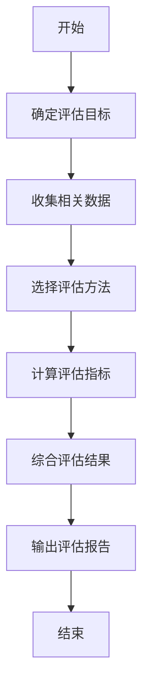
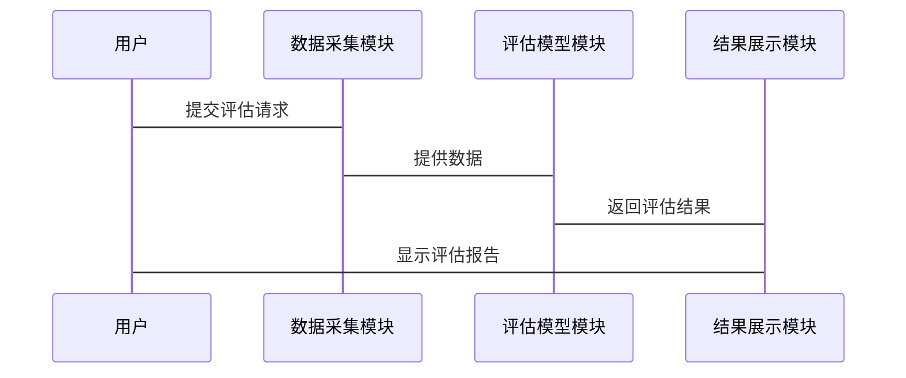

                 


# 《企业估值中的品牌价值评估方法》

**关键词：企业估值、品牌价值、品牌评估、品牌价值模型、品牌价值算法**

**摘要：**  
在企业估值过程中，品牌价值是决定企业整体价值的重要组成部分。本文将从品牌价值的核心概念、评估方法、算法原理、系统架构设计、项目实战以及最佳实践等方面进行详细分析。通过系统化的理论阐述和实际案例解析，帮助读者全面理解品牌价值的评估方法，掌握如何在企业估值中准确量化品牌价值，为企业的融资、并购和上市提供有力支持。

---

## 第一部分：品牌价值评估的背景与意义

### 第1章：品牌价值评估的背景与意义

#### 1.1 品牌价值在企业估值中的重要性
- 1.1.1 品牌价值的定义与特征
  - 品牌价值是企业在市场中建立的声誉和认知的量化表现。
  - 具有无形性、长期性和累积性的特点。
- 1.1.2 品牌价值对企业发展的影响
  - 品牌价值直接影响企业的市场地位和盈利能力。
  - 品牌价值越高，企业在并购和融资中的议价能力越强。
- 1.1.3 品牌价值评估的现实需求
  - 在企业融资、并购和上市过程中，品牌价值是核心评估指标之一。
  - 帮助企业制定科学的品牌战略和价值提升计划。

#### 1.2 品牌价值评估的核心概念
- 1.2.1 品牌价值的内涵与外延
  - 品牌价值不仅包括直接的经济价值，还包括品牌带来的长期收益。
  - 品牌价值的外延涵盖品牌知名度、美誉度和忠诚度等多个维度。
- 1.2.2 品牌价值与其他企业价值的关系
  - 品牌价值是企业整体价值的重要组成部分。
  - 品牌价值与企业市场价值、账面价值密切相关。
- 1.2.3 品牌价值评估的基本原则
  - 客观性：评估结果应基于真实数据和市场反馈。
  - 可比性：评估方法和标准应具有行业可比性。
  - 系统性：评估过程应涵盖品牌的核心要素和影响因素。

#### 1.3 品牌价值评估的理论基础
- 1.3.1 品牌价值评估的理论框架
  - 基于资产基础法、市场法和收益法的理论模型。
  - 结合品牌特性和市场表现的综合评估框架。
- 1.3.2 品牌价值评估的主要方法
  - 基于财务数据的评估方法：如资产重置法、市场法和收益法。
  - 基于市场表现的评估方法：如市场份额分析、品牌溢价分析。
  - 基于消费者认知的评估方法：如问卷调查、品牌指数分析。
- 1.3.3 品牌价值评估的实践意义
  - 为企业的融资和并购提供科学依据。
  - 帮助企业在品牌建设中制定合理的目标和策略。
  - 为企业价值最大化提供方向性指导。

#### 1.4 本章小结
本章主要介绍了品牌价值在企业估值中的重要性，详细阐述了品牌价值的核心概念、理论基础和评估方法。通过这些分析，读者可以理解品牌价值在企业整体估值中的地位和作用。

---

## 第二部分：品牌价值评估的核心概念与联系

### 第2章：品牌价值评估的核心概念与联系

#### 2.1 品牌价值的核心要素
- 2.1.1 品牌知名度
  - 定义：品牌在市场中的认知度和传播范围。
  - 测量方法：市场份额分析、品牌曝光度统计。
- 2.1.2 品牌美誉度
  - 定义：消费者对品牌的信任度和满意度。
  - 测量方法：客户满意度调查、在线声誉分析。
- 2.1.3 品牌忠诚度
  - 定义：消费者对品牌的偏好和持续购买意愿。
  - 测量方法：客户保留率、品牌推荐指数。

#### 2.2 品牌价值评估的属性特征对比
- 2.2.1 品牌价值的定性特征
  - 独特性和不可复制性。
  - 品牌的历史积淀和文化内涵。
- 2.2.2 品牌价值的定量特征
  - 市场份额和市场占有率。
  - 品牌相关的财务数据，如品牌收入、品牌利润。
- 2.2.3 品牌价值的综合特征
  - 品牌的市场表现与消费者认知的结合。
  - 品牌的长期价值与短期收益的平衡。

#### 2.3 品牌价值评估的ER实体关系图
```mermaid
er
  entity(品牌) {
    品牌ID
    品牌名称
    品牌创建时间
  }
  entity(价值评估指标) {
    指标ID
    指标名称
    指标权重
  }
  entity(评估结果) {
    评估ID
    品牌ID
    指标ID
    评估分数
  }
  brand -- many: 评估结果
  价值评估指标 -- many: 评估结果
```

#### 2.4 本章小结
本章从品牌价值的核心要素出发，详细分析了品牌知名度、美誉度和忠诚度的定义与测量方法，并通过ER实体关系图展示了品牌价值评估的核心架构。这些分析为后续的品牌价值评估算法提供了理论基础。

---

## 第三部分：品牌价值评估的算法原理

### 第3章：品牌价值评估的算法原理

#### 3.1 品牌价值评估的主要方法
- 3.1.1 基于财务数据的评估方法
  - 资产重置法：基于品牌资产的重置成本进行评估。
  - 收益法：基于品牌为企业带来的超额收益进行评估。
- 3.1.2 基于市场表现的评估方法
  - 市场份额法：基于品牌在市场中的占有率进行评估。
  - 品牌溢价法：基于品牌溢价能力进行评估。
- 3.1.3 品牌价值的综合评估方法
  - 综合考虑财务数据、市场表现和消费者认知的多维度评估方法。

#### 3.2 品牌价值评估的数学模型
- 3.2.1 品牌价值评估的加权平均模型
$$ V = \sum_{i=1}^{n} w_i x_i $$
其中，$V$ 表示品牌价值，$w_i$ 表示各评估指标的权重，$x_i$ 表示各评估指标的得分。
- 3.2.2 品牌价值评估的回归模型
$$ y = \beta_0 + \beta_1 x_1 + \beta_2 x_2 + \dots + \beta_k x_k + \epsilon $$
其中，$y$ 表示品牌价值，$x_i$ 表示各评估指标，$\beta_i$ 表示回归系数，$\epsilon$ 表示误差项。

#### 3.3 品牌价值评估的流程图


#### 3.4 本章小结
本章从算法原理的角度，详细介绍了品牌价值评估的主要方法和数学模型。通过对不同评估方法的分析，读者可以理解如何根据企业的实际情况选择合适的评估模型，并通过流程图直观地了解评估的逻辑和步骤。

---

## 第四部分：品牌价值评估的系统架构设计

### 第4章：品牌价值评估的系统架构设计

#### 4.1 问题场景介绍
- 品牌价值评估系统的功能需求。
- 系统的目标用户和使用场景。

#### 4.2 系统功能设计
- 4.2.1 数据采集模块
  - 数据来源：市场数据、财务数据、消费者调研数据。
  - 数据清洗与预处理。
- 4.2.2 评估模型模块
  - 模型选择：根据数据特征选择合适的评估模型。
  - 模型训练与优化。
- 4.2.3 结果展示模块
  - 评估结果的可视化展示。
  - 生成评估报告。

#### 4.3 系统架构设计图


#### 4.4 系统接口设计
- API接口设计：数据输入接口、模型调用接口、结果输出接口。
- 接口文档：详细描述接口的输入、输出和调用方式。

#### 4.5 系统交互设计


#### 4.6 本章小结
本章从系统架构设计的角度，详细介绍了品牌价值评估系统的功能模块、架构设计和接口设计。通过系统架构图和交互图，读者可以清晰地理解品牌价值评估系统的整体结构和运作流程。

---

## 第五部分：品牌价值评估的项目实战

### 第5章：品牌价值评估的项目实战

#### 5.1 环境安装与数据准备
- 环境要求：安装必要的编程语言和开发工具（如Python、Jupyter Notebook）。
- 数据来源：收集目标企业的财务数据、市场数据和消费者调研数据。

#### 5.2 系统核心实现源代码
```python
import pandas as pd
from sklearn.linear_model import LinearRegression

# 数据预处理
data = pd.read_csv('brand_value_data.csv')
X = data[['market_share', 'customer Satisfaction', 'brand_recognition']]
y = data['brand_value']

# 模型训练
model = LinearRegression()
model.fit(X, y)

# 模型预测
new_data = pd.DataFrame({
    'market_share': [0.3],
    'customer Satisfaction': [0.8],
    'brand_recognition': [0.6]
})
predicted_value = model.predict(new_data)
print(predicted_value)
```

#### 5.3 代码实现与解读
- 数据预处理：清洗和标准化数据。
- 模型训练：使用线性回归模型进行训练。
- 模型预测：基于输入数据预测品牌价值。
- 模型优化：调整模型参数，提高预测精度。

#### 5.4 实际案例分析
- 案例背景：某互联网公司品牌价值评估。
- 数据分析：收集市场份额、客户满意度和品牌认知度数据。
- 模型应用：使用线性回归模型进行评估，得出品牌价值。

#### 5.5 本章小结
本章通过实际案例，详细展示了品牌价值评估的项目实战过程。从环境安装到数据准备，从模型训练到结果展示，读者可以跟随步骤完成品牌价值评估的整个流程。

---

## 第六部分：品牌价值评估的最佳实践

### 第6章：品牌价值评估的最佳实践

#### 6.1 评估过程中的注意事项
- 数据质量：确保数据的准确性和完整性。
- 模型选择：根据数据特征选择合适的评估模型。
- 结果解释：结合行业背景和企业实际情况解释评估结果。

#### 6.2 品牌价值提升的策略
- 提升品牌知名度：通过广告投放、社交媒体推广等方式。
- 提高品牌美誉度：通过产品创新、服务质量优化等方式。
- 增强品牌忠诚度：通过会员体系、客户关怀等方式。

#### 6.3 品牌价值评估的未来趋势
- 数据驱动的品牌价值评估：利用大数据和人工智能技术提高评估精度。
- 全球化视角的品牌价值评估：考虑不同市场的文化差异和消费习惯。
- 可持续发展的品牌价值评估：关注企业的社会责任和可持续发展能力。

#### 6.4 本章小结
本章总结了品牌价值评估的最佳实践，包括评估过程中的注意事项、品牌价值提升的策略以及未来发展趋势。这些内容为读者在实际操作中提供了宝贵的指导和建议。

---

## 作者信息

作者：AI天才研究院/AI Genius Institute & 禅与计算机程序设计艺术 /Zen And The Art of Computer Programming

---

**全文总结：**  
本文从品牌价值在企业估值中的重要性出发，系统地介绍了品牌价值的核心概念、评估方法、算法原理、系统架构设计和项目实战。通过理论与实践相结合的方式，帮助读者全面理解品牌价值的评估方法，并掌握如何在实际工作中应用这些方法。希望本文能够为企业的品牌价值评估和整体估值提供有力的理论支持和实践指导。

