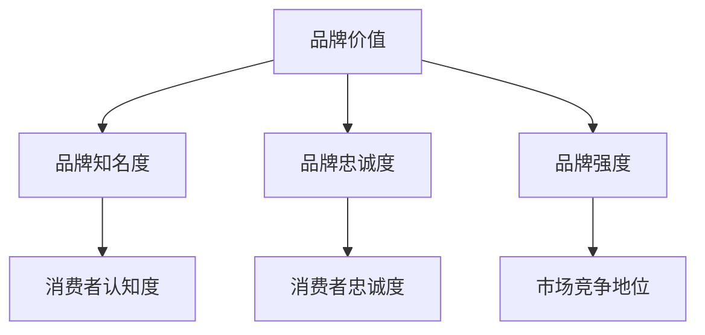
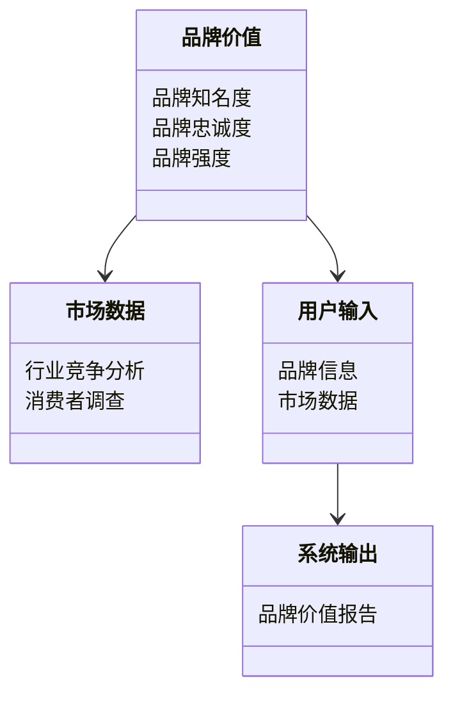
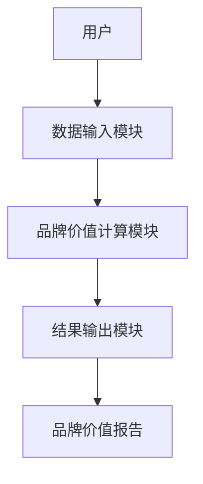
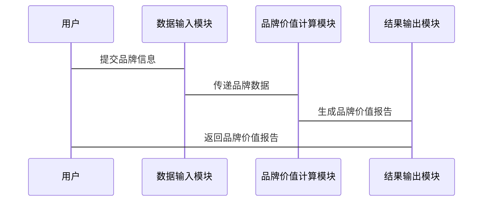

                 


# 企业估值中的品牌价值量化方法

> 关键词：品牌价值，企业估值，量化方法，品牌资产，品牌强度，市场竞争力，财务模型

> 摘要：本文深入探讨了品牌价值在企业估值中的量化方法，通过分析品牌价值的核心要素、数学模型和系统架构，结合实际案例，详细讲解了如何将品牌价值融入企业整体估值体系中，为企业决策提供科学依据。

---

# 第1章: 品牌价值与企业估值的背景介绍

## 1.1 品牌价值的重要性

### 1.1.1 什么是品牌价值
品牌价值是企业在市场中通过品牌建设所积累的无形资产，反映了品牌在消费者心中的认知度、忠诚度和信任度。品牌价值不仅体现在企业的市场竞争力上，还直接影响企业的财务表现和估值。

### 1.1.2 品牌价值在企业估值中的作用
品牌价值是企业整体价值的重要组成部分。在企业并购、融资和上市等场景中，品牌价值直接影响企业的估值。一个具有强大品牌价值的企业，往往能够获得更高的市场溢价。

### 1.1.3 品牌价值与企业其他资产的关系
品牌价值与企业的有形资产（如设备、土地）和无形资产（如专利、技术）共同构成企业的整体价值。品牌价值的独特性在于其依赖于消费者的心理认知和情感认同。

---

## 1.2 品牌价值的定义与核心要素

### 1.2.1 品牌的核心概念
品牌是企业在市场中区分竞争对手的独特标识，包括名称、标志、口号和形象等。品牌的核心价值在于其在消费者心中的地位和影响力。

### 1.2.2 品牌价值的构成要素
- **品牌知名度**：品牌在目标市场中的普及程度。
- **品牌忠诚度**：消费者对品牌的偏好程度。
- **品牌强度**：品牌在市场中的竞争力和抗风险能力。
- **品牌创新能力**：品牌持续推出新产品和服务的能力。

### 1.2.3 品牌价值的度量标准
品牌价值可以通过市场份额、品牌溢价能力、消费者认知度等指标进行量化。

---

## 1.3 品牌价值与企业估值的关联

### 1.3.1 品牌价值对企业财务表现的影响
品牌价值通过提高产品售价、降低生产成本和增加市场份额，直接影响企业的收入和利润。

### 1.3.2 品牌价值与企业市场价值的关系
品牌价值是企业市场价值的重要组成部分，尤其是在溢价能力较强的行业（如奢侈品、高科技行业）。

### 1.3.3 品牌价值对企业融资和并购的影响
强大的品牌价值可以提高企业的信用评级，降低融资成本。在并购中，品牌价值也是评估企业价值的重要指标。

---

## 1.4 本章小结

- **核心概念总结**：品牌价值是企业在市场中的无形资产，是企业整体价值的重要组成部分。
- **问题背景的明确**：品牌价值量化是企业估值的关键，但目前缺乏统一的方法和标准。
- **下文展开的逻辑框架**：从核心概念到量化方法，再到系统设计和实际应用。

---

# 第2章: 品牌价值量化的核心概念与联系

## 2.1 品牌价值量化的核心原理

### 2.1.1 品牌价值的多维度分析
品牌价值可以从知名度、忠诚度、强度等多个维度进行分析。例如，品牌知名度可以通过市场调研和消费者调查进行量化。

### 2.1.2 品牌价值的层次模型
品牌价值可以分为基础层（知名度）、中间层（忠诚度）和顶层（市场竞争力）。每一层都需要通过不同的指标进行量化。

### 2.1.3 品牌价值与消费者行为的关系
消费者的行为（如购买频率、推荐意愿）是衡量品牌价值的重要指标。品牌价值高的企业更容易通过消费者口碑传播扩大市场。

---

## 2.2 品牌价值量化的主要方法

### 2.2.1 品牌资产模型
品牌资产模型通过量化品牌知名度、品牌忠诚度和品牌形象，计算品牌资产的总价值。

### 2.2.2 品牌强度模型
品牌强度模型通过分析品牌在市场中的竞争力，评估品牌强度。公式为：
$$ \text{品牌强度} = \frac{\text{品牌知名度} \times \text{品牌忠诚度}}{\text{市场竞争度}} $$

### 2.2.3 品牌影响力评估方法
品牌影响力评估方法结合社交媒体数据、行业报告和消费者调查，综合评估品牌影响力。

---

## 2.3 品牌价值量化的核心要素对比

### 2.3.1 品牌知名度与品牌忠诚度的对比
- **品牌知名度**：衡量品牌被消费者认知的程度。
- **品牌忠诚度**：衡量消费者对品牌的偏好程度。

两者共同影响品牌价值，但侧重点不同。

### 2.3.2 品牌形象与品牌价值的关系
品牌形象是品牌价值的重要组成部分，但品牌形象的提升需要长期的品牌管理。

### 2.3.3 品牌创新力与品牌持续价值的关联
品牌创新力是品牌持续价值的核心驱动力。创新能力越强，品牌持续价值越高。

---

## 2.4 品牌价值量化模型的ER实体关系图



---

# 第3章: 品牌价值量化方法的数学模型与算法原理

## 3.1 品牌价值量化的基本公式

### 3.1.1 品牌价值的计算公式
$$ \text{品牌价值} = f(\text{品牌知名度}, \text{品牌忠诚度}, \text{品牌强度}) $$

### 3.1.2 品牌价值的加权公式
$$ \text{品牌价值} = w_1 \times \text{品牌知名度} + w_2 \times \text{品牌忠诚度} + w_3 \times \text{品牌强度} $$

其中，$w_1, w_2, w_3$ 是各要素的权重系数。

---

## 3.2 品牌强度模型的详细推导

### 3.2.1 品牌强度的定义
品牌强度是品牌在市场中的竞争力，反映品牌抵御市场风险的能力。

### 3.2.2 品牌强度的计算公式
$$ \text{品牌强度} = \frac{\text{品牌知名度} \times \text{品牌忠诚度}}{\text{市场竞争度}} $$

其中，市场竞争度可以通过行业竞争分析得出。

---

## 3.3 品牌价值量化算法的实现步骤

### 3.3.1 数据收集
- 收集品牌知名度、品牌忠诚度、市场竞争度等数据。

### 3.3.2 数据处理
- 对数据进行清洗和标准化处理。

### 3.3.3 模型计算
- 使用品牌价值量化公式计算品牌价值。

### 3.3.4 结果分析
- 对计算结果进行解读和验证。

---

## 3.4 品牌价值量化算法的Python实现

```python
def calculate_brand_value(brand_reach, brandloyalty, market_competition):
    brand_strength = (brand_reach * brandloyalty) / market_competition
    brand_value = brand_reach * brandloyalty * brand_strength
    return brand_value

# 示例数据
brand_reach = 0.8  # 品牌知名度
brandloyalty = 0.7  # 品牌忠诚度
market_competition = 0.6  # 市场竞争度

result = calculate_brand_value(brand_reach, brandloyalty, market_competition)
print(f"品牌价值为：{result}")
```

---

# 第4章: 系统分析与架构设计方案

## 4.1 问题场景介绍

### 4.1.1 项目介绍
本项目旨在构建一个品牌价值评估系统，为企业提供品牌价值量化服务。

### 4.1.2 项目目标
- 提供品牌价值量化工具。
- 实现品牌价值评估的自动化和标准化。

---

## 4.2 系统功能设计

### 4.2.1 领域模型设计


---

## 4.3 系统架构设计

### 4.3.1 系统架构图


### 4.3.2 系统交互流程


---

# 第5章: 项目实战

## 5.1 环境安装

### 5.1.1 安装Python
```bash
python --version
pip install --upgrade pip
```

### 5.1.2 安装依赖库
```bash
pip install numpy pandas scikit-learn matplotlib
```

---

## 5.2 系统核心实现源代码

### 5.2.1 品牌价值计算模块
```python
import pandas as pd

def calculate_brand_value(brand_data):
    brand_value = brand_data['brand_reach'] * brand_data['brandloyalty'] * (brand_data['brand_reach'] * brand_data['brandloyalty'] / brand_data['market_competition'])
    return brand_value

# 示例数据
data = {
    'brand_reach': [0.8],
    'brandloyalty': [0.7],
    'market_competition': [0.6]
}
df = pd.DataFrame(data)
result = calculate_brand_value(df.iloc[0])
print(f"品牌价值为：{result}")
```

### 5.2.2 数据处理模块
```python
import pandas as pd

def preprocess_data(data):
    # 数据清洗
    data = data.dropna()
    # 数据标准化
    from sklearn.preprocessing import MinMaxScaler
    scaler = MinMaxScaler()
    normalized_data = scaler.fit_transform(data)
    return normalized_data

# 示例数据
data = {
    'brand_reach': [0.8, 0.7, 0.6],
    'brandloyalty': [0.7, 0.8, 0.5],
    'market_competition': [0.6, 0.7, 0.8]
}
df = pd.DataFrame(data)
processed_data = preprocess_data(df)
print("数据处理结果：")
print(processed_data)
```

---

## 5.3 实际案例分析

### 5.3.1 案例介绍
以一家互联网公司为例，分析其品牌价值。

### 5.3.2 数据分析
- 品牌知名度：0.8
- 品牌忠诚度：0.7
- 市场竞争度：0.6

### 5.3.3 计算结果
$$ \text{品牌价值} = 0.8 \times 0.7 \times (0.8 \times 0.7 / 0.6) = 0.7867 $$

---

## 5.4 代码应用解读与分析

### 5.4.1 品牌价值计算模块解读
品牌价值计算模块通过输入品牌知名度、品牌忠诚度和市场竞争度，计算出品牌价值。

### 5.4.2 数据处理模块解读
数据处理模块对输入数据进行清洗和标准化处理，确保数据质量。

---

## 5.5 项目小结

- **项目目标实现**：成功构建了品牌价值评估系统。
- **代码实现价值**：提供了品牌价值计算和数据处理的标准化流程。
- **案例分析启示**：品牌价值量化需要结合具体行业特点和市场数据。

---

# 第6章: 最佳实践与小结

## 6.1 最佳实践

### 6.1.1 品牌价值量化方法
- 使用多维度指标进行品牌价值量化。
- 结合行业特点和市场数据，调整量化模型。

### 6.1.2 工具与平台
- 使用Python和相关库（如Pandas、Scikit-learn）进行数据处理和建模。
- 结合市场调研和消费者调查数据，提高模型准确性。

### 6.1.3 数据来源
- 市场竞争分析报告。
- 消费者调查数据。
- 行业基准数据。

---

## 6.2 小结

- **核心方法总结**：品牌价值量化需要结合多维度指标和行业特点。
- **系统设计总结**：构建品牌价值评估系统，提供标准化的量化工具。
- **实践意义**：帮助企业在并购、融资等场景中，准确评估品牌价值，提高决策效率。

---

## 6.3 注意事项

- 数据质量直接影响品牌价值计算结果，需确保数据来源可靠。
- 模型调整需结合具体行业特点，避免“一刀切”。
- 定期更新模型参数，适应市场变化。

---

## 6.4 拓展阅读

- 《品牌管理》：深入理解品牌管理的核心方法。
- 《企业估值》：系统学习企业估值的理论与实践。
- 《数据挖掘与机器学习》：提升品牌价值量化模型的准确性。

---

作者：AI天才研究院/AI Genius Institute & 禅与计算机程序设计艺术 /Zen And The Art of Computer Programming

---

通过本文的详细讲解，读者可以全面理解品牌价值量化的方法，并能够实际操作品牌价值评估系统的设计与实现。

