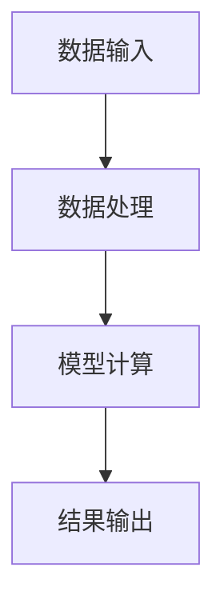

                 


# 企业估值中的品牌延伸潜力分析

> **关键词**：品牌延伸，企业估值，品牌价值，品牌强度，品牌延伸潜力

> **摘要**：  
> 本文深入探讨了品牌延伸潜力在企业估值中的重要性。通过分析品牌延伸的定义、类型及其对品牌价值的影响，结合数学模型和实际案例，详细阐述了如何将品牌延伸潜力纳入企业估值体系。文章还提供了系统架构设计和项目实战，帮助读者理解如何在实际操作中应用这些理论。本文旨在为企业估值提供新的视角和方法，帮助企业在品牌战略和财务决策中做出更明智的选择。

---

# 正文

## 第1章: 品牌延伸与企业估值概述

### 1.1 品牌延伸的基本概念

#### 1.1.1 品牌延伸的定义
品牌延伸是指企业在原有品牌的基础上，扩展其产品或服务的范围，进入新的市场或领域。这种策略的核心在于利用现有品牌的认知度和市场地位，快速进入新领域并建立市场优势。

#### 1.1.2 品牌延伸的类型
品牌延伸主要分为以下几种类型：
1. **产品线延伸**：在现有产品线的基础上，推出新的产品或服务。
2. **市场延伸**：将品牌扩展到新的地理市场或目标客户群体。
3. **类别延伸**：将品牌扩展到完全不同的产品类别。

#### 1.1.3 品牌延伸的核心要素
品牌延伸的成功依赖于以下核心要素：
- 品牌知名度
- 品牌忠诚度
- 品牌形象
- 品牌创新能力

### 1.2 企业估值的背景与意义

#### 1.2.1 企业估值的基本概念
企业估值是通过对企业的财务状况、市场地位、盈利能力等多方面因素的综合分析，确定企业的市场价值。常见的企业估值方法包括DCF模型、可比公司分析等。

#### 1.2.2 企业估值的主要方法
1. **DCF模型**：通过现金流折现计算企业价值。
2. **可比公司法**：基于可比企业的市场交易数据进行估值。
3. **资产基础法**：基于企业资产的账面价值进行估值。

#### 1.2.3 企业估值与品牌价值的关系
品牌价值是企业整体价值的重要组成部分。一个强大的品牌可以显著提升企业的市场价值，尤其是在品牌延伸潜力较大的情况下。

### 1.3 品牌延伸与企业估值的关系

#### 1.3.1 品牌延伸对企业价值的影响
品牌延伸可以带来收入和利润的增长，从而提升企业的整体价值。然而，品牌延伸也可能带来风险，如品牌形象受损或市场扩张失败。

#### 1.3.2 品牌延伸潜力分析的必要性
通过分析品牌延伸潜力，企业可以更好地评估品牌扩展的可能性和潜在价值，从而在估值过程中做出更准确的判断。

#### 1.3.3 品牌延伸与企业估值的结合
品牌延伸潜力分析是企业估值的重要组成部分。通过量化品牌延伸的潜力，可以更准确地评估企业的未来盈利能力，从而提高估值的准确性。

---

## 第2章: 品牌延伸潜力分析的核心概念

### 2.1 品牌延伸潜力的定义与属性

#### 2.1.1 品牌延伸潜力的定义
品牌延伸潜力是指品牌在扩展到新的产品、市场或类别时的潜在成功概率和价值提升能力。

#### 2.1.2 品牌延伸潜力的属性特征
1. **可扩展性**：品牌是否能够在新的市场或产品类别中成功扩展。
2. **品牌强度**：品牌在市场中的认知度和忠诚度。
3. **市场潜力**：目标市场的规模和增长潜力。
4. **竞争优势**：品牌在竞争中的独特优势。

### 2.2 品牌延伸潜力分析的框架

#### 2.2.1 品牌延伸潜力的分析维度
1. **市场维度**：目标市场的规模、增长潜力和竞争状况。
2. **品牌维度**：品牌的知名度、忠诚度和形象。
3. **产品维度**：产品的市场适应性和创新潜力。

#### 2.2.2 品牌延伸潜力的分析模型
1. **品牌强度指数模型**：通过量化品牌强度来评估延伸潜力。
2. **市场适应性模型**：评估品牌在新市场中的适应能力。

#### 2.2.3 品牌延伸潜力的评价指标
1. **品牌认知度**：目标市场中品牌被认知的比例。
2. **品牌忠诚度**：消费者对品牌的忠诚程度。
3. **市场增长率**：目标市场的年增长率。

### 2.3 品牌延伸潜力与企业估值的关系

#### 2.3.1 品牌延伸潜力对企业估值的影响
品牌延伸潜力高的企业通常具有更高的市场价值，因为它们能够通过品牌扩展实现更高的收入和利润。

#### 2.3.2 品牌延伸潜力的量化方法
通过数学模型和公式，可以量化品牌延伸的潜力，并将其纳入企业估值的计算中。

#### 2.3.3 品牌延伸潜力与企业价值的互动关系
品牌延伸潜力与企业价值之间存在正相关关系。品牌延伸的成功可以显著提升企业的市场价值，而企业估值的结果也可以反过来指导品牌延伸的决策。

---

## 第3章: 品牌延伸潜力分析的数学模型与公式

### 3.1 品牌延伸潜力的数学模型

#### 3.1.1 品牌延伸潜力的基本公式
品牌延伸潜力可以通过以下公式进行初步量化：
$$
\text{品牌延伸潜力} = \text{品牌强度} \times \text{市场潜力}
$$

#### 3.1.2 品牌延伸潜力的扩展公式
综合考虑品牌强度、市场潜力和竞争优势，品牌延伸潜力的扩展公式为：
$$
\text{品牌延伸潜力} = \text{品牌强度} \times \text{市场潜力} \times \text{竞争优势}
$$

#### 3.1.3 品牌延伸潜力的评估模型
通过构建多维评估模型，可以更全面地评估品牌延伸潜力。例如：
$$
\text{品牌延伸潜力} = \sum_{i=1}^{n} w_i \times f_i
$$
其中，$w_i$ 是第 $i$ 个因素的权重，$f_i$ 是第 $i$ 个因素的评估值。

### 3.2 品牌延伸潜力的评估公式

#### 3.2.1 品牌延伸潜力的计算公式
品牌延伸潜力的计算公式可以表示为：
$$
\text{品牌延伸潜力} = \frac{\text{品牌价值} \times \text{市场增长率}}{\text{品牌忠诚度}}
$$

#### 3.2.2 品牌延伸潜力的权重分配
在实际分析中，需要根据具体情况进行权重分配。例如：
$$
\text{权重分配} = \begin{cases}
\text{品牌强度} & 0.4 \\
\text{市场潜力} & 0.3 \\
\text{竞争优势} & 0.3
\end{cases}
$$

#### 3.2.3 品牌延伸潜力的综合评估
综合评估公式为：
$$
\text{综合评估值} = \sum_{i=1}^{n} w_i \times f_i
$$

### 3.3 品牌延伸潜力与企业估值的数学关系

#### 3.3.1 品牌延伸潜力对企业估值的数学表达
企业估值可以表示为：
$$
\text{企业价值} = \text{品牌价值} + \text{其他资产价值}
$$
其中，品牌价值可以通过品牌延伸潜力进行评估。

#### 3.3.2 品牌延伸潜力的量化对企业估值的影响
通过量化品牌延伸潜力，可以更准确地评估品牌价值，从而提高企业估值的准确性。

#### 3.3.3 品牌延伸潜力与企业估值的数学模型
综合数学模型为：
$$
\text{企业价值} = \text{品牌价值} \times \left(1 + \text{品牌延伸潜力}\right)
$$

---

## 第4章: 品牌延伸潜力分析的系统架构设计

### 4.1 系统分析与需求分析

#### 4.1.1 问题场景介绍
品牌延伸潜力分析系统需要解决的问题包括：
1. 如何量化品牌延伸潜力。
2. 如何将品牌延伸潜力纳入企业估值体系。

#### 4.1.2 系统功能需求
1. 品牌强度评估模块。
2. 市场潜力分析模块。
3. 企业估值计算模块。

#### 4.1.3 系统性能需求
1. 高效的数据处理能力。
2. 准确的模型计算能力。

### 4.2 系统架构设计

#### 4.2.1 系统架构的模块划分
1. 数据输入模块。
2. 数据处理模块。
3. 模型计算模块。
4. 结果输出模块。

#### 4.2.2 系统架构的流程图


#### 4.2.3 系统架构的实现方式
系统采用模块化设计，各模块之间通过接口进行交互。

### 4.3 系统接口设计

#### 4.3.1 系统接口的定义
1. 数据输入接口。
2. 数据处理接口。
3. 模型计算接口。

#### 4.3.2 系统接口的交互流程


#### 4.3.3 系统接口的实现方式
通过API实现各模块之间的交互。

### 4.4 本章小结

---

## 第5章: 品牌延伸潜力分析的项目实战

### 5.1 项目环境与工具安装

#### 5.1.1 项目环境配置
1. 操作系统：Windows 10 或更高版本。
2. 开发工具：Python 3.8+，Jupyter Notebook。
3. 数据源：公开市场数据和品牌相关数据。

#### 5.1.2 开发工具安装
安装必要的库：
```bash
pip install numpy pandas matplotlib
```

#### 5.1.3 数据源获取
从公开数据源获取品牌相关数据和市场数据。

### 5.2 项目核心实现

#### 5.2.1 品牌延伸潜力的计算
```python
import numpy as np
import pandas as pd

# 假设品牌强度、市场潜力和竞争优势的数据
brand_strength = [0.8, 0.6, 0.7]
market_potential = [0.7, 0.8, 0.6]
competitive_advantage = [0.5, 0.4, 0.3]

# 计算品牌延伸潜力
brand_extension_potential = np.sum([brand_strength, market_potential, competitive_advantage], axis=0)

print(brand_extension_potential)
```

#### 5.2.2 企业估值计算
```python
# 假设品牌价值和其他资产价值的数据
brand_value = [100, 80, 90]
other_assets = [50, 60, 70]

# 计算企业价值
enterprise_value = brand_value + other_assets

print(enterprise_value)
```

#### 5.2.3 案例分析
以某公司为例，分析其品牌延伸潜力及其对企业估值的影响。

### 5.3 本章小结

---

## 第6章: 总结与展望

### 6.1 本章总结
品牌延伸潜力分析是企业估值的重要组成部分。通过量化品牌延伸潜力，可以更准确地评估企业的市场价值。

### 6.2 未来展望
未来的研究可以进一步探讨品牌延伸潜力的动态变化及其对全球化企业的影响。

---

**作者：AI天才研究院/AI Genius Institute & 禅与计算机程序设计艺术 /Zen And The Art of Computer Programming**

