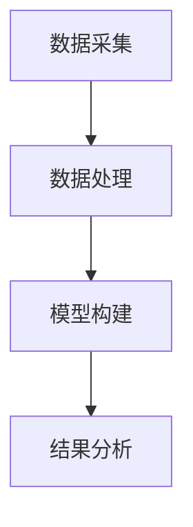

                 


```markdown
# 《企业估值中的地理位置因素分析》

> **关键词**：企业估值，地理位置，经济因素，空间分析，投资分析

> **摘要**：地理位置是影响企业估值的重要因素之一。本文系统分析了地理位置在企业估值中的作用，从地理位置的经济属性、社会属性和技术属性出发，结合空间分析方法，探讨了地理位置对企业成本、收入和风险的具体影响。文章通过地理加权回归模型和空间权重矩阵等数学工具，详细阐述了地理位置因素的量化方法，并结合实际案例，展示了如何将地理位置因素纳入企业估值模型中。最后，文章提出了基于地理位置的企业估值系统的构建思路，并对未来的研究方向进行了展望。

---

## 第一部分: 地理位置因素与企业估值的背景介绍

### 第1章: 地理位置因素在企业估值中的重要性

#### 1.1 企业估值的核心概念与边界
企业估值是通过对企业的财务状况、市场地位、管理团队、技术实力等多方面因素进行综合评估，确定其市场价值的过程。传统的企业估值模型（如DCF模型、PE模型等）主要关注企业的财务数据和市场环境，但往往忽略了地理位置这一重要的外部因素。

#### 1.2 地理位置因素的引入与问题描述
地理位置作为企业的外部环境因素，直接影响企业的运营成本、市场覆盖范围和潜在客户群体。例如，企业在一线城市设立总部可能面临更高的租金成本，但同时也能接触到更广泛的高端客户群体。然而，现有企业估值模型中对地理位置的分析较为有限，难以准确反映地理位置对企业价值的具体影响。

#### 1.3 地理位置对企业价值的影响机制
地理位置通过影响企业的成本结构、收入来源和风险水平，间接影响企业的估值。例如，地理位置优越的企业可能具有更低的物流成本、更高的市场渗透率和更低的经营风险，从而在估值模型中获得更高的加成。

---

### 第2章: 地理位置因素的核心要素与外延

#### 2.1 地理位置的定义与分类
地理位置可以分为自然地理位置和经济地理位置。自然地理位置包括经纬度、地形地貌等因素，而经济地理位置则关注区域经济发展水平、基础设施完善程度等。

#### 2.2 地理位置与企业价值的关系
地理位置与企业价值的关系可以通过以下几个方面进行分析：
1. **成本影响**：地理位置影响企业的租金、物流和人力成本。
2. **收入影响**：地理位置影响企业的市场覆盖范围和客户群体。
3. **风险影响**：地理位置影响企业的政策风险、市场风险和自然灾害风险。

#### 2.3 地理位置的外延与边界
地理位置的外延包括区域经济一体化、城市群发展和全球产业链布局等因素。例如，企业总部所在地的经济发展水平、周边区域的产业集聚效应等都会影响企业的估值。

---

## 第二部分: 地理位置因素的数学模型与算法原理

### 第3章: 地理位置因素的数学模型

#### 3.1 地理加权回归模型
地理加权回归（Geographically Weighted Regression, GWR）是一种常用的空间统计方法，能够根据地理位置的权重动态调整回归系数，从而更准确地反映地理位置对企业价值的影响。

#### 3.2 空间权重矩阵的构建
空间权重矩阵用于量化地理位置之间的空间关系。常见的空间权重矩阵包括：
1. **距离权重矩阵**：根据地理位置的距离计算权重。
2. **邻接权重矩阵**：根据地理位置的邻接关系计算权重。

#### 3.3 地理位置因素的权重计算公式
$$ W = \frac{1}{n} \sum_{i=1}^{n} w_{i} $$

---

### 第4章: 地理位置因素的算法原理

#### 4.1 空间权重矩阵的计算流程
1. 确定地理位置数据。
2. 计算地理位置之间的距离或邻接关系。
3. 根据距离或邻接关系构建空间权重矩阵。

#### 4.2 地理加权回归的实现步骤
1. 收集企业估值数据和地理位置数据。
2. 构建地理加权回归模型。
3. 计算地理位置权重对回归系数的影响。

#### 4.3 地理位置因素对估值的影响系数计算
$$ \beta = (X'WX)^{-1} X'Wy $$

---

## 第三部分: 基于地理位置的企业估值系统设计

### 第5章: 系统分析与架构设计

#### 5.1 系统功能设计
1. 数据采集模块：收集企业地理位置和财务数据。
2. 数据处理模块：构建地理位置数据库。
3. 模型构建模块：实现地理加权回归模型。
4. 结果分析模块：输出地理位置对估值的影响报告。

#### 5.2 系统架构设计


---

### 第6章: 项目实战

#### 6.1 项目背景
以某城市的企业估值为例，分析地理位置对企业估值的影响。

#### 6.2 系统核心实现源代码
```python
import pandas as pd
import numpy as np

# 数据预处理
data = pd.read_csv('enterprise_data.csv')
X = data[['longitude', 'latitude', 'revenue', 'profit']]
y = data['valuation']

# 构建空间权重矩阵
def calculate_weights(X):
    n = len(X)
    weights = np.zeros((n, n))
    for i in range(n):
        for j in range(n):
            weights[i][j] = 1 / (1 + np.sqrt(np.sum((X[i] - X[j])**2)))
    return weights

W = calculate_weights(X[['longitude', 'latitude']])

# 地理加权回归模型
from sklearn.linear_model import WeightedLinearRegression

model = WeightedLinearRegression()
model.fit(X[['revenue', 'profit']], y, sample_weight=W.diagonal())

# 输出结果
print(model.coef_)
```

---

## 第四部分: 总结与展望

### 第7章: 总结与展望

#### 7.1 总结
地理位置是影响企业估值的重要因素之一。本文通过地理加权回归模型和空间分析方法，探讨了地理位置对企业成本、收入和风险的具体影响，并提出了基于地理位置的企业估值系统的构建思路。

#### 7.2 未来研究方向
1. 结合人工智能技术，进一步优化地理位置对企业估值的影响模型。
2. 研究地理位置与企业其他因素（如技术、管理）的交互作用。
3. 探讨全球化背景下地理位置对企业估值的动态影响。

---

**作者**：AI天才研究院/AI Genius Institute & 禅与计算机程序设计艺术 /Zen And The Art of Computer Programming
```

