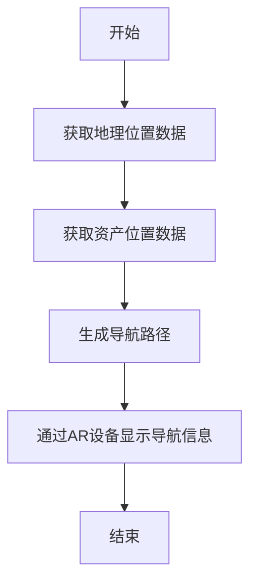
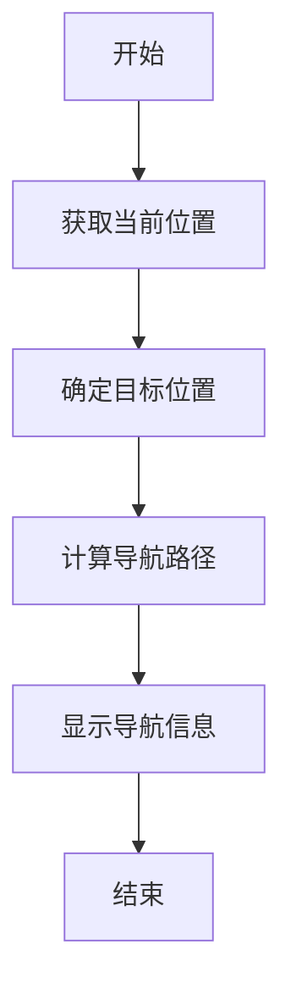
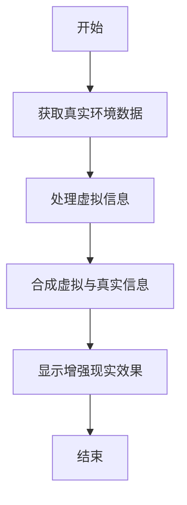
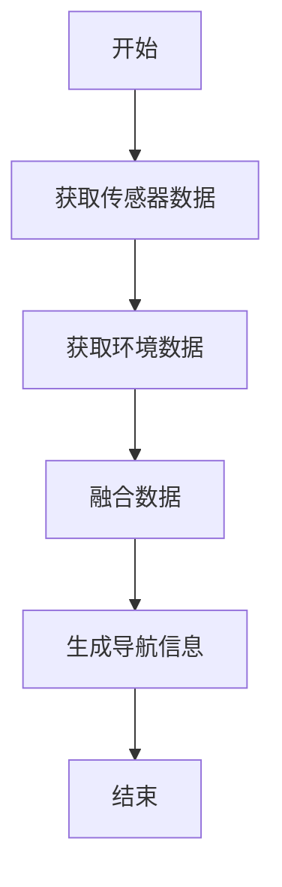
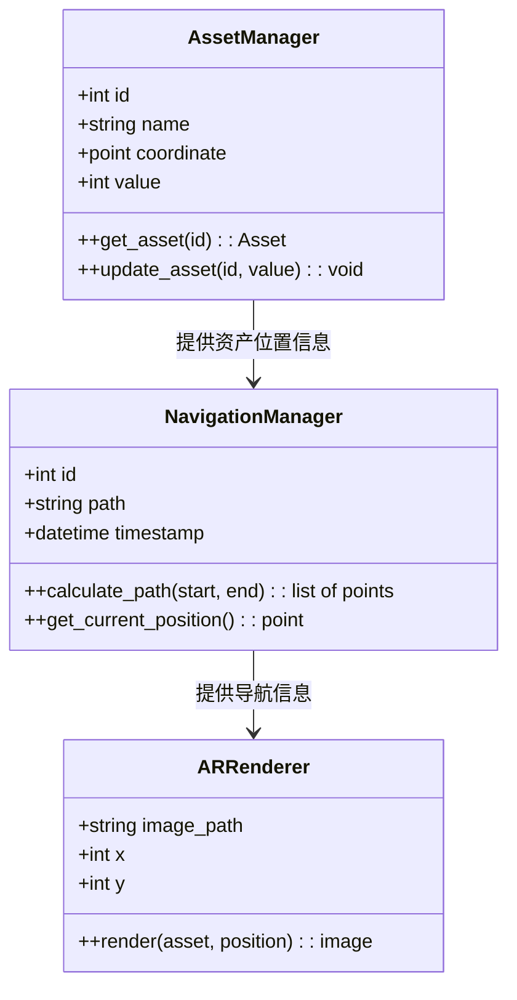
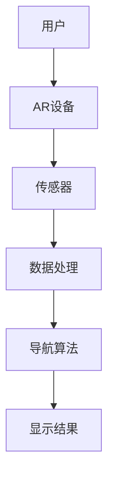
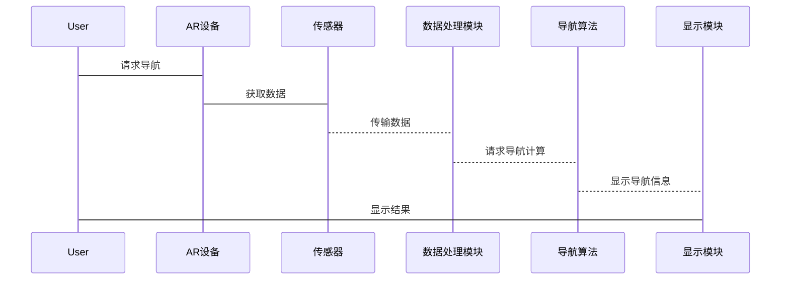

                 


# 企业估值中的增强现实导航应用评估

**关键词**：企业估值、增强现实、导航应用、空间数据可视化、企业价值评估、AR技术

**摘要**：  
随着科技的不断进步，增强现实（AR）技术在企业估值中的应用逐渐成为研究热点。本文旨在探讨增强现实导航应用在企业估值中的核心作用，分析其技术原理、系统架构、实际应用场景以及对传统估值方法的优化与提升。通过对比传统估值方法与AR导航应用的优劣，本文深入剖析了AR导航在企业空间数据可视化、资产定位与追踪、实时数据分析等方面的优势，并结合实际案例，展示了如何通过AR技术提升企业估值的效率和准确性。最后，本文还提出了未来的发展方向和应用前景。

---

## 第一部分: 企业估值中的增强现实导航应用概述

### 第1章: 背景介绍

#### 1.1 增强现实导航的基本概念
增强现实（AR）是一种将虚拟信息叠加在真实环境中的技术，通过摄像头、传感器和算法实现对现实世界的增强。导航应用则是通过AR技术，帮助用户在物理空间中找到方向或位置信息。在企业估值中，AR导航的应用可以将企业的资产分布、空间布局等信息直观地呈现出来，为估值提供更直观的参考。

- **1.1.1 增强现实（AR）的定义与特点**  
  AR是一种结合虚拟信息和真实环境的技术，具有实时性、交互性和沉浸性的特点。通过AR技术，用户可以在物理空间中看到叠加的虚拟信息，如三维模型、数据标签等。

- **1.1.2 导航应用的基本原理**  
  导航应用通过传感器（如摄像头、GPS、陀螺仪）获取现实环境的数据，结合算法（如SLAM、特征匹配）生成导航路径或位置信息，并通过AR设备（如手机、平板、智能眼镜）将导航信息叠加在真实环境中。

- **1.1.3 AR导航在企业估值中的应用背景**  
  企业估值需要考虑企业的资产分布、空间布局、地理位置等多种因素。传统的估值方法依赖于二维图纸或静态数据，难以直观展示空间信息。而AR导航可以通过三维可视化技术，将企业的空间信息实时呈现，为估值提供更直观的支持。

#### 1.2 企业估值的传统方法与局限性
传统企业估值方法主要包括财务指标法、市盈率法、现金流折现法等。这些方法依赖于企业的财务数据，忽略了企业的空间布局和资产分布信息。例如：

- **1.2.1 财务指标法**  
  通过企业的收入、利润、资产等财务指标进行估值，但难以反映企业的空间布局和资产分布对估值的影响。

- **1.2.2 市盈率法**  
  通过企业的市盈率与行业平均市盈率进行比较，但忽略了企业的地理位置和空间分布对估值的影响。

- **1.2.3 现金流折现法**  
  通过预测企业的未来现金流，结合贴现率进行估值，但难以结合企业的空间信息进行动态调整。

- **1.2.4 传统方法的局限性**  
  传统方法主要依赖财务数据，忽略了企业的空间信息和动态变化，难以提供全面的估值支持。

#### 1.3 增强现实导航如何提升企业估值
AR导航通过结合企业的空间信息和动态数据，为传统估值方法提供了新的支持手段。例如：

- **1.3.1 AR技术在空间数据可视化中的优势**  
  AR技术可以通过三维模型、标签等方式，将企业的空间信息直观呈现，帮助估值人员更好地理解企业的空间布局和资产分布。

- **1.3.2 导航应用如何辅助企业估值**  
  AR导航应用可以通过实时定位和追踪技术，帮助估值人员在企业现场快速找到关键资产的位置，并结合实时数据进行动态估值。

- **1.3.3 AR导航在企业估值中的具体应用场景**  
  例如，在商业地产估值中，AR导航可以帮助评估人员快速定位商业地产的地理位置、内部布局，并结合周边环境数据进行综合估值。

### 第2章: 核心概念与联系

#### 2.1 增强现实导航的核心原理
增强现实导航的核心原理包括以下几个方面：

- **2.1.1 AR技术的核心算法**  
  AR技术的核心算法包括定位与追踪算法（如SLAM、特征匹配）、三维重建算法、渲染算法等。

- **2.1.2 导航应用的实现机制**  
  导航应用通过传感器获取环境数据，结合算法生成导航路径或位置信息，并通过AR设备将导航信息叠加在真实环境中。

- **2.1.3 AR导航与企业估值的结合点**  
  AR导航通过结合企业的空间信息和动态数据，为企业的资产定位、空间布局优化、动态估值提供支持。

#### 2.2 核心概念对比分析
以下是AR导航与传统导航的对比分析：

| 对比维度         | AR导航                            | 传统导航                          |
|------------------|-----------------------------------|------------------------------------|
| 数据来源         | 结合虚拟数据与真实环境数据       | 仅依赖真实环境数据                 |
| 可视化方式       | 可以叠加虚拟信息，提供更丰富的信息 | 仅提供真实环境中的位置信息         |
| 应用场景         | 适用于企业估值、空间优化等领域     | 适用于日常导航、交通等领域         |
| 优势             | 提供更直观的空间信息展示           | 实现基本的导航功能                 |

#### 2.3 实体关系图（ER图）与流程图
以下是增强现实导航应用的实体关系图和流程图：

```mermaid
erDiagram
    customer[客户] {
        string id
        string name
        string email
    }
    location[地理位置] {
        int id
        string name
        point coordinate
    }
    asset[资产] {
        int id
        string name
        point coordinate
        int value
    }
    navigation[导航] {
        int id
        string path
        datetime timestamp
    }
    customer --> navigation : 使用导航
    location --> navigation : 包含地理位置
    asset --> navigation : 包含资产位置
```



---

## 第二部分: 算法原理与实现

### 第3章: 算法原理讲解

#### 3.1 导航算法
导航算法是AR导航应用的核心算法之一。以下是导航算法的流程图：



以下是导航算法的Python实现示例：

```python
def calculate_navigation_path(current_position, target_position):
    # 计算导航路径
    path = []
    # 假设当前位置和目标位置为坐标点
    current_x, current_y = current_position
    target_x, target_y = target_position
    # 简单的直线路径计算
    if current_x == target_x:
        step = (target_y - current_y) // 1
        for y in range(current_y, target_y, step):
            path.append((current_x, y))
    else:
        step = (target_x - current_x) // 1
        for x in range(current_x, target_x, step):
            path.append((x, current_y))
    return path

# 示例调用
current_position = (0, 0)
target_position = (2, 3)
path = calculate_navigation_path(current_position, target_position)
print("导航路径:", path)
```

#### 3.2 增强现实算法
增强现实算法的核心是将虚拟信息叠加在真实环境中。以下是增强现实算法的流程图：



以下是增强现实算法的Python实现示例：

```python
import cv2

def apply_ar(image, overlay_image, position):
    # 将overlay_image叠加在image的position位置
    x, y = position
    # 确保位置在图像范围内
    rows, cols = overlay_image.shape[:2]
    if x + rows > image.shape[0] or y + cols > image.shape[1]:
        return image
    # 将overlay_image叠加在image上
    result = image.copy()
    result[y:y+rows, x:x+cols] = overlay_image[y:y+rows, x:x+cols]
    return result

# 示例调用
image = cv2.imread("real_world.jpg")
overlay = cv2.imread("virtual_image.png")
position = (100, 100)
result = apply_ar(image, overlay, position)
cv2.imwrite("augmented_reality.jpg", result)
```

#### 3.3 数据融合算法
数据融合算法是AR导航应用的关键算法之一。以下是数据融合算法的流程图：



以下是数据融合算法的Python实现示例：

```python
import numpy as np

def fuse_data(sensor_data, environment_data):
    # 简单的数据融合方法
    fused_data = {}
    # 传感器数据和环境数据的融合
    fused_data["position"] = sensor_data["position"]
    fused_data["orientation"] = environment_data["orientation"]
    fused_data["timestamp"] = max(sensor_data["timestamp"], environment_data["timestamp"])
    return fused_data

# 示例调用
sensor_data = {"position": (0, 0, 0), "timestamp": 100}
environment_data = {"position": (1, 1, 1), "orientation": (0, 0, 1), "timestamp": 200}
fused = fuse_data(sensor_data, environment_data)
print("融合数据:", fused)
```

---

## 第三部分: 系统分析与架构设计

### 第4章: 系统架构设计

#### 4.1 项目介绍
本项目旨在开发一个基于AR技术的企业估值导航应用，通过实时定位和空间数据可视化，提升企业的估值效率和准确性。

#### 4.2 系统功能设计
以下是系统功能设计的领域模型图：



#### 4.3 系统架构设计
以下是系统架构设计的mermaid图：



#### 4.4 系统接口设计
以下是系统接口设计的mermaid图：



---

## 第四部分: 项目实战

### 第5章: 项目实战

#### 5.1 环境安装
以下是项目实战所需的环境安装说明：

1. **操作系统**：Windows 10或更高版本，macOS 10.15或更高版本，Linux（支持大多数发行版）。
2. **开发工具**：Python 3.8或更高版本，推荐使用PyCharm或VS Code。
3. **依赖库**：
   - OpenCV（用于图像处理）：`pip install opencv-python`
   - SLAM算法库（如ORB-SLAM）：需要编译安装。
   - AR框架（如ARKit、ARCore）：根据平台选择相应的开发框架。

#### 5.2 核心代码实现
以下是核心代码实现：

```python
import cv2
import numpy as np

def ar_navigation_main():
    # 初始化摄像头
    cap = cv2.VideoCapture(0)
    if not cap.isOpened():
        print("无法打开摄像头")
        return

    # 加载AR标记
    ar_marker = cv2.imread("ar_marker.png", cv2.IMREAD_GRAYSCALE)
    ar_marker = ar_marker.reshape(-1)

    # 加载目标资产位置数据
    assets = [
        {"name": "资产1", "coordinate": (100, 100), "value": 10000},
        {"name": "资产2", "coordinate": (200, 200), "value": 20000}
    ]

    while True:
        ret, frame = cap.read()
        if not ret:
            break

        # 检测AR标记
        gray = cv2.cvtColor(frame, cv2.COLOR_BGR2GRAY).reshape(-1)
        matches = np.argwhere(gray == ar_marker).flatten()

        if len(matches) > 0:
            # 计算资产位置
            asset_position = (matches[0] // frame.shape[1], matches[0] % frame.shape[1])
            # 在资产位置叠加AR信息
            cv2.putText(frame, f"${assets[0]['value']}", asset_position, cv2.FONT_HERSHEY_SIMPLEX, 1, (0, 255, 0), 2)
            cv2.putText(frame, f"${assets[1]['value']}", (asset_position[0]+100, asset_position[1]+50), cv2.FONT_HERSHEY_SIMPLEX, 1, (0, 255, 0), 2)

        cv2.imshow("AR Navigation", frame)
        if cv2.waitKey(1) == ord('q'):
            break

    cap.release()
    cv2.destroyAllWindows()

if __name__ == "__main__":
    ar_navigation_main()
```

#### 5.3 代码解读与分析
以上代码实现了一个简单的AR导航应用，主要功能包括：

1. **摄像头初始化**：打开摄像头并获取实时画面。
2. **AR标记检测**：通过检测特定的AR标记，确定资产的位置。
3. **资产位置计算**：根据检测到的标记位置，计算资产的坐标。
4. **AR信息叠加**：在资产位置叠加企业的资产价值信息。

#### 5.4 实际案例分析
以下是AR导航应用在商业地产估值中的实际案例分析：

1. **案例背景**：某商业地产需要进行估值，传统的估值方法依赖于二维图纸和财务数据，难以直观展示商业地产的地理位置和内部布局。
2. **AR导航应用**：通过AR技术，评估人员可以在商业地产现场实时查看资产的地理位置和内部布局，并结合实时数据进行动态估值。
3. **评估结果**：通过AR导航应用，评估人员能够更快速、更直观地完成商业地产的估值，提高了估值的准确性和效率。

#### 5.5 项目小结
通过本项目，我们展示了AR导航技术在企业估值中的实际应用。通过实时定位、空间数据可视化等技术，AR导航应用能够显著提升企业的估值效率和准确性。

---

## 第五部分: 总结与展望

### 第6章: 总结与展望

#### 6.1 总结
本文详细探讨了增强现实导航应用在企业估值中的核心作用，分析了其技术原理、系统架构、实际应用场景以及对传统估值方法的优化与提升。通过对比传统估值方法与AR导航应用的优劣，本文深入剖析了AR导航在企业空间数据可视化、资产定位与追踪、实时数据分析等方面的优势，并结合实际案例，展示了如何通过AR技术提升企业估值的效率和准确性。

#### 6.2 展望
未来，随着AR技术的不断发展，增强现实导航应用在企业估值中的应用前景广阔。以下是未来的发展方向和建议：

1. **技术优化**：进一步优化AR导航算法，提升定位精度和实时性。
2. **功能扩展**：扩展AR导航应用的功能，支持更多企业估值场景，如资产追踪、空间优化等。
3. **行业应用**：推动AR导航技术在更多行业的应用，如商业地产、工业制造、物流等领域。

#### 6.3 最佳实践 tips
以下是使用AR导航应用进行企业估值时的最佳实践建议：

- **选择合适的AR框架**：根据企业的具体需求选择合适的AR框架，如ARKit、ARCore等。
- **确保传感器精度**：选择高精度的传感器，以提升AR导航的定位精度。
- **优化用户体验**：设计直观易用的用户界面，提升用户体验。

#### 6.4 小结
通过本文的探讨，我们可以看到，AR导航技术在企业估值中的应用具有广阔的发展前景。未来，随着AR技术的不断进步，增强现实导航应用将在更多领域发挥重要作用。

---

## 参考文献

1. OpenCV官方文档：https://opencv.org
2. ARKit官方文档：https://developer.apple.com/arkit
3. SLAM算法相关文献：https://www.cs.ox.ac.uk/_staff/az/rgbd/rgbd.html
4. 增强现实导航应用的相关研究论文。

---

**作者：AI天才研究院/AI Genius Institute & 禅与计算机程序设计艺术/Zen And The Art of Computer Programming**

