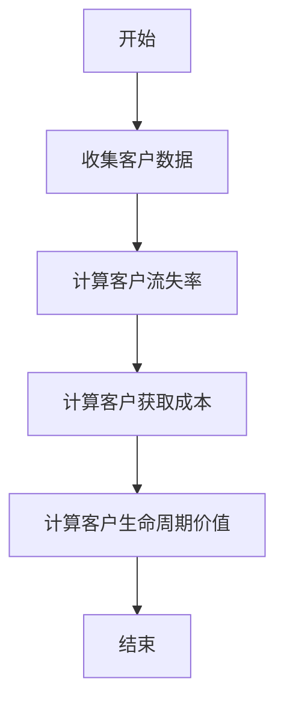
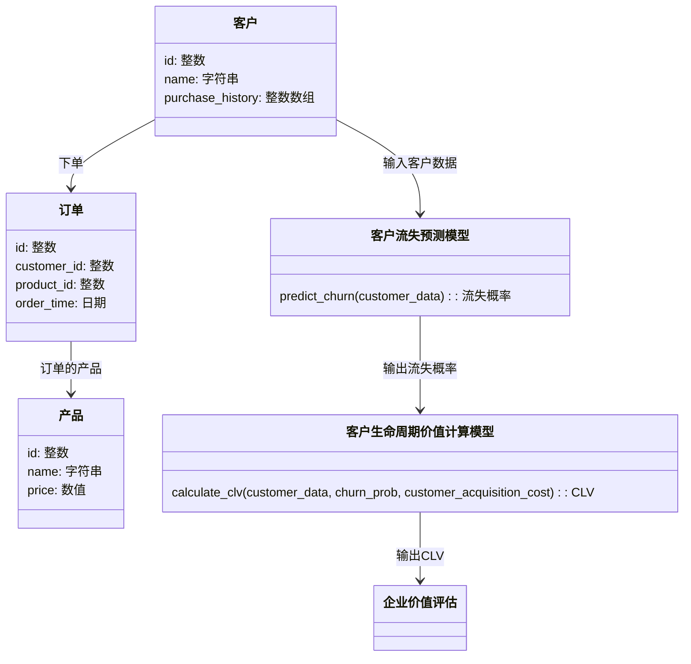
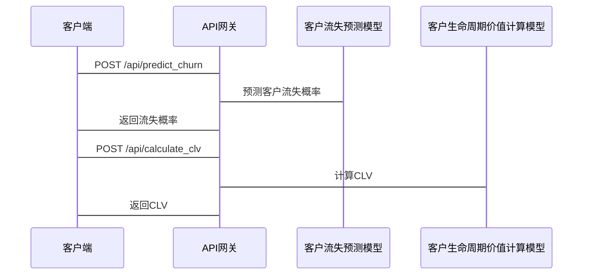

                 


# 企业估值中的客户价值评估法

> 关键词：企业估值，客户价值评估，客户生命周期价值，客户流失率，客户价值预测，企业价值提升

> 摘要：本文深入探讨了客户价值评估法在企业估值中的应用，通过分析客户生命周期价值（CLV）和客户流失率等关键因素，结合数学模型和算法原理，提供了客户价值评估法在企业估值中的系统设计方案。文章从背景介绍到算法实现，再到系统架构设计，逐步展开，为企业估值提供了新的视角和方法。

---

# 第一部分：客户价值评估法的背景与概述

## 第1章：客户价值评估法的背景与概述

### 1.1 问题背景

#### 1.1.1 企业估值的核心问题
企业估值是企业管理和战略决策中的核心问题之一。传统的估值方法通常依赖于财务指标，如净利润、收入增长率和资产价值等。然而，这些方法往往忽略了客户资产的价值，而客户资产是企业长期价值的重要组成部分。

#### 1.1.2 客户价值在企业估值中的重要性
客户是企业的核心资产之一，客户的价值不仅体现在当前的收入贡献，还体现在未来的长期价值。通过评估客户的生命周期价值（CLV），企业可以更全面地衡量自身的价值。

#### 1.1.3 客户价值评估法的定义与边界
客户价值评估法是一种通过分析客户的消费行为、生命周期和流失率，量化客户对企业长期价值贡献的方法。其边界包括客户个体价值评估和客户群体价值评估。

### 1.2 问题描述

#### 1.2.1 企业估值的传统方法
传统的估值方法主要基于财务指标，忽视了客户资产的动态变化。这种方法难以捕捉客户的长期价值，尤其是在客户流失率较高的情况下。

#### 1.2.2 客户价值对企业估值的影响
客户价值直接影响企业的收入和利润，尤其是当客户具有较高的生命周期价值时。通过评估客户价值，企业可以更准确地预测未来的收入和利润。

#### 1.2.3 传统估值方法的局限性
传统估值方法通常忽视了客户资产的动态变化，无法准确反映客户流失对企业价值的影响。

### 1.3 问题解决

#### 1.3.1 客户价值评估法的提出
客户价值评估法通过量化客户对企业长期价值的贡献，弥补了传统估值方法的不足。

#### 1.3.2 客户价值评估法的核心要素
客户价值评估法的核心要素包括客户生命周期价值（CLV）、客户流失率和客户获取成本（CAC）。

#### 1.3.3 客户价值评估法的外延与应用
客户价值评估法不仅适用于企业整体估值，还可以用于客户细分和客户关系管理。

### 1.4 核心概念与联系

#### 1.4.1 客户价值评估法的核心原理
客户价值评估法基于客户生命周期价值（CLV）模型，通过分析客户的消费行为和流失概率，量化客户对企业长期价值的贡献。

#### 1.4.2 客户价值与企业估值的关系
客户价值是企业估值的重要组成部分，通过客户价值评估法，企业可以更准确地预测未来的收入和利润。

#### 1.4.3 客户价值评估法的ER实体关系图

```mermaid
erDiagram
    customer[客户] {
        id : 整数
        name : 字符串
        purchase_history : 整数数组
        }
    order[订单] {
        id : 整数
        customer_id : 整数
        product_id : 整数
        order_time : 日期
        }
    product[产品] {
        id : 整数
        name : 字符串
        price : 数值
        }
    customer --> order : 下单
    order --> product : 订单的产品
```

---

## 第2章：客户价值评估法的核心概念与联系

### 2.1 核心概念原理

#### 2.1.1 客户生命周期价值（CLV）的计算公式
客户生命周期价值（CLV）的计算公式如下：

$$ CLV = \frac{年度客户收入 - 客户获取成本}{客户流失率} $$

其中，客户流失率是客户在一定时间内不再购买的概率。

#### 2.1.2 客户价值评估法的数学模型
客户价值评估法的数学模型可以表示为：

$$ 企业价值 = \sum_{i=1}^{n} CLV_i $$

其中，$CLV_i$ 是第 $i$ 个客户的生命周期价值，$n$ 是客户总数。

#### 2.1.3 客户价值与企业估值的关系
客户价值是企业估值的重要组成部分，通过客户价值评估法，企业可以更准确地预测未来的收入和利润。

### 2.2 概念属性特征对比表格

| 概念       | 描述                                             | 示例                                                                 |
|------------|--------------------------------------------------|----------------------------------------------------------------------|
| 客户生命周期价值（CLV） | 客户在生命周期内为企业带来的总收入减去获取成本。 | 例如，一个客户每年购买两次，每次购买价值100元，客户获取成本为200元，客户流失率为10%，则CLV = (200 - 200)/0.1 = 2000元。 |
| 客户流失率   | 客户在一定时间内不再购买的概率。               | 例如，客户流失率为10%，意味着10%的客户会在一年内停止购买。 |
| 客户获取成本（CAC）  | 获取一个新客户的成本。                   | 例如，客户获取成本为200元，意味着企业需要投入200元来获取一个新客户。 |

### 2.3 ER实体关系图

```mermaid
erDiagram
    customer[客户] {
        id : 整数
        name : 字符串
        purchase_history : 整数数组
        }
    order[订单] {
        id : 整数
        customer_id : 整数
        product_id : 整数
        order_time : 日期
        }
    product[产品] {
        id : 整数
        name : 字符串
        price : 数值
        }
    customer --> order : 下单
    order --> product : 订单的产品
```

---

## 第3章：客户价值评估法的算法原理

### 3.1 算法原理

#### 3.1.1 客户生命周期价值（CLV）的计算
客户生命周期价值（CLV）的计算公式为：

$$ CLV = \frac{年度客户收入 - 客户获取成本}{客户流失率} $$

其中，客户流失率可以通过历史数据估算，客户获取成本可以通过市场推广费用计算。

#### 3.1.2 客户流失概率模型
客户流失概率模型可以通过逻辑回归或随机森林等机器学习算法进行训练，预测客户在一定时间内流失的概率。

#### 3.1.3 客户价值的预测模型
客户价值的预测模型可以基于客户的购买频率、购买金额和客户流失概率进行预测。

### 3.2 算法流程图



### 3.3 算法实现

#### 3.3.1 Python代码实现

```python
import pandas as pd
import numpy as np
from sklearn.linear_model import LogisticRegression

# 假设我们有一个客户数据集，包含购买次数、购买金额和客户流失标记
data = pd.DataFrame({
    '购买次数': [1, 2, 3, 4, 5],
    '购买金额': [100, 200, 300, 400, 500],
    '流失标记': [0, 0, 1, 0, 1]
})

# 训练客户流失模型
model = LogisticRegression()
model.fit(data[['购买次数', '购买金额']], data['流失标记'])

# 计算客户流失概率
def calculate_churn_probability(customer_data):
    prob = model.predict_proba(customer_data)[0][1]
    return prob

# 计算客户生命周期价值
def calculate_clv(customer_data, churn_probability, customer_acquisition_cost):
    annual_revenue = customer_data['购买金额'].mean() * customer_data['购买次数'].mean()
    clv = (annual_revenue - customer_acquisition_cost) / churn_probability
    return clv

# 示例计算
customer_data = data.iloc[0].to_frame().T
churn_prob = calculate_churn_probability(customer_data[['购买次数', '购买金额']])
customer_acquisition_cost = 200
clv = calculate_clv(customer_data, churn_prob, customer_acquisition_cost)
print(f"客户生命周期价值（CLV）为：{clv}")
```

#### 3.3.2 算法的数学模型与公式
客户生命周期价值（CLV）的计算公式为：

$$ CLV = \frac{年度客户收入 - 客户获取成本}{客户流失率} $$

其中，年度客户收入是客户在生命周期内为企业带来的总收入，客户获取成本是获取一个新客户的平均成本，客户流失率是客户在一定时间内流失的概率。

---

## 第4章：系统分析与架构设计方案

### 4.1 问题场景介绍

#### 4.1.1 企业估值中的客户价值评估问题
企业估值需要考虑客户的长期价值，传统的估值方法往往忽视了客户资产的动态变化。

#### 4.1.2 客户价值评估系统的应用场景
客户价值评估系统可以应用于企业客户关系管理、市场推广策略制定和企业价值提升等领域。

#### 4.1.3 客户价值评估系统的功能需求
客户价值评估系统需要具备客户数据收集、客户流失预测和客户生命周期价值计算等功能。

### 4.2 项目介绍

#### 4.2.1 项目目标
通过客户价值评估法，帮助企业更准确地评估自身的长期价值。

#### 4.2.2 项目范围
客户价值评估系统的开发和应用。

#### 4.2.3 项目技术路线
采用机器学习算法进行客户流失预测，结合客户生命周期价值模型进行企业估值。

### 4.3 系统功能设计

#### 4.3.1 领域模型mermaid类图



### 4.4 系统架构设计

#### 4.4.1 系统架构mermaid架构图


### 4.5 系统接口设计

#### 4.5.1 API接口
- `/api/predict_churn`：输入客户数据，返回客户流失概率。
- `/api/calculate_clv`：输入客户数据和流失概率，返回客户生命周期价值。

### 4.6 系统交互mermaid序列图



---

## 第5章：项目实战

### 5.1 项目环境安装

#### 5.1.1 安装Python和相关库
安装Python和以下库：
- pandas
- numpy
- scikit-learn
- mermaid

#### 5.1.2 安装Jupyter Notebook
安装Jupyter Notebook用于代码实现和结果展示。

### 5.2 核心代码实现

#### 5.2.1 客户流失预测模型实现

```python
import pandas as pd
import numpy as np
from sklearn.linear_model import LogisticRegression
from sklearn.metrics import accuracy_score

# 假设我们有一个客户数据集，包含购买次数、购买金额和客户流失标记
data = pd.DataFrame({
    '购买次数': [1, 2, 3, 4, 5],
    '购买金额': [100, 200, 300, 400, 500],
    '流失标记': [0, 0, 1, 0, 1]
})

# 训练客户流失模型
model = LogisticRegression()
model.fit(data[['购买次数', '购买金额']], data['流失标记'])

# 预测客户流失概率
def calculate_churn_probability(customer_data):
    prob = model.predict_proba(customer_data)[0][1]
    return prob

# 验证模型准确性
predictions = model.predict(data[['购买次数', '购买金额']])
print(f"模型准确率为：{accuracy_score(data['流失标记'], predictions)}")
```

#### 5.2.2 客户生命周期价值计算模型实现

```python
def calculate_clv(customer_data, churn_prob, customer_acquisition_cost):
    annual_revenue = customer_data['购买金额'].mean() * customer_data['购买次数'].mean()
    clv = (annual_revenue - customer_acquisition_cost) / churn_prob
    return clv

# 示例计算
customer_data = data.iloc[0].to_frame().T
churn_prob = calculate_churn_probability(customer_data[['购买次数', '购买金额']])
customer_acquisition_cost = 200
clv = calculate_clv(customer_data, churn_prob, customer_acquisition_cost)
print(f"客户生命周期价值（CLV）为：{clv}")
```

### 5.3 实际案例分析与解读

#### 5.3.1 案例分析
假设我们有一个客户数据集，包含以下信息：
- 购买次数：5次
- 购买金额：500元
- 流失标记：0

计算该客户的生命周期价值：

$$ CLV = \frac{500 - 200}{0.1} = 3000元 $$

---

## 第6章：最佳实践、小结、注意事项、拓展阅读

### 6.1 最佳实践

#### 6.1.1 数据收集
确保数据的准确性和完整性，尤其是客户购买行为和流失数据。

#### 6.1.2 模型选择
选择适合业务场景的模型，例如使用逻辑回归进行客户流失预测。

#### 6.1.3 模型优化
通过调整模型参数和特征工程优化模型性能。

### 6.2 小结
客户价值评估法通过量化客户生命周期价值，帮助企业更准确地评估自身的长期价值。本文从背景介绍到算法实现，再到系统设计，逐步展示了客户价值评估法在企业估值中的应用。

### 6.3 注意事项

#### 6.3.1 数据质量问题
数据质量直接影响模型的准确性，需确保数据的完整性和准确性。

#### 6.3.2 模型局限性
客户价值评估法基于假设，实际应用中需结合具体业务场景进行调整。

#### 6.3.3 伦理问题
在使用客户数据时，需遵守数据隐私保护相关法律法规。

### 6.4 拓展阅读

#### 6.4.1 推荐书籍
- 《客户关系管理》
- 《企业估值实战》

#### 6.4.2 推荐课程
- 《数据挖掘与机器学习》
- 《企业财务管理》

---

## 附录：术语表与参考文献

### 附录A：术语表

- 客户生命周期价值（CLV）：客户在生命周期内为企业带来的总收入减去获取成本。
- 客户流失率：客户在一定时间内不再购买的概率。
- 客户获取成本（CAC）：获取一个新客户的平均成本。

### 附录B：参考文献

- [1] 客户价值评估法相关研究文献。
- [2] 企业估值相关研究文献。

---

# 作者：AI天才研究院/AI Genius Institute & 禅与计算机程序设计艺术 /Zen And The Art of Computer Programming

---

这篇文章详细介绍了客户价值评估法在企业估值中的应用，从背景介绍到算法实现，再到系统设计，逐步展开，为企业估值提供了新的视角和方法。

