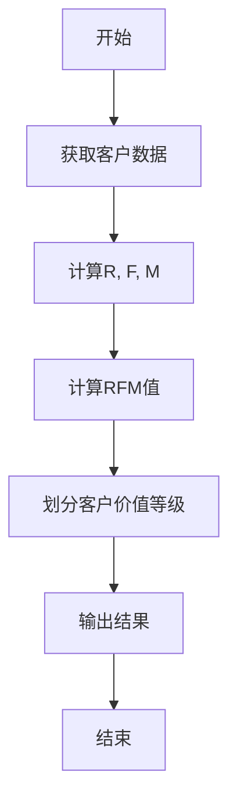
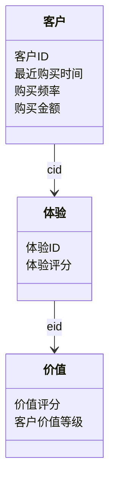
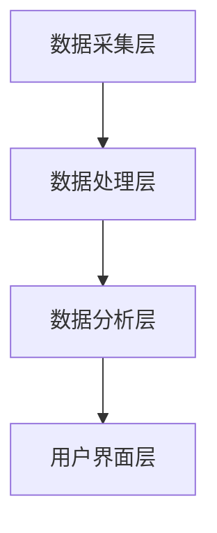
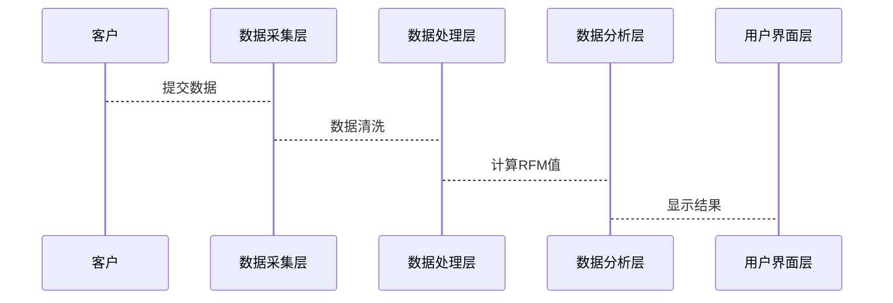

                 


# 企业估值中的客户体验价值分析

> 关键词：企业估值、客户体验、客户满意度、生命周期价值、客户忠诚度、客户价值评分、RFM模型

> 摘要：客户体验是企业估值中不可或缺的重要因素，它直接影响客户满意度和忠诚度，进而影响企业的长期绩效和市场价值。本文通过分析客户体验的核心要素，探讨其对企业估值的影响，并提出基于客户体验价值的分析模型，帮助企业更准确地评估自身价值。

---

# 第一部分: 企业估值中的客户体验价值分析背景介绍

## 第1章: 客户体验价值分析概述

### 1.1 客户体验与企业估值的关系

#### 1.1.1 客户体验的定义与内涵
客户体验（Customer Experience, CX）是指客户与企业在互动过程中所感受到的整体体验，包括产品使用、服务接触、沟通互动等多个方面。客户体验不仅影响客户的即时感受，还会影响客户对企业的情感认知和长期忠诚度。

#### 1.1.2 客户体验与企业价值的关系
企业估值不仅是对财务指标的关注，还应考虑客户资产的价值。客户体验良好的企业往往能通过更高的客户满意度和忠诚度获得更多的客户生命周期价值（Customer Lifetime Value, CLV），从而提升企业整体估值。

#### 1.1.3 客户体验对企业估值的影响
客户体验直接影响客户流失率、客户获取成本和客户留存成本。通过优化客户体验，企业可以降低客户流失率，提高客户留存率，从而提升企业的长期盈利能力。

### 1.2 问题背景与问题描述

#### 1.2.1 传统企业估值方法的局限性
传统的估值方法主要关注财务指标（如收入、利润、资产等），而忽略了客户资产的价值。这种估值方法难以准确反映企业的市场价值，尤其是在客户驱动的行业中。

#### 1.2.2 客户体验在估值中的忽视
在企业估值中，客户体验往往被视为“软性”指标，难以量化。然而，客户体验的优劣直接影响客户行为和企业绩效，因此在估值中必须纳入客户体验的因素。

#### 1.2.3 引入客户体验价值分析的必要性
通过引入客户体验价值分析，可以更全面地评估企业的市场价值，尤其是那些依赖客户关系的企业。客户体验价值分析可以帮助企业在估值中获得更准确的结果。

### 1.3 问题解决与边界

#### 1.3.1 通过客户体验提升企业估值的方法
- 提升客户满意度和忠诚度
- 优化客户生命周期价值
- 加强客户体验管理

#### 1.3.2 客户体验价值分析的边界与外延
客户体验价值分析的边界包括客户体验的核心要素（如满意度、忠诚度）和相关财务指标（如收入、利润）。外延则包括客户体验对品牌价值和企业声誉的影响。

## 1.4 核心概念与要素

### 1.4.1 客户体验的核心要素
- **客户满意度（Customer Satisfaction）**：客户对企业产品或服务的满意程度。
- **客户忠诚度（Customer Loyalty）**：客户对企业产品或服务的持续购买意愿。
- **客户生命周期价值（Customer Lifetime Value, CLV）**：客户在其生命周期内为企业带来的总收入减去相关成本。

### 1.4.2 企业估值的关键指标
- **收入与利润**：企业的财务表现。
- **客户资产价值**：客户数量、客户质量（高价值客户）。
- **品牌价值**：品牌知名度和客户忠诚度。

### 1.4.3 两者结合的逻辑结构
通过客户体验管理提升客户满意度和忠诚度，进而提高客户生命周期价值，最终实现企业估值的提升。

---

## 1.5 本章小结
本章通过分析客户体验与企业估值的关系，揭示了客户体验在企业估值中的重要性。传统的估值方法忽视了客户体验的价值，而引入客户体验价值分析可以更全面地评估企业价值。

---

# 第二部分: 客户体验价值分析的核心概念与联系

## 第2章: 客户体验价值的核心要素

### 2.1 客户满意度与忠诚度

#### 2.1.1 客户满意度的定义与测量
客户满意度（CS）是客户对企业产品或服务满足其需求的程度的评价。可以通过问卷调查、在线反馈等方式进行测量。

#### 2.1.2 客户忠诚度的定义与测量
客户忠诚度（CL）是客户对企业产品或服务的持续购买意愿。可以通过客户保留率、重复购买率等指标进行测量。

#### 2.1.3 客户满意度与忠诚度的关系
客户满意度是客户忠诚度的基础。高满意度的客户更有可能成为忠诚客户，而忠诚客户往往为企业创造更高的价值。

### 2.2 客户生命周期价值

#### 2.2.1 客户生命周期的定义
客户生命周期是指客户从首次接触企业到最终离开企业的整个过程，包括获取阶段、发展阶段、成熟阶段和衰退阶段。

#### 2.2.2 生命周期价值的计算方法
客户生命周期价值（CLV）的计算公式为：
$$ CLV = \frac{收入 - 成本}{客户流失率} $$

#### 2.2.3 生命周期价值与企业估值的关系
客户生命周期价值是企业客户资产的重要组成部分，高CLV的客户可以为企业创造更高的长期价值。

### 2.3 客户体验与企业绩效

#### 2.3.1 客户体验对企业绩效的影响
良好的客户体验可以提高客户满意度和忠诚度，从而提升企业的收入和利润。

#### 2.3.2 绩效指标与企业估值的关系
企业绩效指标（如收入、利润、客户留存率）是企业估值的重要组成部分。

#### 2.3.3 体验驱动的绩效提升模型
通过优化客户体验，企业可以提升客户满意度和忠诚度，进而提高收入和利润，最终实现企业估值的提升。

### 2.4 核心概念对比与ER图

---

#### 2.4.1 核心概念对比
| 概念         | 定义                             | 影响因素       | 测量方法         |
|--------------|----------------------------------|----------------|------------------|
| 客户满意度   | 客户对企业产品或服务的满意程度 | 产品质量、服务 | 问卷调查、反馈   |
| 客户忠诚度   | 客户对企业产品或服务的忠诚程度 | 满意度、替代品 | 重复购买率、保留率 |
| 生命周期价值 | 客户在其生命周期内为企业创造的价值 | 客户留存率、收入 | 计算模型          |

---

#### 2.4.2 ER实体关系图
```mermaid
erd
    title 客户体验价值分析 ER图
    Customer --|{一对多}--> Experience: cid, eid
    Experience --|{一对多}--> Value: eid, value_score
```

---

## 2.5 本章小结
本章分析了客户体验的核心要素，包括客户满意度、忠诚度和生命周期价值，并通过对比和ER图展示了这些概念之间的关系。

---

## 第3章: 客户体验价值分析的算法原理

### 3.1 客户价值评分模型

#### 3.1.1 RFM模型
RFM模型是一种基于客户行为数据的客户价值评分方法，包括以下三个维度：
- **R（Recency）**：客户最近一次购买的时间。
- **F（Frequency）**：客户购买的频率。
- **M（Monetary）**：客户每次购买的平均金额。

RFM模型的计算公式为：
$$ RFM = R \times F \times M $$

#### 3.1.2 RFM模型实现
通过RFM模型可以将客户分为不同价值等级，从而帮助企业识别高价值客户。

#### 3.1.3 算法流程图


#### 3.1.4 Python代码实现
```python
import pandas as pd

# 示例数据
data = {
    '客户ID': [1, 2, 3, 4, 5],
    '最近购买时间': [3, 5, 2, 1, 4],
    '购买频率': [2, 3, 1, 4, 2],
    '购买金额': [100, 150, 80, 200, 120]
}

df = pd.DataFrame(data)

# 计算RFM值
df['RFM'] = df['最近购买时间'] * df['购买频率'] * df['购买金额']

# 划分客户价值等级
def get_segment(rfm):
    if rfm >= 200:
        return '高价值客户'
    elif rfm >= 100:
        return '中价值客户'
    else:
        return '低价值客户'

df['客户价值等级'] = df['RFM'].apply(get_segment)

print(df)
```

---

## 3.2 本章小结
本章通过RFM模型展示了客户体验价值分析的算法原理，并通过Python代码实现了模型的计算和客户价值等级的划分。

---

## 第4章: 客户体验价值分析的系统分析与架构设计

### 4.1 问题场景介绍
企业需要通过客户体验价值分析系统来提升客户满意度和忠诚度，进而提高企业估值。

### 4.2 系统功能设计

#### 4.2.1 领域模型


#### 4.2.2 系统架构设计


#### 4.2.3 接口设计
- 数据采集接口：从数据库获取客户行为数据。
- 数据处理接口：清洗和预处理数据。
- 数据分析接口：计算RFM值和客户价值等级。

#### 4.2.4 交互流程图


---

## 4.3 本章小结
本章通过系统分析和架构设计，展示了客户体验价值分析系统的核心功能和实现方式。

---

## 第5章: 客户体验价值分析的项目实战

### 5.1 项目介绍
本项目通过客户体验价值分析系统对企业客户进行价值评分，帮助企业优化客户管理策略。

### 5.2 核心代码实现

#### 5.2.1 环境安装
```bash
pip install pandas scikit-learn
```

#### 5.2.2 核心代码
```python
import pandas as pd
from sklearn.preprocessing import StandardScaler

# 数据预处理
data = {
    '客户ID': [1, 2, 3, 4, 5],
    '最近购买时间': [3, 5, 2, 1, 4],
    '购买频率': [2, 3, 1, 4, 2],
    '购买金额': [100, 150, 80, 200, 120]
}

df = pd.DataFrame(data)

# 标准化处理
scaler = StandardScaler()
df_scaled = pd.DataFrame(scaler.fit_transform(df[['最近购买时间', '购买频率', '购买金额']]))

# 计算RFM值
df_scaled['RFM'] = df_scaled['最近购买时间'] * df_scaled['购买频率'] * df_scaled['购买金额']

# 划分客户价值等级
def get_segment(rfm):
    if rfm >= 200:
        return '高价值客户'
    elif rfm >= 100:
        return '中价值客户'
    else:
        return '低价值客户'

df_scaled['客户价值等级'] = df_scaled['RFM'].apply(get_segment)

print(df_scaled)
```

---

## 5.3 本章小结
本章通过项目实战展示了客户体验价值分析的具体实现，包括数据预处理、模型计算和结果分析。

---

## 第6章: 客户体验价值分析的最佳实践

### 6.1 小结
客户体验价值分析是企业估值的重要组成部分，通过优化客户体验可以提升企业价值。

### 6.2 注意事项
- 数据质量：确保数据的准确性和完整性。
- 模型选择：根据企业特点选择合适的分析模型。
- 持续优化：定期更新模型和优化客户体验策略。

### 6.3 拓展阅读
- 书籍推荐：《客户体验管理》、《企业估值分析》
- 在线资源：相关学术论文、行业报告

---

## 6.4 本章小结
本章总结了客户体验价值分析的最佳实践，并提供了注意事项和拓展阅读建议。

---

# 第三部分: 结论

## 结论
客户体验是企业估值的重要组成部分，通过客户体验价值分析可以更全面地评估企业价值。本文通过理论分析、算法实现和项目实战，展示了客户体验价值分析的核心内容和实际应用。

---

## 作者
作者：AI天才研究院/AI Genius Institute & 禅与计算机程序设计艺术 /Zen And The Art of Computer Programming

