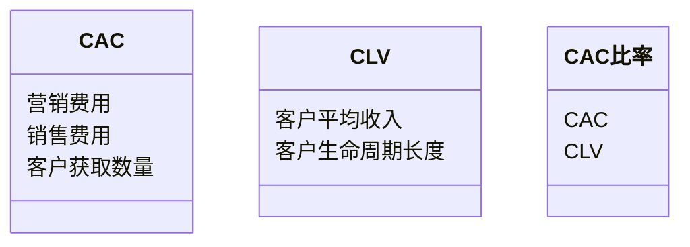

                 


# 企业估值中的客户获取成本分析

> 关键词：客户获取成本（CAC）、企业估值、客户生命周期价值（CLV）、营销费用、销售费用、CAC比率

> 摘要：客户获取成本（CAC）是企业在获取客户过程中所花费的所有费用，包括营销费用、销售费用等。本文将从CAC的基本概念、数学模型、系统分析与架构设计以及项目实战四个方面，全面分析企业估值中的客户获取成本，帮助读者深入理解并掌握CAC的分析方法和应用技巧。

---

# 第一部分: 企业估值中的客户获取成本分析基础

## 第1章: 客户获取成本（CAC）概述

### 1.1 什么是客户获取成本
客户获取成本（Customer Acquisition Cost，简称CAC）是指企业在获取一位新客户的过程中所花费的所有费用，包括营销费用、销售费用、渠道成本等。CAC是企业估值中的一个关键指标，因为它直接影响企业的盈利能力和增长潜力。

#### 1.1.1 客户获取成本的定义
CAC的定义可以简单表示为：
$$CAC = \frac{\text{营销费用} + \text{销售费用}}{\text{客户获取数量}}$$

CAC的计算不仅包括直接的营销支出，还包括间接的成本，例如销售人员的工资、广告费用、渠道佣金等。

#### 1.1.2 CAC在企业估值中的重要性
CAC是企业估值中的一个重要指标，因为它能够帮助企业评估客户获取的效率和成本效益。一个低CAC意味着企业可以用较低的成本获取高质量的客户，从而提高企业的盈利能力。

#### 1.1.3 CAC的核心要素与边界
CAC的核心要素包括：
- **营销费用**：用于吸引潜在客户的费用，例如广告、SEO、内容营销等。
- **销售费用**：用于销售团队的费用，包括销售人员的工资、培训费用、销售工具费用等。
- **客户获取数量**：企业在一定时间内获取的新客户数量。

CAC的边界包括不同行业的差异性，例如SaaS企业与传统制造业的CAC计算方式可能不同。

---

### 1.2 CAC的计算方法
CAC的计算方法多种多样，但最常用的公式是：
$$CAC = \frac{\text{营销费用} + \text{销售费用}}{\text{客户获取数量}}$$

#### 1.2.1 CAC的基本公式
CAC的基本公式是一个简单的成本分摊模型，将企业的营销和销售总费用分摊到每个获取的客户上。例如，如果企业某季度的营销费用为100万元，销售费用为50万元，共获取了500个新客户，则：
$$CAC = \frac{100 + 50}{500} = 0.3 \text{万元/客户}$$

#### 1.2.2 CAC的构成部分
CAC的构成部分包括：
- **营销费用**：用于吸引客户的费用，例如广告、SEO、内容营销等。
- **销售费用**：用于销售团队的费用，包括销售人员的工资、培训费用、销售工具费用等。
- **客户获取渠道与成本分配**：不同渠道的客户获取成本可能不同，需要将费用按渠道进行分摊。

#### 1.2.3 CAC的行业差异性
不同行业的CAC差异较大。例如，SaaS企业的CAC通常较低，而制造业或高端服务业的CAC可能较高。因此，在计算和分析CAC时，需要结合行业特点。

---

### 1.3 CAC与企业估值的关系
CAC与企业估值密切相关，因为它是评估企业盈利能力的重要指标。

#### 1.3.1 CAC对估值的影响
- CAC越低，企业的盈利能力越强，估值也越高。
- CAC与客户生命周期价值（CLV）的比率（即CAC/CLV）是衡量企业客户获取效率的重要指标。

#### 1.3.2 CAC与客户生命周期价值（CLV）的关系
客户生命周期价值（CLV）是指一个客户在生命周期内为企业带来的总收入。CAC与CLV的比率可以帮助企业评估客户获取的效率：
$$\text{CAC比率} = \frac{CAC}{CLV}$$

例如，如果CAC为0.3万元，CLV为1万元，则：
$$\text{CAC比率} = \frac{0.3}{1} = 0.3$$
这意味着每获取一位客户，企业需要投资0.3万元，而客户在生命周期内为企业带来的收入为1万元，投资回报率为333%。

#### 1.3.3 CAC比率的计算与分析
CAC比率越低，企业的客户获取效率越高，盈利能力越强。一般来说，理想情况下，CAC比率应低于3，即每获取一位客户的投资回报率超过3倍。

---

## 1.4 本章小结
本章主要介绍了客户获取成本（CAC）的基本概念、计算方法及其在企业估值中的重要性。通过分析CAC的构成部分和行业差异性，我们了解了CAC在不同场景下的应用。同时，我们还讨论了CAC与客户生命周期价值（CLV）的关系，以及CAC比率的计算与分析方法。

---

# 第二部分: CAC的核心概念与数学模型

## 第2章: CAC的核心概念分析

### 2.1 CAC的构成要素
CAC的构成要素包括营销费用、销售费用和客户获取渠道与成本分配。

#### 2.1.1 营销费用
营销费用包括广告费用、SEO费用、内容营销费用等。这些费用是吸引潜在客户的关键支出。

#### 2.1.2 销售费用
销售费用包括销售人员的工资、培训费用、销售工具费用等。这些费用是将潜在客户转化为实际客户的必要支出。

#### 2.1.3 客户获取渠道与成本分配
不同渠道的客户获取成本可能不同，例如通过社交媒体获取客户的成本可能低于通过搜索引擎获取客户的成本。因此，在计算CAC时，需要将费用按渠道进行分摊。

---

### 2.2 CAC的属性特征对比
不同行业的CAC差异较大，以下是几种常见的行业CAC对比：

#### 2.2.1 不同行业的CAC对比
| 行业       | CAC（万元） |
|------------|------------|
| SaaS       | 1-3        |
| 电子商务    | 0.5-2      |
| 高端服务业  | 5-10       |

#### 2.2.2 不同客户规模的CAC差异
客户规模越大，CAC通常越高。例如，企业客户与个人客户的CAC可能相差较大。

#### 2.2.3 CAC的时间敏感性
CAC的时间敏感性取决于行业的特点。例如，订阅型服务的CAC可能与一次性销售的CAC有所不同。

---

### 2.3 CAC的ER实体关系图
以下是CAC的ER实体关系图：

```mermaid
er
actor: 客户
actor: 渠道
actor: 营销活动
actor: 销售团队
```

---

## 第3章: CAC的数学模型与公式

### 3.1 CAC的基本公式
CAC的基本公式可以表示为：
$$CAC = \frac{\text{营销费用} + \text{销售费用}}{\text{客户获取数量}}$$

#### 3.1.1 CAC与客户生命周期价值（CLV）的关系
客户生命周期价值（CLV）可以表示为：
$$CLV = \text{客户平均收入} \times \text{客户生命周期长度}$$

CAC与CLV的比率是衡量客户获取效率的重要指标：
$$\text{CAC比率} = \frac{CAC}{CLV}$$

---

### 3.2 CAC的优化模型
CAC的优化模型可以通过线性回归分析来实现。

#### 3.2.1 CAC的最小化问题
通过优化营销和销售策略，降低CAC成本。

#### 3.2.2 CAC与客户转化率的关系
客户转化率越高，CAC越低。因此，提高转化率是降低CAC的重要途径。

---

## 3.3 CAC的数学推导与案例分析
以下是一个简单的CAC数学推导案例：

假设某企业季度营销费用为100万元，销售费用为50万元，共获取了500个新客户，则：
$$CAC = \frac{100 + 50}{500} = 0.3 \text{万元/客户}$$

---

# 第三部分: CAC的系统分析与架构设计

## 第4章: CAC的系统分析与架构设计

### 4.1 系统功能设计
系统功能设计包括数据采集、CAC计算、结果分析和报告生成。

#### 4.1.1 领域模型
以下是领域模型类图：



#### 4.1.2 系统架构设计
以下是系统架构图：

```mermaid
containerDiagram
    客户数据系统
    营销系统
    销售系统
    报告系统
```

---

## 第5章: 项目实战

### 5.1 环境安装与数据收集
需要安装数据分析工具，例如Python、Pandas、NumPy等。

### 5.2 核心代码实现
以下是Python代码实现：

```python
def calculate_CAC(marketing_cost, sales_cost, customers_acquired):
    CAC = (marketing_cost + sales_cost) / customers_acquired
    return CAC

marketing_cost = 100  # 万元
sales_cost = 50  # 万元
customers_acquired = 500
CAC = calculate_CAC(marketing_cost, sales_cost, customers_acquired)
print(f"CAC = {CAC:.2f} 万元/客户")
```

### 5.3 代码解读与分析
- `calculate_CAC`函数：计算CAC值。
- `marketing_cost`和`sales_cost`：营销费用和销售费用。
- `customers_acquired`：获取的客户数量。

---

## 5.4 实际案例分析
以某SaaS企业为例，假设其季度营销费用为100万元，销售费用为50万元，共获取了500个新客户，则：
$$CAC = \frac{100 + 50}{500} = 0.3 \text{万元/客户}$$

---

## 5.5 项目小结
通过上述分析和实战，我们掌握了如何计算和优化CAC，并将其应用于实际的企业估值中。

---

# 第四部分: 总结与展望

## 第6章: 总结与展望

### 6.1 最佳实践 tips
- 定期监控和优化CAC。
- 结合行业特点和客户生命周期价值（CLV）进行分析。

### 6.2 小结
通过本篇文章的学习，我们深入了解了客户获取成本（CAC）的核心概念、数学模型和系统架构设计，并通过实战案例掌握了CAC的分析方法。

### 6.3 注意事项
- CAC的计算需要结合企业的实际情况。
- CAC的优化需要综合考虑成本和效率。

### 6.4 拓展阅读
- 《数据分析实战》
- 《企业估值方法论》

---

# 作者

作者：AI天才研究院/AI Genius Institute & 禅与计算机程序设计艺术 /Zen And The Art of Computer Programming

