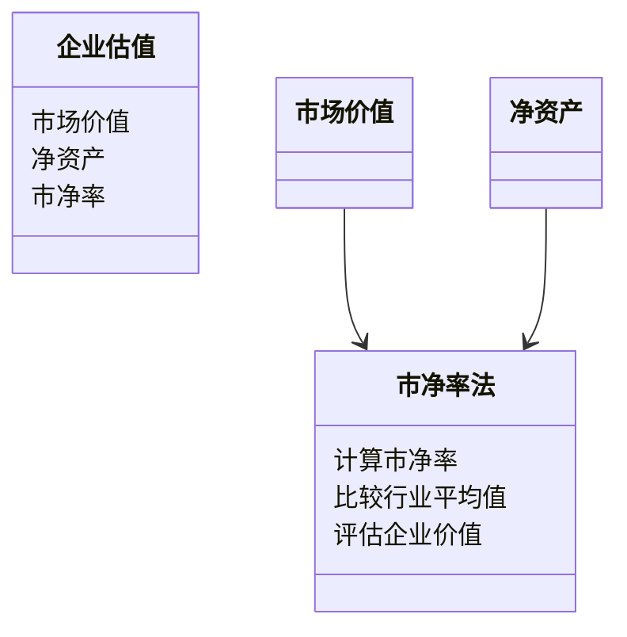
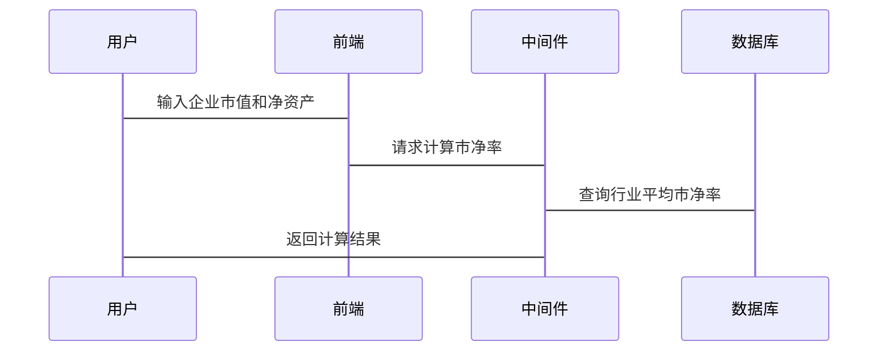

                 


# 《企业估值中的市净率法详解》

> **关键词**: 企业估值，市净率，财务指标，投资评估，资产重估

> **摘要**: 本文系统地探讨了市净率法在企业估值中的应用，从基本概念到数学模型，从系统分析到项目实战，全面解析了市净率法的原理、方法及其在实际投资决策中的应用。通过详细讲解市净率法的核心公式、影响因素、系统架构设计以及实际案例分析，帮助读者掌握市净率法在企业估值中的具体应用和实践技巧。

---

## 第1章：市净率法的基本概念与背景

### 1.1 市净率法的定义与核心要素

#### 1.1.1 市净率法的定义
市净率法（Price-to-Book Ratio，简称P/B）是企业估值中的一种常用方法，用于衡量企业的市场价值与其账面价值之间的关系。其核心公式为：
$$ P/B = \frac{\text{企业市值}}{\text{净资产}} $$

#### 1.1.2 市净率法的核心要素
- 企业市值：企业在市场上的公允价值。
- 净资产：企业的资产减去负债后的价值。
- 市净率值：反映企业市场价值与账面价值的比值。

#### 1.1.3 市净率法的适用场景
- 适用于资产密集型行业（如银行、房地产）。
- 适用于企业账面价值相对稳定的场景。

### 1.2 市净率法的发展历程

#### 1.2.1 市净率法的起源
市净率法起源于20世纪初的金融理论，最初用于评估银行等金融机构的价值。

#### 1.2.2 市净率法在企业估值中的发展
随着金融市场的成熟，市净率法逐渐扩展到其他行业，并与其他估值方法结合使用。

#### 1.2.3 市净率法的现状与趋势
当前，市净率法仍然是企业估值的重要工具之一，但其应用需要结合行业特点和市场环境。

### 1.3 市净率法与其他估值方法的对比

#### 1.3.1 市净率法与市盈率法的对比
市盈率法（P/E）侧重于企业盈利能力和未来收益，而市净率法侧重于企业资产价值。

#### 1.3.2 市净率法与现金流折现法的对比
现金流折现法基于未来现金流的折现，而市净率法基于当前市场价值与账面价值的比值。

#### 1.3.3 市净率法与资产重估法的对比
资产重估法假设资产价值可以重新评估，而市净率法基于现有的账面价值进行评估。

---

## 第2章：市净率法的数学模型与公式

### 2.1 市净率法的基本公式

#### 2.1.1 市净率（P/B）的计算公式
$$ P/B = \frac{\text{企业市值}}{\text{净资产}} $$

#### 2.1.2 市净率法的数学推导
市净率法的推导基于企业价值与其净资产的比率关系。假设企业的净资产为B，市值为P，则市净率P/B反映了市场对企业的估值相对于其账面价值的倍数。

#### 2.1.3 市净率法的适用条件
- 企业具有稳定的资产结构。
- 企业账面价值能够反映其真实价值。

### 2.2 市净率法的核心属性与特征

#### 2.2.1 市净率法的线性特性
市净率法的计算公式具有线性关系，易于理解和应用。

#### 2.2.2 市净率法的敏感性分析
市净率法对净资产的评估敏感，需要结合行业特点和企业具体情况。

#### 2.2.3 市净率法的稳定性评估
市净率法在资产密集型行业较为稳定，但在轻资产行业可能波动较大。

---

## 第3章：市净率法的系统分析与架构设计

### 3.1 问题场景介绍

#### 3.1.1 企业估值的基本问题
企业估值的核心问题是确定企业的市场价值，而市净率法提供了基于资产价值的评估方法。

#### 3.1.2 市净率法的应用场景
市净率法适用于资产密集型行业，如银行、房地产和制造业。

#### 3.1.3 市净率法的局限性
市净率法难以适用于轻资产行业，且忽略了企业的未来盈利能力。

### 3.2 系统功能设计

#### 3.2.1 领域模型设计（Mermaid 类图）


#### 3.2.2 系统架构设计（Mermaid 架构图）


#### 3.2.3 系统接口设计
- 输入接口：企业市值、净资产。
- 输出接口：市净率值。

#### 3.2.4 系统交互设计（Mermaid 序列图）


---

## 第4章：市净率法的项目实战

### 4.1 环境安装

#### 4.1.1 安装Python环境
- 安装Python 3.x。
- 安装必要的库，如pandas、numpy。

#### 4.1.2 安装Mermaid工具
- 安装Mermaid CLI工具用于生成图表。

### 4.2 系统核心实现源代码

#### 4.2.1 Python代码实现
```python
import pandas as pd
import numpy as np

def calculate_p_b_ratio(market_value, book_value):
    return market_value / book_value

# 示例数据
market_value = 1000000000  # 10亿美元
book_value = 500000000     # 5亿美元

p_b_ratio = calculate_p_b_ratio(market_value, book_value)
print(f"市净率 = {p_b_ratio}")
```

#### 4.2.2 代码应用解读
- 输入企业市值和净资产，计算市净率。
- 示例结果：市净率 = 2.0。

### 4.3 案例分析

#### 4.3.1 案例背景
某银行的市值为100亿美元，净资产为50亿美元。

#### 4.3.2 计算过程
$$ P/B = \frac{100}{50} = 2.0 $$

#### 4.3.3 结果解读
市净率为2.0，高于行业平均值，表明该银行的股价可能被高估。

### 4.4 项目小结
通过案例分析，展示了市净率法在实际中的应用，强调了行业平均值的重要性。

---

## 第5章：市净率法的最佳实践

### 5.1 小结
市净率法是一种简单有效的估值方法，适用于资产密集型行业。

### 5.2 注意事项
- 结合行业特点。
- 考虑企业未来盈利能力。

### 5.3 拓展阅读
- 《企业估值方法与应用》。
- 《金融投资中的数学模型》。

---

## 作者简介

作者：AI天才研究院/AI Genius Institute  
& 禅与计算机程序设计艺术 /Zen And The Art of Computer Programming  

---

**注**: 以上内容为《企业估值中的市净率法详解》的目录大纲和部分章节内容示例，实际书籍内容将更加详细，并包含完整的代码实现、图表和案例分析。

