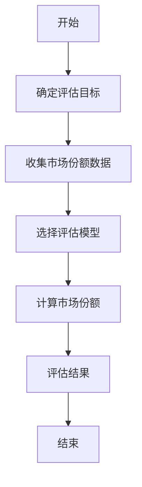
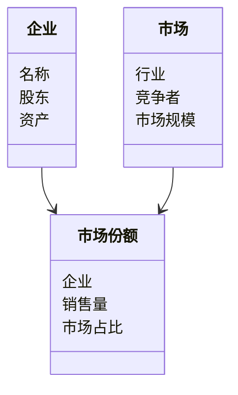
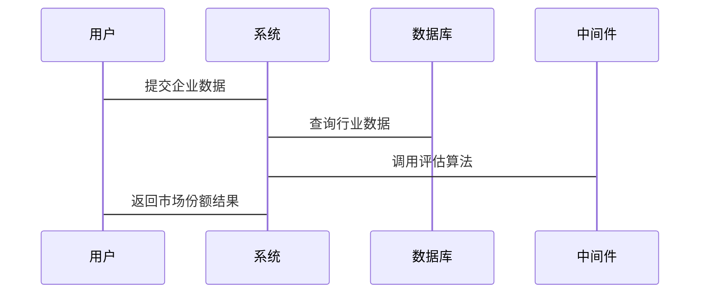

                 


```markdown
# 企业估值中的市场份额价值评估

## 关键词：企业估值、市场份额、价值评估、数据分析、技术方法、案例分析

## 摘要：本文详细探讨了在企业估值过程中，如何有效评估市场份额的价值。通过分析市场份额的核心概念、评估方法、数学模型和实际案例，结合技术工具和系统设计，为读者提供全面的指导，帮助他们在企业估值中准确评估市场份额的价值。

## 第一部分：企业估值中的市场份额价值评估背景介绍

### 第1章：市场份额价值评估的背景与概念

#### 1.1 企业估值中的问题背景
##### 1.1.1 企业估值的核心问题
企业估值是评估企业整体价值的过程，涉及财务表现、市场地位、行业趋势等多个因素。其中，市场份额是影响企业价值的关键指标之一。

##### 1.1.2 市场份额在企业估值中的重要性
市场份额反映了企业在行业中的地位和竞争力。高市场份额通常意味着更强的定价权和更大的市场影响力，直接影响企业的收入和利润。

##### 1.1.3 传统估值方法的局限性
传统估值方法如市盈率、市净率等，难以全面考虑市场份额的动态变化和市场结构的影响。市场份额的波动性可能使传统方法低估或高估企业的真实价值。

#### 1.2 市场份额的定义与属性
##### 1.2.1 市场份额的定义
市场份额是指企业在特定市场中销售产品或服务的总量占整个市场的比例。计算公式为：
$$市场份额 = \frac{\text{企业销售量}}{\text{市场总销售量}} \times 100\%$$

##### 1.2.2 市场份额的核心属性
- 数量占比：企业在市场中的销售量占比。
- 质量占比：企业在高端市场的影响力。
- 动态变化：市场份额随市场环境变化而波动。

##### 1.2.3 市场份额与其他估值指标的关系
市场份额与收入、利润、风险评估等指标密切相关。例如，高市场份额通常意味着更高的收入和利润率，但可能伴随更高的竞争压力和市场风险。

#### 1.3 市场份额价值评估的方法与工具
##### 1.3.1 常用市场份额评估工具
- 数据分析工具：Excel、Python、R。
- 估值模型：DCF模型、EV/EBITDA模型。
- 行业分析工具：行业报告、市场调研。

##### 1.3.2 数据来源与处理方法
数据来源包括企业财报、行业报告、市场调研等。处理方法包括清洗数据、计算市场份额、趋势分析等。

##### 1.3.3 评估模型的选择与优化
选择合适的模型需考虑企业所处行业、市场结构和数据可得性。优化模型可结合历史数据和市场预测，提高评估准确性。

#### 1.4 市场份额价值评估的应用场景
##### 1.4.1 企业并购中的应用
评估目标企业市场份额，判断其市场地位和整合潜力，帮助制定合理的并购价格。

##### 1.4.2 企业融资中的应用
高市场份额可提升企业信用评级和融资能力，降低融资成本。

##### 1.4.3 企业战略规划中的应用
通过分析市场份额趋势，制定市场进入、产品开发和竞争策略。

### 第2章：市场份额价值评估的核心概念与联系

#### 2.1 市场份额的核心概念原理
##### 2.1.1 市场份额的计算公式
$$市场份额 = \frac{\text{企业销售量}}{\text{市场总销售量}} \times 100\%$$

##### 2.1.2 市场份额的影响因素
- 产品价格：影响需求和市场份额。
- 品牌影响力：强大的品牌可提升市场份额。
- 竞争对手策略：竞争格局变化影响市场份额。

##### 2.1.3 市场份额的动态变化规律
市场份额受市场增长、竞争加剧和产品生命周期影响，呈现波动性变化。

#### 2.2 市场份额与其他估值指标的对比分析
##### 2.2.1 市场份额与企业价值的关系
市场份额高通常意味着企业价值高，但需考虑行业增长潜力。

##### 2.2.2 市场份额与收入、利润的关系
市场份额与收入和利润呈正相关，但高市场份额不一定带来高利润，需考虑成本结构。

##### 2.2.3 市场份额与风险评估的关系
高市场份额可能面临较高的竞争风险，需平衡市场地位与风险控制。

#### 2.3 市场份额的ER实体关系图
```mermaid
erDiagram
    customer[客户]
    product[产品]
    market_share[市场份额]
    company[企业]
    customer <--- market_share
    product <--- market_share
    company <--- market_share
```

#### 2.4 市场份额的流程图


## 第三部分：企业市场份额价值评估的算法原理

### 第3章：市场份额价值评估算法原理

#### 3.1 评估算法概述
市场份额评估算法包括数据清洗、模型选择、计算和验证。

#### 3.2 数据清洗与预处理
##### 3.2.1 数据清洗流程
1. 检查数据完整性。
2. 处理缺失值。
3. 去重和格式统一。

##### 3.2.2 数据预处理步骤
- 数据标准化：统一数据格式。
- 数据归一化：调整数据范围。

#### 3.3 市场份额计算算法
##### 3.3.1 加权平均算法
$$市场份额 = \sum (\text{权重}_i \times \text{变量}_i)$$

##### 3.3.2 回归分析算法
使用线性回归预测市场份额：
$$\hat{y} = a + bx$$

##### 3.3.3 聚类分析算法
将企业分为不同市场占有率类别，分析其特征。

#### 3.4 算法实现代码
```python
import pandas as pd
import numpy as np

# 数据加载与预处理
data = pd.read_csv('market_share.csv')
data.dropna(inplace=True)  # 删除缺失值
data['市场份额'] = data['市场份额'].astype(float)

# 计算加权平均市场份额
weights = [0.5, 0.3, 0.2]
variables = ['收入', '利润', '成本']
market_share = np.dot(weights, variables)
print('加权平均市场份额:', market_share)

# 回归分析
from sklearn.linear_model import LinearRegression
model = LinearRegression()
model.fit(data[['收入', '利润', '成本']], data['市场份额'])
print('回归模型系数:', model.coef_)
```

## 第四部分：企业市场份额价值评估的系统分析与架构设计

### 第4章：系统分析与架构设计

#### 4.1 问题场景介绍
市场份额评估系统用于帮助企业准确评估市场地位，支持决策。

#### 4.2 系统功能设计
##### 4.2.1 领域模型设计


##### 4.2.2 系统架构设计


##### 4.2.3 系统接口设计
定义API接口，如`/api/market_share/calculate`，用于接收企业数据，返回市场份额评估结果。

##### 4.2.4 系统交互设计


## 第五部分：企业市场份额价值评估的项目实战

### 第5章：项目实战

#### 5.1 环境安装与配置
- Python 3.8+
- Jupyter Notebook
- Pandas、NumPy、Scikit-learn库

#### 5.2 系统核心实现
##### 5.2.1 核心代码实现
```python
def calculate_market_share(customers, market_size):
    return (customers / market_size) * 100

market_share = calculate_market_share(企业销售量, 市场总销售量)
print('计算的市场份额:', market_share)
```

##### 5.2.2 代码功能解读
函数`calculate_market_share`计算企业市场份额，返回百分比值。

#### 5.3 实际案例分析
##### 5.3.1 案例背景
分析某科技公司市场份额，数据包括企业销售量和市场总销售量。

##### 5.3.2 数据分析与解读
使用回归分析预测未来市场份额变化，评估企业增长潜力。

##### 5.3.3 案例总结
高市场份额表明企业市场地位稳固，但需关注市场竞争风险。

## 第六部分：企业市场份额价值评估的最佳实践

### 第6章：最佳实践

#### 6.1 小结
市场份额是企业估值的关键因素，需结合多种方法和工具进行评估。

#### 6.2 注意事项
- 数据准确性：确保数据来源可靠。
- 模型选择：根据具体情况选择合适模型。
- 风险控制：考虑市场变化对市场份额的影响。

#### 6.3 拓展阅读
推荐阅读行业报告、学术论文和相关技术书籍，深入理解市场份额评估的理论与实践。

## 作者信息

作者：AI天才研究院/AI Genius Institute & 禅与计算机程序设计艺术/Zen And The Art of Computer Programming

---

本文通过系统分析和实际案例，详细阐述了企业估值中市场份额的价值评估方法，结合技术工具和系统设计，为读者提供了全面的指导。希望本文能帮助读者在企业估值中准确评估市场份额的价值，做出明智的商业决策。
```

