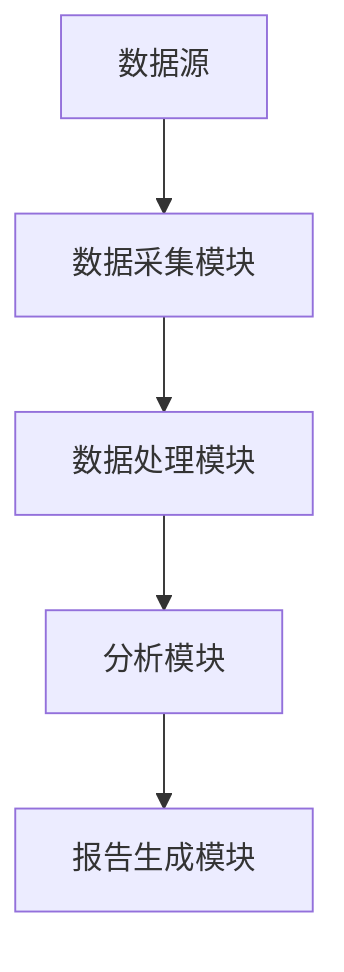
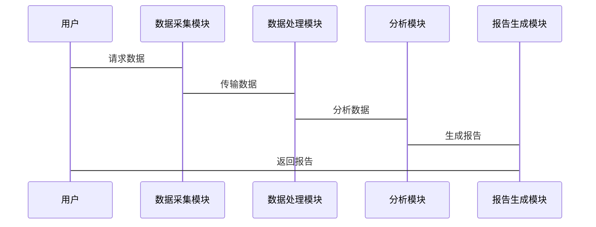

                 


# 企业估值中的市场渗透率分析

> **关键词**: 市场渗透率、企业估值、市场分析、数据分析、市场战略

> **摘要**: 市场渗透率是企业在特定市场中的产品或服务普及程度的重要指标，对企业的估值具有重要影响。本文从市场渗透率的基本概念出发，分析其驱动因素、数学模型、系统架构设计，并结合实际案例进行深入探讨，为企业估值提供理论支持和实践指导。

---

## 第一部分: 市场渗透率的基本概念与应用

### 第1章: 市场渗透率的基本概念与应用

#### 1.1 市场渗透率的定义与背景

**1.1.1 市场渗透率的定义**

市场渗透率（Market Penetration Rate）是衡量企业产品或服务在目标市场中的普及程度的重要指标。它通常表示企业在目标市场中所占的市场份额比例，反映了企业在市场中的影响力和竞争力。

**1.1.2 市场渗透率在企业估值中的重要性**

市场渗透率是企业估值的核心因素之一。高市场渗透率意味着企业的产品或服务在市场中占据较大份额，通常意味着更高的收入和利润，从而提高企业的估值。

**1.1.3 市场渗透率的核心要素与边界**

- **核心要素**: 产品或服务的市场份额、目标市场规模、市场增长率。
- **边界**: 市场渗透率的上限通常为100%，当市场饱和时，渗透率不再增长。

#### 1.2 市场渗透率的计算方法

**1.2.1 市场渗透率的计算公式**

市场渗透率（P）的计算公式为：

$$ P = \frac{\text{企业销售额}}{\text{目标市场销售额}} \times 100\% $$

其中：
- 企业销售额：企业在目标市场中的收入。
- 目标市场销售额：目标市场中所有企业的总收入。

**1.2.2 市场渗透率的影响因素**

- **产品竞争力**: 产品的质量和价格直接影响市场渗透率。
- **市场需求**: 目标市场的需求量和增长潜力。
- **竞争格局**: 竞争对手的数量和市场份额。

**1.2.3 市场渗透率与企业估值的关系**

市场渗透率与企业估值呈正相关关系。高市场渗透率意味着企业具有更强的市场地位和盈利能力，从而提高企业的估值。

#### 1.3 市场渗透率的行业应用

**1.3.1 高科技行业的市场渗透率分析**

高科技行业（如互联网、人工智能）通常具有高增长和高市场渗透率的潜力。企业需要通过技术创新和市场推广来提高市场渗透率。

**1.3.2 消费品行业的市场渗透率分析**

消费品行业（如食品、日用品）的市场渗透率受消费者偏好和购买习惯的影响较大。企业需要通过品牌建设和渠道扩展来提高市场渗透率。

**1.3.3 金融行业的市场渗透率分析**

金融行业（如银行、保险）的市场渗透率受监管政策和客户需求的影响较大。企业需要通过产品创新和服务优化来提高市场渗透率。

---

## 第二部分: 市场渗透率的驱动因素与影响

### 第2章: 市场渗透率的驱动因素与影响

#### 2.1 市场渗透率的驱动因素

**2.1.1 产品竞争力分析**

- **产品优势**: 产品是否具有独特的功能或优势。
- **产品生命周期**: 产品处于导入期、成长期还是成熟期。

**2.1.2 市场需求分析**

- **市场规模**: 目标市场的总容量。
- **市场增长率**: 市场的需求增长速度。

**2.1.3 竞争格局分析**

- **竞争对手数量**: 市场上主要竞争对手的数量。
- **竞争对手市场份额**: 竞争对手的市场占有率。

#### 2.2 市场渗透率对企业估值的影响

**2.2.1 市场渗透率与企业收入的关系**

高市场渗透率意味着企业收入增长快，从而提高企业估值。

**2.2.2 市场渗透率与企业利润的关系**

高市场渗透率意味着企业具有更强的定价能力和成本控制能力，从而提高企业利润。

**2.2.3 市场渗透率与企业市场地位的关系**

高市场渗透率意味着企业在市场上具有更强的影响力和话语权，从而提高企业的市场地位。

#### 2.3 市场渗透率的行业差异

**2.3.1 不同行业市场渗透率的差异**

- 高科技行业：市场渗透率增长快。
- 消费品行业：市场渗透率受消费者偏好影响大。
- 金融行业：市场渗透率受政策和监管影响大。

**2.3.2 市场渗透率与行业生命周期的关系**

- 导入期：市场渗透率低。
- 成长期：市场渗透率快速提升。
- 成熟期：市场渗透率稳定。

**2.3.3 市场渗透率与企业规模的关系**

- 大型企业：市场渗透率通常较高。
- 小型企业：市场渗透率通常较低。

---

## 第三部分: 市场渗透率的分析框架

### 第3章: 市场渗透率的分析框架

#### 3.1 市场渗透率分析的基本框架

**3.1.1 分析目标的确定**

明确分析的目标，例如：评估当前市场渗透率、预测未来市场渗透率、制定市场渗透策略。

**3.1.2 数据收集与处理**

- 数据来源：企业内部数据、行业报告、市场调研。
- 数据处理：清洗数据、整理数据、建立数据库。

**3.1.3 分析方法的选择**

- 定量分析：统计分析、回归分析。
- 定性分析：竞争分析、消费者行为分析。

#### 3.2 市场渗透率的分析模型

**3.2.1 市场渗透率预测模型**

- **线性回归模型**: 预测市场渗透率的趋势。
- **时间序列模型**: 预测市场渗透率的未来值。
- **非线性回归模型**: 预测市场渗透率的复杂变化。

**3.2.2 市场渗透率驱动因素模型**

- **因果关系模型**: 分析市场渗透率的主要驱动因素。
- **结构方程模型**: 综合分析市场渗透率的影响因素。

**3.2.3 市场渗透率与企业估值的综合模型**

- **综合模型**: 结合市场渗透率和企业财务指标进行估值。

#### 3.3 市场渗透率的分析工具

**3.3.1 数据可视化工具**

- **图表工具**: Excel、Tableau。
- **数据可视化库**: Matplotlib、Seaborn。

**3.3.2 统计分析工具**

- **统计软件**: SPSS、R。
- **数据分析库**: Pandas、NumPy。

**3.3.3 专业分析软件**

- **行业分析工具**: Gartner、Forrester。
- **估值工具**: discounted cash flow（DCF）模型。

---

## 第四部分: 市场渗透率的数学模型与公式

### 第4章: 市场渗透率的数学模型与公式

#### 4.1 市场渗透率的基本公式

**4.1.1 市场渗透率计算公式**

$$ P = \frac{\text{企业销售额}}{\text{目标市场销售额}} \times 100\% $$

**4.1.2 市场渗透率变化率公式**

$$ \Delta P = \frac{P_{\text{新}} - P_{\text{旧}}}{P_{\text{旧}}} \times 100\% $$

**4.1.3 市场渗透率与市场份额的关系**

$$ \text{市场份额} = P \times \text{目标市场规模} $$

#### 4.2 市场渗透率的预测模型

**4.2.1 线性回归模型**

$$ P_{\text{预测}} = a + bt $$

其中：
- \( a \) 是截距。
- \( b \) 是回归系数。
- \( t \) 是时间变量。

**4.2.2 时间序列模型**

$$ P_{\text{预测}} = \alpha + \beta t + \gamma t^2 $$

其中：
- \( \alpha \) 是长期趋势系数。
- \( \beta \) 是线性趋势系数。
- \( \gamma \) 是二次趋势系数。

**4.2.3 非线性回归模型**

$$ P_{\text{预测}} = \frac{K P_{\text{当前}}}{1 + e^{-rt}} $$

其中：
- \( K \) 是最大市场渗透率。
- \( r \) 是增长率。
- \( t \) 是时间变量。

#### 4.3 市场渗透率与企业估值的数学关系

**4.3.1 企业估值的基本公式**

$$ V = \frac{CF}{r} $$

其中：
- \( V \) 是企业估值。
- \( CF \) 是未来现金流。
- \( r \) 是贴现率。

**4.3.2 市场渗透率对企业估值的影响公式**

$$ CF = P \times \text{目标市场规模} \times \text{利润率} $$

**4.3.3 综合模型的数学表达**

$$ V = \frac{P \times \text{目标市场规模} \times \text{利润率}}{r} $$

---

## 第五部分: 市场渗透率的系统架构设计

### 第5章: 市场渗透率的系统架构设计

#### 5.1 系统功能设计

**5.1.1 系统功能模块**

- **数据采集模块**: 采集市场数据。
- **数据处理模块**: 清洗和整理数据。
- **分析模块**: 计算市场渗透率、预测市场渗透率。
- **报告生成模块**: 生成分析报告。

**5.1.2 功能模块设计**

- **数据采集**: 通过API接口获取市场数据。
- **数据处理**: 使用Python进行数据清洗和整理。
- **分析模块**: 使用机器学习算法进行预测。
- **报告生成**: 生成可视化报告。

#### 5.2 系统架构设计

**5.2.1 系统架构图**



**5.2.2 系统接口设计**

- **输入接口**: 数据源接口、用户输入接口。
- **输出接口**: 分析结果接口、报告生成接口。

**5.2.3 系统交互设计**



---

## 第六部分: 项目实战

### 第6章: 项目实战

#### 6.1 环境安装

**6.1.1 安装Python**

```bash
pip install python
```

**6.1.2 安装数据分析库**

```bash
pip install pandas numpy
```

**6.1.3 安装数据可视化库**

```bash
pip install matplotlib seaborn
```

#### 6.2 核心代码实现

**6.2.1 数据采集代码**

```python
import pandas as pd

def collect_data():
    # 示例：从CSV文件中读取数据
    data = pd.read_csv('market.csv')
    return data
```

**6.2.2 数据处理代码**

```python
def preprocess_data(data):
    # 数据清洗和整理
    data.dropna(inplace=True)
    data['日期'] = pd.to_datetime(data['日期'])
    return data
```

**6.2.3 市场渗透率计算代码**

```python
def calculate_penetration(data):
    # 计算市场渗透率
    market_size = data['市场规模'].sum()
    company_sales = data['企业销售额'].sum()
    penetration = (company_sales / market_size) * 100
    return penetration
```

#### 6.3 案例分析与详细讲解

**6.3.1 案例背景**

假设我们有一个高科技企业的市场渗透率分析项目，目标是预测未来三年的市场渗透率。

**6.3.2 数据分析**

使用历史数据计算当前市场渗透率：

```python
data = collect_data()
data = preprocess_data(data)
penetration = calculate_penetration(data)
print(f"当前市场渗透率为：{penetration}%")
```

**6.3.3 预测市场渗透率**

使用线性回归模型预测未来三年的市场渗透率：

```python
import numpy as np

def predict_penetration(data):
    # 线性回归模型
    t = np.arange(len(data['日期']))
    coefficients = np.polyfit(t, data['市场渗透率'], 1)
    a, b = coefficients
    future_penetration = a * (len(data) + 1) + b
    return future_penetration

future_penetration = predict_penetration(data)
print(f"未来三年市场渗透率预测为：{future_penetration}%")
```

---

## 第七部分: 总结与展望

### 第7章: 总结与展望

#### 7.1 总结

市场渗透率是企业估值的重要指标，其计算和分析需要结合行业特点和企业实际情况。通过数学模型和系统架构设计，可以更准确地预测市场渗透率，从而为企业的估值提供支持。

#### 7.2 小结

- **核心要点**: 市场渗透率的定义、计算方法、驱动因素。
- **关键模型**: 线性回归模型、时间序列模型。
- **系统设计**: 数据采集、处理、分析和报告生成模块。

#### 7.3 注意事项

- 数据的准确性和完整性是市场渗透率分析的基础。
- 模型的选择需要结合企业的实际情况和目标。
- 结果的解释需要结合行业背景和市场环境。

#### 7.4 拓展阅读

- 《企业估值的多维度分析》
- 《市场渗透率预测的高级模型》
- 《数据分析与可视化实战》

---

**作者：AI天才研究院/AI Genius Institute & 禅与计算机程序设计艺术 /Zen And The Art of Computer Programming**

---

**注**: 本文为技术博客文章，旨在通过系统化的分析和实践，为企业估值中的市场渗透率分析提供理论支持和实践指导。

