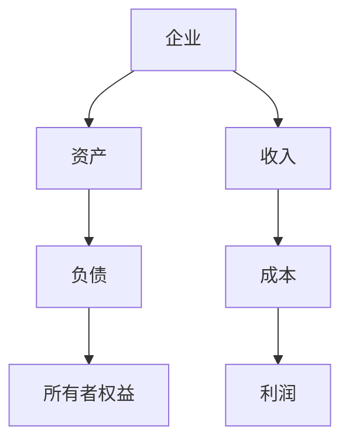
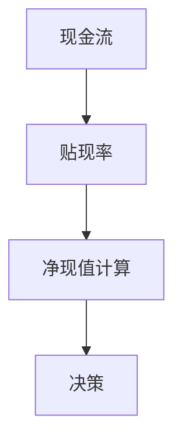
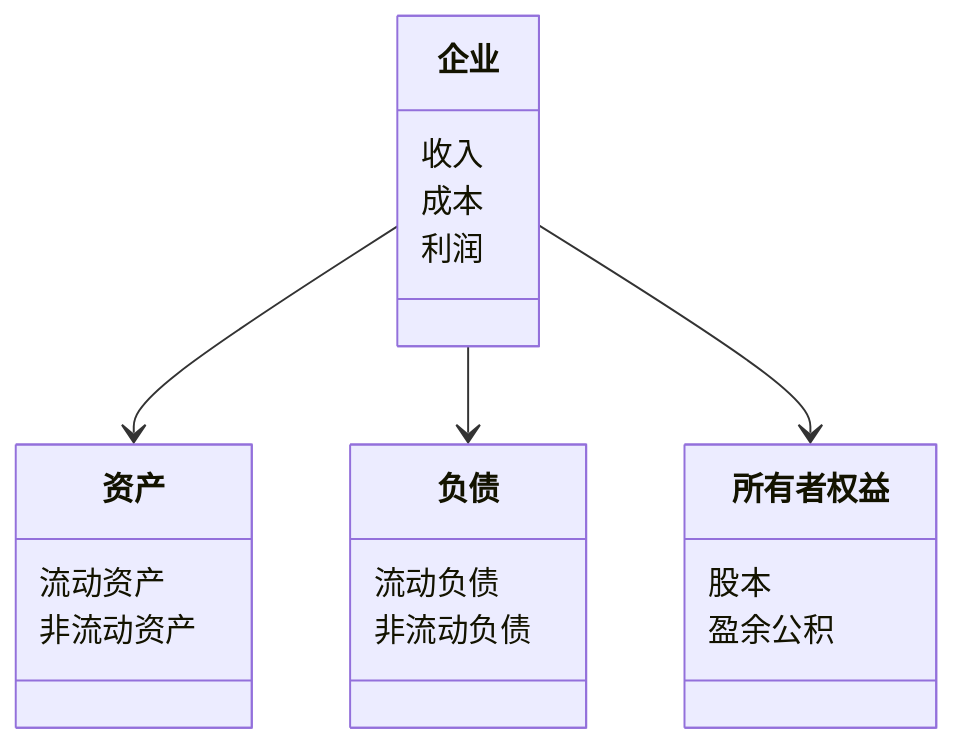
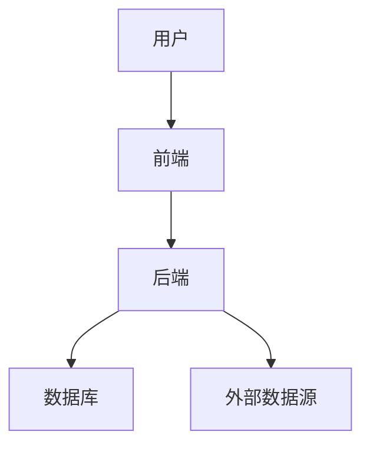
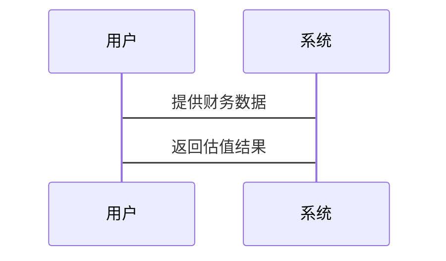

                 


# 企业估值中的常见误区及解决方案

> **关键词**: 企业估值，误区，解决方案，财务分析，投资决策

> **摘要**: 企业估值是投资决策中的关键环节，但常常伴随着多种误区。本文系统分析了企业在估值过程中常见的误区，并提出了相应的解决方案，结合实际案例和数学模型，帮助读者更好地理解和掌握企业估值的核心要点。

---

## 第1章: 企业估值背景与核心概念

### 1.1 企业估值的基本概念

#### 1.1.1 什么是企业估值
企业估值是指对企业整体价值的评估，通常用于投资决策、并购交易、融资等场景。企业估值的核心在于确定企业的内在价值，即企业在未来现金流的现值。

#### 1.1.2 企业估值的常见方法
- **相对估值法**: 市盈率（P/E）、市净率（P/B）等指标。
- **绝对估值法**: 净现值（NPV）、内部收益率（IRR）等指标。
- **DCF模型**: 现金流折现模型，用于评估企业未来现金流的现值。

#### 1.1.3 企业估值的核心要素
- **现金流**: 企业的未来现金流是估值的基础。
- **贴现率**: 反映资金的时间价值和风险。
- **增长率**: 影响未来现金流的大小。

---

### 1.2 企业估值中的常见误区

#### 1.2.1 误区一：忽略市场波动
市场波动会影响企业的短期表现，但长期估值应基于企业的基本面，而非短期市场波动。

#### 1.2.2 误区二：过度依赖历史数据
历史数据只能反映过去的表现，不能完全预测未来。企业估值应更多关注未来现金流。

#### 1.2.3 误区三：忽视企业基本面
基本面分析是企业估值的核心，包括收入、利润、资产等财务指标。

#### 1.2.4 误区四：盲目追求高增长
高增长可能带来高回报，但也伴随着更高的风险和不确定性。

#### 1.2.5 误区五：忽略行业周期性
行业周期性会影响企业的业绩，估值时需考虑行业所处的周期阶段。

---

### 1.3 企业估值的核心要素与结构

#### 1.3.1 企业估值的核心要素
- **现金流**: 企业的未来现金流。
- **贴现率**: 包括无风险利率和风险溢价。
- **增长率**: 未来现金流的增长速度。

#### 1.3.2 企业估值的结构化模型
企业估值通常分为以下几个步骤：
1. 确定企业的未来现金流。
2. 确定合适的贴现率。
3. 计算现金流的现值。
4. 考虑企业价值的其他因素，如资产价值。

#### 1.3.3 企业估值的边界与外延
企业估值的边界包括企业的财务数据、市场环境、行业竞争等。外延则涉及企业未来的增长潜力。

---

### 1.4 企业估值的关键公式与数学模型

#### 1.4.1 常见企业估值公式
- 净现值（NPV）公式：
$$ NPV = \sum_{t=1}^{n} \frac{CF_t}{(1 + r)^t} $$
其中，\( CF_t \) 是第 \( t \) 年的现金流，\( r \) 是贴现率。

- 内部收益率（IRR）公式：
$$ IRR = r \) 使得 \( \sum_{t=1}^{n} \frac{CF_t}{(1 + r)^t} = 0 $$

- 市盈率（P/E）公式：
$$ P/E = \frac{股票价格}{每股收益} $$

- 市净率（P/B）公式：
$$ P/B = \frac{股票价格}{每股净资产} $$

---

## 第2章: 企业估值的核心概念与联系

### 2.1 核心概念原理

#### 2.1.1 企业价值的定义与计算
企业价值（Enterprise Value）是企业整体价值的度量，包括股权价值和债权价值。

#### 2.1.2 企业估值的逻辑与流程
1. 确定企业的未来现金流。
2. 确定合适的贴现率。
3. 计算现金流的现值。
4. 考虑其他因素，如资产价值。

#### 2.1.3 企业估值的关键变量
- 现金流：企业未来产生的现金流。
- 贴现率：反映资金的时间价值和风险。
- 增长率：未来现金流的增长速度。

---

### 2.2 核心概念属性特征对比表格

| 概念 | 定义 | 特性 | 应用场景 |
|------|------|------|----------|
| NPV  | 净现值 | 时间价值、风险偏好 | 投资决策 |
| IRR  | 内部收益率 | 投资回报率 | 项目评估 |
| P/E  | 市盈率 | 相对估值 | 股票估值 |
| P/B  | 市净率 | 相对估值 | 股票估值 |

---

### 2.3 ER实体关系图架构



---

### 2.4 本章小结

通过本章的分析，我们了解了企业估值的核心概念，包括现金流、贴现率、增长率等，并通过对比表格和ER实体关系图，清晰地展示了各概念之间的联系。

---

## 第3章: 企业估值的算法原理与数学模型

### 3.1 算法原理

#### 3.1.1 净现值（NPV）算法


---

### 3.2 数学模型与公式

#### 3.2.1 净现值公式
$$ NPV = \sum_{t=1}^{n} \frac{CF_t}{(1 + r)^t} $$

#### 3.2.2 内部收益率公式
$$ IRR = r \) 使得 \( \sum_{t=1}^{n} \frac{CF_t}{(1 + r)^t} = 0 $$

---

## 第4章: 系统分析与架构设计方案

### 4.1 问题场景介绍

#### 4.1.1 问题背景
企业在进行估值时，常常面临数据不完整、市场波动等挑战，导致估值结果不准确。

#### 4.1.2 项目介绍
本章将设计一个企业估值系统，帮助用户克服常见误区，提高估值的准确性。

---

### 4.2 系统功能设计

#### 4.2.1 领域模型


---

### 4.3 系统架构设计



---

### 4.4 系统接口设计

#### 4.4.1 API接口
- **输入**: 用户提供的企业财务数据和市场数据。
- **输出**: 估值结果和相关指标。

---

### 4.5 系统交互设计



---

## 第5章: 项目实战

### 5.1 环境安装

#### 5.1.1 安装Python
```bash
pip install numpy pandas matplotlib
```

---

### 5.2 系统核心实现源代码

#### 5.2.1 计算净现值
```python
import numpy as np

def calculate_npv(cash_flows, discount_rate):
    return np.npv(discount_rate, cash_flows)
```

#### 5.2.2 计算内部收益率
```python
def calculate_irr(cash_flows):
    return np.irr(cash_flows)
```

---

### 5.3 代码应用解读与分析

#### 5.3.1 净现值计算
```python
cash_flows = [-100, 200, 300]
discount_rate = 0.1
npv = calculate_npv(cash_flows, discount_rate)
print("NPV:", npv)
```

#### 5.3.2 内部收益率计算
```python
cash_flows = [-100, 200, 300]
irr = calculate_irr(cash_flows)
print("IRR:", irr)
```

---

### 5.4 实际案例分析

#### 5.4.1 案例背景
某企业预计未来三年的现金流分别为100万元、150万元和200万元，贴现率为10%。

#### 5.4.2 解决方案
计算净现值：
$$ NPV = \frac{100}{(1 + 0.1)^1} + \frac{150}{(1 + 0.1)^2} + \frac{200}{(1 + 0.1)^3} - 初始投资 $$

---

### 5.5 项目小结

通过本章的实战分析，我们学会了如何使用Python进行企业估值，包括净现值和内部收益率的计算。

---

## 第6章: 总结与最佳实践

### 6.1 总结

企业估值是一个复杂的过程，需要综合考虑多种因素。通过识别和避免常见误区，结合数学模型和实际案例，我们可以更准确地进行企业估值。

---

### 6.2 最佳实践 tips

- **数据驱动**: 依赖实际数据，而非主观判断。
- **模型选择**: 根据具体情况选择合适的估值方法。
- **持续学习**: 关注市场变化和行业趋势。

---

### 6.3 注意事项

- **数据准确性**: 确保输入数据的准确性。
- **模型假设**: 明确模型的假设条件。
- **风险提示**: 估值结果仅供参考，实际投资需谨慎。

---

### 6.4 拓展阅读

- 《企业估值实战指南》
- 《财务报表分析与企业估值》

---

**作者：AI天才研究院/AI Genius Institute & 禅与计算机程序设计艺术 /Zen And The Art of Computer Programming**

---

**版权声明**: 本文为原创内容，转载请注明出处。

