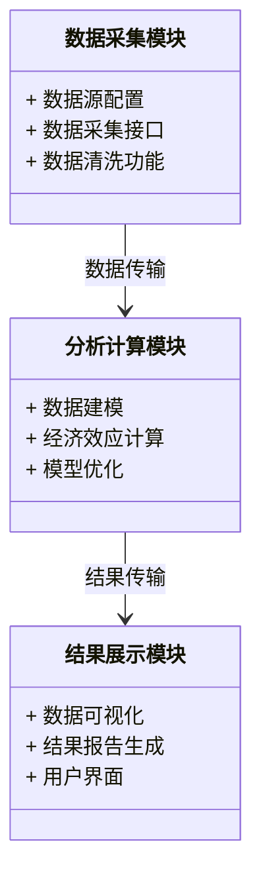
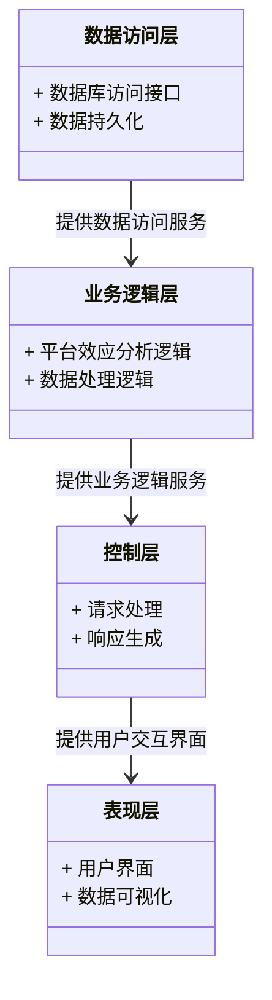
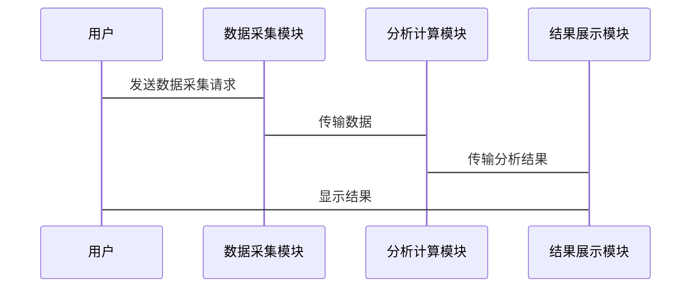

                 

# 第4章: 平台经济效应的系统架构设计

## 4.1 系统架构设计的背景与目标

### 4.1.1 问题背景

在企业估值过程中，平台经济效应的分析需要一个高效的系统架构来支撑。传统的估值方法难以充分考虑平台经济的双边市场、网络效应和动态性。因此，我们需要设计一个专门针对平台经济效应的系统架构，以实现对平台企业价值的准确评估。

### 4.1.2 系统设计目标

- **模块化设计**：将系统划分为数据采集、分析计算、结果展示等模块，便于功能扩展和维护。
- **高可用性**：确保系统在高负载和大规模数据处理时仍能稳定运行。
- **可扩展性**：支持数据量和用户量的动态扩展。
- **实时性**：能够实时处理和分析数据，提供及时的估值结果。

## 4.2 系统功能设计

### 4.2.1 功能模块划分

为了实现平台经济效应的分析，系统功能模块如下：

1. **数据采集模块**：负责从多个数据源（如企业财务数据、市场数据、用户行为数据等）采集和整合数据。
2. **分析计算模块**：对采集到的数据进行清洗、建模和计算，得出平台经济效应的量化指标。
3. **结果展示模块**：以可视化的方式展示分析结果，便于用户理解和决策。

### 4.2.2 领域模型设计

使用 Mermaid 绘制领域模型类图：

## 4.3 系统架构设计

### 4.3.1 分层架构设计

采用分层架构，将系统划分为数据访问层、业务逻辑层、控制层和表现层：

### 4.3.2 关键接口设计

系统主要接口包括：

1. **数据采集接口**：用于从外部数据源获取数据。
2. **分析计算接口**：用于调用分析模型进行计算。
3. **结果展示接口**：用于将计算结果传递给前端展示。

使用 Mermaid 绘制系统交互序列图：

## 4.4 系统性能优化

### 4.4.1 并行处理

为了提高数据处理效率，可以采用并行计算技术，将数据采集、清洗和分析过程分布到多个计算节点上。

### 4.4.2 异构计算

结合 CPU 和 GPU 的计算能力，利用 GPU 的并行计算能力加速大规模数据处理和模型训练。

## 4.5 系统扩展性设计

### 4.5.1 模块化设计

采用模块化设计，每个功能模块独立开发和测试，便于后续的功能扩展和维护。

### 4.5.2 容错设计

在系统架构中引入容错机制，如数据备份、负载均衡和故障容错，确保系统在部分节点故障时仍能正常运行。

## 4.6 本章小结

本章详细介绍了平台经济效应分析系统的架构设计，包括系统功能模块划分、分层架构设计、关键接口设计和系统性能优化等方面。通过合理的系统架构设计，能够有效支持平台经济效应的分析，为企业估值提供有力的技术支持。

---

