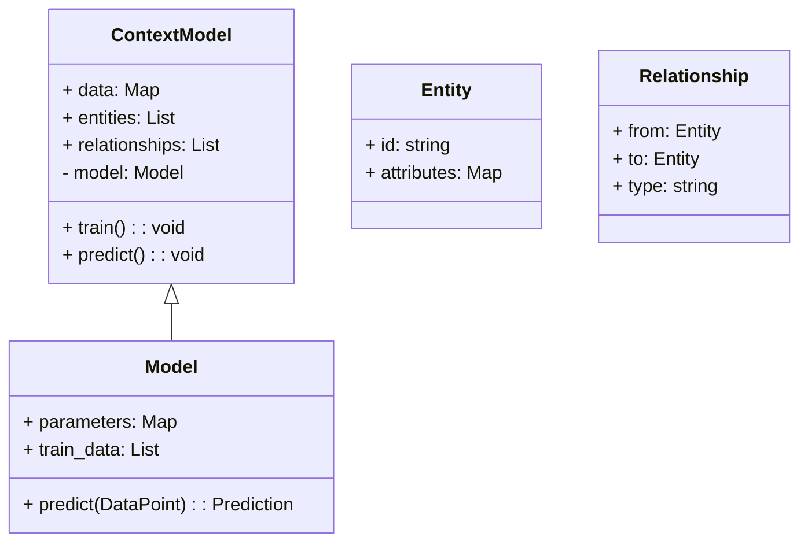
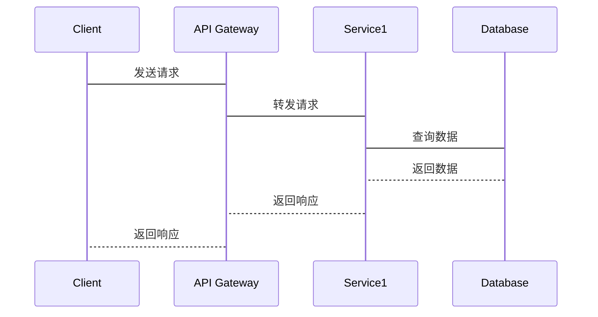

                 


# 企业估值中的情境感知技术应用评估

> 关键词：企业估值、情境感知技术、人工智能、机器学习、数据融合

> 摘要：本文详细探讨了情境感知技术在企业估值中的应用，从基本原理到算法实现，再到系统架构和项目实战，全面分析了情境感知技术如何提升企业估值的准确性与效率。通过实际案例和代码实现，本文为读者提供了从理论到实践的完整指导。

---

## 第1章: 情境感知技术与企业估值概述

### 1.1 情境感知技术的基本概念

#### 1.1.1 情境感知技术的定义
情境感知技术（Situation Awareness Technology）是一种通过收集、处理和理解多源数据，以提供关于当前情境的全面认知的技术。它结合了传感器数据、历史记录和实时信息，帮助用户更好地理解和决策。

#### 1.1.2 情境感知技术的核心特征
- **实时性**：能够快速处理和响应实时数据。
- **多源性**：整合来自不同来源的数据。
- **情境理解**：通过分析数据生成对情境的深度理解。
- **可解释性**：结果需具备清晰的解释路径。

#### 1.1.3 情境感知技术在企业估值中的应用潜力
企业估值需要考虑市场环境、企业基本面、行业趋势等多种因素。情境感知技术能够整合这些多维度信息，提供更精准的估值结果。

### 1.2 企业估值的基本原理

#### 1.2.1 企业估值的定义与方法
企业估值是对企业价值的评估，常用的方法包括DCF模型、市盈率法、市净率法等。这些方法依赖于对企业财务数据、市场环境和行业趋势的分析。

#### 1.2.2 传统企业估值模型的局限性
传统估值模型往往忽略了动态变化的市场环境和企业内外部的复杂因素，导致估值结果可能存在偏差。

#### 1.2.3 情境感知技术如何提升企业估值的准确性
通过整合实时市场数据、行业趋势和企业内部信息，情境感知技术能够提供更全面的情境理解，从而提升估值的准确性。

### 1.3 本章小结
本章介绍了情境感知技术的基本概念及其在企业估值中的潜力，分析了传统估值模型的局限性，并提出了情境感知技术如何提升估值的准确性的思路。

---

## 第2章: 情境感知技术的核心概念与联系

### 2.1 情境感知技术的原理

#### 2.1.1 情境建模的基本原理
情境建模是通过构建数学模型来描述和分析情境。模型需要考虑数据的多样性、实时性和动态变化。

#### 2.1.2 数据融合与情境分析
数据融合是将多源数据整合的过程，情境分析则是通过数据融合结果来理解情境的过程。

#### 2.1.3 情境理解与决策支持
情境理解是基于数据融合和情境分析的结果，生成对情境的深度理解。决策支持则是基于情境理解提供决策建议。

### 2.2 情境感知技术的核心要素

#### 2.2.1 数据源的多样性
情境感知技术需要整合来自不同来源的数据，如市场数据、企业财务数据、行业趋势等。

#### 2.2.2 模型的可解释性
模型需要具备清晰的解释路径，以便用户能够理解结果背后的原因。

#### 2.2.3 算法的实时性与准确性
算法需要能够实时处理数据，并保证结果的准确性。

### 2.3 情境感知技术与企业估值的关系

#### 2.3.1 情境感知技术在企业估值中的应用场景
- **市场环境分析**：分析市场趋势和竞争对手情况。
- **企业基本面评估**：整合企业财务数据和行业趋势。
- **风险评估**：识别潜在风险并提供应对策略。

#### 2.3.2 情境感知技术与企业估值模型的结合
通过整合情境感知技术，企业估值模型能够更好地捕捉市场变化和企业内部动态，提升估值的准确性。

#### 2.3.3 情境感知技术对企业估值结果的影响
情境感知技术能够提供更全面的情境理解，从而影响估值结果的准确性和可靠性。

### 2.4 本章小结
本章详细介绍了情境感知技术的原理和核心要素，并分析了其与企业估值的关系，强调了情境感知技术在提升企业估值准确性中的重要作用。

---

## 第3章: 情境感知技术的算法原理

### 3.1 情境建模的算法选择

#### 3.1.1 基于深度学习的模型
- **神经网络**：通过多层神经网络提取数据特征。
- **循环神经网络**：适用于处理时间序列数据。
- **卷积神经网络**：适用于处理图像和文本数据。

#### 3.1.2 基于传统机器学习的模型
- **支持向量机（SVM）**：适用于分类和回归任务。
- **随机森林**：适用于特征重要性分析和分类任务。

#### 3.1.3 混合模型的优势与挑战
- **优势**：结合不同算法的优势，提升模型的泛化能力。
- **挑战**：模型复杂度增加，训练时间和计算资源需求上升。

### 3.2 情境分析的特征提取

#### 3.2.1 特征提取的基本原理
特征提取是将原始数据转换为具有代表性的特征向量的过程。

#### 3.2.2 基于情境的特征表示方法
- **词袋模型**：将文本数据表示为词袋。
- **词嵌入**：通过训练生成词向量，如Word2Vec、GloVe。
- **图结构表示**：将数据表示为图结构，利用图的节点和边进行特征提取。

#### 3.2.3 特征选择的优化策略
- **主成分分析（PCA）**：通过降维减少特征数量。
- **Lasso回归**：通过正则化方法进行特征选择。

### 3.3 情境理解的相似度计算

#### 3.3.1 相似度计算的数学模型
- **余弦相似度**：衡量两个向量之间的夹角。
- **欧氏距离**：衡量两个点之间的距离。

#### 3.3.2 基于余弦相似度的计算
$$ \text{余弦相似度} = \frac{\vec{A} \cdot \vec{B}}{|\vec{A}| |\vec{B}|} $$

#### 3.3.3 基于欧氏距离的计算
$$ \text{欧氏距离} = \sqrt{\sum_{i=1}^{n} (A_i - B_i)^2} $$

### 3.4 情境感知技术的分类与实现

#### 3.4.1 分类算法的选择
- **K-近邻算法（KNN）**：适用于分类和回归任务。
- **决策树**：适用于特征重要性分析和分类任务。

#### 3.4.2 分类模型的训练与优化
- **训练过程**：通过数据集训练模型参数。
- **优化策略**：通过交叉验证和网格搜索优化模型参数。

#### 3.4.3 分类结果的评估与改进
- **评估指标**：准确率、召回率、F1分数。
- **改进策略**：调整模型参数、尝试不同算法。

### 3.5 本章小结
本章详细介绍了情境感知技术的算法选择和实现过程，包括特征提取、相似度计算和分类模型的训练与优化。

---

## 第4章: 情境感知技术的数学模型与公式

### 4.1 情境建模的数学基础

#### 4.1.1 线性回归模型
线性回归模型用于预测目标变量与特征变量之间的线性关系。
$$ y = \beta_0 + \beta_1 x_1 + \beta_2 x_2 + \dots + \beta_n x_n $$

#### 4.1.2 支持向量机（SVM）模型
SVM模型用于分类和回归任务，通过最大化分类间隔实现最优解。
$$ \text{目标函数} = \min_{\theta, \alpha} \frac{1}{2} \|\theta\|^2 + \sum_{i=1}^{n} \alpha_i (y_i - \text{sign}(\theta^T x_i + b)) $$

#### 4.1.3 随机森林模型
随机森林模型通过集成多个决策树提升模型的准确性和鲁棒性。

### 4.2 情境分析的特征表示

#### 4.2.1 基于向量空间模型的表示
将文本数据表示为向量空间中的点。
$$ \text{向量表示} = (x_1, x_2, \dots, x_n) $$

#### 4.2.2 基于词嵌入的表示方法
通过训练生成词向量，如Word2Vec模型。
$$ \text{词向量} = v_{\text{word}} $$

#### 4.2.3 基于图结构的表示方法
将数据表示为图结构，利用图的节点和边进行特征提取。
$$ \text{图结构} = G = (V, E) $$

### 4.3 情境理解的相似度计算公式

#### 4.3.1 余弦相似度公式
$$ \text{余弦相似度} = \frac{\vec{A} \cdot \vec{B}}{|\vec{A}| |\vec{B}|} $$

#### 4.3.2 欧氏距离公式
$$ \text{欧氏距离} = \sqrt{\sum_{i=1}^{n} (A_i - B_i)^2} $$

### 4.4 本章小结
本章详细介绍了情境感知技术的数学模型与公式，包括线性回归、SVM和随机森林模型，以及特征表示和相似度计算公式。

---

## 第5章: 情境感知技术的系统架构与实现

### 5.1 系统功能设计

#### 5.1.1 领域模型（Mermaid 类图）


#### 5.1.2 系统架构设计（Mermaid 架构图）
```mermaid
archiecture
    client --> API Gateway
    API Gateway --> Load Balancer
    Load Balancer --> Service1
    Load Balancer --> Service2
    Service1 --> Database
    Service2 --> Database
```

#### 5.1.3 系统接口设计
- **输入接口**：接收市场数据、企业财务数据和行业趋势。
- **输出接口**：提供估值结果、风险评估和决策建议。

#### 5.1.4 系统交互流程（Mermaid 序列图）


### 5.2 本章小结
本章详细介绍了情境感知技术的系统架构与实现，包括领域模型、系统架构设计和系统交互流程。

---

## 第6章: 情境感知技术的项目实战

### 6.1 环境安装

#### 6.1.1 安装Python
```bash
python --version
pip install --upgrade pip
```

#### 6.1.2 安装依赖库
```bash
pip install numpy
pip install scikit-learn
pip install matplotlib
pip install word2vec
```

### 6.2 系统核心实现源代码

#### 6.2.1 特征提取代码
```python
import numpy as np
from sklearn.feature_extraction.text import TfidfVectorizer

vectorizer = TfidfVectorizer()
X = vectorizer.fit_transform(text_data)
```

#### 6.2.2 相似度计算代码
```python
from sklearn.metrics.pairwise import cosine_similarity

cosine_sim = cosine_similarity(X, X)
```

#### 6.2.3 分类模型训练代码
```python
from sklearn.model_selection import train_test_split
from sklearn.svm import SVC

X_train, X_test, y_train, y_test = train_test_split(X, y, test_size=0.2)
model = SVC()
model.fit(X_train, y_train)
```

#### 6.2.4 模型评估代码
```python
from sklearn.metrics import accuracy_score

y_pred = model.predict(X_test)
print("Accuracy:", accuracy_score(y_test, y_pred))
```

### 6.3 代码应用解读与分析
- **特征提取**：使用TfidfVectorizer提取文本特征，生成TF-IDF向量。
- **相似度计算**：通过cosine_similarity计算文本之间的余弦相似度。
- **分类模型训练**：使用SVC训练分类模型，预测结果并评估模型准确性。

### 6.4 实际案例分析
以某企业为例，通过代码实现对企业估值的情境感知分析，展示模型在实际应用中的表现。

### 6.5 项目小结
本章通过实际案例展示了情境感知技术在企业估值中的应用，详细解读了代码实现和模型评估过程。

---

## 第7章: 情境感知技术的最佳实践与总结

### 7.1 最佳实践 tips

#### 7.1.1 数据质量的重要性
确保数据的准确性和完整性，避免噪声数据对模型的影响。

#### 7.1.2 模型选择的策略
根据具体问题选择合适的算法，避免盲目使用复杂模型。

#### 7.1.3 模型优化的技巧
通过交叉验证和网格搜索优化模型参数，提升模型的泛化能力。

### 7.2 小结
本章总结了情境感知技术在企业估值中的应用经验，提出了最佳实践建议，为读者提供了从理论到实践的完整指导。

### 7.3 注意事项

#### 7.3.1 数据隐私与安全
在处理企业数据时，需注意数据隐私和安全问题，避免数据泄露。

#### 7.3.2 模型的可解释性
确保模型具备良好的可解释性，便于用户理解和信任。

#### 7.3.3 模型的实时性
在动态变化的市场环境中，需保证模型的实时性，及时更新模型参数。

### 7.4 拓展阅读

#### 7.4.1 情境感知技术的最新研究
阅读相关学术论文，了解情境感知技术的最新进展。

#### 7.4.2 企业估值的高级方法
学习更高级的企业估值方法，结合情境感知技术提升估值的准确性。

---

## 作者：AI天才研究院/AI Genius Institute & 禅与计算机程序设计艺术 /Zen And The Art of Computer Programming

---

### 总结
本文从企业估值的基本原理出发，详细探讨了情境感知技术的应用，通过算法原理、系统架构和项目实战的逐步分析，为读者提供了从理论到实践的完整指导。通过实际案例和代码实现，本文展示了情境感知技术在企业估值中的潜力和优势，为相关领域的研究和实践提供了有益的参考。

