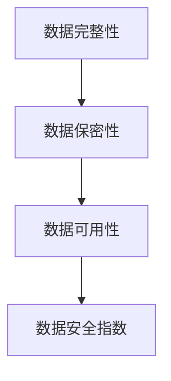
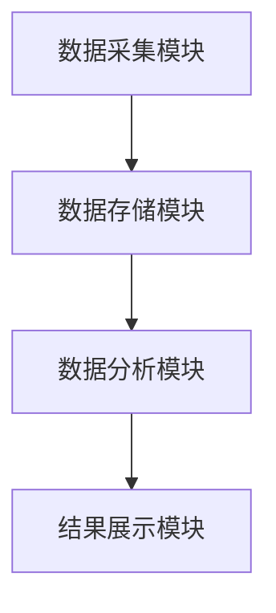
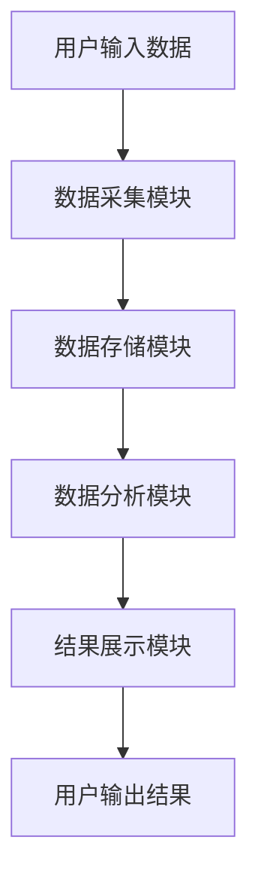

                 


# 企业估值中的数据安全能力评估

## 关键词：数据安全，企业估值，数据资产，数据安全评估，数据隐私保护

## 摘要：  
随着数字化转型的加速，数据已成为企业最重要的资产之一。数据安全能力评估不仅是企业风险管理的关键环节，也是影响企业估值的重要因素。本文从数据安全能力评估的背景与概念出发，详细探讨了数据安全能力评估的核心指标、评估模型、算法原理及系统架构，并通过实际案例分析，展示了如何将数据安全能力评估与企业估值相结合。本文还提出了数据安全能力评估在企业估值中的最佳实践和未来发展趋势，为企业提供了一套完整的数据安全能力评估框架。

---

## 第1章: 数据安全能力评估与企业估值概述

### 1.1 数据安全能力评估的背景与意义

#### 1.1.1 数据安全对企业估值的影响  
在数字经济时代，数据已成为企业的核心资产。数据的安全性直接影响企业的声誉、法律责任和财务表现。数据泄露或安全漏洞可能导致企业估值大幅下降，甚至引发退市或破产风险。因此，数据安全能力评估已成为企业估值的重要组成部分。

#### 1.1.2 数据安全能力评估的定义与目标  
数据安全能力评估是指通过量化和分析企业的数据安全能力，评估其在抵御数据泄露、未经授权访问、数据篡改等方面的能力。其目标是为企业提供数据安全能力的全面评估，并为企业的风险管理、投资决策和估值提供参考依据。

#### 1.1.3 数据安全能力评估的必要性与重要性  
随着数据泄露事件的频发，企业面临的数据安全风险不断增加。数据安全能力评估不仅是企业合规性的要求，也是提升企业数据安全管理水平的重要手段。通过数据安全能力评估，企业可以发现自身数据安全的薄弱环节，并采取针对性措施，从而提升数据安全能力，增强市场竞争力。

---

### 1.2 数据安全能力评估的核心概念

#### 1.2.1 数据安全能力的定义与特征  
数据安全能力是指企业在保护数据完整性、保密性和可用性方面的能力。其特征包括全面性、动态性、技术性等。企业需要从技术、管理和组织等多个维度评估其数据安全能力。

#### 1.2.2 数据安全能力评估的指标体系  
数据安全能力评估的指标体系包括以下几类：  
- **技术维度**：数据加密能力、访问控制能力、安全检测能力等。  
- **管理维度**：数据安全政策、安全管理制度、人员培训等。  
- **组织维度**：数据安全团队的组织架构、职责分工等。  

#### 1.2.3 数据安全能力评估的边界与外延  
数据安全能力评估的边界包括企业内部数据和外部数据，但不涉及企业的财务数据和核心业务数据。其外延则包括数据隐私保护、数据备份与恢复、数据生命周期管理等方面。

---

### 1.3 数据安全能力评估与企业估值的关系

#### 1.3.1 数据安全能力对企业价值的影响  
数据安全能力是企业核心竞争力的重要组成部分。强大的数据安全能力可以提升企业的市场信誉，降低风险敞口，从而提高企业的估值。

#### 1.3.2 数据安全能力评估在企业估值中的应用  
在企业估值过程中，数据安全能力评估可以作为调整企业价值的重要依据。通过评估企业的数据安全能力，投资者可以更全面地评估企业的风险和潜在收益。

#### 1.3.3 数据安全能力评估与企业风险管理  
数据安全能力评估是企业风险管理的重要组成部分。通过评估数据安全能力，企业可以识别潜在风险，制定有效的风险管理策略。

---

### 1.4 数据安全能力评估的现状与挑战

#### 1.4.1 当前数据安全能力评估的主要方法  
目前，数据安全能力评估的主要方法包括：  
1. 基于ISO 27001等国际标准的评估方法。  
2. 基于行业最佳实践的评估方法。  
3. 基于数据安全指数模型的评估方法。  

#### 1.4.2 数据安全能力评估中的主要挑战  
数据安全能力评估的主要挑战包括：  
1. 数据安全能力的量化难度较大。  
2. 数据安全能力评估指标的标准化不足。  
3. 数据安全能力评估的动态性与企业数据环境的快速变化不匹配。  

#### 1.4.3 数据安全能力评估的未来发展趋势  
数据安全能力评估的未来发展趋势包括：  
1. 数据安全能力评估的自动化与智能化。  
2. 数据安全能力评估的标准化与国际化。  
3. 数据安全能力评估的动态化与实时化。  

---

## 第2章: 数据安全能力评估的核心概念与联系

### 2.1 数据安全能力评估的指标体系

#### 2.1.1 数据完整性评估指标  
数据完整性评估指标包括数据一致性、数据准确性、数据冗余性等。  

#### 2.1.2 数据保密性评估指标  
数据保密性评估指标包括数据访问控制、数据加密、数据匿名化等。  

#### 2.1.3 数据可用性评估指标  
数据可用性评估指标包括数据备份与恢复能力、数据访问速度、数据系统稳定性等。  

---

### 2.2 数据安全能力评估的模型与方法

#### 2.2.1 数据安全能力评估模型的构建  
数据安全能力评估模型的构建需要考虑以下因素：  
- 数据安全能力的评估维度。  
- 数据安全能力的评估指标。  
- 数据安全能力的评估权重。  

#### 2.2.2 数据安全能力评估的主要方法  
数据安全能力评估的主要方法包括：  
1. 基于指标体系的评估方法。  
2. 基于数据安全指数模型的评估方法。  
3. 基于机器学习的评估方法。  

#### 2.2.3 数据安全能力评估模型的优劣势对比  
数据安全能力评估模型的优劣势对比：  
- 基于指标体系的评估方法：简单易懂，但缺乏动态性。  
- 基于数据安全指数模型的评估方法：动态性强，但复杂性较高。  
- 基于机器学习的评估方法：精度高，但需要大量数据支持。  

---

### 2.3 数据安全能力评估与传统企业估值方法的对比

#### 2.3.1 传统企业估值方法的概述  
传统企业估值方法主要包括资产基础法、收益法和市场法。  

#### 2.3.2 数据安全能力评估与传统估值方法的异同  
数据安全能力评估与传统估值方法的异同：  
- 相同点：都需要考虑企业的风险因素。  
- 不同点：数据安全能力评估更注重企业的数据资产保护能力。  

#### 2.3.3 数据安全能力评估对传统估值方法的补充作用  
数据安全能力评估可以为传统估值方法提供额外的风险评估信息，帮助企业更全面地评估自身的市场价值。

---

## 第3章: 数据安全能力评估的算法原理与实现

### 3.1 数据安全指数模型的构建

#### 3.1.1 数据安全指数模型的定义  
数据安全指数模型是一种基于数据安全能力指标的综合评估模型。  

#### 3.1.2 数据安全指数模型的流程图  


#### 3.1.3 数据安全指数模型的数学公式  
$$ DSI = \sum_{i=1}^{n} w_i \cdot s_i $$
其中，$w_i$ 表示第 $i$ 个指标的权重，$s_i$ 表示第 $i$ 个指标的评分。

---

### 3.2 数据安全能力评估的实现步骤

#### 3.2.1 数据采集与处理  
数据采集与处理包括数据清洗、数据转换和数据存储。  

#### 3.2.2 数据分析与建模  
数据分析与建模包括数据预处理、特征提取和模型训练。  

#### 3.2.3 模型验证与优化  
模型验证与优化包括模型验证、参数调整和模型优化。  

---

### 3.3 数据安全能力评估的Python实现

#### 3.3.1 数据安全指数模型的代码实现  
```python
def data_security_index(scores, weights):
    return sum(score * weight for score, weight in zip(scores, weights))

# 示例数据
scores = [0.8, 0.7, 0.9]
weights = [0.3, 0.4, 0.3]

# 计算数据安全指数
dsi = data_security_index(scores, weights)
print(f"数据安全指数：{dsi}")
```

#### 3.3.2 数据安全能力评估的代码实现  
```python
import pandas as pd
from sklearn.metrics import classification_report

# 示例数据加载
data = pd.read_csv("data.csv")

# 数据预处理
data_processed = data.dropna()

# 特征提取
X = data_processed.drop(columns=["label"])
y = data_processed["label"]

# 模型训练
from sklearn.tree import DecisionTreeClassifier
model = DecisionTreeClassifier()
model.fit(X, y)

# 模型验证
y_pred = model.predict(X)
print(classification_report(y, y_pred))
```

---

## 第4章: 数据安全能力评估的系统分析与架构设计

### 4.1 系统功能设计

#### 4.1.1 数据采集模块  
数据采集模块负责采集企业的数据安全相关数据。  

#### 4.1.2 数据分析模块  
数据分析模块负责对数据进行分析和建模。  

#### 4.1.3 结果展示模块  
结果展示模块负责将评估结果以可视化的方式展示给用户。  

---

### 4.2 系统架构设计

#### 4.2.1 系统架构图  


#### 4.2.2 系统接口设计  
系统接口设计包括数据接口和用户接口。  

---

### 4.3 系统交互设计

#### 4.3.1 系统交互流程图  


---

## 第5章: 数据安全能力评估的项目实战

### 5.1 项目背景与目标

#### 5.1.1 项目背景  
本项目旨在通过数据安全能力评估帮助企业提升数据安全管理水平，降低数据安全风险。  

#### 5.1.2 项目目标  
本项目的目標是构建一个数据安全能力评估系统，为企业提供数据安全能力评估的工具和方法。  

---

### 5.2 项目实施步骤

#### 5.2.1 数据采集与处理  
数据采集与处理包括数据清洗、数据转换和数据存储。  

#### 5.2.2 数据分析与建模  
数据分析与建模包括数据预处理、特征提取和模型训练。  

#### 5.2.3 模型验证与优化  
模型验证与优化包括模型验证、参数调整和模型优化。  

---

### 5.3 项目成果与总结

#### 5.3.1 项目成果  
本项目构建了一个数据安全能力评估系统，能够帮助企业量化其数据安全能力，并提供针对性的改进建议。  

#### 5.3.2 项目总结  
通过本项目的实施，我们验证了数据安全能力评估方法的有效性，并为企业的数据安全管理提供了新的思路。

---

## 第6章: 数据安全能力评估的案例分析

### 6.1 案例背景与介绍

#### 6.1.1 案例背景  
某互联网企业因数据泄露事件导致企业估值大幅下降。为了提升数据安全能力，该企业决定实施数据安全能力评估。  

---

### 6.2 数据安全能力评估实施过程

#### 6.2.1 数据采集与处理  
数据采集与处理包括数据清洗、数据转换和数据存储。  

#### 6.2.2 数据分析与建模  
数据分析与建模包括数据预处理、特征提取和模型训练。  

#### 6.2.3 模型验证与优化  
模型验证与优化包括模型验证、参数调整和模型优化。  

---

### 6.3 评估结果与分析

#### 6.3.1 评估结果  
通过数据安全能力评估，该企业发现其数据完整性能力较弱，数据保密性能力较强。  

#### 6.3.2 改进建议  
针对评估结果，建议该企业加强数据完整性管理，提升数据可用性能力。  

---

## 第7章: 数据安全能力评估的总结与展望

### 7.1 总结

#### 7.1.1 数据安全能力评估的重要性和必要性  
数据安全能力评估是企业风险管理的重要组成部分，也是提升企业估值的重要手段。  

#### 7.1.2 数据安全能力评估的实施步骤与方法  
数据安全能力评估的实施步骤包括数据采集、数据分析、模型构建和结果展示。  

---

### 7.2 未来展望

#### 7.2.1 数据安全能力评估的未来发展趋势  
数据安全能力评估的未来发展趋势包括自动化、智能化和动态化。  

#### 7.2.2 数据安全能力评估的挑战与机遇  
数据安全能力评估的挑战包括数据安全能力的量化难度大、数据安全能力评估指标的标准化不足等。而机遇则在于数据安全能力评估的市场需求不断增加，技术手段日益先进。

---

## 作者：AI天才研究院/AI Genius Institute & 禅与计算机程序设计艺术 /Zen And The Art of Computer Programming

---

**本文通过详细分析数据安全能力评估的背景、核心概念、算法原理、系统架构和实际案例，为企业提供了如何在数据安全能力评估中提升企业估值的思路和方法。希望本文能够为企业在数据安全能力评估领域提供有价值的参考和指导。**

