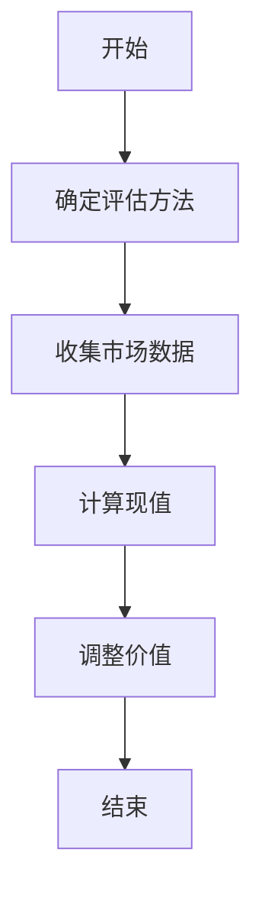
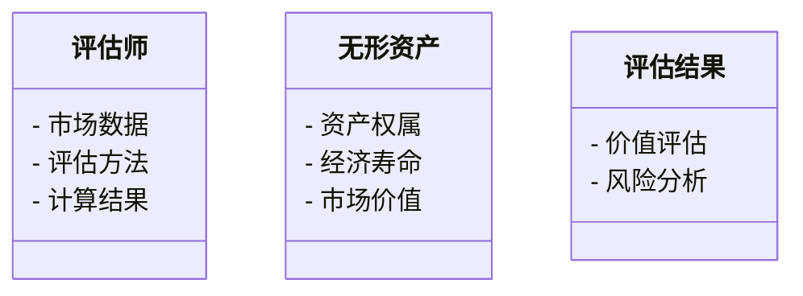

                 


# 企业估值中的无形资产评估

**关键词**：企业估值、无形资产评估、资产评估方法、经济寿命、权属关系、市场价值、评估模型

**摘要**：  
本文系统地探讨了企业估值中无形资产评估的重要性及其核心方法。通过分析无形资产的定义、分类及其在企业价值中的作用，结合多种评估方法（如市场法、收益法和成本法），并借助ER实体关系图和数学模型，本文深入剖析了无形资产评估的算法原理及其实现。通过项目实战案例，展示了如何将这些理论应用于实际企业估值中，为读者提供了一套完整且实用的无形资产评估体系。

---

# 第一部分：企业估值中的无形资产评估基础

## 第1章：无形资产评估的基本概念

### 1.1 无形资产的定义与分类

#### 1.1.1 无形资产的定义  
无形资产是指企业拥有或控制的，没有实物形态但能够为企业带来经济利益的资源。它们通常包括专利权、商标权、版权、商誉、特许经营权等。

#### 1.1.2 无形资产的分类  
无形资产可以分为以下几类：  
- **知识产权类**：专利权、商标权、版权等。  
- **合同权益类**：特许经营权、长期合同权益等。  
- **商誉类**：企业整体价值超过可识别净资产的部分。  
- **技术类**：专有技术、工艺流程等。  

#### 1.1.3 无形资产的特点  
- **非实体性**：无形资产没有实物形态。  
- **价值波动性**：其价值受市场环境、技术发展等因素影响较大。  
- **依附性**：通常依附于企业或特定资产。  
- **可转让性**：可以通过出售或授权使用进行转让。  

### 1.2 无形资产评估的背景与意义

#### 1.2.1 无形资产评估的背景  
随着经济全球化和技术进步，无形资产在企业价值中的占比越来越高。例如，科技型企业的核心竞争力往往来源于专利和技术，而非传统制造业的固定资产。

#### 1.2.2 无形资产评估的重要性  
- **企业融资**：金融机构评估企业价值时，无形资产是重要考量因素。  
- **并购交易**：企业并购中，无形资产的价值直接影响交易价格。  
- **财务报告**：准确评估无形资产价值，有助于提高财务报表的准确性。  

#### 1.2.3 无形资产评估的边界与外延  
- **边界**：仅限于企业拥有或控制的无形资产，不包括客户关系或人力资源等难以量化的资源。  
- **外延**：包括无形资产的未来收益能力、市场竞争力等。  

### 1.3 无形资产评估的核心要素

#### 1.3.1 无形资产的权属关系  
- **所有权**：资产的所有者是谁？  
- **使用权**：资产的使用权是否受限？  
- **转让权**：资产是否可以自由转让？  

#### 1.3.2 无形资产的经济寿命  
- **寿命长短**：专利权的寿命通常为20年，而版权的寿命可能更长。  
- **更新速度**：技术类无形资产可能因技术进步而迅速贬值。  

#### 1.3.3 无形资产的市场价值  
- **市场需求**：资产的市场需求情况如何？  
- **替代品**：是否存在替代品影响其价值？  
- **交易案例**：是否有类似的交易案例可供参考？  

## 第2章：无形资产评估的核心概念

### 2.1 无形资产评估的核心概念

#### 2.1.1 无形资产评估的原理  
无形资产评估的核心在于将无形资产的未来收益折现为现值。  
$$DCF = \frac{CF}{(r - g)}$$  
其中，CF为未来现金流，r为折现率，g为增长率。  

#### 2.1.2 无形资产评估的关键属性  
- **可识别性**：资产是否可以单独识别？  
- **可计量性**：资产的价值是否可以量化？  
- **可持续性**：资产的收益能力是否长期可持续？  

#### 2.1.3 无形资产评估的流程  
1. 确定资产类型。  
2. 收集市场数据。  
3. 选择评估方法。  
4. 计算并调整价值。  
5. 出具评估报告。  

### 2.2 无形资产评估方法对比

#### 2.2.1 市场法  
- **定义**：通过比较类似资产的市场交易价格，确定评估对象的价值。  
- **优缺点**：  
  - 优点：数据可靠，结果直观。  
  - 缺点：依赖于可比交易案例的可获得性。  

#### 2.2.2 收益法  
- **定义**：基于资产未来产生的收益，折现计算其现值。  
- **优缺点**：  
  - 优点：适用于收益稳定的资产。  
  - 缺点：需要准确预测未来现金流。  

#### 2.2.3 成本法  
- **定义**：基于资产的重置成本，计算其价值。  
- **优缺点**：  
  - 优点：适用于技术成熟、成本透明的资产。  
  - 缺点：难以反映资产的市场价值。  

### 2.3 无形资产评估的ER实体关系图

```mermaid
er
actor: 评估师
|------|
| 评估项目 |
|------|
| 无形资产 |
|------|
| 评估结果 |
```

---

# 第二部分：无形资产评估的算法原理

## 第3章：无形资产评估的数学模型

### 3.1 无形资产评估的数学模型概述

#### 3.1.1 贴现现金流模型  
$$DCF = \frac{CF}{(r - g)}$$  
其中，CF为未来现金流，r为折现率，g为增长率。  

#### 3.1.2 加权平均法  
$$WAM = \sum (w_i \times t_i)$$  
其中，$w_i$为权重，$t_i$为时间点。  

#### 3.1.3 市盈率法  
$$P/E = \frac{P}{E}$$  
其中，P为股价，E为每股收益。  

### 3.2 算法原理的详细讲解

#### 3.2.1 贴现现金流模型的公式  
$$DCF = \frac{CF}{(r - g)}$$  
- **解释**：将未来现金流折现为现值，计算其当前价值。  
- **示例**：假设未来现金流为100万元，折现率为10%，增长率为5%，则DCF = 100 / (0.10 - 0.05) = 2000万元。  

#### 3.2.2 加权平均法的公式  
$$WAM = \sum (w_i \times t_i)$$  
- **解释**：根据各因素的权重和时间点计算加权平均值。  
- **示例**：假设权重为0.5和0.5，时间点为2年和3年，则WAM = 0.5×2 + 0.5×3 = 2.5年。  

#### 3.2.3 市盈率法的公式  
$$P/E = \frac{P}{E}$$  
- **解释**：通过比较市盈率和行业平均市盈率，估算资产价值。  
- **示例**：假设行业平均市盈率为15，企业每股收益为2元，则P = 15×2 = 30元。  

### 3.3 算法原理的mermaid流程图



---

## 第4章：项目实战——无形资产评估系统设计

### 4.1 系统功能设计

#### 4.1.1 领域模型（mermaid类图）



#### 4.1.2 系统架构设计（mermaid架构图）


### 4.2 系统接口设计

#### 4.2.1 输入接口  
- **输入数据**：资产类型、市场数据、权属信息等。  
#### 4.2.2 输出接口  
- **输出结果**：评估价值、风险分析等。  

### 4.3 系统交互流程（mermaid序列图）

```mermaid
sequenceDiagram
actor 评估师 -> server: 提交评估请求
server -> database: 查询市场数据
database -> server: 返回市场数据
server -> calculator: 计算现值
calculator -> server: 返回计算结果
server -> actor: 输出评估报告
```

---

## 第5章：项目实战——无形资产评估案例分析

### 5.1 项目介绍  
以一家科技公司为例，评估其专利资产的价值。  

### 5.2 核心代码实现

#### 5.2.1 环境安装  
- **Python**：安装Python 3.x。  
- **库**：安装`numpy`和`pandas`。  

#### 5.2.2 核心代码实现

```python
import numpy as np
import pandas as pd

def calculate_dcf(cash_flows, discount_rate, growth_rate):
    return cash_flows / (discount_rate - growth_rate)

# 示例数据
cash_flows = 1000000  # 未来现金流（万元）
discount_rate = 0.10   # 折现率
growth_rate = 0.05     # 增长率

# 计算DCF值
dcf_value = calculate_dcf(cash_flows, discount_rate, growth_rate)
print(f"DCF Value: {dcf_value}")
```

#### 5.2.3 代码解读与分析  
- **函数**：`calculate_dcf`计算DCF值。  
- **输入**：未来现金流、折现率和增长率。  
- **输出**：DCF值。  

### 5.3 案例分析  
假设某科技公司拥有一项专利，未来现金流为1000万元，折现率为10%，增长率5%。根据DCF模型，其DCF值为2000万元。  

---

# 第三部分：总结与展望

## 第6章：总结与展望

### 6.1 无形资产评估的关键点  
- **权属关系**：明确资产的所有权和使用权。  
- **经济寿命**：评估资产的使用寿命和价值波动。  
- **市场价值**：结合市场数据和行业趋势，准确评估资产价值。  

### 6.2 展望  
随着技术进步和市场变化，无形资产评估将更加复杂。未来，可以结合大数据和人工智能技术，提高评估的准确性和效率。

---

# 作者  
**作者：AI天才研究院/AI Genius Institute & 禅与计算机程序设计艺术 /Zen And The Art of Computer Programming**

