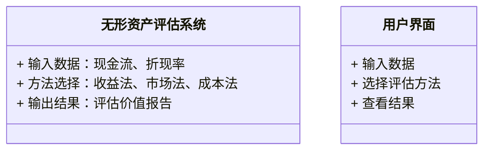

                 


# 企业估值中的无形资产评估技巧

> **关键词**：企业估值，无形资产，资产评估，知识产权，财务分析，商业价值，投资决策

> **摘要**：  
> 在企业估值过程中，无形资产的价值评估是一个复杂而关键的环节。本文详细探讨了无形资产评估的核心概念、分类、主要方法（包括收益法、市场法、成本法）以及数学模型的应用，并通过实际案例分析，结合系统架构设计和项目实战，为读者提供全面的评估技巧。文章最后总结了最佳实践和注意事项，帮助读者在企业估值中更好地识别和评估无形资产的价值。

---

## 第1章：无形资产的背景与重要性

### 1.1 无形资产的定义与分类

#### 1.1.1 无形资产的定义  
无形资产是指企业拥有或控制的，没有实物形态，但能够为企业带来长期经济利益的资源。常见的无形资产包括专利权、商标权、著作权、商誉、客户关系等。

#### 1.1.2 无形资产的分类  
无形资产可以分为以下几类：
1. **知识产权类**：包括专利权、商标权、著作权等。
2. **企业特有类**：包括商誉、专有技术、客户关系等。
3. **其他无形资产**：如特许经营权、合同权益等。

#### 1.1.3 无形资产在企业中的作用  
无形资产不仅是企业价值的重要组成部分，还直接影响企业的市场竞争力和未来收益能力。

---

### 1.2 无形资产评估的重要性

#### 1.2.1 企业估值中的无形资产价值  
企业在市场中的价值不仅仅取决于有形资产，无形资产的价值往往占据了更大的比重。例如，科技企业的核心价值通常体现在专利技术和品牌价值上。

#### 1.2.2 无形资产评估对企业决策的影响  
准确评估无形资产的价值，有助于企业在并购、融资、上市等重大决策中做出合理的判断。

#### 1.2.3 无形资产评估的法律与经济意义  
从法律角度，无形资产的评估有助于保护企业的知识产权；从经济角度，它能够帮助企业在财务报告中合理反映资产价值。

---

## 第2章：无形资产的核心概念与分类

### 2.1 无形资产的核心要素

#### 2.1.1 无形资产的无形性  
无形资产没有实物形态，其价值依赖于其带来的经济利益。

#### 2.1.2 无形资产的可识别性  
某些无形资产（如商誉）难以单独识别，而其他如专利权则具有明确的法律识别性。

#### 2.1.3 无形资产的可计量性  
尽管无形资产难以直接计量，但通过收益法、市场法和成本法可以估算其价值。

### 2.2 无形资产的分类与特征

#### 2.2.1 知识产权类无形资产

| 知识产权类型 | 特征                          |
|--------------|------------------------------|
| 专利权       | 法律保护，技术独特性          |
| 商标权       | 标识性，品牌价值              |
| 著作权       | 独创性，保护期限有限          |

#### 2.2.2 企业特有无形资产

| 类型         | 描述                           |
|--------------|--------------------------------|
| 商誉         | 企业长期积累的市场声誉         |
| 专有技术     | 独特的技术或工艺                |
| 客户关系     | 稳定的客户群体和合作关系        |

#### 2.2.3 其他无形资产

| 类型         | 描述                           |
|--------------|--------------------------------|
| 特许经营权   | 授权经营的权利                  |
| 合同权益     | 未来收益的合同约定             |

---

## 第3章：无形资产评估的主要方法

### 3.1 收益法

#### 3.1.1 收益法的基本原理  
收益法通过预测无形资产带来的未来现金流，折现到现值来评估其价值。

#### 3.1.2 收益法的应用步骤

1. **确定预测期**：通常为5-10年。
2. **预测现金流**：包括收入和成本的增量。
3. **选择折现率**：基于市场风险和资产风险。
4. **计算净现值（NPV）**：$$ NPV = \sum_{t=1}^{n} \frac{CF_t}{(1 + r)^t} $$

#### 3.1.3 收益法的优缺点

| 优点         | 缺点                          |
|--------------|-------------------------------|
| 结合未来收益 | 需准确预测现金流和折现率        |
| 适用于长期资产 | 对预测误差敏感                  |

### 3.2 市场法

#### 3.2.1 市场法的基本原理  
市场法基于可比交易案例，通过比较分析估算无形资产价值。

#### 3.2.2 市场法的应用步骤

1. **收集可比案例**：选择与目标资产相似的交易。
2. **调整差异**：考虑规模、行业、地理位置等因素。
3. **计算平均值或中位数**：得出目标资产的估计价值。

#### 3.2.3 市场法的优缺点

| 优点         | 缺点                          |
|--------------|-------------------------------|
| 数据直观     | 可比案例难找                   |
| 适用于短期资产 | 依赖市场数据的可获得性         |

### 3.3 成本法

#### 3.3.1 成本法的基本原理  
成本法基于重置成本或机会成本来估算无形资产价值。

#### 3.3.2 成本法的应用步骤

1. **确定重置成本**：估算重新获得相同资产的成本。
2. **考虑时间价值**：调整为现值。
3. **计算贬值**：考虑资产的使用寿命和损耗。

#### 3.3.3 成本法的优缺点

| 优点         | 缺点                          |
|--------------|-------------------------------|
| 简单易行     | 高估贬值风险                   |
| 适用于短期资产 | 无法反映市场实际价值           |

---

## 第4章：无形资产评估的数学模型与案例分析

### 4.1 收益法的数学模型

#### 4.1.1 净现值法（NPV）

$$ NPV = \sum_{t=1}^{n} \frac{CF_t}{(1 + r)^t} $$

- **CF_t**：第t年的现金流
- **r**：折现率
- **n**：预测期

#### 4.1.2 内部收益率法（IRR）

$$ IRR = r \text{ 使得 } NPV = 0 $$

#### 4.1.3 永续年金法

$$ PV = \frac{CF}{r} $$

---

### 4.2 案例分析

#### 4.2.1 案例背景  
假设某科技公司拥有一项专利技术，预计未来5年每年带来额外收益100万元，折现率为10%。

#### 4.2.2 计算NPV

$$ NPV = \frac{100}{(1+0.1)^1} + \frac{100}{(1+0.1)^2} + \frac{100}{(1+0.1)^3} + \frac{100}{(1+0.1)^4} + \frac{100}{(1+0.1)^5} $$
$$ NPV ≈ 40.67 + 36.98 + 33.23 + 30.11 + 27.01 ≈ 168.01 \text{万元} $$

---

## 第5章：系统分析与架构设计

### 5.1 问题场景介绍  
企业需要评估无形资产的价值，涉及数据收集、模型计算和结果分析。

### 5.2 系统功能设计



---

## 第6章：项目实战与案例分析

### 6.1 环境安装  
安装Python和相关库（如numpy、pandas）。

### 6.2 核心实现

```python
def calculate_npv(cash_flows, discount_rate):
    return sum(cf / (1 + discount_rate) ** t for t, cf in enumerate(cash_flows))

cash_flows = [100, 100, 100, 100, 100]
discount_rate = 0.1
print(calculate_npv(cash_flows, discount_rate))
```

---

## 总结与最佳实践

### 6.3 最佳实践 tips

1. **选择合适的方法**：根据资产类型和数据 availability选择收益法、市场法或成本法。
2. **准确预测现金流**：确保预测的合理性和准确性。
3. **合理选择折现率**：反映市场风险和资产特定风险。

### 6.4 小结  
本文详细探讨了无形资产评估的核心概念、方法和数学模型，并通过案例分析和系统设计展示了如何在实际中应用这些方法。

### 6.5 注意事项

- 无形资产评估需要结合企业的实际情况。
- 数据来源和质量直接影响评估结果。
- 建议由专业人员进行评估。

### 6.6 拓展阅读

- 财务估值相关书籍
- 知识产权评估指南
- 无形资产评估的最新研究

---

**作者：AI天才研究院/AI Genius Institute & 禅与计算机程序设计艺术 /Zen And The Art of Computer Programming**

