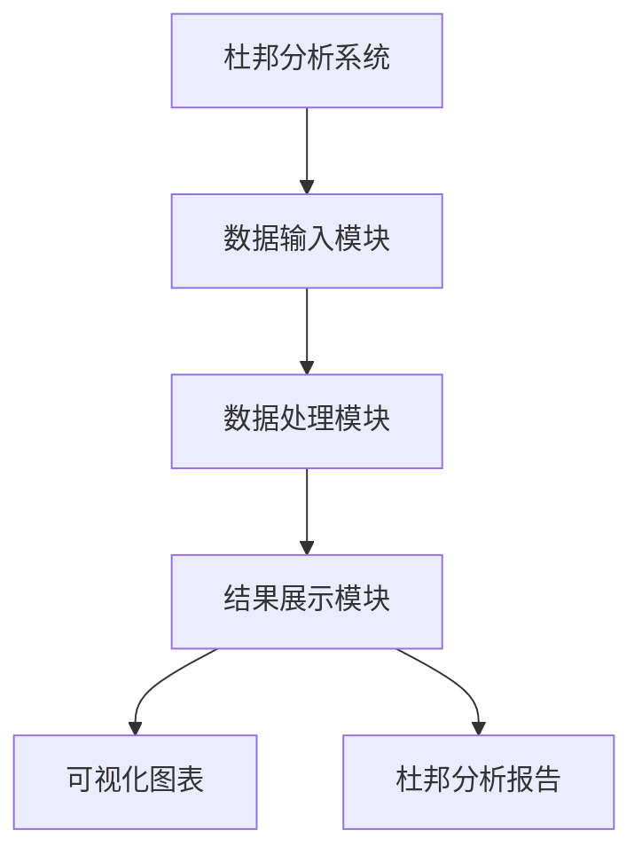
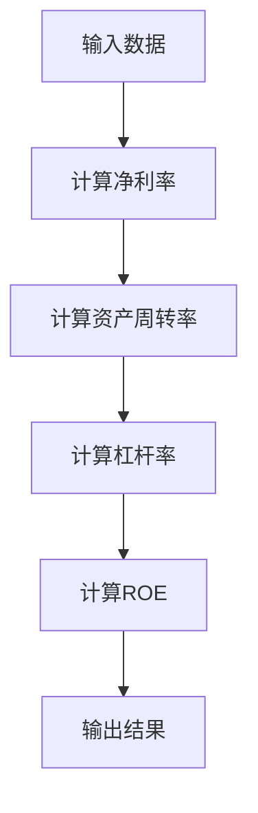

                 


# 企业估值中的杜邦分析法

> 关键词：杜邦分析法，企业估值，净资产收益率（ROE），财务指标分析，Python代码实现

> 摘要：杜邦分析法是一种经典的财务分析工具，通过分解净资产收益率（ROE）来评估企业的财务绩效和估值。本文从杜邦分析法的背景、核心概念、算法原理、系统设计、项目实战等方面进行详细阐述，并结合实际案例和Python代码示例，帮助读者全面理解杜邦分析法在企业估值中的应用。

---

## 第一部分: 杜邦分析法的背景与基础

### 第1章: 杜邦分析法的起源与发展

#### 1.1 杜邦分析法的起源
杜邦分析法是由美国的杜邦公司于20世纪20年代开发的一种财务分析方法。它最初用于评估公司的财务绩效，后来逐渐被广泛应用于企业估值和投资分析。

#### 1.2 杜邦分析法的核心思想
杜邦分析法的核心思想是将净资产收益率（ROE）分解为三个关键因素：净利率、资产周转率和杠杆率。通过分析这些因素，可以深入理解企业的财务状况和盈利能力。

#### 1.3 杜邦分析法的发展历程
杜邦分析法自提出以来，不断完善和发展。随着金融市场的变化，杜邦分析法也逐渐扩展到更多的应用场景，如企业估值、投资决策等。

### 第2章: 杜邦分析法的基本概念

#### 2.1 净资产收益率（ROE）
净资产收益率（ROE）是衡量企业盈利能力的重要指标，计算公式为：
$$ROE = \frac{\text{净利润}}{\text{所有者权益}}$$

#### 2.2 净利率
净利率是净利润与营业收入的比率，计算公式为：
$$\text{净利率} = \frac{\text{净利润}}{\text{营业收入}}$$

#### 2.3 资产周转率
资产周转率是营业收入与平均资产总额的比率，计算公式为：
$$\text{资产周转率} = \frac{\text{营业收入}}{\text{平均资产总额}}$$

#### 2.4 杠杆率
杠杆率是总资产与所有者权益的比率，计算公式为：
$$\text{杠杆率} = \frac{\text{总资产}}{\text{所有者权益}}$$

### 第3章: 杜邦分析法的分解逻辑

#### 3.1 ROE的分解公式
杜邦分析法将ROE分解为三个因素：
$$ROE = \text{净利率} \times \text{资产周转率} \times \text{杠杆率}$$

#### 3.2 杜邦分析法的三大指标对比
| 指标名称 | 计算公式 | 指标意义 |
|----------|----------|----------|
| 净利率   | 净利润 / 营业收入 | 衡量企业盈利能力 |
| 资产周转率 | 营业收入 / 平均资产总额 | 衡量企业资产使用效率 |
| 杠杆率   | 总资产 / 所有者权益 | 衡量企业财务杠杆 |

---

## 第二部分: 杜邦分析法的核心概念与联系

### 第4章: 杜邦分析法的数学模型与公式

#### 4.1 ROE的分解公式
$$ROE = \text{净利率} \times \text{资产周转率} \times \text{杠杆率}$$

#### 4.2 净利率的计算公式
$$\text{净利率} = \frac{\text{净利润}}{\text{营业收入}}$$

#### 4.3 资产周转率的计算公式
$$\text{资产周转率} = \frac{\text{营业收入}}{\text{平均资产总额}}$$

#### 4.4 杠杆率的计算公式
$$\text{杠杆率} = \frac{\text{总资产}}{\text{所有者权益}}$$

### 第5章: 杜邦分析法的系统架构设计

#### 5.1 系统功能模块
- 数据输入模块：读取企业的财务数据。
- 数据处理模块：计算净利率、资产周转率和杠杆率。
- 结果展示模块：输出杜邦分析结果并生成可视化图表。

#### 5.2 系统架构设计


---

## 第三部分: 杜邦分析法的算法原理与实现

### 第6章: 杜邦分析法的算法实现

#### 6.1 Python代码实现
```python
def du邦分析法(净利润, 营业收入, 平均资产总额, 总资产, 所有者权益):
    净利率 = 净利润 / 营业收入
    资产周转率 = 营业收入 / 平均资产总额
    杠杆率 = 总资产 / 所有者权益
    ROE = 净利率 * 资产周转率 * 杠杆率
    return ROE, 净利率, 资产周转率, 杠杆率
```

#### 6.2 算法流程图


---

## 第四部分: 项目实战与案例分析

### 第7章: 项目实战

#### 7.1 环境安装
- 安装Python和相关库（如pandas、matplotlib）。

#### 7.2 代码实现
```python
import pandas as pd
import matplotlib.pyplot as plt

def calculate_du邦分析法(finance_data):
    净利率 = finance_data['净利润'] / finance_data['营业收入']
    资产周转率 = finance_data['营业收入'] / finance_data['平均资产总额']
    杠杆率 = finance_data['总资产'] / finance_data['所有者权益']
    ROE = 净利率 * 资产周转率 * 杠杆率
    return ROE, 净利率, 资产周转率, 杠杆率

# 示例数据
data = {
    '净利润': [100, 150, 200],
    '营业收入': [500, 600, 700],
    '平均资产总额': [1000, 1200, 1400],
    '总资产': [2000, 2400, 2800],
    '所有者权益': [800, 900, 1000]
}

finance_data = pd.DataFrame(data)

ROE, 净利率, 资产周转率, 杠杆率 = calculate_du邦分析法(finance_data)

print("ROE:", ROE)
print("净利率:", 净利率)
print("资产周转率:", 资产周转率)
print("杠杆率:", 杠杆率)

# 可视化图表
plt.plot(ROE, 'b-', label='ROE')
plt.plot(净利率, 'r-', label='净利率')
plt.plot(资产周转率, 'g-', label='资产周转率')
plt.plot(杠杆率, 'k-', label='杠杆率')
plt.legend()
plt.show()
```

---

## 第五部分: 总结与展望

### 第8章: 总结与展望

#### 8.1 本章总结
杜邦分析法通过分解ROE，帮助企业深入理解财务绩效，为估值提供重要依据。

#### 8.2 未来展望
杜邦分析法在企业估值中的应用将更加智能化和自动化，结合人工智能和大数据技术，进一步提升分析的深度和广度。

---

## 附录

### 附录A: 杜邦分析法公式汇总

| 指标名称 | 计算公式 |
|----------|----------|
| ROE     | 净利率 × 资产周转率 × 杠杆率 |
| 净利率   | 净利润 / 营业收入 |
| 资产周转率 | 营业收入 / 平均资产总额 |
| 杠杆率   | 总资产 / 所有者权益 |

### 附录B: Python代码库推荐
- Pandas
- Matplotlib
- NumPy

---

**作者：AI天才研究院/AI Genius Institute & 禅与计算机程序设计艺术 /Zen And The Art of Computer Programming**

