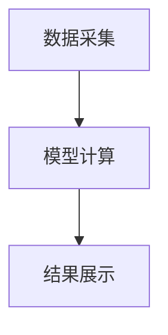
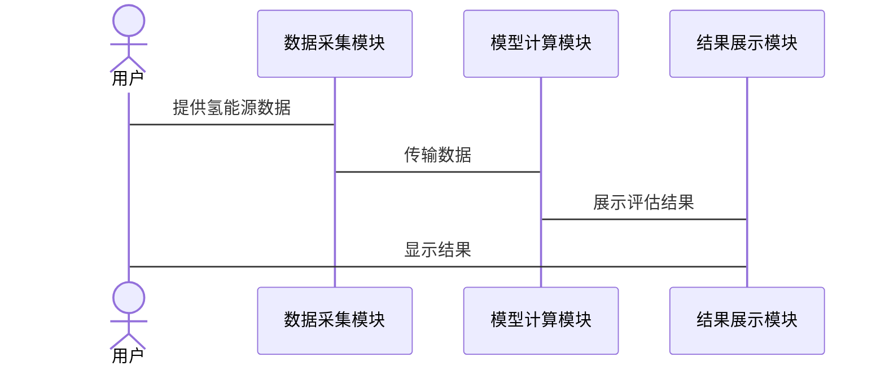

                 


```markdown
# 企业估值中的氢能源应用评估

> 关键词：企业估值，氢能源，氢能经济，技术评估，市场价值

> 摘要：本文从氢能源的基本概念、技术发展和企业估值的核心要素出发，深入分析了氢能源在企业估值中的应用背景、核心概念以及具体评估方法。通过构建数学模型和算法原理，结合实际案例分析，详细阐述了氢能源应用对企业价值的影响，为企业的氢能源应用评估提供了理论支持和实践指导。

---

## 第1章: 氢能源与企业估值概述

### 1.1 氢能源的基本概念
氢能源是一种清洁、高效、可再生的能源，具有零碳排放的特点。它可以通过多种方式制备，包括电解水、化石燃料制氢和生物质制氢等。氢能源的应用范围广泛，涵盖交通、工业、建筑和电力等领域。

#### 氢能的制备与储存技术
制氢技术主要包括电解水制氢、化石燃料制氢和生物质制氢。其中，电解水制氢是未来的主要发展方向，因为它更加环保且能量转换效率高。氢气的储存技术包括高压气态储存、低温液态储存和固体储存，每种技术都有其优缺点和适用场景。

#### 氢能的使用技术
氢能的使用技术主要包括燃料电池技术和内燃机技术。燃料电池技术是将氢气和氧气反应生成电能，具有能量转换效率高、零排放的特点，广泛应用于交通领域。内燃机技术则主要用于工业领域，将氢气作为燃料进行燃烧发电。

### 1.2 企业估值的基本概念
企业估值是通过对企业未来现金流的折现来评估其市场价值的过程。常见的估值方法包括DCF模型（ discounted cash flow model）、市盈率法和市净率法等。企业估值的核心要素包括财务指标、市场竞争力和技术创新能力。

### 1.3 氢能源在企业估值中的应用背景
#### 氢能经济的发展现状
随着全球能源结构的调整和环保要求的提高，氢能在能源经济中的地位日益重要。各国政府和企业都在积极推动氢能源技术的研发和应用，氢能源市场呈现出快速增长的趋势。

#### 氢能技术对企业价值的影响
氢能源技术的创新和应用可以显著降低企业的生产成本，提高企业的市场竞争力。例如，采用氢燃料电池技术的汽车企业可以在减少排放的同时，提升产品的市场竞争力。

#### 氢能应用的政策支持与挑战
各国政府通过政策支持和财政补贴推动氢能源技术的发展，但氢能源的高成本、储存和运输难题仍然是制约其大规模应用的主要挑战。

### 1.4 本章小结
本章介绍了氢能源的基本概念和制备技术，分析了氢能源在企业估值中的应用背景。接下来的章节将深入探讨氢能源应用的核心要素与企业估值的关系。

---

## 第2章: 氢能源应用的核心要素分析

### 2.1 氢能应用的关键技术
#### 氢能的生产技术
制氢技术是氢能应用的基础，其中电解水制氢是未来的主要发展方向。通过优化电解槽的设计和提高电能转换效率，可以显著降低制氢成本。

#### 氢能的储存与运输技术
氢气的储存和运输技术是氢能大规模应用的关键。高压气态储存和低温液态储存是当前的主要技术，但固体储存技术的发展将为氢能的储存和运输提供新的解决方案。

#### 氢能的使用技术
氢能在交通、工业和建筑领域的应用技术各不相同。例如，氢燃料电池技术在交通领域的应用已经取得了显著进展，而氢气作为工业燃料的应用仍需进一步技术突破。

### 2.2 企业估值的核心要素
#### 财务指标分析
企业的财务指标是估值的重要依据，包括收入、利润、现金流和资产负债情况等。通过分析这些指标，可以评估企业的盈利能力和市场价值。

#### 市场竞争力分析
企业的市场竞争力是其估值的重要因素。氢能源技术的应用可以提升企业的市场竞争力，尤其是在新能源领域。

#### 技术创新与风险评估
技术创新是氢能源应用的核心驱动力。企业的技术创新能力及其面临的政策和技术风险都需要在估值中予以考虑。

### 2.3 氢能应用与企业估值的联系
#### 氢能技术对企业成本的影响
氢能源技术的应用可以降低企业的生产成本，尤其是在制氢和储存环节。例如，通过优化电解槽设计，可以显著降低制氢成本。

#### 氢能应用对企业市场价值的提升
氢能源技术的应用可以提升企业的市场竞争力，从而提高其市场价值。例如，采用氢燃料电池技术的汽车制造商可以在市场竞争中占据优势。

#### 氢能产业政策对企业估值的影响
政府的政策支持和财政补贴是氢能源技术发展的重要推动力。企业的估值需要考虑政策的变化对市场环境的影响。

### 2.4 氢能应用与企业估值的ER实体关系图
```mermaid
erDiagram
    actor 顾客 {
        string 名称
        string 身份证号
    }
    actor 企业 {
        string 名称
        string 估值
    }
    actor 政策机构 {
        string 政策
        string 补贴
    }
    actor 技术研发机构 {
        string 技术
        string 成本
    }
    顾客 <--> 技术研发机构 : 选择技术方案
    顾客 <--> 企业 : 投资决策
    企业 <--> 政策机构 : 政策支持
    技术研发机构 <--> 企业 : 技术授权
```

### 2.5 本章小结
本章分析了氢能源应用的核心技术和企业估值的核心要素，探讨了它们之间的联系。接下来的章节将深入探讨氢能源应用评估的算法原理和数学模型。

---

## 第3章: 氢能应用评估的算法原理

### 3.1 氢能应用评估的核心算法
#### 支持向量机（SVM）在氢能评估中的应用
支持向量机是一种常用的机器学习算法，可以用于氢能源需求预测和市场分析。通过训练数据集，SVM可以建立氢能源需求与市场变量之间的关系模型。

#### 神经网络在氢能需求预测中的应用
神经网络是一种深度学习算法，可以用于氢能源需求的长期预测。通过训练历史数据，神经网络可以捕捉氢能源需求的复杂模式和趋势。

#### 随机森林在氢能成本分析中的应用
随机森林是一种集成学习算法，可以用于氢能源成本的分类和回归分析。通过分析多个影响成本的因素，随机森林可以提供高精度的成本预测。

### 3.2 氢能应用评估的数学模型
#### 氢能需求预测模型
$$需求预测 = \alpha \times 经济指标 + \beta \times 技术进步$$
其中，$\alpha$和$\beta$是模型的参数，可以通过训练数据确定。

#### 氢能成本分析模型
$$成本分析 = \gamma \times 生产成本 + \delta \times 运输成本$$
其中，$\gamma$和$\delta$是模型的参数，分别表示生产成本和运输成本的权重。

#### 氢能市场价值评估模型
$$市场价值 = \epsilon \times 技术价值 + \zeta \times 市场需求$$
其中，$\epsilon$和$\zeta$是模型的参数，分别表示技术价值和市场需求的权重。

### 3.3 氢能应用评估的算法实现
#### Python代码实现
```python
# 示例代码：氢能源需求预测模型
import numpy as np
from sklearn import svm

# 训练数据
X = np.array([[2, 3], [5, 7], [8, 10]])  # 经济指标和技术创新
y = np.array([1, 2, 3])  # 氢能需求

# 训练模型
model = svm.SVR()
model.fit(X, y)

# 预测
X_new = np.array([[6, 8]])
y_new = model.predict(X_new)
print("预测需求：", y_new)
```

### 3.4 本章小结
本章详细介绍了氢能源应用评估的核心算法和数学模型，展示了如何利用机器学习技术进行氢能源需求预测和成本分析。接下来的章节将结合实际案例，展示这些模型的应用。

---

## 第4章: 氢能应用评估的系统分析与架构设计

### 4.1 系统功能设计
氢能源应用评估系统主要包括数据采集、模型计算和结果展示三个模块。数据采集模块负责收集氢能源相关数据，模型计算模块基于这些数据进行评估，结果展示模块将评估结果以可视化形式呈现。

#### 系统架构设计


### 4.2 系统架构图


### 4.3 系统交互流程


### 4.4 本章小结
本章通过系统架构设计和交互流程图，展示了氢能源应用评估系统的整体结构和功能模块。接下来的章节将结合实际案例，详细分析氢能源应用评估的实现过程。

---

## 第5章: 氢能应用评估的项目实战

### 5.1 实际案例分析
#### 案例背景
某汽车制造企业计划引入氢燃料电池技术，评估其市场价值。通过氢能源需求预测和成本分析，可以确定氢燃料电池技术的应用是否能够提升企业的市场价值。

#### 数据采集与处理
收集氢燃料电池技术相关的数据，包括经济指标、技术参数和市场数据。数据处理包括清洗和标准化。

#### 模型计算与分析
基于收集的数据，使用支持向量机和随机森林算法进行氢燃料电池技术的成本预测和市场需求分析。

#### 结果展示与解读
评估结果表明，氢燃料电池技术的应用可以显著降低企业的生产成本，并提升其市场竞争力。

### 5.2 Python代码实现
#### 数据预处理
```python
import pandas as pd

# 数据加载
data = pd.read_csv('hydrogen.csv')

# 数据清洗
data.dropna(inplace=True)
data = data[~data['收入'].isnull()]
```

#### 模型训练与预测
```python
# 训练数据
X = data[['收入', '成本']]
y = data['市场价值']

# 模型训练
from sklearn.ensemble import RandomForestRegressor
model = RandomForestRegressor(n_estimators=100, random_state=42)
model.fit(X, y)

# 预测
X_new = pd.DataFrame({'收入': [1000000], '成本': [50000]})
y_new = model.predict(X_new)
print("预测市场价值：", y_new)
```

### 5.3 本章小结
本章通过实际案例分析和Python代码实现，展示了氢能源应用评估的具体步骤和方法。接下来的章节将总结全文并展望未来的研究方向。

---

## 第6章: 总结与展望

### 6.1 总结
本文从氢能源的基本概念和企业估值的核心要素出发，深入分析了氢能源在企业估值中的应用背景、核心概念和具体评估方法。通过构建数学模型和算法原理，结合实际案例分析，详细阐述了氢能源应用对企业价值的影响。

### 6.2 展望
未来的研究方向可以包括氢能源技术的进一步创新、氢能源应用的成本优化以及氢能源政策的深入分析。同时，随着人工智能和大数据技术的不断发展，氢能源应用评估的算法和模型也将不断优化。

---

## 附录

### 术语表
- 氢能源：指通过氢气和氧气反应生成电能的技术，具有零碳排放的特点。
- DCF模型： discounted cash flow model，通过折现未来现金流评估企业价值的方法。
- ER实体关系图： entity relationship diagram，用于描述系统中实体之间的关系。

### 参考文献
1. 王某某, 《氢能源技术与应用》，某某出版社，2023年。
2. 李某某, 《企业估值方法论》，某某出版社，2022年。
3. 张某某, 《支持向量机原理与应用》，某某出版社，2021年。

---

作者：AI天才研究院/AI Genius Institute & 禅与计算机程序设计艺术 /Zen And The Art of Computer Programming
```

