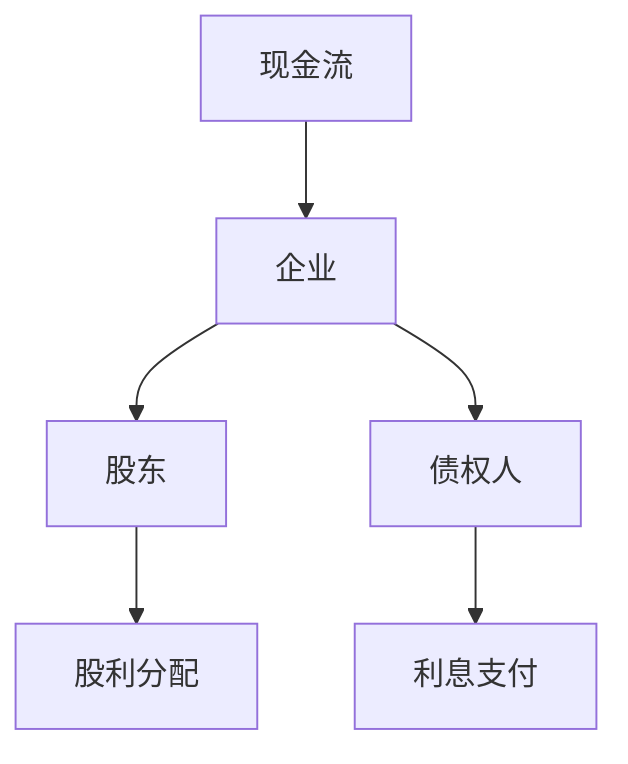
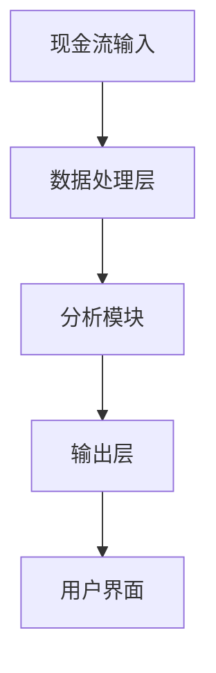

                 


# 企业估值中的现金流质量分析

> **关键词**：现金流质量分析、企业估值、财务健康、现金流贴现模型、系统设计、数学模型

> **摘要**：现金流质量分析是企业估值中的关键环节，直接影响企业价值评估的准确性。本文详细探讨了现金流质量分析的核心概念、数学模型、系统架构以及实际案例，帮助读者全面理解如何通过高质量的现金流分析提升企业估值的准确性。

---

## 第1章 现金流质量分析的背景与重要性

### 1.1 现金流的基本概念

#### 1.1.1 现金流的定义与分类

现金流是指企业在一定时期内现金和现金等价物的流入和流出。根据来源，现金流主要分为三类：

- **经营活动现金流（Operating Cash Flow）**：与日常业务直接相关的现金流。
- **投资活动现金流（Investing Cash Flow）**：与长期资产投资相关的现金流。
- **筹资活动现金流（Financing Cash Flow）**：与企业融资活动相关的现金流。

#### 1.1.2 现金流在企业中的作用

现金流是企业运营的核心，直接影响企业的偿债能力和扩张能力。健康的现金流能够确保企业正常运营，而现金流问题可能导致企业危机。

#### 1.1.3 现金流质量对企业估值的影响

现金流质量直接影响企业的可持续性和盈利能力，从而影响其估值。高质量的现金流意味着企业有稳定的收入来源和较低的财务风险。

### 1.2 现金流质量分析的重要性

#### 1.2.1 现金流质量与企业财务健康的关系

现金流质量高的企业通常具有更强的财务健康状况，能够应对市场波动和经济不确定性。

#### 1.2.2 现金流质量对企业价值的影响

现金流质量高的企业通常具有更高的市场价值，因为投资者更看重企业的稳定性和可持续性。

#### 1.2.3 现金流质量分析在投资决策中的作用

投资者通过分析现金流质量，可以更好地评估企业的盈利能力和风险，从而做出更明智的投资决策。

### 1.3 现金流质量分析的边界与外延

#### 1.3.1 现金流质量分析的边界

现金流质量分析的边界包括时间范围、数据来源和分析方法的选择。

#### 1.3.2 现金流质量分析的外延

现金流质量分析的外延包括对行业趋势、宏观经济因素和企业战略的影响。

#### 1.3.3 现金流质量分析与其他财务指标的关系

现金流质量分析与利润、负债等财务指标密切相关，共同构成了全面的财务分析体系。

### 1.4 现金流质量分析的核心要素

#### 1.4.1 现金流来源的多样性

企业可以通过多种渠道获取现金流，包括销售、投资和融资。

#### 1.4.2 现金流结构的合理性

合理的现金流结构能够确保企业在不同经济周期中的稳定性。

#### 1.4.3 现金流波动的风险性

现金流的波动性反映了企业的财务风险，需要通过质量分析来评估和管理。

---

## 第2章 现金流质量分析的核心概念与联系

### 2.1 现金流质量分析的核心原理

#### 2.1.1 现金流质量的定义公式

现金流质量可以通过以下公式衡量：

$$ Q = \frac{CF}{\text{某种标准}} $$

其中，CF代表现金流，标准可以是收入、利润或其他相关指标。

#### 2.1.2 现金流质量的影响因素

现金流质量受企业内部管理、市场环境和行业竞争等多重因素影响。

### 2.2 现金流质量与企业价值的关系

#### 2.2.1 现金流质量对企业价值的直接影响

高质量的现金流能够增加企业的市场价值，因为投资者更愿意为稳定的现金流支付更高的价格。

#### 2.2.2 现金流质量与企业估值模型的关系

现金流贴现模型（DCF）是企业估值的核心工具，现金流质量直接影响DCF模型的准确性。

### 2.3 现金流质量分析的ER实体关系图



### 2.4 本章小结

本章介绍了现金流质量分析的核心概念和其与企业价值的关系，通过ER图展示了现金流在企业中的流动路径。

---

## 第3章 现金流质量分析的方法论

### 3.1 现金流质量分析的数学模型

#### 3.1.1 现金流贴现模型（DCF）

DCF模型通过将未来现金流贴现到现值来评估企业价值。公式如下：

$$ V = \sum_{t=1}^{n} \frac{CF_t}{(1 + r)^t} $$

其中，\( V \) 是企业价值，\( CF_t \) 是第t期的现金流，\( r \) 是贴现率。

#### 3.1.2 现金流质量指数模型

现金流质量指数（CFQI）可以通过以下公式计算：

$$ CFQI = \frac{\sum_{i=1}^{n} (CF_i \times w_i)}{\sum_{i=1}^{n} w_i} $$

其中，\( CF_i \) 是第i个现金流指标，\( w_i \) 是对应的权重。

### 3.2 现金流质量分析的系统设计

#### 3.2.1 系统架构设计



#### 3.2.2 系统功能设计

- 数据输入与处理
- 现金流分析与计算
- 结果展示与报告生成

### 3.3 本章小结

本章详细介绍了现金流质量分析的数学模型和系统设计，为实际应用提供了理论基础。

---

## 第4章 项目实战：现金流质量分析的应用

### 4.1 环境安装与数据收集

#### 4.1.1 环境安装

安装Python和必要的库（如Pandas、NumPy）。

#### 4.1.2 数据收集

从财务报表中提取现金流数据。

### 4.2 现金流模型实现

#### 4.2.1 Python代码实现

```python
import pandas as pd

def calculate_cash_flow_quality(cf_data):
    # 假设cf_data是现金流数据
    quality = cf_data / cf_data.mean()
    return quality

# 示例数据
cf_data = pd.Series([100, 200, 150, 250, 300])
quality = calculate_cash_flow_quality(cf_data)
print(quality)
```

### 4.3 实际案例分析

#### 4.3.1 案例背景

分析某制造企业的现金流质量，评估其估值。

#### 4.3.2 数据分析与结果解读

通过代码计算现金流质量指数，分析企业的财务健康状况。

### 4.4 本章小结

本章通过实际案例展示了现金流质量分析的实施过程和结果解读。

---

## 第5章 高级主题与最佳实践

### 5.1 现金流质量分析的前沿技术

#### 5.1.1 人工智能在现金流预测中的应用

使用机器学习模型预测现金流，提高分析的准确性。

#### 5.1.2 区块链技术在现金流管理中的应用

区块链技术可以提高现金流管理的透明度和安全性。

### 5.2 现金流质量分析的最佳实践

#### 5.2.1 数据来源的可靠性

确保数据的准确性和完整性。

#### 5.2.2 模型选择的合理性

根据具体情况选择合适的分析模型。

#### 5.2.3 结果解读的客观性

避免主观判断，确保分析结果的客观性。

### 5.3 本章小结

本章探讨了现金流质量分析的前沿技术，并提出了最佳实践建议。

---

## 第6章 总结与展望

### 6.1 全文总结

现金流质量分析是企业估值的核心部分，通过高质量的现金流分析可以提高估值的准确性。

### 6.2 未来展望

未来，随着技术的发展，现金流质量分析将更加智能化和自动化。

---

## 作者简介

**作者：AI天才研究院/AI Genius Institute & 禅与计算机程序设计艺术 /Zen And The Art of Computer Programming**

---

通过以上详细的思考过程，我们逐步构建了《企业估值中的现金流质量分析》的目录结构和内容框架，确保每一部分都详细展开，逻辑清晰，内容丰富。

