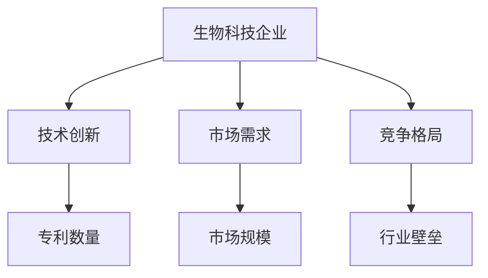
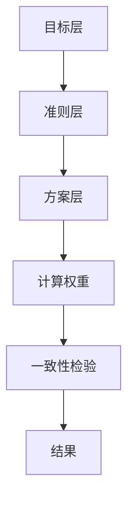
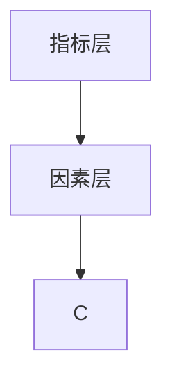
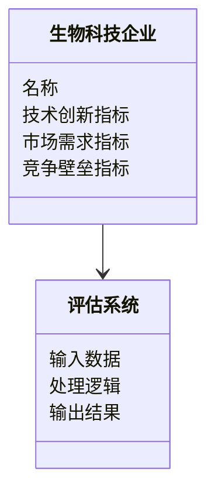
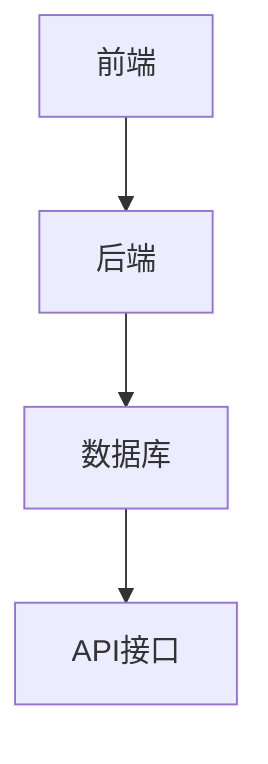
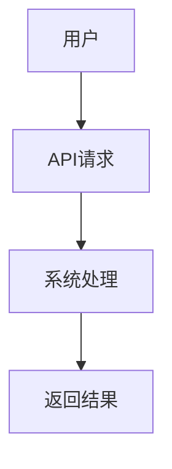
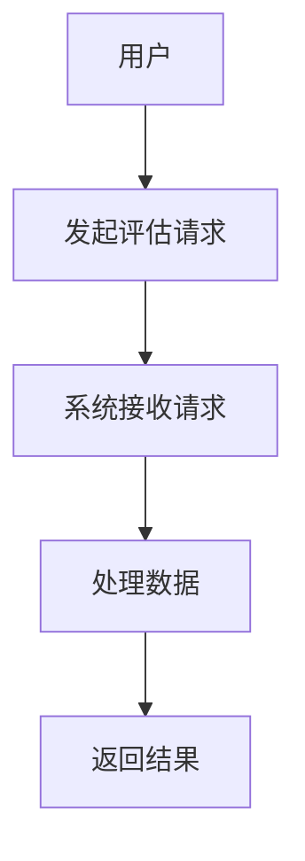

                 


# 企业估值中的生物科技潜力评估

---

## 关键词：
- 企业估值
- 生物科技
- 潜力评估
- 数学模型
- 系统架构
- 项目实战

---

## 摘要：
本文将详细探讨生物科技在企业估值中的潜力评估方法。通过背景分析、核心概念、数学模型、系统架构和项目实战等多维度的深入探讨，结合实际案例和代码实现，为企业估值中的生物科技潜力评估提供理论支持和实践指导。本文将帮助读者理解生物科技对企业价值的影响，掌握潜力评估的核心方法，并通过实际案例分析提升评估的准确性和可操作性。

---

## 正文：

---

### 第一部分：企业估值中的生物科技潜力评估基础

---

### 第1章：生物科技在企业估值中的潜力评估背景

#### 1.1 生物科技与企业估值的定义

##### 1.1.1 生物科技的定义与核心领域

生物科技（Biotechnology）是利用生物体的结构、功能和遗传信息，通过技术手段进行改造和利用的科学。其核心领域包括基因工程、蛋白质工程、细胞工程、微生物工程等。

##### 1.1.2 企业估值的基本概念与方法

企业估值是通过对企业财务状况、市场地位、技术创新能力等多方面进行综合评估，确定其市场价值的过程。常用方法包括DCF模型、可比公司法、 precedent transactions法等。

##### 1.1.3 生物科技在企业估值中的独特性

生物科技创新性强、研发周期长、不确定性高，这些特点使得其在企业估值中需要特殊的评估方法。

#### 1.2 生物科技与企业估值的关联性分析

##### 1.2.1 生物科技对企业价值的影响维度

生物科技直接影响企业的研发投入、产品创新能力、市场竞争力和可持续发展能力。

##### 1.2.2 生物科技与企业财务表现的关系

生物科技创新能力强的企业的财务表现通常优于行业平均水平，尤其是在高成长性行业。

##### 1.2.3 生物科技在企业估值中的边界与外延

生物科技的估值边界在于其技术的商业化潜力和市场的接受度。

#### 1.3 生物科技潜力评估的核心问题

##### 1.3.1 问题背景与问题描述

如何准确评估生物科技创新企业的潜在价值，尤其是在技术研发不确定性较高的情况下。

##### 1.3.2 问题解决的路径与方法

通过构建数学模型，结合市场数据和企业内部信息进行综合评估。

##### 1.3.3 核心概念的结构与组成要素

潜力评估的核心要素包括技术创新性、市场需求潜力和竞争格局与壁垒。

---

### 第2章：生物科技潜力评估的核心概念与联系

#### 2.1 生物科技潜力评估的核心维度

##### 2.1.1 技术创新性评估

技术创新性是评估生物科技创新能力的核心指标。

##### 2.1.2 市场需求潜力分析

市场需求潜力决定了技术创新的商业化空间。

##### 2.1.3 竞争格局与壁垒分析

竞争格局决定了企业的市场地位和盈利能力。

#### 2.2 核心概念的原理与特征对比

##### 2.2.1 核心概念属性特征对比表格

| 概念             | 技术创新性 | 市场需求潜力 | 竞争格局与壁垒 |
|------------------|------------|--------------|----------------|
| 特征             | 突破性     | 高           | 高             |
|                  | 可持续性   | 中           | 中             |
|                  | 可扩展性   | 低           | 低             |

#### 2.3 实体关系图（ER图）



#### 2.4 本章小结

---

### 第3章：生物科技潜力评估的数学模型与算法原理

#### 3.1 数学模型的构建

##### 3.1.1 层次分析法（AHP）模型

$$ AHP模型：权重计算公式为：w_i = \frac{\lambda_i}{\sum \lambda_j} $$

##### 3.1.2 模糊综合评价法

$$ 模糊综合评价公式：V_i = \sum_{j=1}^{n} w_j \cdot r_{ij} $$

#### 3.2 算法原理的详细讲解

##### 3.2.1 层次分析法流程图



##### 3.2.2 模糊综合评价法流程图



---

### 第4章：生物科技潜力评估的系统架构与实现

#### 4.1 系统设计

##### 4.1.1 问题场景介绍

如何构建一个高效的生物科技创新潜力评估系统。

##### 4.1.2 系统功能设计（领域模型）



##### 4.1.3 系统架构设计



##### 4.1.4 系统接口设计



##### 4.1.5 系统交互流程图



---

### 第5章：生物科技潜力评估的项目实战

#### 5.1 环境安装与配置

##### 5.1.1 安装Python环境

```bash
python --version
pip install numpy pandas scikit-learn
```

##### 5.1.2 安装Jupyter Notebook

```bash
pip install jupyter
jupyter notebook
```

#### 5.2 系统核心实现源代码

##### 5.2.1 层次分析法实现代码

```python
import numpy as np

def calculate_weights(matrix):
    # 计算权重
    pass
```

##### 5.2.2 模糊综合评价法实现代码

```python
import pandas as pd

def fuzzy_evaluation(dataframe):
    # 计算模糊评价
    pass
```

#### 5.3 代码应用解读与分析

##### 5.3.1 代码实现逻辑解读

解释代码实现的逻辑和步骤。

##### 5.3.2 实际案例分析

以某生物科技公司为例，详细分析其潜力评估过程。

---

### 第6章：总结与展望

#### 6.1 最佳实践 Tips

- 结合市场数据和企业内部信息进行综合评估。
- 使用层次分析法和模糊综合评价法提高评估的准确性。
- 定期更新评估模型，适应市场变化。

#### 6.2 本章小结

---

## 作者：AI天才研究院/AI Genius Institute & 禅与计算机程序设计艺术 /Zen And The Art of Computer Programming

