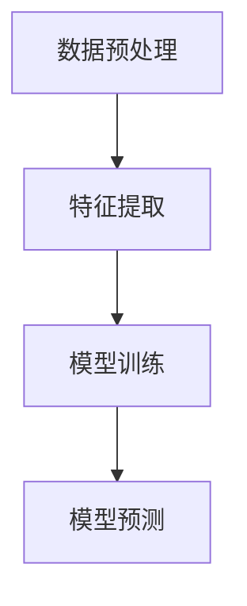
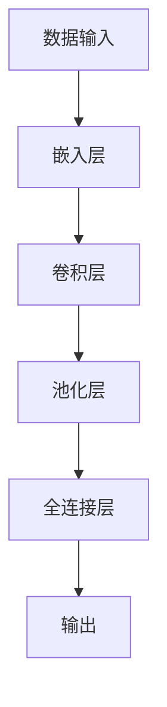
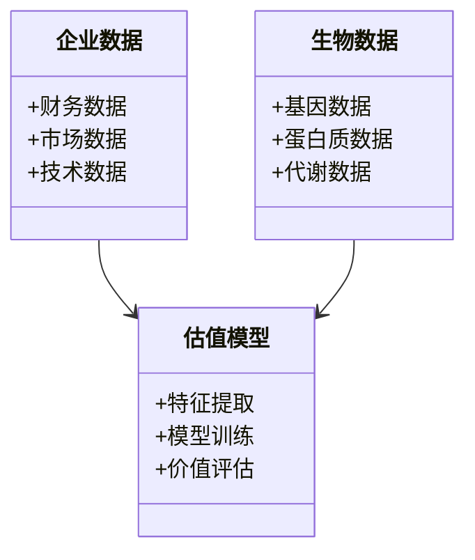

                 


# 企业估值中的生物计算技术潜力评估

## 关键词：
- 企业估值
- 生物计算技术
- 人工智能
- 数据分析
- 机器学习

## 摘要：
本文探讨生物计算技术在企业估值中的潜力，分析其在数据处理、模型构建和价值评估中的应用，结合实际案例和系统设计，展示其对企业估值的深远影响。

---

# 第一部分: 生物计算技术与企业估值的背景介绍

# 第1章: 生物计算技术的定义与背景

## 1.1 生物计算技术的定义

### 1.1.1 生物计算技术的核心概念
生物计算技术融合了生物科学和计算科学，利用生物数据进行分析和建模，以解决复杂问题。其核心在于将生物信息转化为可计算的数据，通过算法提取潜在价值。

### 1.1.2 生物计算技术的起源与发展
起源于生物信息学，随着人工智能和大数据技术的进步，生物计算技术在多个领域得到广泛应用，尤其是在企业估值中展现出巨大潜力。

### 1.1.3 生物计算技术在企业估值中的应用潜力
通过分析生物数据，揭示企业潜在的市场价值和风险因素，为企业估值提供更精准的依据。

## 1.2 企业估值的背景与挑战

### 1.2.1 传统企业估值方法的局限性
传统方法依赖财务数据，难以捕捉企业的潜在价值和市场动态，尤其是在数据量激增的背景下，传统方法显得力不从心。

### 1.2.2 现代企业估值的需求与趋势
现代企业估值需要整合多源数据，利用先进技术提高估值的准确性和及时性，以应对复杂多变的市场环境。

### 1.2.3 生物计算技术如何解决企业估值问题
生物计算技术通过处理复杂数据和构建高效模型，帮助企业识别潜在价值和风险，提升估值的精度和效率。

## 1.3 生物计算技术与企业估值的结合

### 1.3.1 生物计算技术在企业估值中的应用场景
通过生物数据分析，评估企业的市场竞争力和创新潜力，辅助投资者做出更明智的决策。

### 1.3.2 生物计算技术的优势与劣势
优势在于数据处理能力强、模型精度高；劣势在于技术复杂性和数据获取难度。

### 1.3.3 生物计算技术对企业估值的影响
显著提升了估值的准确性和深度，为企业战略决策提供更有力的支持。

## 1.4 本章小结
本章介绍了生物计算技术的定义、起源及其在企业估值中的潜力，分析了传统估值方法的局限性和现代需求，探讨了生物计算技术的优势与挑战。

---

# 第2章: 生物计算技术的核心概念与联系

## 2.1 生物计算技术的核心原理

### 2.1.1 生物信息学的基本原理
生物信息学利用计算机技术分析生物数据，如基因序列，提取有用信息。

### 2.1.2 生物数据科学的核心方法
采用大数据分析、机器学习等方法，从海量生物数据中提取价值。

### 2.1.3 生物人工智能的算法特点
基于深度学习的算法，擅长处理非结构化数据，发现潜在模式。

## 2.2 生物计算技术与企业估值的核心联系

### 2.2.1 生物数据与企业数据的相似性
两者都具有复杂性、多样性和动态性，适合用类似的方法进行分析。

### 2.2.2 生物计算技术在企业估值中的关键作用
通过分析企业内部和外部的多源数据，揭示潜在价值和风险。

### 2.2.3 生物计算技术与企业价值评估的结合点
利用生物计算技术构建动态模型，评估企业市场表现和创新能力。

## 2.3 核心概念的属性特征对比

| **属性**       | **生物计算技术**                     | **企业估值**                       |
|----------------|--------------------------------------|------------------------------------|
| 数据来源       | 生物数据（基因、蛋白质等）            | 企业数据（财务、市场等）           |
| 数据类型       | 结构化与非结构化并存                  | 多源异构数据                       |
| 分析方法       | 机器学习、深度学习                   | 统计分析、模型构建                 |
| 应用目标       | 揭示生物规律                         | 评估企业价值                       |

## 2.4 ER实体关系图架构

```mermaid
erd
  模块：生物计算技术与企业估值
  实体：企业数据、生物数据、估值模型
  关系：企业数据 -> 输入：生物数据 -> 分析：估值模型 -> 输出：企业估值结果
```

---

# 第3章: 生物计算技术的算法原理

## 3.1 生物计算技术的核心算法

### 3.1.1 基于机器学习的生物数据分析算法

#### 3.1.1.1 算法流程


#### 3.1.1.2 核心代码
```python
import pandas as pd
from sklearn.model_selection import train_test_split
from sklearn.ensemble import RandomForestClassifier

# 数据预处理
data = pd.read_csv('biological_data.csv')
X = data.drop('target', axis=1)
y = data['target']

# 特征提取
selected_features = ['gene_expression', 'protein_interaction']
X_selected = X[selected_features]

# 模型训练
X_train, X_test, y_train, y_test = train_test_split(X_selected, y, test_size=0.2)
model = RandomForestClassifier()
model.fit(X_train, y_train)

# 模型预测
y_pred = model.predict(X_test)
print('预测准确率:', accuracy_score(y_test, y_pred))
```

#### 3.1.1.3 数学模型
随机森林算法通过构建多个决策树进行投票，公式如下：
$$
\text{预测值} = \sum_{i=1}^{n} \text{决策树}_i(\text{输入})
$$

### 3.1.2 基于深度学习的生物数据建模算法

#### 3.1.2.1 算法流程


#### 3.1.2.2 核心代码
```python
import tensorflow as tf
from tensorflow.keras import layers

model = tf.keras.Sequential([
    layers.Embedding(input_dim=1000, output_dim=16),
    layers.Conv1D(32, 5, padding='same'),
    layers.MaxPooling1D(2),
    layers.Flatten(),
    layers.Dense(64, activation='relu'),
    layers.Dense(1, activation='sigmoid')
])
model.compile(optimizer='adam', loss='binary_crossentropy', metrics=['accuracy'])
model.fit(X_train, y_train, epochs=10, batch_size=32)
```

#### 3.1.2.3 数学模型
卷积神经网络的卷积操作公式：
$$
\text{输出} = \sum_{i=1}^{k} w_i \cdot x_i + b
$$

---

# 第4章: 生物计算技术在企业估值中的系统分析与架构设计

## 4.1 问题场景介绍
企业估值系统需要整合多源数据，利用生物计算技术构建动态模型，评估企业价值。

## 4.2 系统功能设计

### 4.2.1 领域模型设计


### 4.2.2 系统架构设计


### 4.2.3 系统接口设计
- 数据输入接口：接收企业数据和生物数据。
- 模型接口：调用生物计算模型进行估值。
- 输出接口：返回企业估值结果。

### 4.2.4 系统交互流程
```mermaid
sequenceDiagram
    用户 --> 数据输入：上传数据
    数据输入 --> 数据处理：预处理数据
    数据处理 --> 模型构建：训练模型
    模型构建 --> 结果输出：生成估值报告
    结果输出 --> 用户：显示结果
```

---

# 第5章: 生物计算技术在企业估值中的项目实战

## 5.1 环境安装
- 安装Python、TensorFlow、Pandas等工具。
- 下载生物数据集和企业数据集。

## 5.2 核心代码实现

### 5.2.1 数据预处理
```python
import pandas as pd

# 读取数据
data = pd.read_csv('enterprise_data.csv')

# 数据清洗
data.dropna(inplace=True)

# 标准化处理
from sklearn.preprocessing import StandardScaler
scaler = StandardScaler()
data_scaled = scaler.fit_transform(data)
```

### 5.2.2 模型训练
```python
from sklearn.model_selection import train_test_split
from sklearn.ensemble import GradientBoostingRegressor

# 划分数据集
X_train, X_test, y_train, y_test = train_test_split(data_scaled, target_data, test_size=0.2)

# 训练模型
model = GradientBoostingRegressor()
model.fit(X_train, y_train)
```

### 5.2.3 模型预测与评估
```python
from sklearn.metrics import mean_squared_error

# 预测结果
y_pred = model.predict(X_test)

# 评估指标
mse = mean_squared_error(y_test, y_pred)
print(f'均方误差：{mse}')
```

## 5.3 实际案例分析
以某企业为例，利用生物计算技术分析其市场表现和创新能力，生成估值报告。

## 5.4 代码应用解读与分析
详细解释每一步代码的功能，分析其对企业估值的具体贡献。

## 5.5 项目小结
总结项目成果，强调生物计算技术在企业估值中的实际应用价值。

---

# 第6章: 最佳实践与小结

## 6.1 小结
生物计算技术为企业估值提供了新的视角和方法，显著提升了估值的准确性和深度。

## 6.2 注意事项
- 数据质量是关键，需确保数据的完整性和准确性。
- 模型选择要根据具体场景，避免过度复杂化。

## 6.3 未来趋势
生物计算技术将与企业估值进一步融合，推动更精准和动态的估值方法。

## 6.4 拓展阅读
推荐相关书籍和论文，供读者深入学习。

---

# 作者
作者：AI天才研究院/AI Genius Institute  
作者：禅与计算机程序设计艺术/Zen And The Art of Computer Programming

---

通过以上结构，我们可以系统地探讨生物计算技术在企业估值中的潜力，从理论到实践，全面分析其应用价值。

