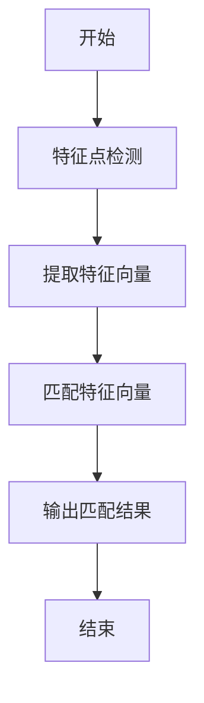

                 


# 企业估值中的生物识别技术应用评估

> 关键词：生物识别技术、企业估值、身份验证、算法原理、系统架构

> 摘要：生物识别技术作为一种新兴的身份验证手段，在企业估值中展现出独特的优势。本文通过分析生物识别技术的核心概念、算法原理、系统架构及其在企业估值中的具体应用，探讨其在企业管理与价值评估中的潜在价值和实现路径。

---

## 第1章：生物识别技术概述

### 1.1 生物识别技术的定义与特点

生物识别技术是一种通过人体特有的生理特征或行为特征进行身份验证的技术。其主要特征包括唯一性、稳定性、非接触性和安全性。常见的生物识别技术包括指纹识别、虹膜识别、面部识别、声音识别和笔迹识别等。

**核心概念：**
- **唯一性**：每个人的生理特征都是独一无二的，确保了身份识别的准确性。
- **稳定性**：生理特征在一定时间内相对稳定，便于长期使用。
- **非接触性**：许多生物识别技术无需物理接触设备，提高了使用的便捷性。
- **安全性**：生物特征难以被伪造，相较于传统的密码验证更加安全。

### 1.2 企业估值中的生物识别技术应用背景

企业估值通常依赖于财务数据、市场分析和管理层判断等传统方法，而生物识别技术的引入为企业估值提供了新的视角和数据支持。以下是具体应用场景：

**1.2.1 问题背景：**
传统的企业估值方法可能存在数据滞后、主观性强、难以量化员工状态等问题，导致估值结果不够准确。

**1.2.2 问题描述：**
- 数据来源单一，难以全面反映企业的实际运营状况。
- 员工的工作状态和健康状况对企业绩效有直接影响，但难以量化。
- 现有方法难以实时捕捉员工的生理和行为特征数据。

**1.2.3 解决方法：**
引入生物识别技术，实时采集和分析员工的生理特征数据，如面部表情、声音特征、工作状态等，以提供更全面的企业运营数据，辅助估值。

**1.2.4 边界与外延：**
生物识别技术的应用仅限于身份验证和相关特征数据的采集，不会涉及员工的隐私数据处理，且仅用于企业内部管理目的。

---

## 第2章：生物识别技术的核心原理

### 2.1 生物识别技术的原理

生物识别技术的实现过程包括特征采集、特征提取、特征匹配三个主要步骤。

#### 2.1.1 特征采集
通过传感器设备（如指纹采集器、摄像头）采集用户的生理特征数据。

#### 2.1.2 特征提取
利用算法从采集的特征数据中提取关键特征向量，例如面部识别中的关键特征点提取。

#### 2.1.3 特征匹配
将提取的特征向量与预存的特征模板进行比对，确定是否匹配。

### 2.2 生物识别技术的关键算法

#### 2.2.1 基于特征点的识别算法
- **原理**：通过检测特征点（如指纹的脊线、面部的五官位置）进行识别。
- **优点**：实现简单，计算速度快。
- **缺点**：易受光线、角度等因素影响。

#### 2.2.2 基于深度学习的识别算法
- **原理**：利用卷积神经网络（CNN）学习特征，提取高层次特征。
- **优点**：识别精度高，抗干扰能力强。
- **缺点**：需要大量标注数据进行训练，计算资源消耗大。

#### 2.2.3 基于模式识别的生物特征匹配
- **原理**：将提取的特征向量与特征库中的模板进行模式匹配。
- **优点**：通用性强，适用于多种生物特征识别。
- **缺点**：匹配速度可能较慢。

---

## 第3章：生物识别技术在企业估值中的具体应用

### 3.1 企业身份验证与访问控制

#### 3.1.1 员工身份验证
通过生物识别技术实现员工的身份验证，确保只有授权员工可以访问敏感数据和系统。

#### 3.1.2 第三方访问控制
对于企业合作伙伴或访客，可以使用生物识别技术进行身份验证，提升企业安全。

#### 3.1.3 安全监控
在企业关键区域（如数据中心）部署生物识别技术，实时监控和记录访问情况。

### 3.2 企业内部管理与流程优化

#### 3.2.1 员工考勤管理
通过生物识别技术实现员工考勤记录的自动化管理，提升考勤管理的效率和准确性。

#### 3.2.2 会议签到
在企业会议中使用生物识别技术进行签到，减少传统签到方式的时间浪费。

#### 3.2.3 工作状态监控
通过分析员工的生理特征数据（如面部表情、声音特征）来判断员工的工作状态，优化企业内部管理。

---

## 第4章：生物识别技术的系统架构与实现

### 4.1 系统架构设计

#### 4.1.1 分层架构
生物识别系统通常采用分层架构，包括数据采集层、特征提取层、特征匹配层和应用层。

#### 4.1.2 模块划分
- **数据采集模块**：负责采集生物特征数据。
- **特征提取模块**：对采集的数据进行特征提取。
- **特征匹配模块**：将提取的特征与数据库中的模板进行匹配。
- **应用层**：根据匹配结果进行相应的操作。

### 4.2 系统实现的关键技术

#### 4.2.1 特征采集技术
- 使用摄像头、指纹传感器等设备进行特征采集。
- 采集过程中需要注意光线、角度等因素的影响。

#### 4.2.2 特征提取与匹配算法
- **特征提取**：使用主成分分析（PCA）或深度学习模型提取特征向量。
- **特征匹配**：采用欧氏距离、余弦相似度等方法进行匹配。

---

## 第5章：算法原理与数学模型

### 5.1 基于特征点的识别算法

#### 5.1.1 特征点检测
- 使用Harris角点检测算法或SIFT算法检测关键特征点。
- 检测结果如图所示：



#### 5.1.2 特征点匹配
- 使用RANSAC算法进行特征点匹配，剔除 outliers。

### 5.2 基于深度学习的识别算法

#### 5.2.1 深度学习模型
- 使用卷积神经网络（CNN）进行特征提取。
- 模型结构如下：


#### 5.2.2 模型训练
- 使用MNIST数据集进行训练，优化模型参数。

---

## 第6章：项目实战与案例分析

### 6.1 项目环境安装

```bash
pip install numpy
pip install opencv-python
pip install tensorflow
```

### 6.2 核心代码实现

```python
import cv2
import os
import numpy as np
from tensorflow.keras.models import load_model

# 加载预训练模型
model = load_model('face_recognition_model.h5')

# 加载人脸检测器
face_cascade = cv2.CascadeClassifier('haarcascade_frontalface_default.xml')

# 采集视频流
cap = cv2.VideoCapture(0)

while True:
    ret, frame = cap.read()
    if not ret:
        continue
    gray = cv2.cvtColor(frame, cv2.COLOR_BGR2GRAY)
    faces = face_cascade.detectMultiScale(gray, 1.3, 5)
    for (x, y, w, h) in faces:
        face_roi = gray[y:y+h, x:x+w]
        face_roi = cv2.resize(face_roi, (100, 100))
        face_roi = np.array(face_roi, dtype=np.float32) / 255.0
        prediction = model.predict(np.array([face_roi.flatten()]))
        # 处理预测结果
    cv2.imshow('Face Recognition', frame)
    if cv2.waitKey(1) == ord('q'):
        break
cap.release()
cv2.destroyAllWindows()
```

---

## 第7章：最佳实践与小结

### 7.1 最佳实践
1. **数据隐私保护**：在生物识别系统的开发和部署中，必须严格保护用户数据的隐私。
2. **系统稳定性**：确保系统的稳定性和可靠性，避免因设备故障或网络问题导致服务中断。
3. **算法优化**：根据具体应用场景，选择合适的生物识别算法，并进行持续优化。

### 7.2 小结
生物识别技术作为一种高效、准确的身份验证手段，正在逐步应用于企业估值和内部管理中。通过合理设计和实施，生物识别技术能够显著提升企业的运营效率和估值准确性。

---

## 作者信息
作者：AI天才研究院 & 禅与计算机程序设计艺术

---

以上是《企业估值中的生物识别技术应用评估》的完整目录大纲，涵盖了生物识别技术的核心概念、算法原理、系统架构以及在企业估值中的具体应用。通过详细的技术分析和实战案例，本文为读者提供了全面的视角和深入的见解。

