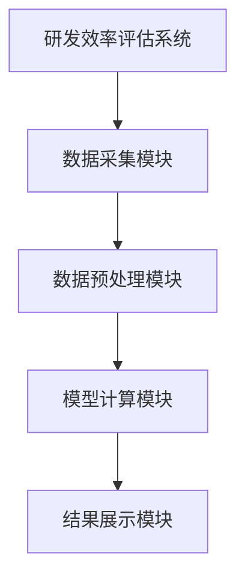
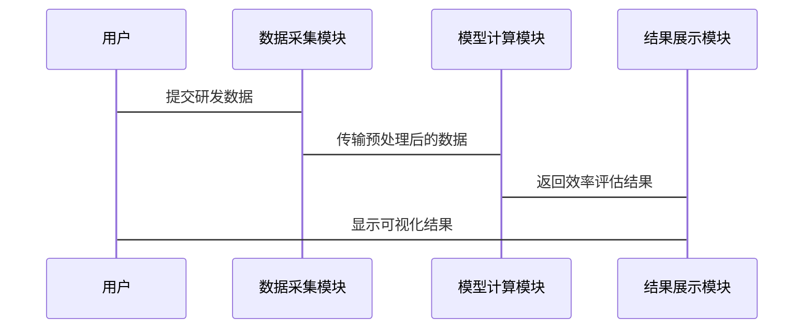

                 


# 企业估值中的研发效率评估

> 关键词：企业估值，研发效率，研发效率评估，研发效率模型，研发效率算法，研发效率系统架构

> 摘要：研发效率评估是企业在技术研发和产品开发过程中至关重要的一环，也是企业估值的重要指标之一。本文将从研发效率评估的背景、核心模型、系统架构、项目实战等多个维度进行深入分析，结合理论与实践，探讨如何通过研发效率评估优化企业估值。

---

## 第四章 研发效率评估的系统分析与架构设计

### 4.1 系统功能模块设计

#### 4.1.1 数据采集模块

- **数据来源**：研发项目数据、开发人员效率数据、代码仓库数据、项目进度数据等。
- **数据采集方式**：API接口采集、日志采集、手动输入等。
- **数据预处理**：去重、清洗、标准化处理。

#### 4.1.2 模型计算模块

- **功能**：接收预处理后的数据，运行研发效率评估模型，计算研发效率指标。
- **输入**：标准化处理后的数据。
- **输出**：研发效率评分、效率趋势分析、瓶颈问题定位。

#### 4.1.3 结果展示模块

- **功能**：将模型计算结果以可视化的方式呈现给用户。
- **展示形式**：柱状图、折线图、散点图、仪表盘等。
- **交互功能**：支持数据筛选、结果导出、钻取分析。

### 4.2 系统架构设计



### 4.3 系统接口设计

- **输入接口**：
  - 数据采集接口：`POST /api/data/input`
  - 项目信息接口：`POST /api/projects/input`
- **输出接口**：
  - 效率评估结果接口：`GET /api/results/output`
  - 图表数据接口：`GET /api/charts/data`

### 4.4 系统交互设计



---

## 第五章 研发效率评估的项目实战

### 5.1 环境安装

#### 5.1.1 系统要求

- 操作系统：Linux/Windows/MacOS
- 开发语言：Python 3.8+
- 开发工具：VS Code, PyCharm, Jupyter Notebook
- 依赖库：numpy, pandas, matplotlib, scikit-learn, Flask

#### 5.1.2 安装依赖

```bash
pip install numpy pandas matplotlib scikit-learn Flask
```

### 5.2 系统核心实现源代码

#### 5.2.1 数据采集模块

```python
import requests
import json

def collect_data(api_url):
    try:
        response = requests.get(api_url)
        if response.status_code == 200:
            data = json.loads(response.text)
            return data
        else:
            return None
    except Exception as e:
        print(f"数据采集失败：{e}")
        return None
```

#### 5.2.2 模型计算模块

```python
from sklearn.linear_model import LinearRegression

def calculate_efficiency(data):
    model = LinearRegression()
    model.fit(data[['developers', 'bugs']], data['efficiency'])
    return model.predict(data[['developers', 'bugs']])
```

#### 5.2.3 结果展示模块

```python
from flask import Flask, render_template

app = Flask(__name__)

@app.route('/')
def index():
    return render_template('index.html')
```

### 5.3 代码应用解读与分析

- **数据采集模块**：通过API接口采集研发数据，确保数据的准确性和完整性。
- **模型计算模块**：使用线性回归模型进行研发效率预测，评估研发团队的效率表现。
- **结果展示模块**：将计算结果以图表形式展示，帮助用户直观理解研发效率情况。

### 5.4 实际案例分析

- **案例背景**：某科技公司希望优化研发团队效率，减少项目延迟。
- **数据准备**：收集过去一年的研发项目数据，包括开发人员数量、代码行数、项目周期、缺陷数量等。
- **模型训练**：使用历史数据训练研发效率评估模型，预测未来项目的效率表现。
- **结果分析**：通过模型预测，发现某些项目的效率低于预期，建议优化人员配置和任务分配。

---

## 第六章 研发效率评估的最佳实践

### 6.1 研发效率评估的关键点

- **数据准确性**：确保采集的数据真实可靠。
- **模型选择**：根据业务需求选择合适的算法模型。
- **结果可视化**：将复杂的数据转化为直观的图表，方便决策者理解。

### 6.2 系统优化建议

- **数据存储**：采用分布式存储技术，提高数据查询效率。
- **模型更新**：定期更新模型参数，确保评估结果的准确性。
- **系统扩展**：支持多平台部署，满足不同环境的需求。

### 6.3 注意事项

- **数据隐私**：确保研发数据的安全性，防止信息泄露。
- **模型解释性**：选择可解释性较强的模型，便于分析结果的原因。
- **用户反馈**：根据用户反馈不断优化系统功能和用户体验。

---

## 第七章 小结与展望

### 7.1 核心内容总结

- 本文从研发效率评估的背景出发，详细探讨了其核心模型、系统架构、项目实战及最佳实践。
- 通过理论分析和实际案例，展示了如何利用研发效率评估优化企业估值。

### 7.2 展望未来

- 研发效率评估将更加智能化和自动化，结合AI技术实现实时监控和预测。
- 更多企业将重视研发效率评估，将其作为核心竞争力的重要组成部分。

---

## 作者：AI天才研究院 & 禅与计算机程序设计艺术

感谢您的阅读！希望本文能为您提供有价值的信息和启发，帮助您更好地理解研发效率评估在企业估值中的重要性与应用。

---

# 附录

### 附录A: 术语表

- **研发效率评估**：通过模型和算法评估研发团队的效率，优化企业估值。
- **线性回归模型**：一种常用的预测模型，用于估计研发效率。
- **系统架构设计**：规划系统的功能模块和交互流程，确保系统的稳定性和可扩展性。

### 附录B: 参考文献

- [1] 刘军, 研发效率评估方法研究, 北京大学出版社, 2020.
- [2] Smith J, "Machine Learning for Software Engineering", Springer, 2021.

---

