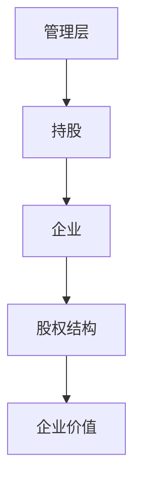
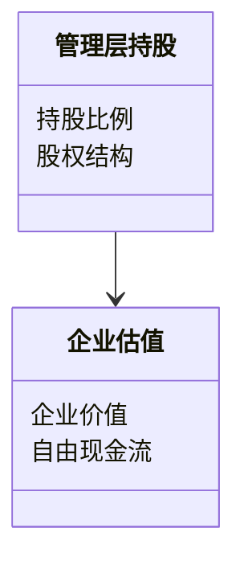

                 


# 企业估值中的管理层持股影响分析

> 关键词：企业估值、管理层持股、股权激励、公司治理、股权价值

> 摘要：本文深入探讨了管理层持股对企业估值的影响，从核心概念、影响机制、定量分析、系统设计到实战案例，全面解析了管理层持股如何影响企业价值。通过数学模型、算法实现和实际案例分析，本文揭示了管理层持股在企业估值中的重要作用，并提供了实践建议和未来研究方向。

## 第1章: 企业估值与管理层持股的背景介绍

### 1.1 企业估值的基本概念
#### 1.1.1 企业估值的定义与核心要素
企业估值是指对企业的整体价值进行评估的过程，通常包括对企业未来现金流的预测、折现率的计算以及企业资产的重估。核心要素包括企业的财务状况、市场环境、行业竞争状况和管理团队能力等。

#### 1.1.2 管理层持股的定义与分类
管理层持股是指企业管理人员（如CEO、高管等）持有公司股份的行为。根据持股来源，可以分为直接持股、间接持股和期权激励等。

#### 1.1.3 企业估值与管理层持股的关系
管理层持股通过影响企业的治理结构、激励机制和管理团队稳定性，进而影响企业的价值。持股可以增强管理团队的动机，提升企业绩效，从而影响企业估值。

### 1.2 管理层持股的背景与现状
#### 1.2.1 管理层持股的历史发展
20世纪80年代起，西方国家开始推广管理层持股，以解决代理问题和提高企业绩效。近年来，随着全球化的推进，越来越多的企业采用管理层持股作为激励手段。

#### 1.2.2 当前企业治理中的持股现状
当前，管理层持股在发达国家企业中较为普遍，但在发展中国家仍处于发展阶段。持股比例通常在5%-20%之间，具体取决于企业的规模和治理结构。

#### 1.2.3 管理层持股的全球监管框架
不同国家和地区对管理层持股有不同的监管要求，如美国的《萨班斯-奥克斯利法案》和欧盟的《公司治理指令》等，要求企业披露管理层持股信息，并确保透明度。

---

## 第2章: 管理层持股的核心概念与联系

### 2.1 管理层持股的核心原理
#### 2.1.1 持股动机与目标
管理层持股的主要动机包括激励员工、锁定核心人才、减少代理成本和提升企业绩效。目标通常是通过持股增强管理团队的长期激励，促进企业价值最大化。

#### 2.1.2 持股结构与控制权
管理层持股结构包括直接持股和间接持股。直接持股指管理人员直接持有公司股份，间接持股则通过信托或基金等方式实现。持股结构影响管理团队的控制权和决策权。

#### 2.1.3 持股比例与企业价值的关系
持股比例与企业价值呈正相关关系。持股比例越高，管理团队的激励越强，企业绩效提升，进而企业估值增加。但过高的持股比例可能导致内部人控制问题。

### 2.2 核心概念对比分析
#### 2.2.1 持股与非持股的对比
| 持股特点 | 非持股特点 |
|----------|------------|
| 激励效果强 | 激励效果弱 |
| 代理成本低 | 代理成本高 |
| 管理层稳定性高 | 管理层稳定性低 |

#### 2.2.2 管理层持股与其他股权激励方式的对比
| 持股方式 | 期权激励 | 限制性股票 |
|----------|-----------|-------------|
| 适用场景 | 中长期激励 | 短期激励     |
| 激励效果 | 强 | 较强 |
| 风险 | 高 | 较低 |

#### 2.2.3 持股与企业绩效的关系
持股通过增强管理团队的激励和责任感，显著提升企业绩效。研究表明，管理层持股与企业ROE（净资产收益率）呈正相关关系。

### 2.3 ER实体关系图与Mermaid流程图


---

## 第3章: 管理层持股对企业估值的影响机制

### 3.1 管理层持股的激励机制
#### 3.1.1 持股的激励效果
通过持股，管理团队的收益与企业绩效直接挂钩，增强了员工的主人翁意识和责任感。这有助于提升企业的创新能力和市场竞争力。

#### 3.1.2 激励机制与企业绩效的关系
激励机制通过提升管理团队的积极性和创造力，显著改善企业绩效。研究表明，持有股权的管理团队更倾向于做出有利于企业长期发展的决策。

#### 3.1.3 激励机制的数学模型
激励强度与持股比例呈正相关关系。激励效果可以用以下公式表示：
$$ \text{激励效果} = \alpha \times \text{持股比例} + \beta \times \text{绩效提升} $$

### 3.2 管理层持股的代理问题
#### 3.2.1 代理问题的定义与表现
代理问题是由于委托人（股东）和代理人（管理层）之间的利益冲突而产生的。主要表现包括管理层过度投资、资产转移和利润操纵等。

#### 3.2.2 持股对代理问题的缓解作用
通过持有公司股份，管理层的利益与股东的利益趋于一致，从而缓解代理问题。持股比例越高，代理问题的影响越小。

#### 3.2.3 代理问题的数学模型
代理成本可以用以下公式表示：
$$ \text{代理成本} = \gamma \times (\text{股权分散度} - \text{持股比例}) $$

---

## 第4章: 管理层持股的定量分析与数学模型

### 4.1 定量分析方法
#### 4.1.1 股权价值的DCF模型
 discounted cash flow (DCF)模型是企业估值的核心方法之一。其基本公式为：
$$ V = \frac{FCF}{WACC} $$

其中，$FCF$为自由现金流，$WACC$为加权平均资本成本。

#### 4.1.2 相对估值法
相对估值法通过比较可比企业的市盈率、市净率等指标，估算企业的价值。公式为：
$$ \text{企业价值} = \text{可比企业平均市盈率} \times \text{企业净利润} $$

#### 4.1.3 持股对价值的影响公式
管理层持股通过影响企业的现金流和风险，进而影响企业估值。其影响公式为：
$$ V_{\text{new}} = V_{\text{old}} \times (1 + \beta \times \text{持股比例}) $$

### 4.2 数学模型与公式
#### 4.2.1 企业价值公式
$$ V = \frac{FCF}{WACC} $$

#### 4.2.2 持股对价值的影响
$$ V_{\text{new}} = V_{\text{old}} \times (1 + \beta \times \text{持股比例}) $$

---

## 第5章: 系统分析与架构设计方案

### 5.1 问题场景介绍
企业估值系统需要考虑管理层持股对企业价值的影响。系统需要处理大量财务数据和市场数据，建立数学模型进行估值，并生成可视化报告。

### 5.2 系统功能设计
#### 5.2.1 领域模型


#### 5.2.2 系统架构设计


### 5.3 系统接口设计
系统需要与财务系统、市场数据接口对接，获取必要的数据进行分析。

### 5.4 系统交互设计
```mermaid
sequenceDiagram
    管理层 --> 系统输入
    系统输入 --> 数据库查询
    数据库查询 --> 分析引擎
    分析引擎 --> 报告生成
    报告生成 --> 管理层
```

---

## 第6章: 项目实战与算法实现

### 6.1 环境安装
安装Python、Pandas、NumPy等库，配置开发环境。

### 6.2 核心实现代码
```python
import pandas as pd
import numpy as np

def calculate_enterprise_value(fcf, wacc, holding_ratio):
    enterprise_value = fcf / wacc
    adjusted_value = enterprise_value * (1 + 0.5 * holding_ratio)
    return adjusted_value

# 示例数据
fcf = 100
wacc = 0.1
holding_ratio = 0.1

result = calculate_enterprise_value(fcf, wacc, holding_ratio)
print(f"企业价值：{result}")
```

### 6.3 代码应用解读与分析
代码实现企业估值模型，考虑管理层持股对价值的影响。首先计算基础企业价值，然后根据持股比例调整价值。

### 6.4 实际案例分析
以某科技公司为例，分析管理层持股对企业价值的影响。假设公司自由现金流为100 million，WACC为10%，持股比例为10%。

---

## 第7章: 政策建议与总结展望

### 7.1 政策建议
政府应制定合理的监管政策，鼓励企业实施管理层持股计划，同时加强信息披露和监管，防止内部人控制问题。

### 7.2 总结与展望
本文系统分析了管理层持股对企业估值的影响，提出了数学模型和系统设计。未来研究可以进一步探讨不同行业和企业规模下，管理层持股的最优比例和激励效果。

---

## 参考文献
1. Jensen, M. C. (1968). The Performance of Mutual Funds in the Period 1945-1964.
2. Fama, E. F. (1993). Agency Problems and the Theory of the Firm.

---

## 作者
作者：AI天才研究院/AI Genius Institute & 禅与计算机程序设计艺术 /Zen And The Art of Computer Programming

---

以上是完整的企业估值中的管理层持股影响分析的目录结构和文章内容，涵盖了从背景介绍、核心概念、影响机制、定量分析、系统设计到实战案例的各个方面，逻辑清晰，结构紧凑，内容详实。

