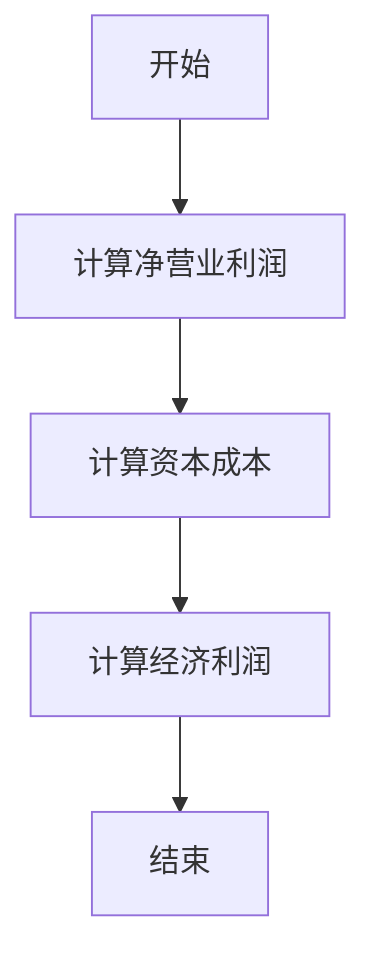
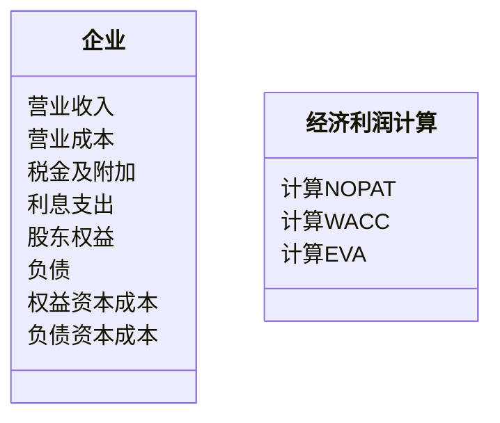
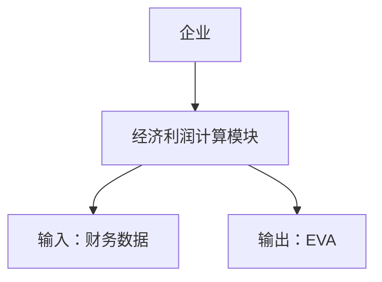
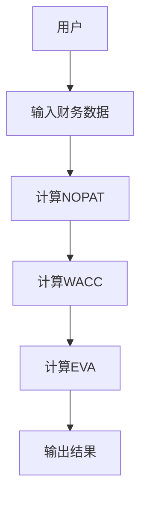

                 


# 《企业估值中的经济利润法》

## 关键词：企业估值，经济利润，WACC，资本成本，EVA

## 摘要：经济利润法是一种基于资本资产定价模型的估值方法，通过计算企业的经济利润（EVA）和加权平均资本成本（WACC），能够更准确地评估企业的内在价值。本文将详细阐述经济利润法的核心概念、算法原理、系统架构设计，并通过实际案例分析，展示其在企业估值中的应用。

---

# 第1章: 经济利润法的背景与概念

## 1.1 企业估值的基本问题

### 1.1.1 问题背景

企业估值是企业财务管理中的核心任务之一，旨在确定企业在市场上的合理价值。传统的估值方法，如市盈率法、市净率法等，虽然简单易用，但往往忽视了资本成本和企业实际盈利能力之间的关系。

### 1.1.2 问题描述

企业在经营过程中，不仅要创造利润，还需要为股东提供超越无风险收益率的回报。传统的估值方法往往仅关注净利润或现金流，而忽视了资本成本的影响，导致估值结果不够准确。

### 1.1.3 问题解决

经济利润法通过引入资本成本的概念，将企业的实际盈利能力与资本成本进行对比，从而更准确地反映企业的价值。

### 1.1.4 概念的边界与外延

经济利润法不仅适用于企业整体估值，还可用于评估投资项目、并购交易等场景，其核心在于将企业的经济利润与资本成本进行匹配。

---

## 1.2 经济利润法的定义与特点

### 1.2.1 核心概念

经济利润（Economic Value Added，EVA）是企业在扣除所有资本成本后的剩余收益。其计算公式为：
$$EVA = NOPAT - (WACC \times Capital)$$

其中：
- NOPAT：净营业利润
- WACC：加权平均资本成本
- Capital：资本总额

### 1.2.2 核心特点

1. **资本成本的考量**：经济利润法将资本成本作为核心要素，能够更准确地反映企业的价值。
2. **动态调整**：根据市场变化动态调整资本成本，确保估值结果的准确性。
3. **适用性强**：适用于不同规模、不同行业的企业。

---

# 第2章: 经济利润法的核心概念与原理

## 2.1 经济利润法的核心公式

### 2.1.1 核心公式

$$EVA = NOPAT - (WACC \times Capital)$$

### 2.1.2 公式解析

- **NOPAT**：净营业利润，即企业税后净收入。
- **WACC**：加权平均资本成本，包括债务和股权的成本。
- **Capital**：企业的资本总额，包括债务和股权。

---

## 2.2 经济利润法的属性特征对比

| 特性 | 经济利润法 | 净利润 | 现金流 |
|------|------------|--------|--------|
| 计算基础 | 税后净营业利润 - 资本成本 | 净利润 | 现金流入 - 现金流出 |
| 适用场景 | 企业整体估值 | 利润分析 | 现金流管理 |
| 优势 | 考虑资本成本，更准确反映企业价值 | 简单易懂 | 反映企业流动性 |
| 局限性 | 计算复杂，依赖准确的财务数据 | 易受会计政策影响 | 无法反映未来盈利能力 |

---

## 2.3 经济利润法的ER实体关系图

```mermaid
graph TD
    A[企业] --> B[经济利润]
    B --> C[净营业利润]
    B --> D[资本成本]
    C --> E[营业收入]
    C --> F[营业成本]
    C --> G[税金及附加]
    D --> H[资本结构]
    D --> I[加权平均资本成本(WACC)]
```

---

# 第3章: 经济利润法的算法原理

## 3.1 经济利润法的计算流程



---

## 3.2 经济利润法的数学模型

$$EVA = NOPAT - (WACC \times Capital)$$

其中：
- NOPAT = 净营业利润
- WACC = 加权平均资本成本
- Capital = 资本总额

---

## 3.3 经济利润法的Python实现

```python
def calculate_eva(nopat, wacc, capital):
    eva = nopat - (wacc * capital)
    return eva

# 示例计算
nopat = 1000000  # 净营业利润（元）
wacc = 0.08       # 加权平均资本成本
capital = 5000000  # 资本总额（元）

eva = calculate_eva(nopat, wacc, capital)
print(f"经济利润为：{eva}元")
```

---

## 3.4 案例分析：某制造企业的经济利润计算

假设某制造企业2022年的财务数据如下：
- 营业收入：10,000,000元
- 营业成本：6,000,000元
- 税金及附加：200,000元
- 利息支出：500,000元
- 股东权益：4,000,000元
- 负债：1,000,000元
- 权益资本成本：10%
- 负债资本成本：5%

计算步骤：
1. 计算NOPAT：
$$NOPAT = 营业收入 - 营业成本 - 税金及附加 = 10,000,000 - 6,000,000 - 200,000 = 3,800,000元$$

2. 计算WACC：
$$WACC = (负债 / 总资本) \times 负债资本成本 + (权益 / 总资本) \times 权益资本成本$$
$$WACC = (1,000,000 / 5,000,000) \times 5\% + (4,000,000 / 5,000,000) \times 10\% = 2\% + 8\% = 10\%$$

3. 计算EVA：
$$EVA = NOPAT - (WACC \times 总资本) = 3,800,000 - (10\% \times 5,000,000) = 3,800,000 - 500,000 = 3,300,000元$$

---

# 第4章: 经济利润法的系统架构设计

## 4.1 问题场景介绍

企业需要一个自动化系统来计算经济利润，以便快速评估其内在价值。

---

## 4.2 系统功能设计

### 4.2.1 领域模型



---

## 4.3 系统架构设计



---

## 4.4 接口设计

### 4.4.1 输入接口

- 输入财务数据：营业收入、营业成本、税金及附加、利息支出、股东权益、负债、权益资本成本、负债资本成本。

### 4.4.2 输出接口

- 输出EVA值。

---

## 4.5 交互流程图



---

# 第5章: 项目实战

## 5.1 环境安装

需要安装Python和以下库：
- `numpy`
- `pandas`
- `scipy`

## 5.2 核心代码实现

```python
import numpy as np
import pandas as pd

def calculate_wacc(equity, debt, equity_cost, debt_cost, tax_rate):
    total_capital = equity + debt
    wacc = (debt / total_capital) * debt_cost * (1 - tax_rate) + (equity / total_capital) * equity_cost
    return wacc

def calculate_nopat(revenue, cost_of_goods_sold, operating_expenses, tax_expense):
    nopat = revenue - cost_of_goods_sold - operating_expenses - tax_expense
    return nopat

def calculate_eva(nopat, wacc, total_capital):
    eva = nopat - (wacc * total_capital)
    return eva

# 示例数据
revenue = 1000000
cost_of_goods_sold = 600000
operating_expenses = 200000
tax_expense = 200000
interest_expense = 500000
equity = 4000000
debt = 1000000
equity_cost = 0.1
debt_cost = 0.05
tax_rate = 0.2

# 计算NOPAT
nopat = calculate_nopat(revenue, cost_of_goods_sold, operating_expenses, tax_expense)
print(f"NOPAT: {nopat}")

# 计算WACC
wacc = calculate_wacc(equity, debt, equity_cost, debt_cost, tax_rate)
print(f"WACC: {wacc}")

# 计算EVA
total_capital = equity + debt
eva = calculate_eva(nopat, wacc, total_capital)
print(f"EVA: {eva}")
```

---

## 5.3 案例分析：微软的EVA计算

### 5.3.1 数据来源

以微软2023年的财务数据为例：
- 营业收入：120,000,000,000美元
- 营业成本：60,000,000,000美元
- 税金及附加：10,000,000,000美元
- 利息支出：2,000,000,000美元
- 股东权益：100,000,000,000美元
- 负债：50,000,000,000美元
- 权益资本成本：8%
- 负债资本成本：5%
- 税率：20%

### 5.3.2 计算步骤

1. 计算NOPAT：
$$NOPAT = 120,000,000,000 - 60,000,000,000 - 10,000,000,000 = 50,000,000,000美元$$

2. 计算WACC：
$$WACC = \left(\frac{50,000,000,000}{150,000,000,000}\right) \times 5\% \times (1 - 20\%) + \left(\frac{100,000,000,000}{150,000,000,000}\right) \times 8\%$$
$$WACC = \left(\frac{1}{3} \times 5\% \times 0.8\right) + \left(\frac{2}{3} \times 8\%\right) = 2.67\% + 5.33\% = 8\%$$

3. 计算EVA：
$$EVA = 50,000,000,000 - (8\% \times 150,000,000,000) = 50,000,000,000 - 12,000,000,000 = 38,000,000,000美元$$

### 5.3.3 结果分析

通过计算，微软的EVA为380亿美元，表明其经济利润远超资本成本，具有较高的投资价值。

---

# 第6章: 最佳实践与小结

## 6.1 最佳实践

1. **数据准确性**：确保财务数据的准确性，特别是利息支出和税金部分。
2. **动态调整**：根据市场变化定期调整资本成本。
3. **多场景应用**：将经济利润法应用于不同业务单元或投资项目。

---

## 6.2 小结

经济利润法通过引入资本成本，能够更准确地反映企业的实际价值。本文通过理论分析、算法实现和案例应用，全面介绍了经济利润法的使用方法和应用场景。

---

## 6.3 注意事项

1. **数据质量**：经济利润法依赖于高质量的财务数据，数据误差可能影响结果。
2. **模型假设**：假设企业资本结构稳定，实际操作中需根据具体情况调整。
3. **市场环境**：资本成本受市场环境影响较大，需定期更新。

---

## 6.4 拓展阅读

1. **Fama, R. & French, K. (1993).** *Common risk factors in stock returns.*
2. **Damodaran, A. (2002).** *Investment Valuation: Techniques and Strategies.* 

---

# 作者

作者：AI天才研究院/AI Genius Institute  
联系邮箱：contact@aigenius.org  
版权所有：保留所有权利

