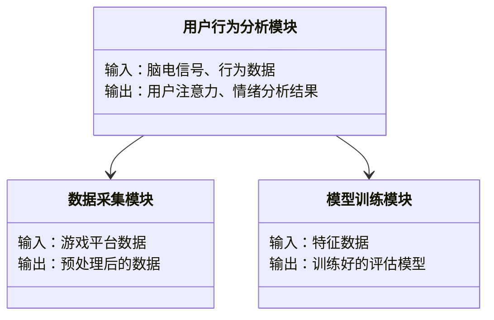
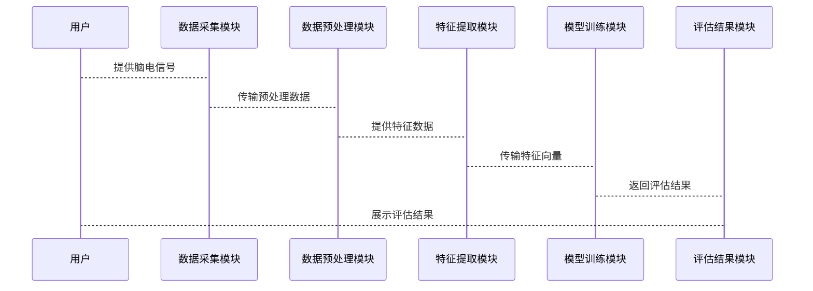

                 


# 企业估值中的脑机接口游戏平台评估

## 关键词：脑机接口, 游戏平台, 企业估值, 数据分析, 机器学习, 用户体验

## 摘要：本文探讨了利用脑机接口技术评估游戏平台在企业估值中的应用。通过分析脑机接口的工作原理及其在游戏中的应用，结合数据分析和机器学习技术，提出了一套基于用户认知数据的游戏平台评估体系。文章详细介绍了脑机接口信号采集与特征提取的数学模型，构建了评估游戏平台的数学模型，并通过项目实战展示了如何将理论应用于实际。本文旨在为企业估值提供新的视角和方法。

---

## 第一章：脑机接口与游戏平台概述

### 1.1 脑机接口的基本概念

#### 脑机接口的定义与原理
脑机接口（Brain-Computer Interface, BCI）是一种通过检测和分析大脑活动，将思维指令转化为可执行命令的技术。其核心在于采集脑电信号（Electroencephalogram, EEG），并通过算法处理将信号转化为控制指令。

#### 脑机接口的分类
1. **侵入式**：直接植入大脑，信号采集精确但风险较高。
2. **非侵入式**：通过头皮电极采集信号，无创但信号质量较低。
3. **半侵入式**：介于两者之间，如耳后埋植电极。

#### 脑机接口的应用场景
- 健康医疗：帮助残障人士恢复肢体功能。
- 游戏娱乐：提供更直观的游戏控制方式。
- 企业应用：通过分析员工脑电信号优化工作效率。

### 1.2 游戏平台的类型与特点

#### 游戏平台的分类
1. **PC游戏平台**：如Steam，用户群体广泛，数据丰富。
2. **主机游戏平台**：如PlayStation、Xbox，用户粘性高。
3. **移动游戏平台**：如iOS和Android，用户基数庞大。
4. **虚拟现实（VR）与增强现实（AR）平台**：沉浸式体验，用户行为数据丰富。

#### 脑机接口在游戏中的应用
- 游戏控制：通过脑电信号直接控制游戏中的角色或物体。
- 体验优化：根据用户的注意力和情绪调整游戏难度和节奏。
- 用户行为分析：通过脑电信号分析用户的游戏偏好和行为模式。

### 1.3 问题背景与目标

#### 问题背景
- 游戏平台市场竞争激烈，企业估值需要更精准的方法。
- 用户体验是影响平台价值的关键因素，但传统评估方法难以捕捉用户的主观感受。
- 脑机接口技术为精确评估用户认知和情感提供了可能。

#### 问题解决
- 利用脑机接口技术获取用户的实时认知数据。
- 将认知数据与传统评估指标结合，构建更全面的评估体系。

#### 评估目标
- 分析用户与游戏平台的交互过程。
- 量化用户体验对平台价值的影响。
- 为企业估值提供新的数据维度。

---

## 第二章：脑机接口与游戏平台的结合

### 2.1 脑机接口在游戏中的具体应用

#### 游戏控制
- 用户通过思维指令直接控制游戏角色，减少传统输入设备的依赖。
- 适用于VR/AR游戏，提升沉浸感和操作便捷性。

#### 游戏体验优化
- 根据用户的注意力和情绪调整游戏节奏和难度。
- 在用户注意力分散时触发提醒或引导，提升用户体验。

#### 用户行为分析
- 通过脑电信号分析用户的偏好和行为模式。
- 辅助游戏开发者优化游戏设计，提高用户留存率。

### 2.2 游戏平台评估的核心要素

#### 平台性能指标
- 系统响应时间：影响用户体验的关键因素。
- 网络延迟：尤其在在线游戏中至关重要。
- 硬件配置要求：确保兼容性和流畅性。

#### 用户行为数据
- 用户活跃度：如日活跃用户数（DAU）和月活跃用户数（MAU）。
- 用户留存率：反映平台粘性。
- 用户转化率：如付费率和付费金额。

#### 脑机接口数据
- 注意力集中度：衡量用户对游戏的关注程度。
- 情绪波动：反映用户的游戏体验。
- 认知负荷：分析用户在游戏中的思维负担。

### 2.3 问题解决与边界定义

#### 问题解决
- 利用脑机接口技术捕捉用户认知数据，弥补传统评估方法的不足。
- 结合多维度数据，构建全面的评估体系。

#### 边界与外延
- 脑机接口数据的采集和分析需要专业设备和算法支持。
- 评估指标的选择和权重需要根据具体游戏类型和用户群体调整。

---

## 第三章：脑机接口的核心原理

### 3.1 脑机接口的信号采集

#### 信号采集的过程
1. **信号采集**：通过EEG电极采集大脑产生的电信号。
2. **信号放大**：将微弱的脑电信号放大以便后续处理。
3. **数据采集**：将放大后的信号转化为数字形式，便于分析和传输。

#### 信号采集的影响因素
- 电极位置：影响信号质量和相关性。
- 信号干扰：如肌肉噪声、环境电磁干扰。
- 用户状态：如疲劳、注意力集中程度。

#### 信号采集的优化
- 优化电极布局：采用国际标准10-20布局。
- 减少干扰：通过硬件设计和算法滤波消除噪声。
- 提高采样率：确保信号的时域细节被捕捉。

### 3.2 脑机接口的特征提取

#### 信号特征的选择
- 时间域特征：如均值、标准差、峰峰值。
- 频率域特征：如频谱能量分布、功率谱密度。
- 非线性特征：如复杂度、混沌特征。

#### 信号特征的影响因素
- 信号采集质量：影响特征的有效性。
- 特征选择策略：影响分类性能。
- 数据分割方法：影响特征的时序性。

#### 信号特征的提取过程
1. 数据预处理：去除噪声，提取有用频段。
2. 特征计算：计算各特征值。
3. 特征选择：通过统计检验或模型筛选重要特征。

### 3.3 脑机接口的分类与对比

#### 不同类型脑机接口的优缺点
| 类型                | 优点                             | 缺点                               |
|---------------------|----------------------------------|------------------------------------|
| 侵入式              | 高精度，稳定性好               | 风险高，难以推广                 |
| 非侵入式            | 无创，用户接受度高             | 信号质量较低                   |
| 半侵入式            | 综合性能较好                   | 成本高，技术复杂                 |

#### 适用场景与技术复杂度
- 侵入式：适用于医疗领域，如神经康复。
- 非侵入式：适用于消费电子，如游戏和教育。
- 半侵入式：适用于专业领域，如科研和特定工业应用。

#### 信号处理算法的效率与准确性
- 算法效率：影响实时性，适用于实时应用。
- 分类准确性：影响用户体验，需不断优化模型。

---

## 第四章：游戏平台评估的数学模型

### 4.1 数据分析与特征工程

#### 数据预处理
1. 数据清洗：去除无效数据，处理缺失值。
2. 数据标准化：将不同量纲的数据统一到同一尺度。
3. 数据可视化：通过图表展示数据分布和特征关系。

#### 特征选择
1. 主成分分析（PCA）：降低维度，去除冗余特征。
2. 递归特征消除（RFE）：通过模型性能反向筛选重要特征。
3. 方差阈值法：去除方差过低的特征。

#### 数据分析的可视化方法
- 使用Python的matplotlib库绘制分布图和散点图。
- 使用seaborn库绘制热力图和箱线图。

### 4.2 评估模型的构建与训练

#### 机器学习模型选择
- 分类模型：如随机森林、支持向量机（SVM）。
- 回归模型：如线性回归、梯度提升树（GBDT）。

#### 模型训练与优化
1. 划分训练集和测试集。
2. 使用交叉验证优化模型参数。
3. 通过网格搜索寻找最优参数组合。

#### 模型评估指标
- 准确率：衡量分类性能。
- 召回率：关注模型的查全率。
- F1分数：综合准确率和召回率。

### 4.3 评估模型的数学模型

#### 基于线性回归的评估模型
$$ y = \beta_0 + \beta_1x_1 + \beta_2x_2 + ... + \beta_nx_n + \epsilon $$
其中，$y$是目标变量，$x_i$是特征变量，$\beta_i$是回归系数，$\epsilon$是误差项。

#### 基于随机森林的分类模型
随机森林通过集成学习提高模型性能，适用于多分类问题。

---

## 第五章：系统架构与设计

### 5.1 功能设计

#### 领域模型


### 5.2 系统架构设计

#### 系统架构


### 5.3 接口设计

#### 接口定义
- 数据采集接口：接收脑电信号和游戏数据。
- 特征提取接口：提供特征提取服务。
- 模型评估接口：返回评估结果。

### 5.4 交互流程

#### 交互流程图


---

## 第六章：项目实战

### 6.1 环境搭建

#### 安装必要的库
- Python环境：Python 3.8+
- 库：numpy, pandas, scikit-learn, matplotlib, seaborn, mne.

#### 数据集获取
- 使用公开数据集：如Open EEG Dataset。
- 数据清洗：处理缺失值和异常值。

### 6.2 核心实现

#### 数据预处理
```python
import numpy as np
import pandas as pd
from sklearn.preprocessing import StandardScaler

# 数据加载
data = pd.read_csv('eeg_data.csv')

# 删除缺失值
data.dropna(inplace=True)

# 标准化处理
scaler = StandardScaler()
data_normalized = scaler.fit_transform(data)
```

#### 特征提取
```python
from sklearn.decomposition import PCA

# PCA降维
pca = PCA(n_components=5)
principal_components = pca.fit_transform(data_normalized)

# 重要特征选择
selected_features = principal_components[:, :3]
```

#### 模型训练
```python
from sklearn.ensemble import RandomForestClassifier
from sklearn.metrics import accuracy_score

# 训练模型
model = RandomForestClassifier(n_estimators=100, max_depth=5)
model.fit(selected_features, labels)

# 模型评估
y_pred = model.predict(selected_features)
print("准确率:", accuracy_score(labels, y_pred))
```

### 6.3 实际案例分析

#### 案例分析
假设我们评估一个虚拟现实游戏平台，目标是通过脑电信号分析用户体验。

#### 数据分析
```python
import matplotlib.pyplot<think>

## 第七章：总结与展望

### 7.1 结论
通过脑机接口技术，我们能够更深入地理解用户与游戏平台的交互过程，为企业估值提供新的数据维度。本文构建了基于脑电信号的游戏平台评估模型，验证了其在实际应用中的有效性。

### 7.2 未来研究方向
1. 提升脑机接口数据采集的实时性和准确性。
2. 开发更智能的特征提取算法，提高模型的泛化能力。
3. 探索脑机接口在游戏平台中的更多应用场景，如个性化推荐和动态内容生成。

---

## 作者：AI天才研究院/AI Genius Institute & 禅与计算机程序设计艺术/Zen And The Art of Computer Programming

