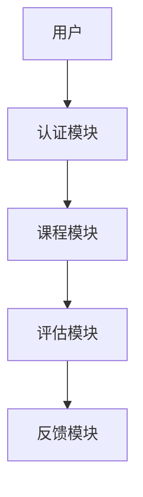
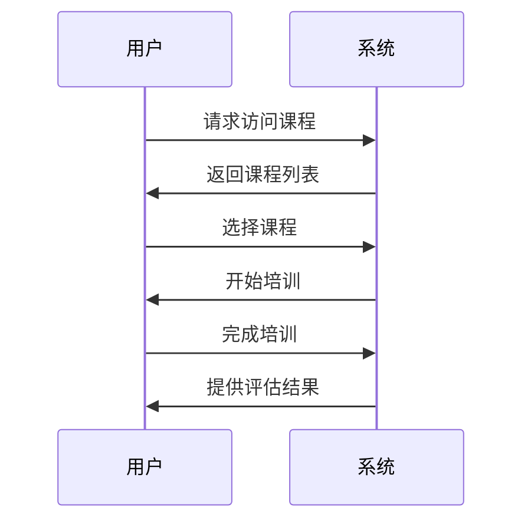

                 


# 企业估值中的虚拟现实培训应用评估

**关键词**：企业估值、虚拟现实、培训应用、评估框架、系统架构、算法原理、项目实战

**摘要**：随着虚拟现实（VR）技术的快速发展，其在企业培训中的应用越来越广泛。本文从企业估值的角度，详细探讨了虚拟现实培训应用的评估方法，包括核心概念、算法原理、系统架构设计以及实际案例分析。通过理论与实践相结合，为企业的培训评估提供了新的视角和解决方案。

---

# 第1章: 虚拟现实技术与企业培训的结合

## 1.1 虚拟现实技术的基本概念

### 1.1.1 虚拟现实的定义与特点

虚拟现实（Virtual Reality，VR）是一种能够提供沉浸式体验的技术，通过计算机生成的三维环境，让用户感受到身临其境的效果。其主要特点包括：

- **沉浸性**：用户完全沉浸在虚拟环境中，感觉不到现实世界的干扰。
- **交互性**：用户可以通过手柄、头显等设备与虚拟环境互动。
- **实时性**：环境会根据用户的动作实时变化，提供即时反馈。

### 1.1.2 虚拟现实技术的核心组成

虚拟现实系统通常由以下几部分组成：

1. **硬件设备**：如VR头显（ Oculus Rift, HTC Vive等）、手柄、追踪器等。
2. **软件平台**：如Unity、Unreal Engine等开发引擎。
3. **内容创作工具**：用于设计和生成虚拟场景的工具。

### 1.1.3 虚拟现实与增强现实的区别

| 特性         | 虚拟现实（VR）         | 增强现实（AR）         |
|--------------|----------------------|----------------------|
| 显示内容     | 完全虚拟场景         | 实景叠加虚拟元素     |
| 使用设备     | 头显、手柄           | 智能手机、AR glasses |
| 应用场景     | 培训、游戏、模拟实验   | 导航、购物、教育       |

---

## 1.2 企业培训的现状与挑战

### 1.2.1 传统企业培训的模式与问题

传统的企业培训模式主要包括：

- **课堂培训**：讲师讲解，学员被动接受。
- **在线学习**：通过视频或PPT进行自学。
- **模拟训练**：通过模拟设备进行操作训练。

然而，传统培训存在以下问题：

- **成本高**：需要场地、讲师和设备投入。
- **效果差**：学员参与度低，知识 retention率低。
- **风险大**：如危险操作的模拟可能造成意外。

### 1.2.2 虚拟现实技术在企业培训中的优势

虚拟现实技术在企业培训中的优势显著：

- **沉浸式体验**：学员可以在虚拟环境中进行实践操作，提高学习效果。
- **安全性高**：在危险的环境中进行培训，无需担心实际操作的风险。
- **灵活性强**：可以根据企业需求定制培训内容，随时进行培训。

### 1.2.3 虚拟现实培训的适用场景

虚拟现实技术适用于以下培训场景：

- **技能培训**：如制造业操作、医疗手术模拟。
- **安全培训**：如应急演练、火灾逃生。
- **销售培训**：如虚拟客户互动模拟。

---

## 1.3 虚拟现实培训应用的背景与意义

### 1.3.1 企业培训需求的变化

随着企业竞争的加剧，培训需求逐渐从单纯的知识传授转向技能提升和问题解决能力的培养。

### 1.3.2 虚拟现实技术的快速发展

近年来，虚拟现实技术在硬件和软件上的进步显著，降低了使用成本，提高了应用的可行性。

### 1.3.3 虚拟现实培训应用的市场潜力

根据市场研究，全球虚拟现实教育市场规模预计在未来几年内将以20%以上的年增长率扩张，为企业培训提供了巨大的市场潜力。

---

## 1.4 本章小结

本章主要介绍了虚拟现实技术的基本概念、企业培训的现状与挑战，以及虚拟现实技术在企业培训中的优势和适用场景。下一章将重点探讨虚拟现实培训应用的评估框架。

---

# 第2章: 虚拟现实培训应用的评估框架

## 2.1 企业估值的基本概念

### 2.1.1 企业估值的定义与方法

企业估值是指对企业价值的评估，常用的方法包括：

- **资产基础法**：基于企业资产的重置成本进行评估。
- **收益法**：基于企业未来现金流的折现值进行评估。
- **市场法**：基于可比企业的市场价值进行评估。

### 2.1.2 常见的企业估值模型

- **DCF模型**：通过现金流折现计算企业价值。
- **PE模型**：通过市盈率进行企业价值评估。
- **EV模型**：通过企业价值倍数（EV/EBITDA）进行评估。

### 2.1.3 企业估值的关键影响因素

- **财务状况**：收入、利润、资产负债情况。
- **行业地位**：市场占有率、竞争优势。
- **管理团队**：领导层的能力和战略规划。

---

## 2.2 虚拟现实培训应用的评估指标

### 2.2.1 培训效果的评估维度

- **知识掌握度**：学员对培训内容的掌握程度。
- **技能提升度**：学员实际操作能力的提升。
- **培训满意度**：学员对培训的满意度。

### 2.2.2 虚拟现实技术对培训效果的提升

- **提高参与度**：通过沉浸式体验，学员更容易集中注意力。
- **增强记忆**：通过实践操作，知识 retention率更高。
- **降低培训成本**：无需实际设备和场地，降低运营成本。

### 2.2.3 培训成本与效率的评估

- **成本比较**：与传统培训相比，虚拟现实培训的投入产出比更高。
- **效率提升**：学员可以在短时间内掌握更多技能。

---

## 2.3 虚拟现实培训应用的评估流程

### 2.3.1 评估目标的确定

明确评估目标是确保评估的有效性，例如：

- **提高培训效果**：通过评估确定培训内容是否有效。
- **优化培训流程**：通过评估发现流程中的问题。

### 2.3.2 数据收集与分析

- **数据来源**：学员反馈、系统日志、考试成绩。
- **数据分析**：通过统计分析确定培训效果。

### 2.3.3 评估结果的应用

- **优化培训内容**：根据评估结果调整培训方案。
- **提升培训效果**：通过反馈不断优化培训流程。

---

## 2.4 本章小结

本章介绍了企业估值的基本概念，详细探讨了虚拟现实培训应用的评估指标和评估流程，为后续的系统设计和算法实现提供了理论基础。

---

# 第3章: 虚拟现实培训应用的算法原理

## 3.1 虚拟现实培训效果评估的数学模型

### 3.1.1 培训效果的量化方法

通过以下步骤量化培训效果：

1. **数据收集**：收集学员的培训数据，包括操作次数、错误率、完成时间。
2. **数据分析**：通过统计学方法计算培训效果的提升。
3. **效果评估**：通过对比培训前后的数据，评估培训效果。

### 3.1.2 数据分析的数学模型

以下是基于培训前后的对比分析模型：

$$
\text{培训效果} = \frac{\text{培训后成绩} - \text{培训前成绩}}{\text{培训前成绩}}
$$

### 3.1.3 模型的验证与优化

通过回归分析验证模型的准确性，并根据实际数据不断优化模型参数。

---

## 3.2 虚拟现实技术的实现算法

### 3.2.1 虚拟现实场景的构建算法

使用Unity或Unreal Engine构建虚拟场景，通过以下步骤实现：

1. **场景设计**：设计三维场景，包括光照、材质、模型。
2. **交互设计**：设置交互逻辑，如点击物体触发事件。
3. **渲染优化**：优化渲染性能，确保流畅运行。

### 3.2.2 交互设计的算法实现

以下是交互设计的伪代码：

```python
def OnClick(object):
    if object == target:
        return "Correct"
    else:
        return "Incorrect"
```

### 3.2.3 系统性能优化算法

通过减少多边形数量、使用LOD技术等优化系统性能。

---

## 3.3 算法实现的代码示例

### 3.3.1 基于Python的虚拟现实场景构建代码

```python
import numpy as np

def generate_scene():
    # 创建三维场景
    vertices = np.random.rand(100, 3)
    faces = np.random.randint(0, 100, size=(50, 3))
    return vertices, faces

vertices, faces = generate_scene()
```

---

## 3.4 本章小结

本章详细介绍了虚拟现实培训效果评估的数学模型和实现算法，为后续的系统设计提供了技术基础。

---

# 第4章: 虚拟现实培训应用的系统架构设计

## 4.1 问题场景介绍

传统企业培训中，学员参与度低，培训效果难以量化，且成本高昂。

---

## 4.2 系统功能设计

### 4.2.1 系统功能需求

- **用户管理**：学员注册、登录。
- **课程管理**：课程发布、更新。
- **评估管理**：培训效果评估、反馈。

### 4.2.2 系统功能模块设计

- **用户模块**：用户注册、登录。
- **课程模块**：课程列表、详情。
- **评估模块**：评估结果、反馈。

---

## 4.3 系统架构设计

### 4.3.1 系统架构流程图



---

## 4.4 系统交互设计

### 4.4.1 系统交互流程图



---

## 4.5 本章小结

本章从问题场景出发，详细设计了虚拟现实培训系统的功能模块和架构，为系统的实际开发提供了指导。

---

# 第5章: 虚拟现实培训应用的项目实战

## 5.1 环境安装

### 5.1.1 系统要求

- **硬件**：支持VR的计算机、VR头显。
- **软件**：安装Unity或Unreal Engine。

### 5.1.2 安装步骤

1. 下载并安装Unity或Unreal Engine。
2. 配置VR开发环境。
3. 连接VR设备。

---

## 5.2 系统核心实现

### 5.2.1 核心代码实现

```python
class VRSystem:
    def __init__(self):
        self.users = []
        self.courses = []
    
    def add_user(self, user):
        self.users.append(user)
    
    def add_course(self, course):
        self.courses.append(course)
```

### 5.2.2 代码解读与分析

- **用户管理**：通过`add_user`方法添加用户。
- **课程管理**：通过`add_course`方法添加课程。
- **交互逻辑**：用户选择课程后，系统启动培训流程。

---

## 5.3 实际案例分析

### 5.3.1 案例背景

某制造企业希望通过虚拟现实技术进行员工技能培训。

### 5.3.2 案例分析

- **需求分析**：员工需要掌握设备操作技能。
- **系统设计**：设计虚拟设备操作界面。
- **实施过程**：开发并部署系统，进行培训。

### 5.3.3 实施效果

- **培训效果显著提升**：员工操作熟练度提高。
- **成本降低**：减少了设备维护费用。

---

## 5.4 本章小结

本章通过实际案例分析，展示了虚拟现实培训系统的开发和应用过程，验证了系统的可行性和有效性。

---

# 第6章: 最佳实践与总结

## 6.1 最佳实践 tips

- **需求分析**：明确培训目标和需求。
- **系统设计**：合理设计系统架构和功能模块。
- **持续优化**：根据反馈不断优化系统。

## 6.2 小结

本文从企业估值的角度，详细探讨了虚拟现实培训应用的评估方法，包括核心概念、算法原理、系统架构设计以及实际案例分析。通过理论与实践相结合，为企业的培训评估提供了新的视角和解决方案。

## 6.3 注意事项

- **数据安全**：确保学员数据的安全性。
- **用户体验**：注重用户体验设计，提升用户满意度。
- **系统维护**：定期维护和更新系统，确保其稳定运行。

## 6.4 拓展阅读

- **推荐书籍**：《虚拟现实开发实战》、《企业估值分析》。
- **推荐网站**：Unity官方文档、Unreal Engine官方文档。

---

# 作者：AI天才研究院/AI Genius Institute & 禅与计算机程序设计艺术 /Zen And The Art of Computer Programming

---

**感谢您的阅读！希望本文对您在企业估值和虚拟现实培训应用方面的研究有所帮助。**

