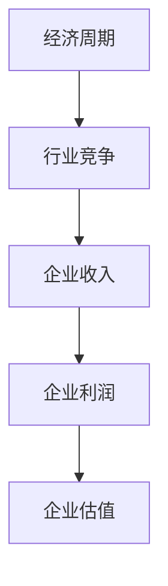
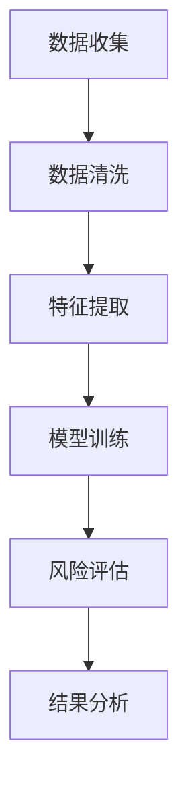
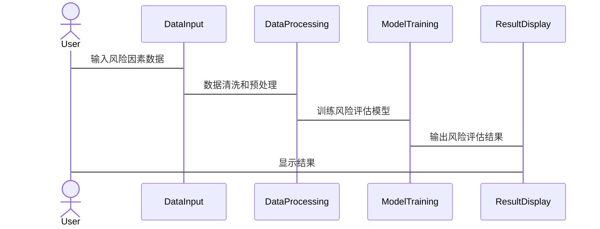

                 


# 《企业估值中的风险因素分析》

---

## 关键词：
企业估值, 风险因素, 风险分析, 财务分析, 系统设计, 数学模型, 项目实战

---

## 摘要：
企业估值是企业管理和投资决策中的核心问题之一。在企业估值过程中，风险因素分析是决定企业价值的重要环节。本文从风险因素分析的基本概念出发，结合数学模型和系统设计，详细探讨了风险因素对企业估值的影响。通过具体案例分析和项目实战，本文为企业估值中的风险因素分析提供了系统化的解决方案和实践指导。

---

## 第一部分: 企业估值与风险因素分析基础

### 第1章: 企业估值与风险因素概述

#### 1.1 企业估值的基本概念
企业估值是通过对企业的财务状况、市场地位、经营能力等多方面因素的综合分析，估算企业价值的过程。企业估值是企业管理和投资决策中的重要工具，广泛应用于并购、融资、上市等场景。

企业价值的构成要素包括资产价值、未来现金流、品牌价值、管理团队能力等。企业估值的主要方法包括资产法、收益法、市场法等。

---

#### 1.2 风险因素在企业估值中的作用
风险因素是指可能影响企业未来现金流、资产价值或经营稳定性的一系列因素。风险因素对企业估值的影响主要体现在以下几个方面：
1. **资产风险**：如资产贬值、流动性风险等。
2. **收益风险**：如收入波动、利润率下降等。
3. **市场风险**：如行业竞争加剧、政策变化等。
4. **流动性风险**：如资产变现能力不足等。

风险因素与收益的平衡是企业估值的核心问题。在高风险的情况下，企业需要提供更高的预期收益以补偿风险；在低风险的情况下，企业可以享受更低的资本成本。

---

#### 1.3 企业估值中的风险因素分析框架
风险因素分析框架是企业估值的核心工具。以下是常见的分析框架：
1. **定性分析**：通过行业分析、竞争分析、管理团队评估等方法，识别影响企业价值的关键风险因素。
2. **定量分析**：通过财务指标（如beta系数、标准差）和概率模型（如蒙特卡洛模拟）量化风险因素的影响。
3. **综合分析**：结合定性与定量分析，构建综合评估模型，得出最终的企业估值。

---

### 第2章: 风险因素分析的核心概念与联系

#### 2.1 风险因素的核心概念
风险因素的核心概念包括以下几点：
1. **风险因素的属性**：
   - 确定性：风险因素的可预测程度。
   - 影响程度：风险因素对企业的影响力。
   - 时间性：风险因素的影响时间跨度。
2. **风险因素的分类**：
   - 系统性风险：如经济周期、政策变化等。
   - 非系统性风险：如企业-specific风险，如管理风险、技术风险等。

以下是一个风险因素属性特征对比表格：

| 风险因素 | 确定性 | 影响程度 | 时间性 |
|----------|--------|----------|--------|
| 经济周期 | 低     | 高       | 长     |
| 管理风险 | 中     | 高       | 中     |
| 技术风险 | 低     | 中       | 短     |

---

#### 2.2 风险因素的分类与影响
风险因素的分类体系可以通过ER实体关系图来展示。以下是风险因素与企业估值的关系图：

```mermaid
er
actor RiskFactor {
  id: string
  name: string
  type: string
  impact: integer
  probability: float
}
actor EnterpriseValuation {
  id: string
  value: float
  riskFactors: [RiskFactor]
}
```

风险因素之间的相互作用可以通过以下关系图展示：



---

#### 2.3 风险因素分析的数学模型
风险因素分析的数学模型可以通过以下公式表示：

$$
\text{企业价值} = \sum_{i=1}^{n} w_i \times f_i
$$

其中：
- \(w_i\) 是风险因素 \(i\) 的权重。
- \(f_i\) 是风险因素 \(i\) 的影响值。

---

## 第二部分: 风险因素分析的算法原理

### 第3章: 风险因素分析的算法原理

#### 3.1 风险因素分析的算法概述
风险因素分析的算法流程如下：



以下是风险因素分析的Python代码示例：

```python
import numpy as np
import pandas as pd

# 数据加载
data = pd.read_csv('risk_factors.csv')

# 数据清洗
data = data.dropna()

# 特征提取
X = data.drop(columns=['value'])
y = data['value']

# 模型训练
from sklearn.linear_model import LinearRegression
model = LinearRegression()
model.fit(X, y)

# 风险评估
new_factors = pd.DataFrame({'factor1': [0.5], 'factor2': [0.3]})
predicted_value = model.predict(new_factors)
print(predicted_value)
```

---

## 第三部分: 风险因素分析的系统设计

### 第4章: 风险因素分析的系统架构设计

#### 4.1 系统功能设计
系统功能模块划分如下：

1. **数据输入模块**：用户输入风险因素数据。
2. **数据处理模块**：清洗和预处理数据。
3. **模型训练模块**：训练风险评估模型。
4. **结果展示模块**：输出风险评估结果。

系统功能模块的交互流程如下：



---

## 第四部分: 风险因素分析的项目实战

### 第5章: 项目实战: 风险因素分析系统开发

#### 5.1 项目环境安装
以下是项目环境的安装步骤：

1. 安装Python和必要的库：
   ```bash
   pip install numpy pandas scikit-learn
   ```

2. 下载风险因素数据集：
   ```bash
   wget https://example.com/risk_factors.csv
   ```

---

#### 5.2 系统核心实现
以下是系统核心实现的代码示例：

```python
import numpy as np
import pandas as pd
from sklearn.linear_model import LinearRegression

# 数据加载
data = pd.read_csv('risk_factors.csv')

# 数据清洗
data = data.dropna()

# 特征提取
X = data.drop(columns=['value'])
y = data['value']

# 模型训练
model = LinearRegression()
model.fit(X, y)

# 风险评估
new_factors = pd.DataFrame({'factor1': [0.5], 'factor2': [0.3]})
predicted_value = model.predict(new_factors)
print(predicted_value)
```

---

## 结语

企业估值中的风险因素分析是一项复杂而重要的任务。通过本文的系统化分析和实践案例，读者可以深入理解风险因素对企业估值的影响，并掌握如何通过数学模型和系统设计来量化和管理这些风险。未来，随着人工智能和大数据技术的发展，风险因素分析将更加精准和高效，为企业估值提供更有力的支持。

---

## 作者：AI天才研究院/AI Genius Institute & 禅与计算机程序设计艺术 /Zen And The Art of Computer Programming

