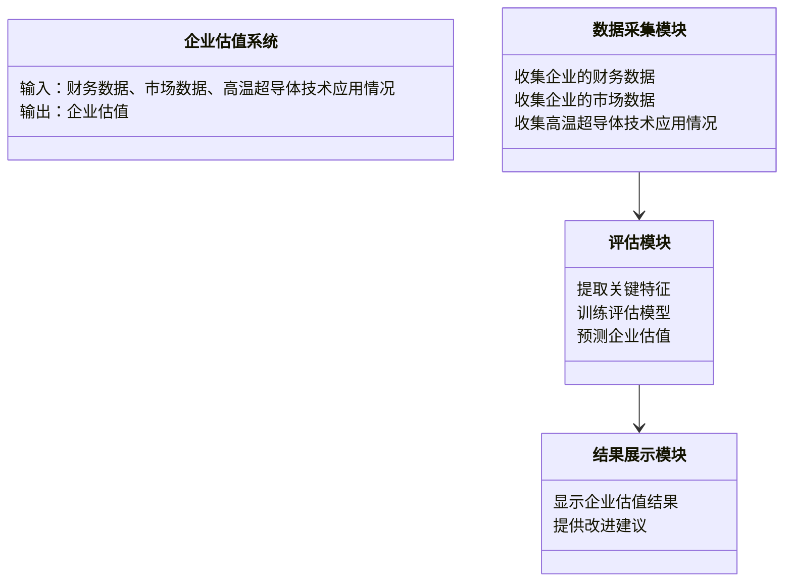
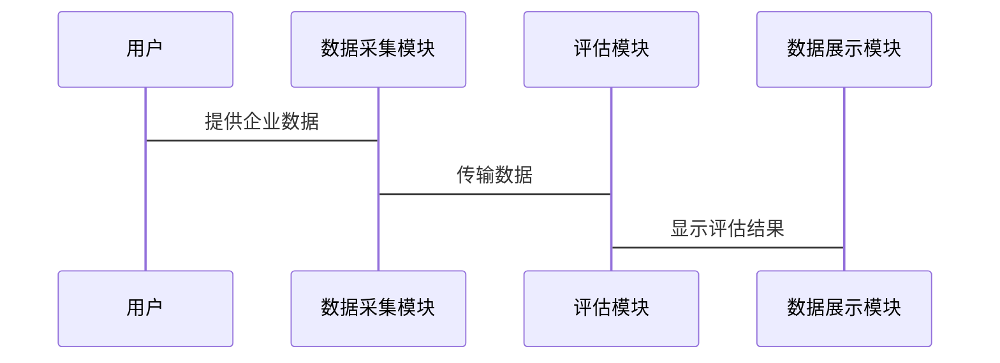

                 


# 企业估值中的高温超导体应用评估

> 关键词：高温超导体，企业估值，应用评估，数学模型，系统架构，案例分析

> 摘要：本文详细探讨了高温超导体在企业估值中的应用评估，从基本概念、核心特性到数学模型构建，再到系统架构设计和实际案例分析，为企业估值提供了新的视角和方法。

---

# 第一部分：高温超导体与企业估值概述

## 第1章：高温超导体的基本概念与应用背景

### 1.1 高温超导体的定义与特性

#### 1.1.1 高温超导体的基本定义
高温超导体（High-Temperature Superconductors, HTS）是指在特定温度下（通常低于液氮沸点77K）具有零电阻特性的材料。与传统超导体相比，高温超导体的工作温度更高，材料种类更多样，应用范围更广。

#### 1.1.2 高温超导体的核心特性
高温超导体的核心特性包括：
1. **零电阻性**：在临界温度以下，电流在导体中无损耗流动。
2. **完全磁化性**：在临界磁场以下，磁场无法穿透导体。
3. **临界电流与临界磁场**：高温超导体在不同温度和磁场下具有特定的临界电流和临界磁场，决定了其在实际应用中的负载能力。

#### 1.1.3 高温超导体与传统导体的对比分析
| 特性 | 高温超导体 | 传统导体 |
|------|-------------|-----------|
| 导电性 | 零电阻（低温下） | 有电阻 |
| 磁性 | 完全磁化（低温下） | 可能具有铁磁性或顺磁性 |
| 工作温度 | 通常在77K以下 | 室温或更低 |

高温超导体的这些特性使其在电力传输、电子元件制造等领域具有重要应用潜力，从而影响企业的估值。

---

### 1.2 企业估值中的高温超导体应用背景

#### 1.2.1 企业估值的基本概念
企业估值是通过对企业的财务状况、市场地位、技术创新能力等多方面因素的综合评估，确定企业的市场价值。传统估值方法通常依赖于财务指标和市场数据，而高温超导体的应用为估值提供了新的技术维度。

#### 1.2.2 高温超导体在企业估值中的潜在价值
高温超导体技术的引入可以显著降低企业的运营成本（如电力传输损耗）、提高生产效率，并增强企业的市场竞争力。这些因素都会直接影响企业的估值。

#### 1.2.3 当前高温超导体技术在企业估值中的应用现状
目前，高温超导体技术在企业估值中的应用尚处于起步阶段。主要集中在以下几个方面：
1. **电力行业**：通过降低输电损耗，提升企业效益。
2. **电子制造**：利用高温超导体制造高性能电子元件，提升企业竞争力。
3. **科研机构**：用于超导材料的研究与开发，推动技术进步。

---

## 第2章：高温超导体在企业估值中的核心作用

### 2.1 高温超导体在企业估值中的关键问题

#### 2.1.1 企业估值中的关键因素分析
企业在估值过程中需要考虑的主要因素包括：
1. **财务表现**：收入、利润、现金流等。
2. **市场地位**：市场占有率、品牌影响力等。
3. **技术创新**：技术领先性、研发能力等。
4. **运营效率**：生产效率、成本控制等。

高温超导体技术的引入可以显著影响企业的运营效率和技术创新能力，从而影响估值。

#### 2.1.2 高温超导体如何影响企业估值
高温超导体技术的应用可以：
1. **降低运营成本**：通过减少电力损耗，降低企业的运营成本。
2. **提高生产效率**：利用高温超导体技术提升生产设备的效率。
3. **增强市场竞争力**：通过技术创新提升企业的市场地位。

#### 2.1.3 高温超导体技术的边界与外延
高温超导体技术的应用受到以下限制：
1. **技术成熟度**：高温超导体技术尚未完全成熟，大规模应用仍需时间。
2. **成本因素**：高温超导体材料的生产成本较高，可能影响企业的经济效益。
3. **应用场景**：高温超导体技术在特定行业（如电力、电子制造）中的应用更为显著。

---

### 2.2 高温超导体与企业估值的核心概念结构

#### 2.2.1 核心概念的构成要素
高温超导体在企业估值中的核心概念结构包括以下几个要素：
1. **高温超导体特性**：零电阻性、完全磁化性等。
2. **企业估值方法**：财务指标、市场地位、技术创新等。
3. **技术应用效果**：对运营成本、生产效率的影响。

#### 2.2.2 核心概念之间的关系
高温超导体特性通过影响企业的运营成本和生产效率，进而影响企业的财务表现和市场地位，最终影响企业估值。

#### 2.2.3 系统性分析
通过系统性分析高温超导体技术对企业估值的影响，可以构建一个综合考虑技术、经济和市场因素的评估框架。

---

## 第3章：高温超导体应用评估的核心原理

### 3.1 高温超导体应用评估的基本原理

#### 3.1.1 高温超导体的物理特性对评估的影响
高温超导体的零电阻性和完全磁化性使其在电力传输和电子元件制造中具有显著优势，从而影响企业的估值。

#### 3.1.2 高温超导体在企业估值中的数学模型
构建一个简单的数学模型，用于评估高温超导体技术对企业的估值影响：
$$ V = k \cdot T + c $$
其中，$V$ 表示企业估值，$T$ 表示高温超导体技术的影响程度，$k$ 是影响系数，$c$ 是常数项。

#### 3.1.3 高温超导体应用评估的核心算法
高温超导体应用评估的核心算法包括：
1. 数据采集：收集企业的财务数据、市场数据和高温超导体技术应用情况。
2. 特征提取：提取关键特征，如运营成本、生产效率等。
3. 模型训练：基于历史数据训练评估模型。
4. 结果预测：预测高温超导体技术对企业估值的影响。

---

### 3.2 高温超导体应用评估的数学模型

#### 3.2.1 模型的基本假设
1. 高温超导体技术的应用可以显著降低企业的运营成本。
2. 企业的估值与运营成本和市场地位密切相关。

#### 3.2.2 模型的输入变量与输出变量
- **输入变量**：
  - 企业的财务数据（收入、利润等）
  - 高温超导体技术应用情况（如应用范围、应用深度）
- **输出变量**：
  - 企业的估值

#### 3.2.3 模型的数学表达式
$$ V = \alpha \cdot (收入 - 成本) + \beta \cdot (市场占有率) + \gamma \cdot (技术创新能力) $$
其中，$\alpha$、$\beta$、$\gamma$ 是模型的系数，需根据实际数据进行校准。

---

### 3.3 高温超导体应用评估的算法流程

1. **数据采集**：收集企业的财务数据、市场数据和高温超导体技术应用情况。
2. **特征提取**：提取关键特征，如运营成本、生产效率等。
3. **模型训练**：基于历史数据训练评估模型。
4. **结果预测**：预测高温超导体技术对企业估值的影响。
5. **结果分析**：分析预测结果，评估高温超导体技术的应用效果。

---

## 第4章：系统分析与架构设计

### 4.1 问题场景介绍

高温超导体技术在企业估值中的应用需要构建一个综合考虑技术、经济和市场因素的评估系统。

---

### 4.2 系统功能设计

#### 4.2.1 领域模型设计


---

### 4.3 系统架构设计


---

### 4.4 系统接口设计

1. **数据接口**：提供数据输入接口，支持CSV、JSON等格式。
2. **模型接口**：提供API接口，供其他系统调用评估结果。

---

### 4.5 系统交互设计



---

## 第5章：项目实战

### 5.1 环境安装

安装Python和相关库（如NumPy、Pandas、Scikit-learn）。

---

### 5.2 核心代码实现

```python
import numpy as np
import pandas as pd
from sklearn import linear_model

# 数据加载
data = pd.read_csv('enterprise_data.csv')

# 特征提取
features = data[['收入', '成本', '市场占有率', '技术创新能力']]
target = data['估值']

# 模型训练
model = linear_model.LinearRegression()
model.fit(features, target)

# 模型预测
new_enterprise = {'收入': 10000000, '成本': 5000000, '市场占有率': 0.2, '技术创新能力': 0.8}
new_features = pd.DataFrame([new_enterprise])
predicted_valuation = model.predict(new_features)

print(f'预测企业估值为：{predicted_valuation[0]:.2f}')
```

---

### 5.3 代码解读与分析

1. **数据加载**：读取企业数据，包括财务数据和高温超导体技术应用情况。
2. **特征提取**：提取收入、成本、市场占有率和技术创新能力作为输入特征。
3. **模型训练**：使用线性回归模型训练评估模型。
4. **模型预测**：基于新的企业数据，预测企业估值。

---

### 5.4 实际案例分析

以某电力企业为例，分析高温超导体技术的应用对企业估值的影响。假设该企业引入高温超导体技术后，输电损耗降低30%，从而显著降低运营成本，提升企业估值。

---

## 第6章：结论与展望

### 6.1 最佳实践 tips
- 在企业估值中引入高温超导体技术，需综合考虑技术可行性、经济效益和市场需求。
- 高温超导体技术的应用应与企业实际业务场景相结合，避免盲目应用。

### 6.2 小结
本文详细探讨了高温超导体在企业估值中的应用评估，从基本概念、核心特性到数学模型构建，再到系统架构设计和实际案例分析，为企业估值提供了新的视角和方法。

### 6.3 注意事项
- 高温超导体技术的应用可能面临技术成熟度和成本较高的挑战。
- 在实际应用中，需结合企业的具体情况，制定合理的技术应用策略。

### 6.4 拓展阅读
建议进一步研究高温超导体技术在其他领域的应用，如医疗设备、高速交通等，探索其对企业估值的更广泛影响。

---

# 作者

作者：AI天才研究院/AI Genius Institute & 禅与计算机程序设计艺术 /Zen And The Art of Computer Programming

---

通过本文的系统性分析，我们可以看到高温超导体技术在企业估值中的巨大潜力。未来，随着技术的不断发展，高温超导体的应用将更加广泛，为企业估值提供更精准的评估方法。

