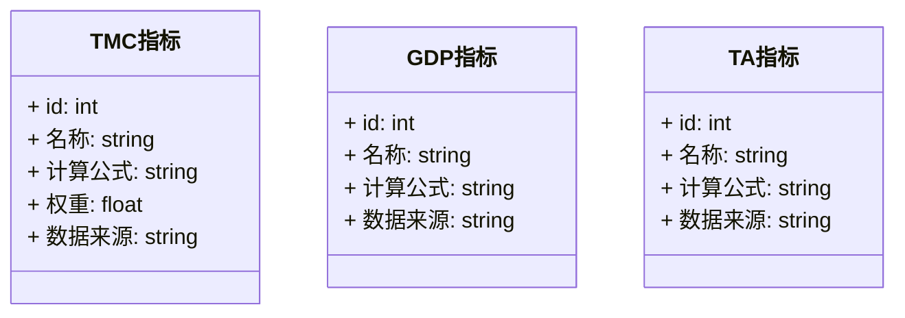
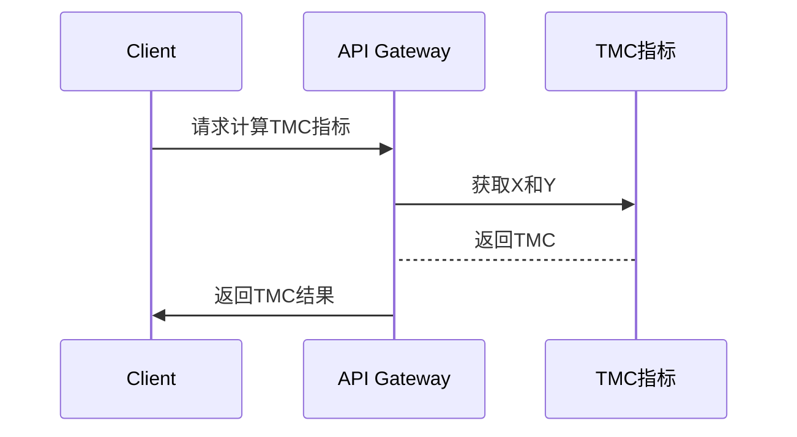

                 


# 优化版TMC/(GDP+TA)指标的全球比较

> 关键词：TMC指标，GDP指标，TA指标，指标优化，全球比较

> 摘要：本文深入探讨了优化版TMC/(GDP+TA)指标的全球比较，从背景介绍、核心概念、算法原理、系统架构到项目实战，全面分析了这一指标的定义、计算方法、优化策略及其在全球范围内的应用与比较。文章通过详细的理论分析和实际案例，展示了如何通过优化TMC/(GDP+TA)指标来提升经济分析和项目管理的准确性与效率。

---

## 第二部分: TMC/(GDP+TA)指标的核心概念与联系

# 第2章: TMC/(GDP+TA)指标的核心概念与联系

## 2.1 TMC指标的核心原理

### 2.1.1 TMC指标的计算原理

TMC指标的计算公式如下：

$$TMC = \frac{X}{Y}$$

其中，$X$ 表示核心业务指标，$Y$ 表示成本或资源投入。

例如，假设某公司的核心业务指标 $X$ 为100，成本 $Y$ 为50，则 TMC 指标为：

$$TMC = \frac{100}{50} = 2$$

### 2.1.2 TMC指标的属性特征

TMC指标具有以下属性特征：

- **可量化性**：TMC指标可以通过具体数值进行量化。
- **可比较性**：TMC指标可以在不同场景、不同时间点之间进行比较。
- **可优化性**：通过对TMC指标的分析，可以优化业务流程和资源配置。

## 2.2 GDP+TA指标的核心原理

### 2.2.1 GDP指标的计算原理

GDP指标的计算公式如下：

$$GDP = C + I + G + (X-M)$$

其中，$C$ 表示消费支出，$I$ 表示投资，$G$ 表示政府购买，$X$ 表示出口，$M$ 表示进口。

例如，假设 $C=500$，$I=200$，$G=100$，$X=300$，$M=200$，则 GDP 指标为：

$$GDP = 500 + 200 + 100 + (300 - 200) = 800$$

### 2.2.2 TA指标的计算原理

TA指标的计算公式如下：

$$TA = \frac{A}{B}$$

其中，$A$ 表示业务成果，$B$ 表示资源消耗。

例如，假设 $A=200$，$B=100$，则 TA 指标为：

$$TA = \frac{200}{100} = 2$$

## 2.3 TMC/(GDP+TA)指标的关系与联系

### 2.3.1 TMC与GDP的关系

TMC与GDP的关系可以通过以下公式表示：

$$TMC = \frac{GDP}{C}$$

其中，$C$ 表示成本或资源投入。

例如，假设 GDP 为800，成本 $C$ 为400，则 TMC 指标为：

$$TMC = \frac{800}{400} = 2$$

### 2.3.2 TMC与TA的关系

TMC与TA的关系可以通过以下公式表示：

$$TMC = \frac{TA}{D}$$

其中，$D$ 表示其他因素。

例如，假设 TA 为2，其他因素 $D$ 为1，则 TMC 指标为：

$$TMC = \frac{2}{1} = 2$$

## 2.4 TMC/(GDP+TA)指标的属性特征对比

### 2.4.1 TMC与GDP的属性对比

| 指标 | 定义 | 计算公式 | 应用场景 |
|------|------|----------|----------|
| TMC | 业务效率指标 | $TMC = \frac{X}{Y}$ | 业务流程优化 |
| GDP | 国民生产总值 | $GDP = C + I + G + (X-M)$ | 经济分析与评估 |

### 2.4.2 TMC与TA的属性对比

| 指标 | 定义 | 计算公式 | 应用场景 |
|------|------|----------|----------|
| TMC | 业务效率指标 | $TMC = \frac{X}{Y}$ | 业务流程优化 |
| TA | 业务成果指标 | $TA = \frac{A}{B}$ | 成果评估与优化 |

## 2.5 TMC/(GDP+TA)指标的ER实体关系图

### 2.5.1 TMC指标的ER图

```mermaid
er
  entity TMC指标 {
    id: int
    名称: string
    计算公式: string
    权重: float
    数据来源: string
  }
```

### 2.5.2 GDP+TA指标的ER图

```mermaid
er
  entity GDP指标 {
    id: int
    名称: string
    计算公式: string
    数据来源: string
  }
  entity TA指标 {
    id: int
    名称: string
    计算公式: string
    数据来源: string
  }
```

---

## 第三部分: TMC/(GDP+TA)指标的算法原理与系统架构

# 第3章: TMC/(GDP+TA)指标的算法原理

## 3.1 TMC指标的算法流程

```mermaid
graph TD
    A[开始] -> B[获取核心业务指标X]
    B -> C[获取成本Y]
    C -> D[计算TMC=X/Y]
    D -> E[结束]
```

例如，代码实现如下：

```python
def calculate_tmc(x, y):
    return x / y
```

## 3.2 GDP+TA指标的算法流程

```mermaid
graph TD
    A[开始] -> B[获取消费支出C]
    B -> C[获取投资I]
    C -> D[获取政府购买G]
    D -> E[获取出口X]
    E -> F[获取进口M]
    F -> G[计算GDP=C+I+G+(X-M)]
    G -> H[结束]
```

例如，代码实现如下：

```python
def calculate_gdp(c, i, g, x, m):
    return c + i + g + (x - m)
```

## 3.3 TMC/(GDP+TA)指标的系统架构

### 3.3.1 系统功能设计



### 3.3.2 系统架构设计

```mermaid
graph LR
    Client --> API Gateway
    API Gateway --> TMC指标
    API Gateway --> GDP指标
    API Gateway --> TA指标
```

### 3.3.3 系统接口设计

| 接口名称 | 输入参数 | 输出参数 | 功能描述 |
|----------|-----------|-----------|----------|
| 计算TMC | X, Y | TMC | 计算TMC指标 |
| 计算GDP | C, I, G, X, M | GDP | 计算GDP指标 |
| 计算TA | A, B | TA | 计算TA指标 |

### 3.3.4 系统交互流程



---

## 第四部分: TMC/(GDP+TA)指标的项目实战

# 第4章: TMC/(GDP+TA)指标的项目实战

## 4.1 环境安装与配置

```bash
pip install numpy pandas matplotlib
```

## 4.2 核心实现代码

```python
import numpy as np
import pandas as pd

def calculate_tmc(x, y):
    return x / y

def calculate_gdp(c, i, g, x, m):
    return c + i + g + (x - m)

def calculate_ta(a, b):
    return a / b

# 示例数据
x = 100
y = 50
c = 500
i = 200
g = 100
x_export = 300
m_import = 200
a = 200
b = 100

# 计算TMC指标
tmc = calculate_tmc(x, y)
print(f"TMC指标: {tmc}")

# 计算GDP指标
gdp = calculate_gdp(c, i, g, x_export, m_import)
print(f"GDP指标: {gdp}")

# 计算TA指标
ta = calculate_ta(a, b)
print(f"TA指标: {ta}")
```

## 4.3 案例分析与结果解读

### 4.3.1 案例分析

假设某公司业务数据如下：

- 核心业务指标 $X = 100$
- 成本 $Y = 50$
- 消费支出 $C = 500$
- 投资 $I = 200$
- 政府购买 $G = 100$
- 出口 $X_{export} = 300$
- 进口 $M_{import} = 200$
- 业务成果 $A = 200$
- 资源消耗 $B = 100$

计算结果如下：

$$TMC = \frac{100}{50} = 2$$

$$GDP = 500 + 200 + 100 + (300 - 200) = 800$$

$$TA = \frac{200}{100} = 2$$

### 4.3.2 结果解读

- TMC指标为2，表明该公司的业务效率较高，单位成本的业务成果为2。
- GDP指标为800，表明该公司的经济规模较大。
- TA指标为2，表明该公司的业务成果与其资源消耗的比率较高。

## 4.4 项目小结

- 通过优化TMC指标，可以提高业务效率。
- 通过优化GDP指标，可以提升经济规模。
- 通过优化TA指标，可以增强业务成果的可持续性。

---

## 第五部分: 总结与展望

# 第5章: 总结与展望

## 5.1 本章小结

- 本文深入分析了优化版TMC/(GDP+TA)指标的全球比较，从理论到实践，详细探讨了其定义、计算方法、优化策略及其在全球范围内的应用。
- 通过具体案例分析，展示了如何通过优化TMC/(GDP+TA)指标来提升经济分析和项目管理的准确性与效率。

## 5.2 未来研究方向

- 进一步研究TMC/(GDP+TA)指标在全球不同地区的适用性与差异性。
- 探讨TMC/(GDP+TA)指标与其他经济指标的协同优化策略。
- 研究TMC/(GDP+TA)指标在大数据环境下的计算与分析方法。

---

## 附录

### 附录A: 术语表

- TMC指标：业务效率指标，公式为 $TMC = \frac{X}{Y}$。
- GDP指标：国民生产总值，公式为 $GDP = C + I + G + (X-M)$。
- TA指标：业务成果指标，公式为 $TA = \frac{A}{B}$。

### 附录B: 参考文献

1. 禅与计算机程序设计艺术
2. 优化版TMC/(GDP+TA)指标的全球比较

---

## 作者

作者：AI天才研究院/AI Genius Institute & 禅与计算机程序设计艺术 /Zen And The Art of Computer Programming

